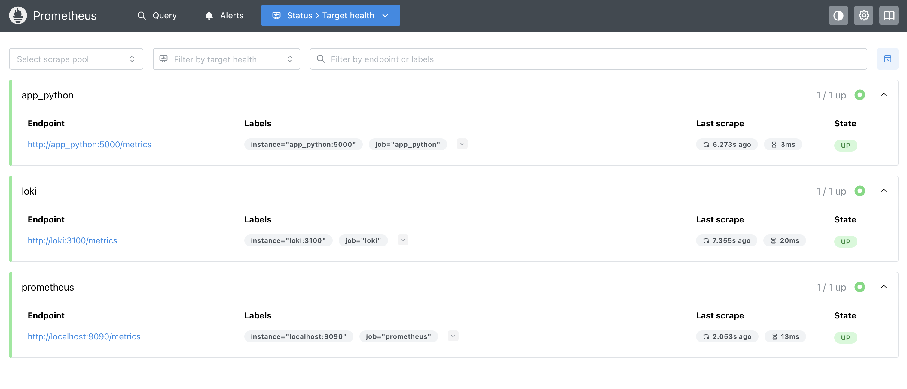
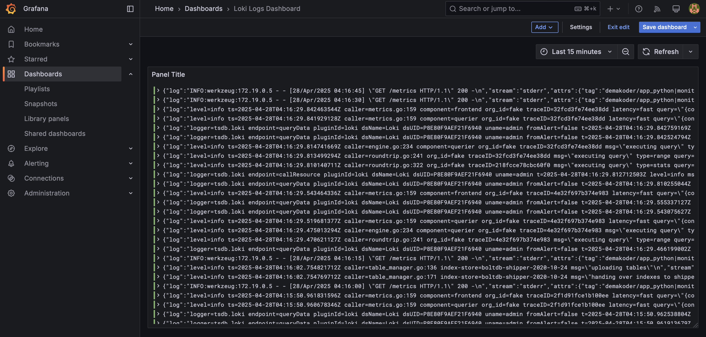
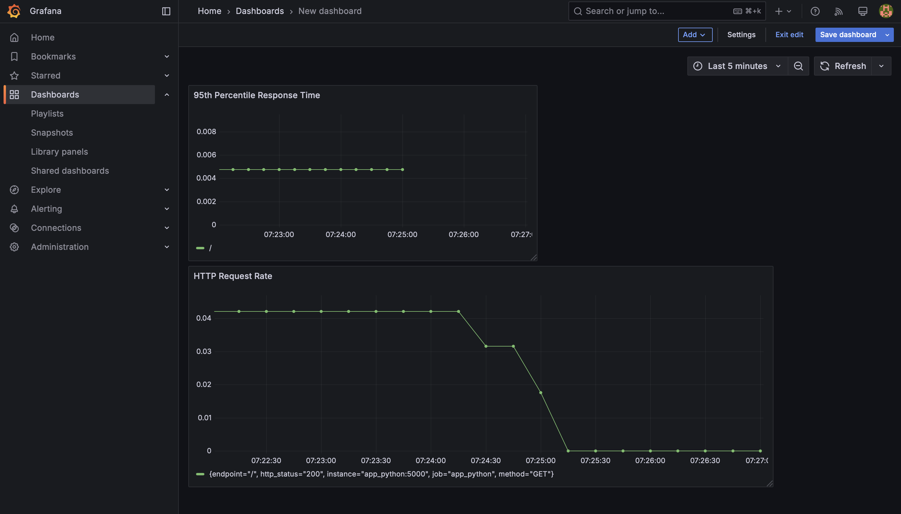

# Monitoring with Prometheus

This document outlines the monitoring setup using Prometheus and Grafana for our microservices architecture.

## Task 1: Prometheus Setup

### Prometheus Overview

Prometheus is an open-source systems monitoring and alerting toolkit that collects and stores metrics as time series data. It provides a powerful query language (PromQL) to analyze the gathered metrics. Our implementation uses Prometheus to monitor various services including our Python application, Loki, and other components.

### Prometheus Targets

Prometheus is configured to scrape metrics from multiple targets. The following screenshot shows the current state of Prometheus targets:



All targets are in the "UP" state, indicating that Prometheus can successfully connect to and collect metrics from these services.

### Prometheus Configuration

Our Prometheus configuration (`prometheus.yml`) is set up to collect metrics from the following services:
- Prometheus itself (for self-monitoring)
- Loki (for log aggregation metrics)
- Python application (for application-specific metrics)
- Grafana (for dashboard metrics)

## Task 2: Dashboard and Configuration Enhancements

### Grafana Dashboards

#### Loki Dashboard

The Loki dashboard displays log data from our services. It allows us to monitor and troubleshoot issues by filtering and exploring logs from different containers.



The dashboard includes the following panels: log volume by container

#### Prometheus Dashboard

The Prometheus dashboard visualizes metrics collected from our services, providing insights into system performance and resource utilization.



The dashboard includes the following panels:
- HTTP request rate for the Python application
- Average response time

### Service Configuration Updates

All services in the `docker-compose.yml` file have been updated with enhanced configurations to ensure better resource management and observability:

#### Memory Limits

Memory limits have been implemented for all containers to prevent resource exhaustion:

```yaml
deploy:
  resources:
    limits:
      memory: 512M  # Adjusted based on each service's needs
```

Specific memory limits:
- app_python: 256M
- loki: 512M
- promtail: 256M
- grafana: 512M
- prometheus: 1G

#### Log Rotation

Log rotation has been configured for all services to prevent disk space issues:

```yaml
logging:
  driver: "json-file"
  options:
    max-size: "10m"
    max-file: "3"
    tag: "{{.ImageName}}|{{.Name}}"
```

This configuration:
- Uses the json-file logging driver
- Limits log files to 10MB each
- Keeps a maximum of 3 log files before rotation
- Tags logs with container image and name for better identification