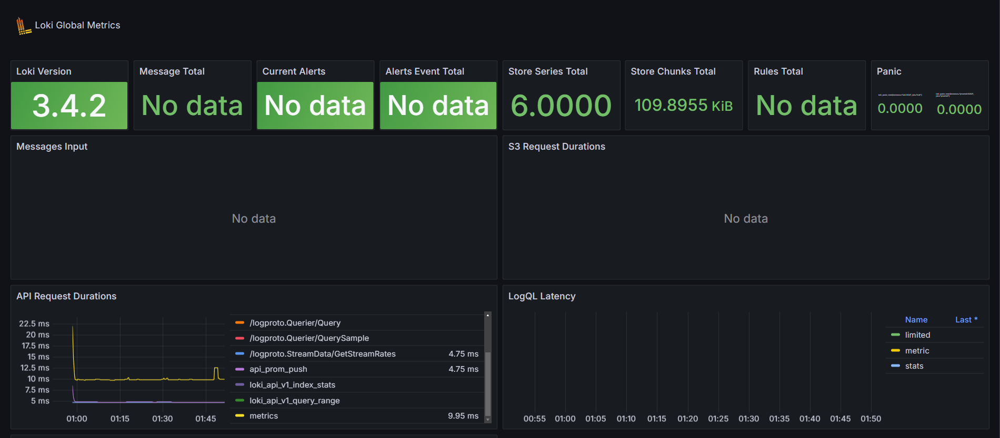
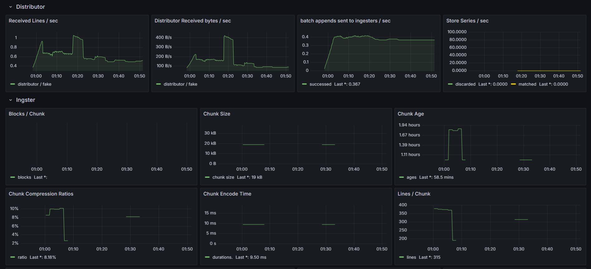
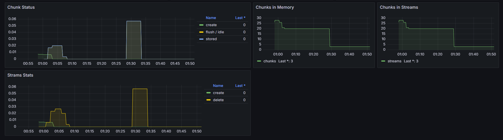
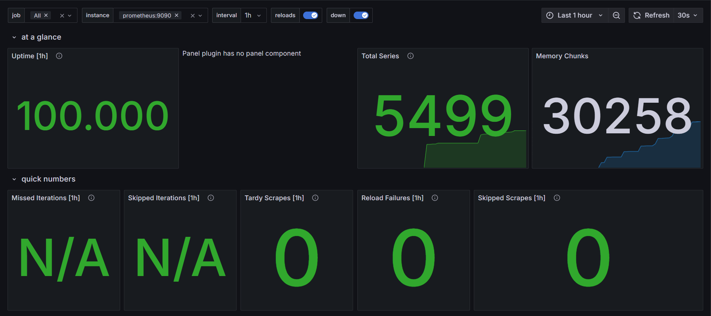
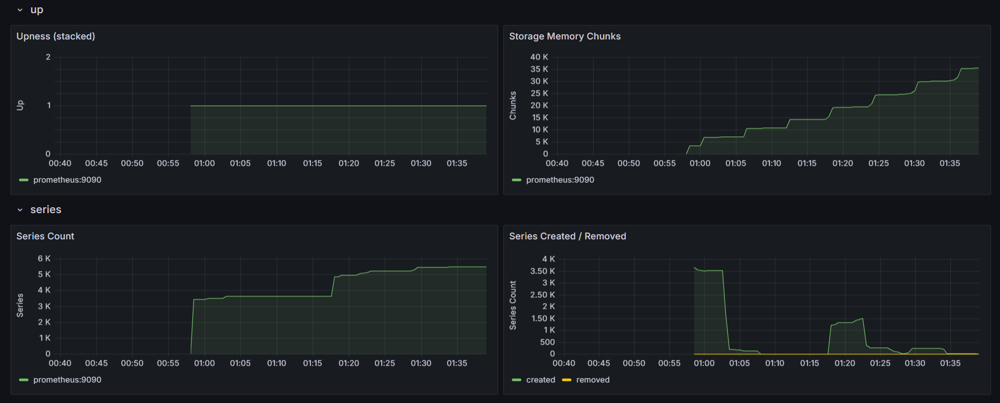
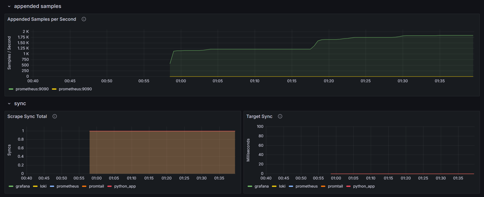
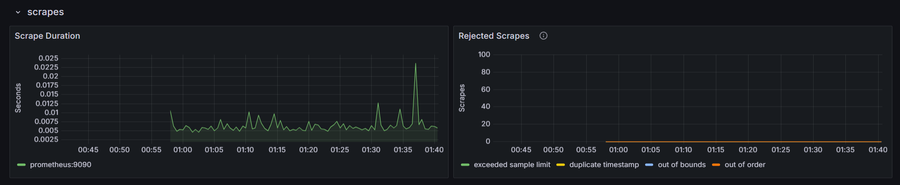
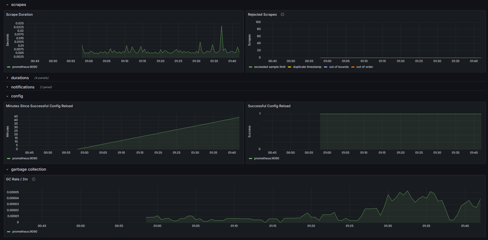

# Monitoring with Prometheus

## Overview

This document describes the setup of **Prometheus**, **Grafana**, and **Loki** for metrics and log monitoring.

## Prometheus Setup

Prometheus Targets are accesible at `http://localhost:9090/targets`.


## Grafana Dashboards

### Loki Dashboard

[Example Dashboard for Loki](https://grafana.com/grafana/dashboards/13407-loki2-0-global-metrics/) is used for this task.





### Prometheus Dashboard

[Example Dashboard for Prometheus](https://grafana.com/grafana/dashboards/3662-prometheus-2-0-overview/) is used for this task.







## Service Configuration Updates

The configuration of all services in the `docker-compose.yml` file enhanced by the following changes:

- **Log Rotation**

  ```yaml
    logging:
          driver: "json-file"
          options:
            max-size: "10m"
            max-file: "3"
  ```

- **Memory Limits**

  ```yaml
    deploy:
      resources:
        limits:
          memory: "512m"
  ```

- **Healthcheck**: Ensure the services are running correctly.

  ```yaml
    healthcheck:
      test: ["CMD", "pgrep", "python"]
      interval: 10s
      timeout: 5s
      retries: 5
  ```

## Metrics Gathering

- **Loki** is configured to expose its metrics on `loki:3100/metrics`.
- **Grafana** metrics are scraped from `grafana:3000/metrics`.
- **Promtail** metrics are available at `promtail:9080/metrics`.
- **Prometheus** itself is scraped at `prometheus:9090/metrics`.
- **Python App** exposes metrics at `app_python:5000/metrics`.
