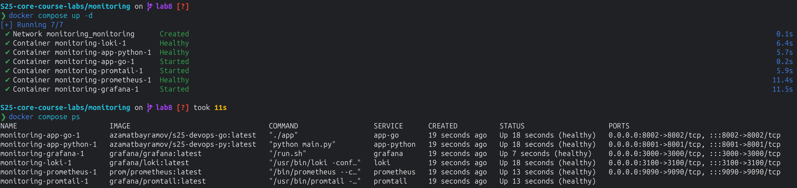
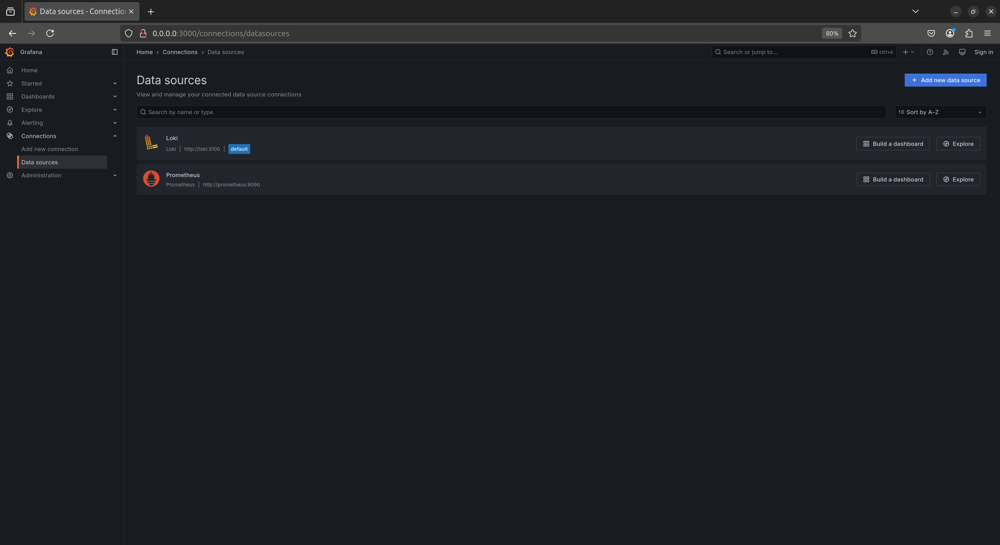
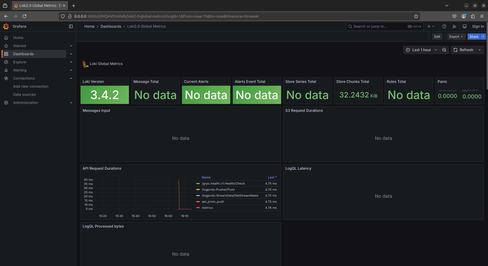
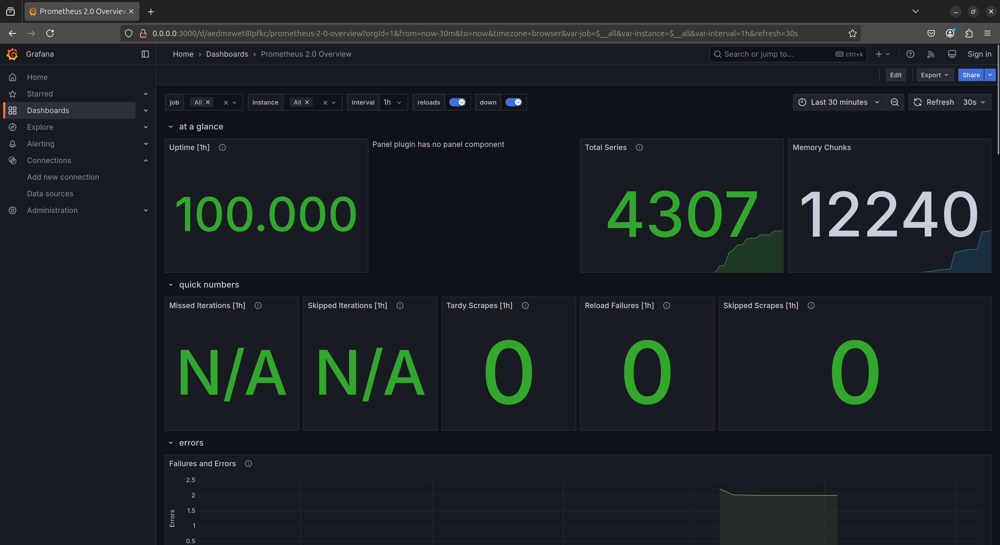
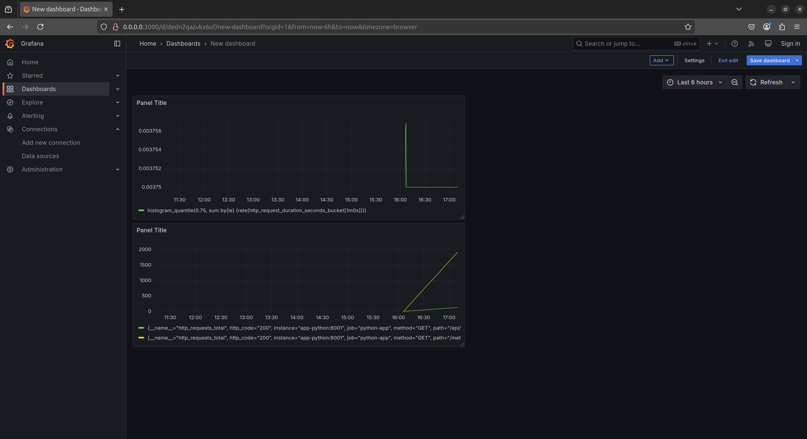

# Metrics

## Docker Compose Up with Prometheus



## Prometheus Targets


## Datasources in Grafana



## Dashboards in Grafana

Dashboard in Grafana for Loki:



Dashboard in Grafana for Prometheus:



Dashboard in Grafana for Python App:



## Log rotation and memory limits

Log rotation and memory limits have been added to the `docker-compose.yml` file.

```yaml
services:
  ...
    logging:
      driver: "json-file"
      options:
        max-size: "20m"
        max-file: "5"
    deploy:
      resources:
        limits:
          memory: "1024m"
          cpus: "0.5"
```

## Healthchecks

For each service, a healthcheck has been added to the `docker-compose.yml` file.

``` 
start_period: 1s
retries: 3
timeout: 5s
```

| Service    | Healthcheck                                |
|------------|--------------------------------------------|
| Loki       | `pgrep loki`                               |
| Grarana    | `curl -f http://localhost:3000/api/health` |
| Promtail   | `pgrep promtail`                           |
| Prometheus | `pgrep prometheus`                         |
| Python App | `curl -f http://localhost:8001/api/time`   |
| Go App     | `curl -f http://localhost:8002/api/date`   |
