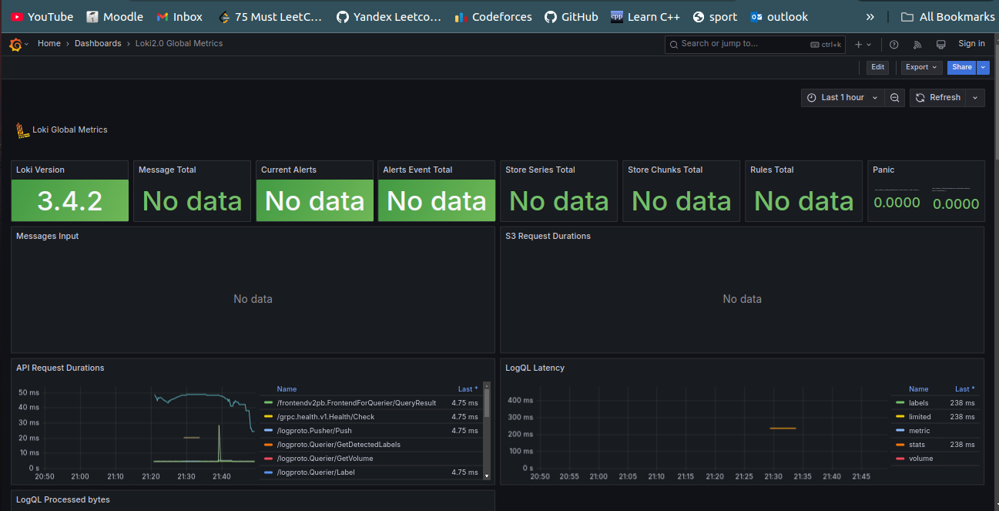

# Logging and Monitoring Setup Documentation

## Overview

This document provides details on the logging and monitoring setup using Loki, Promtail, Grafana, and Prometheus within a Docker-based environment.

## Components

### 1. **Loki**

Loki is the logging backend responsible for storing logs and serving queries.

- **Container Name:** `loki`
- **Image:** `grafana/loki:latest`
- **Ports:**
  - Exposed on `3100:3100`
- **Command:** Uses configuration file `/etc/loki/local-config.yaml`
- **Network:** Connected to `loki` network
- **Logging:** Uses `json-file` driver with a max size of `10MB` and retains up to `3` files
- **Resource Limits:** `512MB` memory limit

### 2. **Promtail**

Promtail is a log shipping agent that collects logs from Docker containers and forwards them to Loki.

- **Container Name:** `promtail`
- **Image:** `grafana/promtail:latest`
- **Volumes:**
  - Mounts `./promtail.yml` to `/etc/promtail/config.yml`
  - Mounts `/var/run/docker.sock` for container log access
- **Command:** Uses configuration file `/etc/promtail/config.yml`
- **Network:** Connected to `loki` network
- **Logging:** Uses `json-file` driver with a max size of `10MB` and retains up to `3` files
- **Resource Limits:** `512MB` memory limit

### 3. **Grafana**

Grafana is used for visualizing logs stored in Loki and monitoring metrics from Prometheus.

- **Container Name:** `grafana`
- **Image:** `grafana/grafana:latest`
- **Ports:**
  - Exposed on `3000:3000`
- **Environment Variables:**
  - `GF_PATHS_PROVISIONING=/etc/grafana/provisioning`
  - Enables anonymous authentication with Admin role
  - Feature toggles enabled: `alertingSimplifiedRouting`, `alertingQueryAndExpressionsStepMode`
- **Entrypoint:**
  - Creates a provisioning configuration file for Loki as a default data source
  - Starts Grafana with `/run.sh`
- **Network:** Connected to `loki` network
- **Logging:** Uses `json-file` driver with a max size of `10MB` and retains up to `3` files
- **Resource Limits:** `512MB` memory limit

### 4. **Web Application (Moscow Time App)**

A simple web application that does not integrate with Loki but is part of the setup.

- **Container Name:** `moscow-time-app`
- **Image:** `yoqub/app_python:latest`
- **Restart Policy:** Always
- **Ports:**
  - Exposed on `5000:5000`
- **Logging:** Uses `json-file` driver with a max size of `10MB` and retains up to `3` files
- **Resource Limits:** `512MB` memory limit

### 5. **Prometheus**

Prometheus is used for collecting and storing monitoring metrics.

- **Container Name:** `prometheus`
- **Image:** `prom/prometheus:latest`
- **Ports:**
  - Exposed on `9090:9090`
- **Volumes:**
  - Mounts `./prometheus.yml` to `/etc/prometheus/prometheus.yml`
- **Command:** Uses configuration file `/etc/prometheus/prometheus.yml`
- **Network:** Connected to `loki` network
- **Logging:** Uses `json-file` driver with a max size of `10MB` and retains up to `3` files
- **Resource Limits:** `512MB` memory limit

## Logging Configuration

The `json-file` logging driver is used for all services with the following settings:

- **Max Log File Size:** `10MB`
- **Max Log Files Retained:** `3`

## Network Configuration

All services except `web-app` are connected to the `loki` network to facilitate log collection and querying.

## Usage

1. Start the stack with `docker-compose up -d`.
2. Access:
   - **Grafana UI:** `http://localhost:3000` (default credentials: `admin/admin`)
   - **Loki API:** `http://localhost:3100`
   - **Prometheus UI:** `http://localhost:9090`
   - **Promtail Logs:** Available in Loki via Grafana
3. Configure Grafana dashboard to query logs from Loki and metrics from Prometheus.

## Conclusion

This setup ensures a centralized logging and monitoring solution using Loki, Promtail, Grafana, and Prometheus, with automated service discovery and a predefined logging structure.

## Screenshots

- Prometheus setup

- Loki metrics

- Prometheus Metrics

