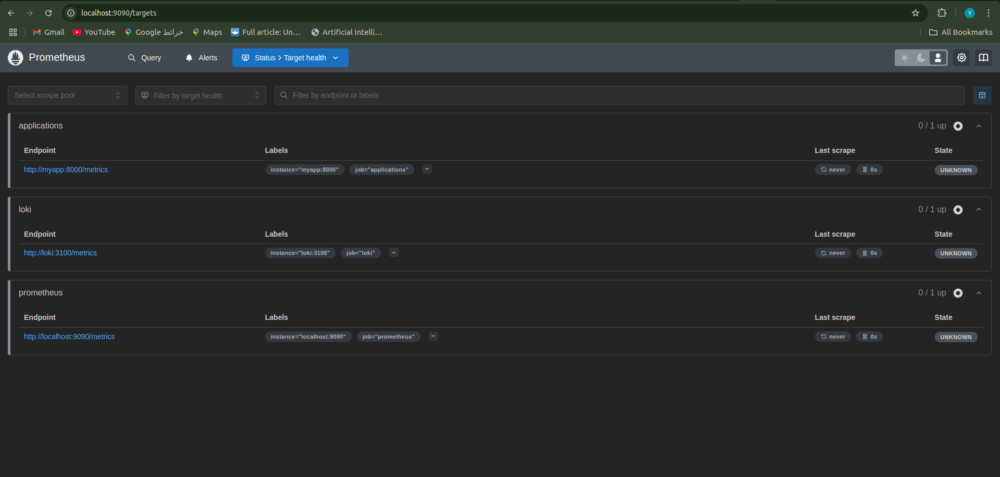
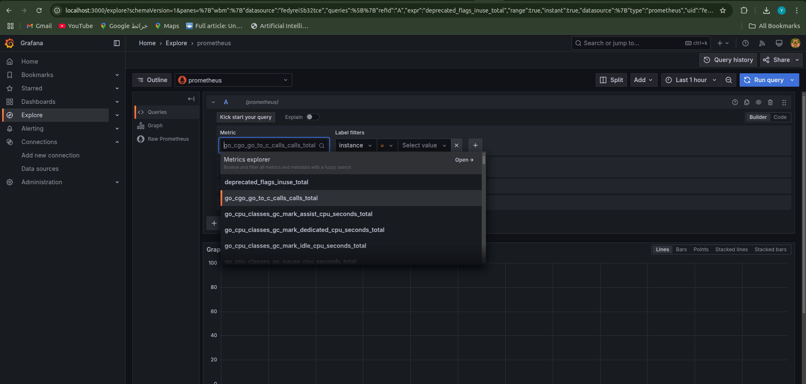
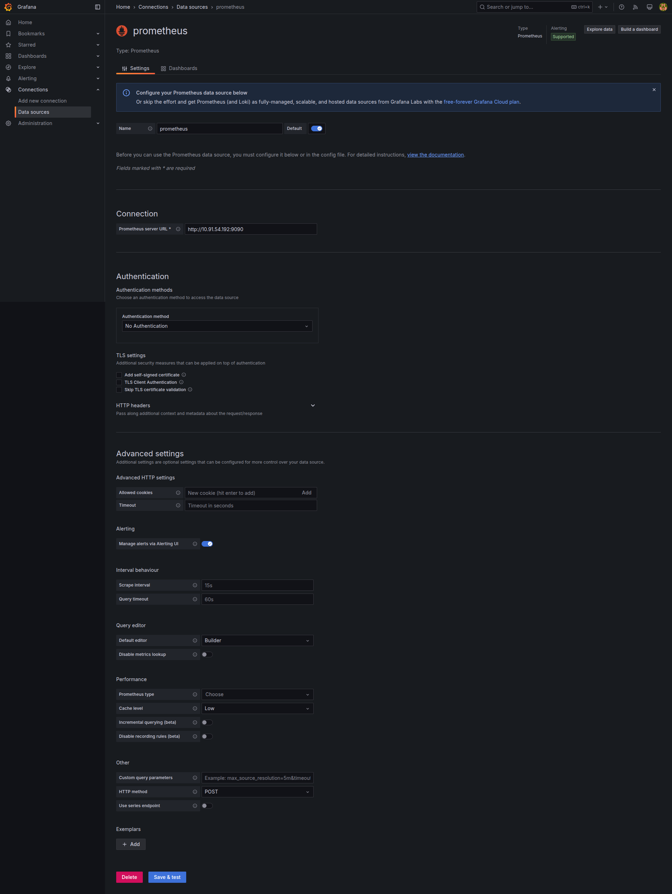

# Lab 8: Monitoring with Prometheus

## Task 1: Prometheus Setup

### 1.1 Prometheus Integration with Docker Compose  
Added Prometheus to the `docker-compose.yml` and configured it to scrape Loki.  

### 1.2 Prometheus Targets Status  
  

---

## Task 2: Dashboard and Configuration Enhancements

### 2.1 Grafana Dashboards  
 
- **Prometheus Dashboard**:  
    

    

### 2.2 Service Configuration Updates  
- **Log Rotation**: Added to all services in `docker-compose.yml`:  
  ```yaml
  logging:
    options:
      max-size: "10m"
      max-file: "3"
