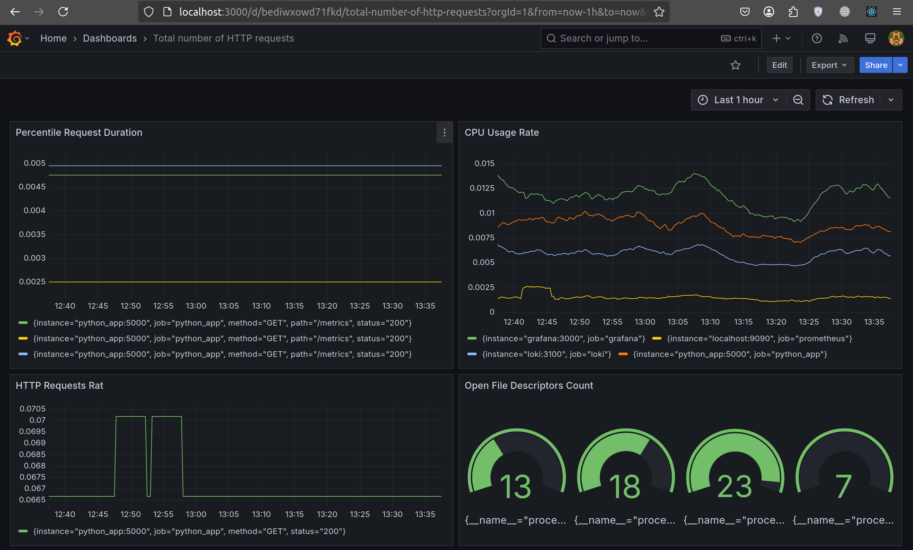

# Prometheus Targets Verification

## Docker Compose

Integrated Prometheus into the docker-compose.yml.
Now `docker-compose.yml` contains all setups for running applications and checking the metrics.
Use `docker compose up -d` to run the system.
To check metrics open in browser https://localhost:9090.

## Prometheus Configuration

- Configured prometheus.yml to collect metrics from:
- Prometheus itself: `prometheus:9090`
- Grafana: `grafana:3000`
- Loki: `loki:3100: 
- Web App: `python_app:5000`

## Prometheus Targets Page (Screenshots)

# Dashboard and Configuration Enhancements
 
## Dashboards in Grafana

- Loki: Used an example dashboard to visualize logs.
- Prometheus: Used an example dashboard to display metrics.

**Screenshots** with **Loki** Dashboard: 

**Screenshots** with **Prometheus** Dashboard: 

## Service Configuration Updates

### Enhancements to docker-compose.yml:

**Log Rotation Mechanisms**: Configured the json-file logging driver with max-size: 10m and max-file: 2 for all services.
**Memory Limits**: Defined resource constraints for all containers:
- `Prometheus`: memory: 50M
- `Loki`: memory: 200M
- `Python App`: memory: 100M
- `Grafana`: memory: 150M
- `Promtail`: memory: 50M
**Documentation**: All changes are now reflected in the updated docker-compose.yml.

### Metrics Gathering:

Extended Prometheus to collect metrics from all services defined in docker-compose.yml.
Added services job in prometheus.yml to scrape metrics from:
- python_app
-  grafana
- loki
- promtail
- prometheus
