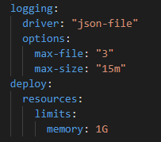

# Monitoring with Prometheus

## Task 1: Prometheus Setup

### Prometheus Configuration

I have expanded my existing `docker-compose.yml` from the previous lab to include Prometheus.

I configured Prometheus to collect metrics from both Loki and Prometheus containers by using a custom config.

### Verify Prometheus Targets

Here are the screenshots that confirm the successful setup.

## Task 2: Dashboard and Configuration Enhancements

### Grafana Dashboards

I have downloaded Loki and Prometheus dashboards in JSON format and put them into `/var/lib/grafana/dashboards` directory. \
Also I have specified the `GF_DASHBOARDS_DEFAULT_HOME_DASHBOARD_PATH` variable that allows to open some dashboard by default on home page. I used Loki dashboard as a default one.

I added Prometheus as another datasource for Grafana.

Here are the screenshots displaying successful dashboard configurations.

#### Loki dashboard

#### Prometheus dashboard

### Service Configuration Updates:

I have added log rotation mechanisms and memory limits for all containers in `docker-compose.yml` (added config to corresponding services).

For log rotation, I have specified the max number of files for rotation (3) and max size for these files (10 Mb). As for memory limits, I specified 256 Mb for my applications services, and 1 Gb for logging stack services.

