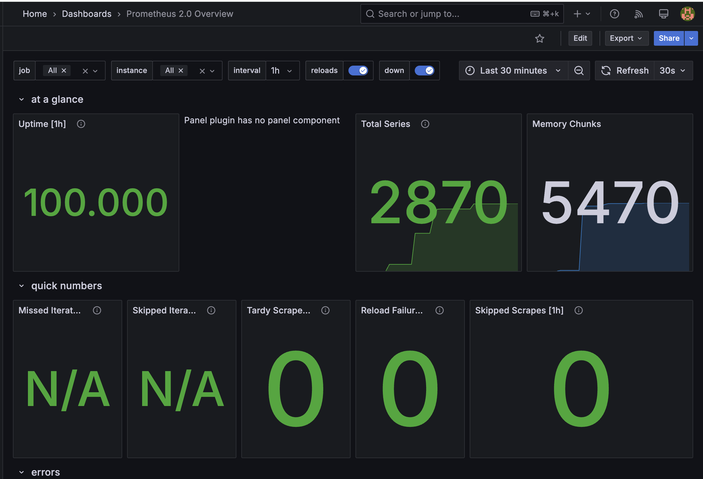

### Task 1:
- Ensuring that Prometheus is correctly scraping metrics:
  - 1. **Both targets are up:** 
  - 2. **Checking prometheus with query:** 
  - 3. **Checking loki with query:** 

---

### Task 2 Dashboards:
- Set up dashboards in Grafana
  - 1. **For loki:** 
  - 2. **For prometheus:** 

### Task 2 Service Configuration Updates:
- Enhanced the configuration of all services in `docker-compose.yml`:
  - **Added log rotation mechanisms:**
    - Implemented `json-file` driver with `max-size: 30m` and `max-file: 3`.
  - **Specified memory limits for containers:**
    - `app-python`: `500m`
    - `app-go`: `500m`
    - `loki`: `1g`
    - `alloy`: `500m`
    - `grafana`: `1g`
    - `prometheus`: `500m`
  - **CPU limits set for better resource management:**
    - `app-python`: `0.5`
    - `app-go`: `0.5`
    - `loki`: `0.5`
    - `alloy`: `0.3`
    - `grafana`: `0.5`
    - `prometheus`: `0.3`

### Task 2 Extention
- Extend Prometheus to gather metrics from all services defined:
  - 

---

### Bonus Task
- 1. For Python web app I have used prometheus_fastapi_instrumentator.Instumentator() to collect and export different metrics for prometheus via exposing `/metrics` route.
  - 
  - 
- 2. For Go web app I have used `github.com/prometheus/client_golang/prometheus/promhttp` to collect and export different metrics for prometheus via the sane route as above.
  - 
  - 
- 3. Also, I have added a health checks for go and python web applications, exposing `/health` route and making it return Status Code 200 on GET Request.
  - 
