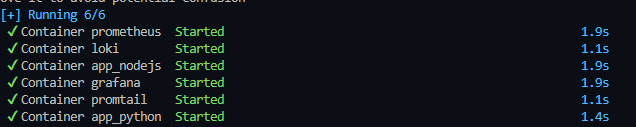
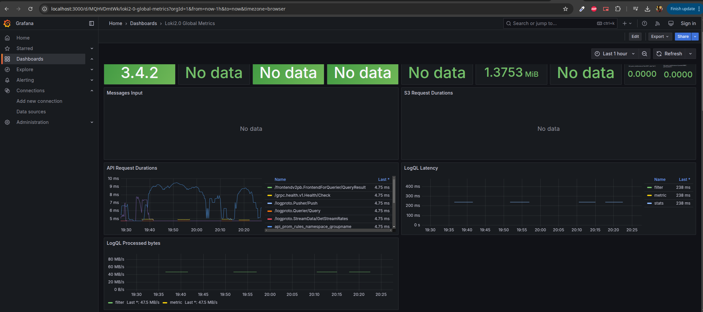
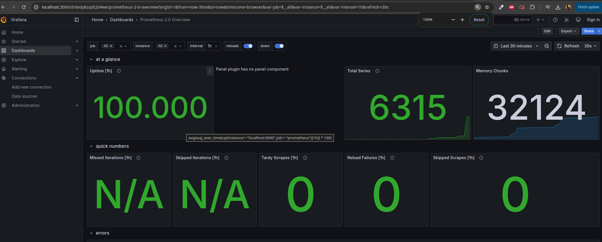

# Metrics and Monitoring Report

## Overview

This report documents the setup and configuration of the Prometheus monitoring stack integrated with Loki, Promtail, Grafana, and our application containers.

## Prometheus Setup

- **Docker Compose:**
  
 

- **Prometheus Configuration:**  
  The `prometheus.yml` file is configured with the following scrape jobs:
  - **prometheus:** Scraping itself at `prometheus:9090`.
  - **loki:** Scraping Loki metrics from `loki:3100`.
  - **app_python:** Scraping application metrics from the Python web app .
  - **app_nodejs:** Scraping application metrics from the Node.js web app .

- **Verification:**  
  The Prometheus targets page ([http://localhost:9090/targets](http://localhost:9090/targets)) shows the following healthy targets:
  - Prometheus
  - Loki  
  

## Grafana Dashboards

- **Loki Dashboard:**  
  An imported Loki dashboard (e.g., [Dashboard 13407](https://grafana.com/grafana/dashboards/13407)) is configured and visible.  
  

- **Prometheus Dashboard:**  
  An imported Prometheus dashboard (e.g., [Dashboard 3662](https://grafana.com/grafana/dashboards/3662)) is configured and shows current metrics.  
  
  
 
## Service Configuration

- **Log Rotation:**  
  Each service in the Docker Compose file uses the `json-file` driver with options (`max-size` and `max-file`) to control log rotation.

- **Memory Limits:**  
  Memory limits have been set for each container to ensure efficient resource usage.

- **Health Checks:**  
  Health checks have been defined for all services. For example, Grafana's health check verifies access via `/api/health`.

## Bonus: Application Metrics and Health Checks

- **Application Metrics:**  
  The Python and Node.js applications now expose metrics endpoints, which Prometheus scrapes successfully.  
  

- **Enhanced Health Checks:**  
  Additional health checks are implemented in the Docker Compose file. Logs indicate that all containers are healthy.  
  

## Conclusion

The Prometheus monitoring stack has been successfully integrated into the existing logging stack. Metrics from Loki, Prometheus, and the applications are being scraped and visualized in Grafana. All service configurations (log rotation, memory limits, health checks) are working as expected.

