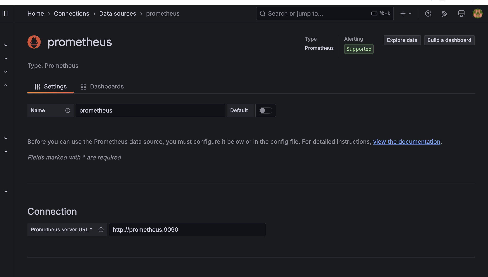

# Metrics

Installation includes a Prometheus container that collects metrics from Prometheus, a Loki container and web-app

## Key Functionalities:
1. **Networking**:
All services are connected to the monitoring network for inter-service communication
2. **Resource Limits**:
Memory limits are defined for each service (128M to 512M) to optimize resource usage.

## Logs & Metrics

