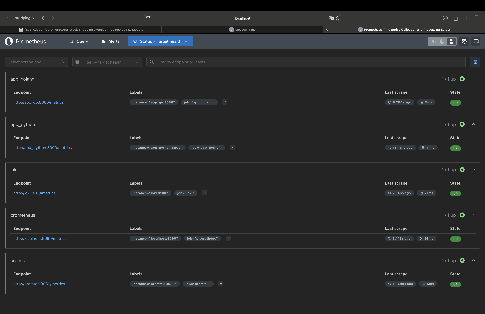

# METRICS

This document outlines the steps taken to integrate Prometheus, set up Grafana dashboards for metrics, and enhance service configurations with log rotation and memory limits.

---

## 1. Prometheus Setup

1. **Add Prometheus to docker-compose.yml**  
   We introduced a new `prometheus` service listening on port `9090`.  
2. **Prometheus Configuration**  
   We mounted a `prometheus.yml` file that defines scrape targets for:
   - `prometheus` (itself)  
   - `loki`  
   - `promtail`  
   - `app_python`  
   - `app_golang`  
3. **Verify Prometheus Targets**  
   Access [http://localhost:9090/targets](http://localhost:9090/targets) to confirm all services are “UP” and being scraped.



---

## 2. Grafana Dashboards

1. **Prometheus Data Source**  
   We configured Grafana to use Prometheus (`http://prometheus:9090`) in addition to Loki.  
2. **Dashboards**  
   - Created or modified dashboards to visualize metrics from our Python and Go applications (e.g., request counts, latency, Go runtime metrics).  
   - Confirmed we can query Prometheus metrics via panels in a new dashboard.

**Prometheus Dashboard**


**Loki Dashboard**


---

## 3. Service Configuration Updates

We enhanced the existing `docker-compose.yml` with the following:

1. **Log Rotation**  
   ```yaml
   x-logging: &default-logging
     driver: "json-file"
     options:
       max-size: "200k"
       max-file: "10"
       tag: "{{.ImageName}}|{{.Name}}"
   ```
   This ensures each container’s logs are rotated to avoid excessive disk usage.

2. **Memory Limits**  
   Under each service’s `deploy` section:
   ```yaml
   deploy:
   resources:
    limits:
      memory: 256M
   ```
   This constrains each container’s memory usage.
3. **Health Checks**  
   Each service has a healthcheck definition to ensure it is running properly. For example:
   ```yaml
   healthcheck:
     test: ["CMD", "wget", "-q", "-O", "-", "http://localhost:3100/ready"]
     interval: 30s
     timeout: 10s
     retries: 3
   ```
   
## 4. Bonus Tasks: Application Metrics

1. **Python Application**  
   - Added a `/metrics` endpoint using `prometheus_client`.  
   - Added a `/health` endpoint
   - Implemented request count and latency metrics via a Flask middleware.  
   - Metrics include `request_count` (with labels for method, endpoint, status) and `request_latency_seconds` (with histogram buckets for response times).
   
   

2. **Go Application**  
   - Exposed `/metrics` using `promhttp.Handler()`.  
   - Added a `/health` endpoint
   - Registered default Go metrics (e.g., `go_threads`, `go_goroutines`) and custom counters/histograms for request tracking.  
   - Confirmed that `app_golang:8080/metrics` is scraped by Prometheus.

   

**For example, request in other dashboard:**


---

## 5. Conclusion

- **Prometheus** scrapes all services, including the newly instrumented Python and Go apps.  
- **Grafana** dashboards now display real-time logs (via Loki) and metrics (via Prometheus).  
- **Services** are configured with log rotation, memory limits, and health checks, resulting in a more robust setup.


