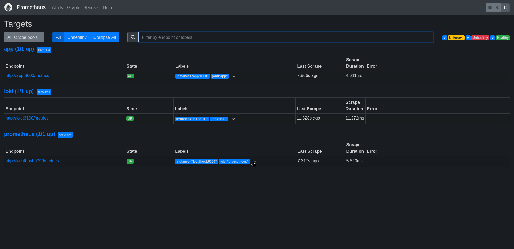
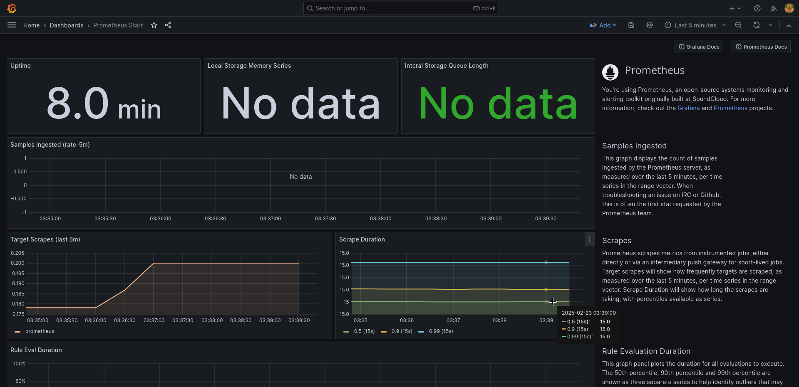

# Metrics and Monitoring Documentation

## Prometheus Setup

### Configuration Overview

The monitoring stack has been enhanced with Prometheus integration. Key components include:

1. **Prometheus Server**
   - Port: 9090
   - Configuration file: prometheus.yml
   - Scraping targets: 
     - Prometheus itself (9090)
     - Loki (3100)
     - Application (8000)

2. **Resource Limits and Log Rotation**
   All services have been configured with:
   - Memory limits
   - Log rotation (max 10MB per file, 3 files max)
   - Health checks

### Container Resource Limits

- Prometheus: 1GB memory
- Grafana: 1GB memory
- Loki: 1GB memory
- Promtail: 512MB memory
- Application: 512MB memory

### Health Checks

All services have health checks configured:
- Prometheus: Checks /-/healthy endpoint
- Loki: Checks /ready endpoint
- Grafana: Checks /api/health endpoint
- Promtail: Checks /ready endpoint
- Application: Checks /health endpoint

### Monitoring Targets

To verify Prometheus targets:
1. Access http://localhost:9090/targets
2. Ensure all targets are up and being scraped




## Grafana Dashboards

### Loki Dashboard


### Prometheus Dashboard



## Additional Notes

### Log Rotation Configuration
All containers use the json-file logging driver with the following settings:
```yaml
logging:
  driver: "json-file"
  options:
    max-size: "10m"
    max-file: "3"
```

### Service Dependencies
- Promtail and Grafana depend on Loki being healthy
- All services are connected through the "monitoring" network
- Services are configured to restart unless stopped manually
