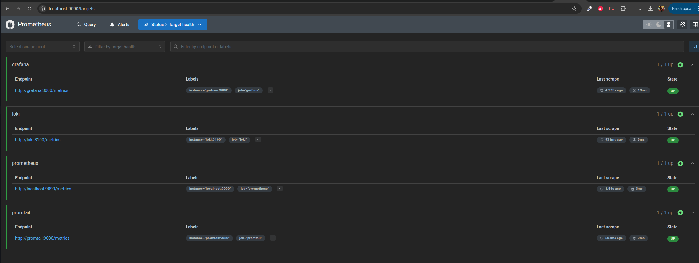

# METRICS

## Initial setup

Here you can see that prometheus is able to acccess all of the other services stably and nicely.

## Dashboards

Then, here we have the dashboards that were added to graphana (I just used the ones recommended in the task, I'm a bit unoriginal)

### Loki Dashboard

### Prometheus Dashboard

## Logs and Limits

I also introduced the limits in the form of the limiting the logging in the `docker-compose.yml` to 2 files and 2m of data per loggging.

Also the memory limit of all containers is only 128m now, probably will have to udjust later for some big boys out there.

## Healthchecks

All of the services now have shiny new healthchecks in the form of `pgrep` on them, working tirelessly every 5 seconds to make sure that everyone is alive.

## Adding the apps

Here are they in prometheus targets:

Running smooth and nicely. And here are their metrics, not so shiny:

And the javacript one:

