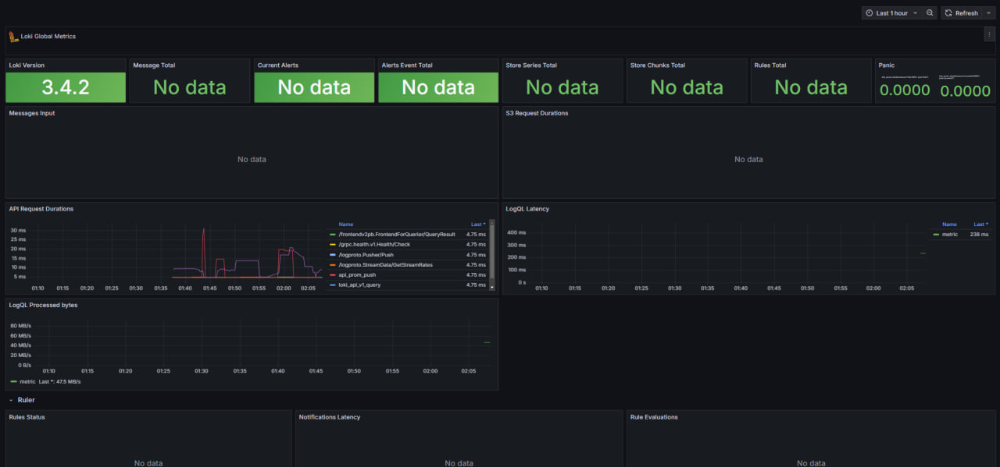

# Metrics

## Memory Limits

Everywhere in code for each of service we have memory limit of 100m.

## Log Rotation

We have log rotation for all services which defined as

```text
logging:
  driver: "json-file"
  options:
    max-size: "200k"
    max-file: "10"
    compress: 1
    tag: "{{.ImageName}}|{{.Name}}"
```

## Screenshots

### Prometheus


### Loki Dashboard



### Prometheus Dashboard


