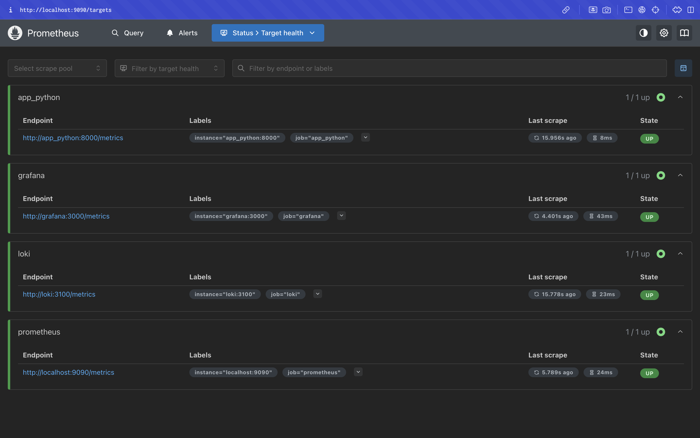
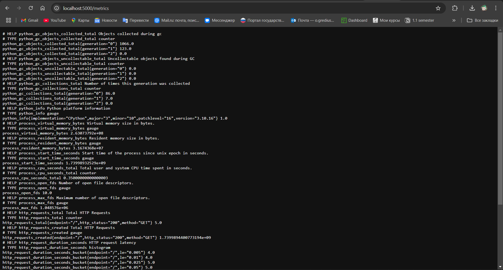

# Metrics

## Service Configuration Updates

### Log Rotation
- All services are configured to use JSON file logging with log rotation.
- Log files are limited to a size of `10MB`.
- A maximum of `3` rotated log files are retained for each service.

### Memory Limits
- A memory limit of `512MB` is set for all containers.

## Screenshots

### Prometheus Targets

### Loki Dashboard

### Prometheus Dashboard

# Bonus

## Health Checks

### Loki
- Check: `pgrep loki`
- Start period: 5 seconds
- Timeout: 5 seconds
- Retries: 5

### Promtail
- Check: `pgrep promtail`
- Start period: 5 seconds
- Timeout: 5 seconds
- Retries: 5

### Grafana
- Check: `http://localhost:3000/api/health`
- Interval: 10 seconds
- Timeout: 5 seconds
- Retries: 5

### Prometheus
- Check: `pgrep prometheus`
- Interval: 10 seconds
- Timeout: 5 seconds
- Retries: 5

### Python App
- Check: `pgrep python`
- Start period: 10 seconds
- Interval: 10 seconds
- Timeout: 5 seconds
- Retries: 5

## Screenshots

