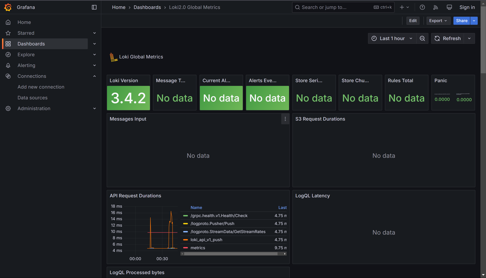

# Metrics

## Prometheus targets

As we can see, all targets are up:


But I want to note that `app_typescript` is missing here because this is a web application built with React =) 
Unfortunately, at the very beginning of the course, it wasn't mentioned that a backend was required, and collecting 
statistics from the frontend with Prometheus isn't an option =(

BUUUUT
I have configured Yandex Metrics as alternative:


## Dashboards

Dashboards for Loki nad Prometheus:

 

## Service Configuration

App is instrumented using prometheus client:


## Log rotation

Every service is configured to rotate logs with respect to:

```yaml
x-logging:
  &default-logging
  driver: "json-file"
  options:
    max-size: "200k"
    max-file: "10"
```

## Memory limits

```yaml
x-deploy:
  &default-deploy
  resources:
    limits:
      memory: 256M
```

## Health checks

Every service is health-checked according to the following pattern:

```yaml
healthcheck:
      test: ["CMD-SHELL", "curl --fail http://localhost:8000 || exit 1"]
      interval: 10s
      timeout: 3s
      retries: 3
```