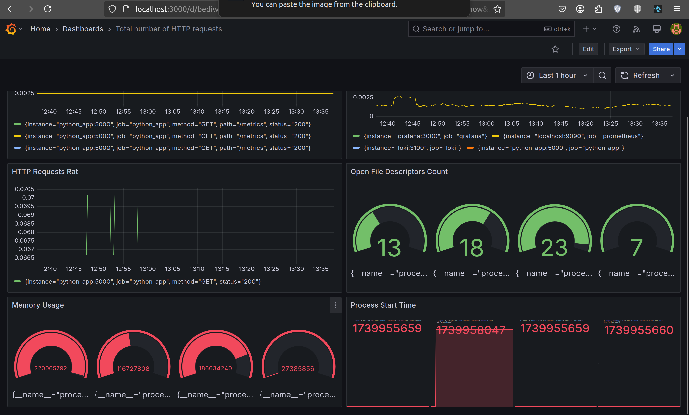

# Monitoring with Prometheus

## Prometheus Setup

### Prometheus Configuration

I have expanded my existing `docker-compose.yml` from the previous lab to include Prometheus.

I configured Prometheus to collect metrics from both Loki and Prometheus containers by using a custom config.

### Verify Prometheus Targets

Here are the screenshots that confirm the successful setup.

