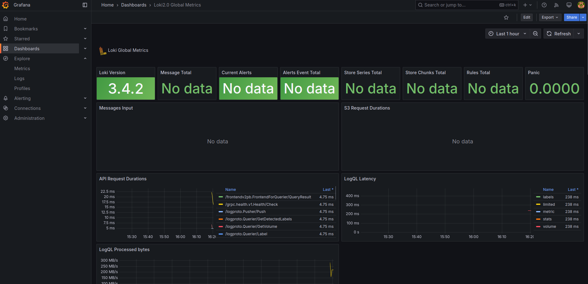
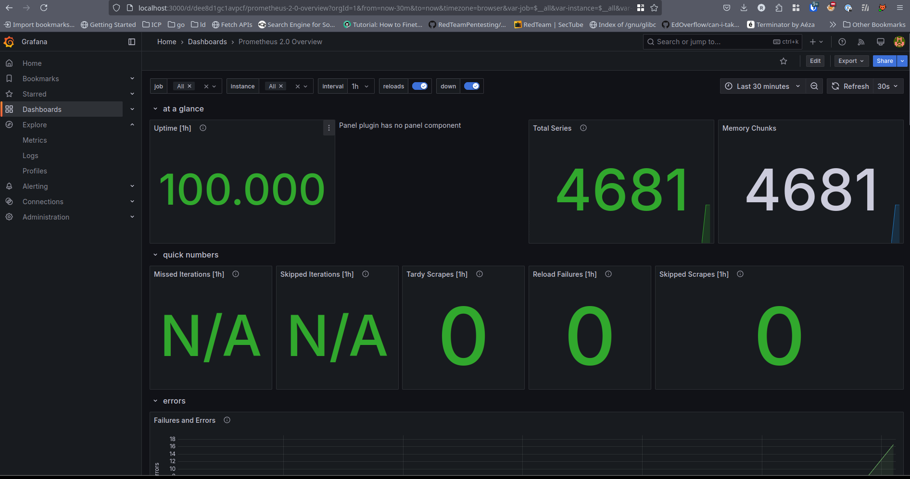

# Metrics, Logging, and Resource Management

## Monitoring Architecture

### Components

- **Prometheus**: Metrics collection and storage (`:9090`)
- **Grafana**: Visualization dashboard (`:3000`)
- **Alloy**: Logs and metrics pipeline agent
- **Loki**: Log aggregation system (`:3100`)

### Metrics Flow

[Services] --> [Prometheus (Metrics)] --> [Grafana]
[Services] --> [Alloy (Logs)] --> [Loki] --> [Grafana]

---

## Key Changes

### Prometheus Integration

- Added Prometheus service with scraping configuration for:
  - Flask App (`flask-app:8080`)
  - Alloy (`alloy:12345`)
  - Loki (`loki:3100`)
  - Grafana (`grafana:3000`)
  - Prometheus itself (`localhost:9090`)
- Configured scrape interval: `15s`

- Applied log rotation and container limits to all services
- Alloy filters containers with label app_logs=true
- Logs enriched with container name metadata
