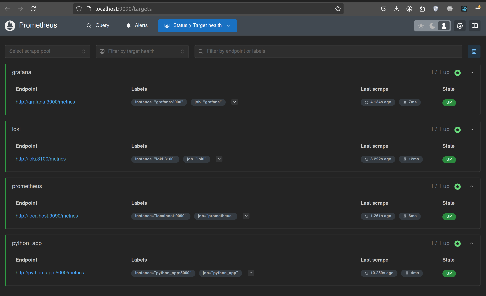

# Prometheus Targets Verification

## Docker Compose

Integrated Prometheus into the docker-compose.yml.
Now `docker-compose.yml` contains all setups for running applications and checking the metrics.
Use `docker compose up -d` to run the system.
To check metrics open in browser https://localhost:9090.

## Prometheus Configuration

- Configured prometheus.yml to collect metrics from:
- Prometheus itself: `prometheus:9090`
- Grafana: `grafana:3000`
- Loki: `loki:3100: `python_app:5000`

## Prometheus Targets Page (Screenshots)

