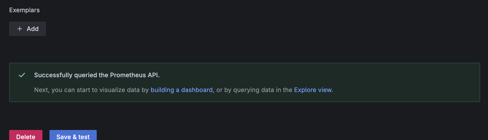

# Monitoring with Prometheus

## Overview
- Overview of the Prometheus monitoring setup integrated with Loki and Grafana.

## Prometheus Setup
Prometheus is configured to scrape metrics from:
- Prometheus itself (`localhost:9090`)
- Loki (`loki:3100`)
- Python App (`app-python:8001`)
- Go App (`app-go:8002`)

Prometheus configuration file:
```yaml
global:
  scrape_interval: 15s

scrape_configs:
  - job_name: "prometheus"
    static_configs:
      - targets: ["localhost:9090"]

  - job_name: "loki"
    static_configs:
      - targets: ["loki:3100"]

  - job_name: "python-app"
    static_configs:
      - targets: ["app-python:8001"]

  - job_name: "go-app"
    static_configs:
      - targets: ["app-go:8002"]
```

## Enhancing the configuration of all services in the `docker-compose.yml` file(specifying memory limits):
```yaml
logging:
      driver: "json-file"
      options:
        max-size: "200k"
        max-file: "10"
    deploy:
      resources:
        limits:
          memory: "500M"
```

# Starting with `docker-compose up -d`:


# Checking Prometheus on port 9090 /targets:


# Connecting Prometheus:




# Importing Prometheus dashboard:


# Importing Loki dashboard:

