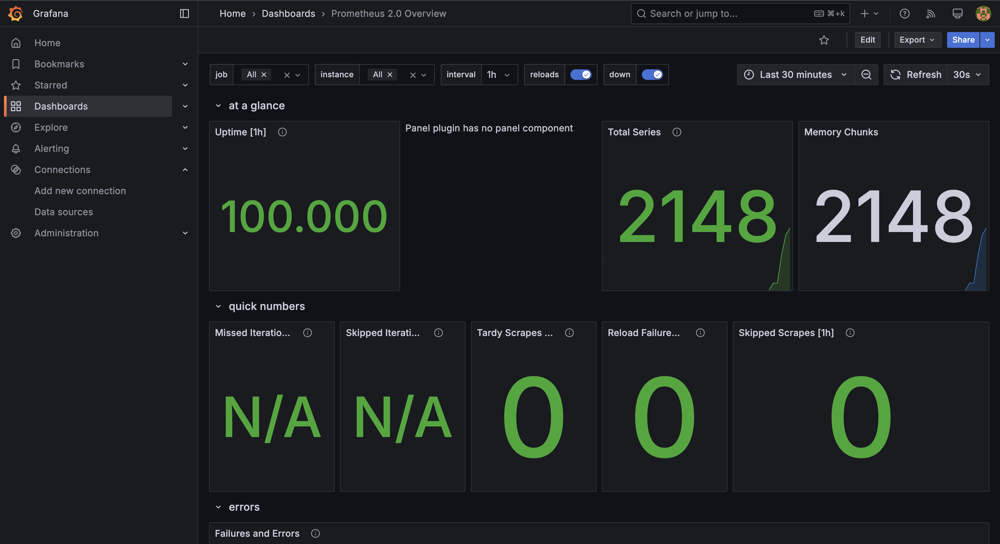

# Metrics

## Displayed metrics in prometheus

I used cadvisor to take metrics from containers, so that webapp containers will not be changed directly.

## Dashboards

I easily can create dashboards like that:

## Additional practices

- Log rotation mechanisms: 3 log files of maximum 10Mb each;

- Memory limits: 512Md maximum per application.