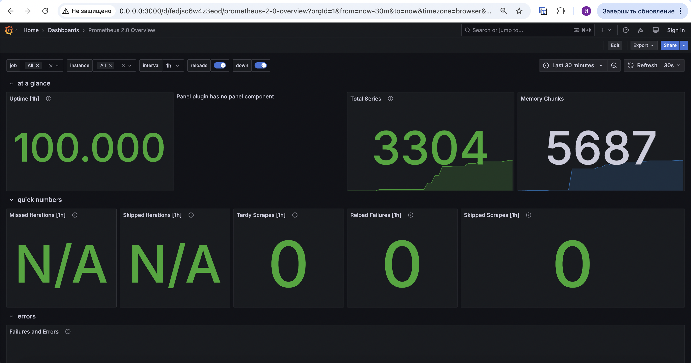

# Overview

## Task 1

The set up of collecting metrics from Loki and Prometheus


## Task 2

### Dashboards

Configured Dashboards for Loki and Prometheus:




### Log Mechanism and Memory Limits

I used YAML Anchors & Aliases to specify:

- x-logging: &default-logging → Defines a log rotation mechanism (max-size 200KB, max 10 files).

- x-resources: &default-resources → Defines memory limits for all services (512MB limit, 256MB reserved).

```yml
x-logging: &default-logging
  driver: "json-file"
  options:
    max-size: "200k"
    max-file: "10"

x-resources: &default-resources
  limits:
    memory: "512m"
  reservations:
    memory: "256m"
```

### All services

All services from `docker-compose.yml` were configured to gather metrics:


## Bonus

Configured apps to export metrics:


Healthcheking was also introduced like this example:

```yml
healthcheck:
      test: ["CMD-SHELL", "wget -qO- http://localhost:9080/ready || exit 1"]
      interval: 30s
      timeout: 10s
      retries: 5
```
