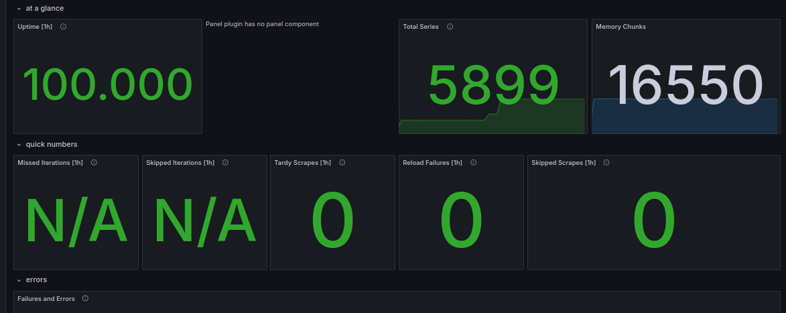

# Metrics

## Prometheus targets


## Dashboards

Dashboards for Loki nad Prometheus:

 

## Web apps instrumentations (bonus task)

Both apps are instrumented using prometheus clients:


## Log rotation

Every service is configured to rotate logs with respect to:

```yaml
x-logging:
  &default-logging
  driver: "json-file"
  options:
    max-size: "200k"
    max-file: "10"
    tag: "{{.ImageName}}|{{.Name}}"
```

## Memory limits

Well, `1G` is too much, but my PC allows so why not:

```yaml
x-deploy:
  &default-deploy
  resources:
    limits:
      memory: 1G
```

## Health checks

Every services is health-checked according to the following pattern:

```yaml
healthcheck:
      test: ["CMD-SHELL", "curl --fail http://localhost:8080 || exit 1"]
      interval: 10s
      timeout: 3s
      retries: 3
```
