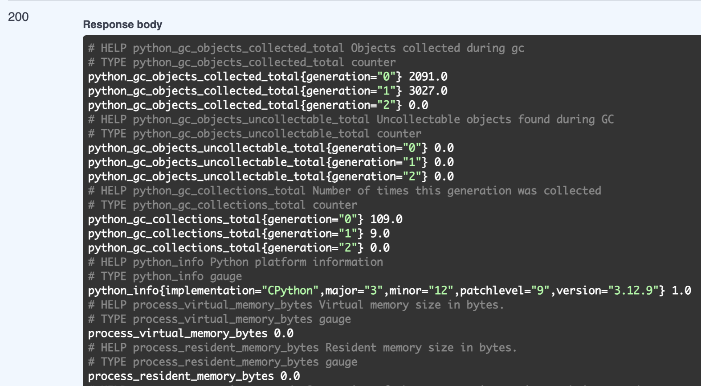

# Metrics

## Screenshots

### Prometheus Targets


### Loki Dashboard


### Prometheus Dashboard


## Service Configuration Updates

### Log rotation
- Usage of JSON file logging with log rotation
- Each Log file is limited by 10MB
- Maximum 3 rotated log files will be kept

### Memory limits for containers.
- 512 MB

# [Bonus]

I use `prometheus_client` to create an endpoint in my Python application for scraping metrics. Then I tested it.

## Screenshots

### New Prometheus Targets


### App Metrics



## Health Checks

### Loki
```
healthcheck:
  test: [ "CMD", "pgrep", "loki" ]
  start_period: 5s
  retries: 3
  timeout: 5s
```

### Promtail
```
healthcheck:
  test: ["CMD", "pgrep", "promtail"]
  start_period: 5s
  retries: 3
  timeout: 5s
```

### Grafana
```
healthcheck:
  test: [ "CMD", "curl", "-f", "http://localhost:3000/api/health" ]
  interval: 10s
  timeout: 5s
  retries: 3
```

### App
```
healthcheck:
  test: ["CMD", "pgrep", "python"]
  interval: 10s
  timeout: 10s
  retries: 3
```

### Prometheus
```
healthcheck:
  test: [ "CMD", "pgrep", "prometheus" ]
  interval: 10s
  timeout: 5s
  retries: 3
```
