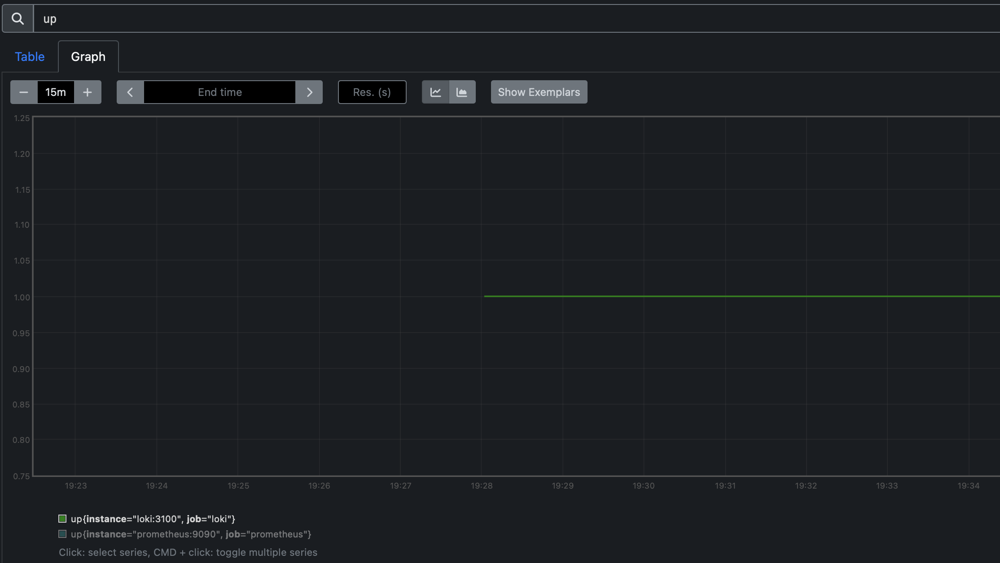

# Prometheus Metrics Report

## Prometheus Configuration

- **Configuration File:** `prometheus.yml`
- **Global Scrape Interval:** 15 seconds
- **Scrape Jobs:**
  - **prometheus:** Scrapes metrics from the Prometheus container at ```prometheus:9090```.
  - **loki:** Scrapes metrics from the Loki container at ```loki:3100```.

## Verifying Prometheus Targets

To verify that Prometheus is correctly scraping metrics, follow these steps:

1. **Access Prometheus Targets:**  
   Open your browser and navigate to [http://localhost:9090/targets](http://localhost:9090/targets).

2. **Expected Results:**  
   You should see both the Prometheus and Loki targets listed with a status of ```UP```.

## Screenshots

### Prometheus Targets Page


*Figure 1: Prometheus Targets page showing both Prometheus and Loki as active targets.*

### Prometheus Graph




*Figure 2: A sample query (e.g., `up`) in the Prometheus Graph page confirming that metrics are being collected.*

