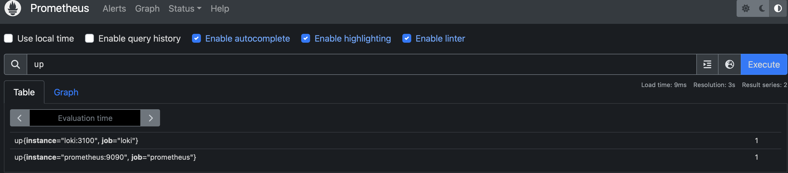

# Prometheus Metrics Report

## Prometheus Setup

- **Configuration File:** `prometheus.yml`
- **Global Scrape Interval:** 15 seconds
- **Scrape Jobs:**
  - **prometheus:** Scrapes metrics from the Prometheus container at ```prometheus:9090```.
  - **loki:** Scrapes metrics from the Loki container at ```loki:3100```.

## Verifying Prometheus Targets

To verify that Prometheus is correctly scraping metrics, follow these steps:

1. **Access Prometheus Targets:**  
   Open your browser and navigate to [http://localhost:9090/targets](http://localhost:9090/targets).

2. **Expected Results:**  
   You should see both the Prometheus and Loki targets listed with a status of ```UP```.

## Screenshots

### Prometheus Targets Page


*Figure 1: Prometheus Targets page showing both Prometheus and Loki as active targets.*

### Prometheus Graph



*Figure 2: A sample query (e.g., `up`) in the Prometheus Graph page confirming that metrics are being collected.*

## Dashboard and Configuration Enhancements

### Log Rotation and Memory Limits

Each service in our ```docker-compose.yml``` now has:
- **Log Rotation:** Configured via the JSON logging driver with options:
  - ```max-size: "10m"```
  - ```max-file: "3"```
- **Memory Limits:** Specified in the ```deploy``` section under ```resources.limits```. For example, Loki is limited to 300M, and Prometheus to 300M.

### Prometheus Scrape Configuration

Our **prometheus.yml** includes the following scrape jobs:
- **prometheus:** Targets ```prometheus:9090```
- **loki:** Targets ```loki:3100```
- **grafana:** Targets ```grafana:3000```
- **promtail:** Targets ```promtail:9080``` 
- **python_app:** Targets ```python_app:8000```

### Loki Dashboard

- An example Loki dashboard has been imported into Grafana.
- **Screenshot:**  
   
    
  *Figure 1: Loki dashboard showing log data.*

### Prometheus Dashboard

- An example Prometheus dashboard has been imported to visualize scraped metrics.
- **Screenshot:**  
    
   
   
   
   
   
  *Figure 2: Prometheus dashboard displaying key metrics.*

## Verification Steps

1. **Service Health:**  
   - Run `docker-compose ps` to ensure all containers are up.
   - Check individual container logs using `docker-compose logs <service>`.

2. **Metrics Gathering:**  
   - Visit [http://localhost:9090/targets](http://localhost:9090/targets) to see active targets.
   - Use [http://localhost:9090/graph](http://localhost:9090/graph) to run queries such as `up` to verify metrics are being collected.

3. **Grafana Dashboards:**  
   - Log in to Grafana at [http://localhost:3000](http://localhost:3000).
   - Verify that the Loki and Prometheus dashboards display correct and up-to-date data.


