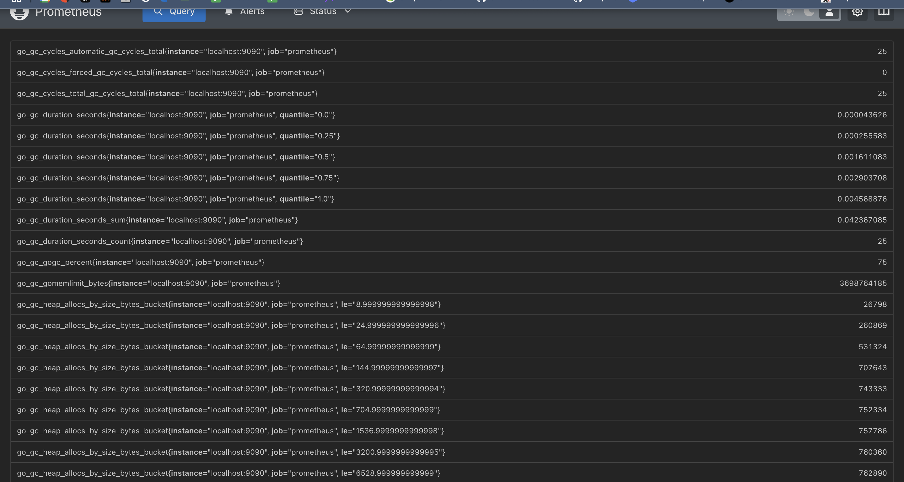

# **Lab 8: Monitoring with Prometheus**

## **1. Prometheus Setup Verification**

### **Prometheus Targets**
The following services are configured as Prometheus scrape targets:
- **Prometheus** (`localhost:9090`)
- **Loki** (`loki:3100`)
- **app_python** (`app_python:4000`)
- **app_javascript** (`app_javascript:6000`)

#### **Verification**
- Prometheus was started successfully using Docker Compose.
- All configured targets are listed as **UP** in Prometheus UI at `http://localhost:9090/targets`.



---

## **2. Grafana Dashboards Setup**

### **Installed Dashboards**
- **Loki Logs Dashboard** (ID: 13407)
- **Prometheus Metrics Dashboard** (ID: 3662)

#### **Verification**
- Accessed Grafana at `http://localhost:3000`
- Imported the required dashboards.

Loki:


Prometheus:


---

## **3. Service Configuration Updates**

### **Log Rotation Configuration**
- Added the following configuration in `docker-compose.yml` to limit log file size:
  ```yaml
  logging:
    driver: "json-file"
    options:
      max-size: "10m"
      max-file: "3"
  ```
- Ensures logs do not consume excessive disk space.

### **Memory Limits Configuration**
- Set memory limits for services in `docker-compose.yml`:
  ```yaml
  deploy:
    resources:
      limits:
        memory: 50M
  ```
- Prevents memory overuse by containers.

---

## **4. Metrics Collection Enhancements**

### **Python Application Metrics**
- Implemented Prometheus client in Python application.


### **JavaScript Application Metrics**
- Integrated `prom-client` for Prometheus metrics.


---

## **5. Health Checks Implementation**

### **Health Check Configuration**
- Added health checks in `docker-compose.yml`:
  ```yaml
  healthcheck:
      test: "curl -f http://localhost:{port} || exit 1"
      retries: 3
      timeout: 5s
      start_period: 5s
  ```
- Ensures services are restarted if they become unresponsive.