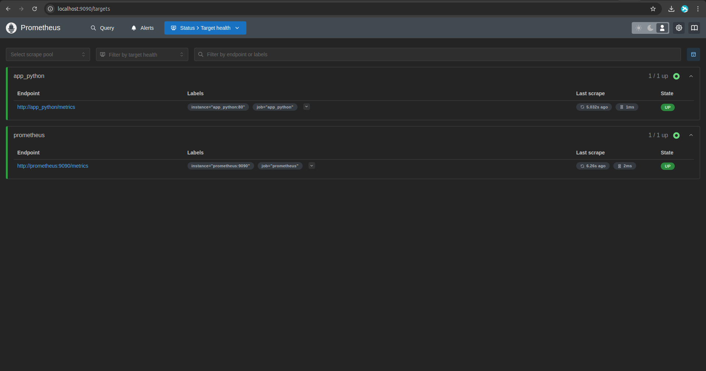
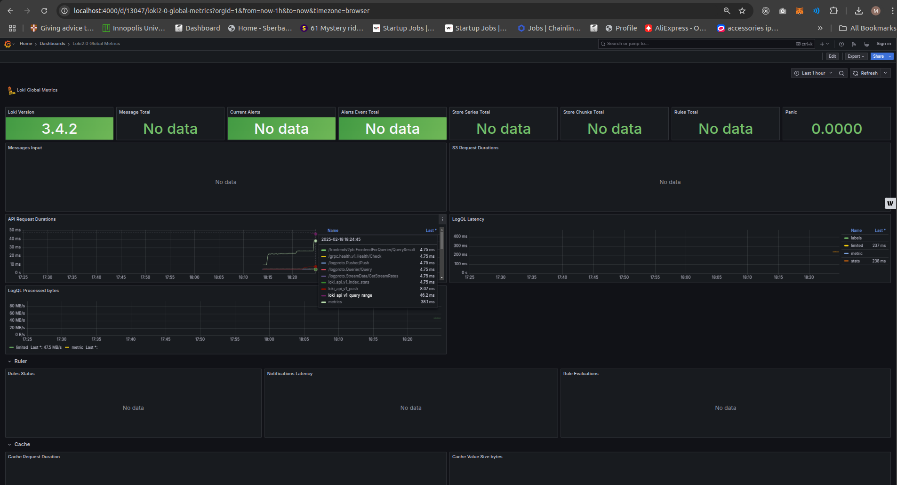

# Metrics Monitoring with Prometheus

This document outlines the setup and configuration of Prometheus for metrics collection in our application environment.

## Table of Contents

1. [Prometheus Setup](#prometheus-setup)
2. [Application Instrumentation](#application-instrumentation)
3. [Grafana Dashboards](#grafana-dashboards)
4. [Service Configuration Enhancements](#service-configuration-enhancements)

## Prometheus Setup

### Overview

Prometheus is an open-source systems monitoring and alerting toolkit. It collects and stores metrics as time series data, with metadata stored as key-value pairs called labels. Prometheus has a powerful query language (PromQL) that allows for flexible data analysis.

### Integration with Docker Compose

Prometheus has been integrated into our existing Docker Compose setup. The configuration includes:

- Prometheus server running on port 9090
- Configuration to scrape metrics from all services
- Persistent volume for storing metrics data

### Prometheus Configuration

The Prometheus configuration file (`prometheus.yml`) is set up to collect metrics from:

- Prometheus itself (self-monitoring)
- Loki logging system
- Grafana dashboard
- Python application
- Node.js application

```yaml
global:
  scrape_interval: 15s
  evaluation_interval: 15s

scrape_configs:
  - job_name: 'prometheus'
    static_configs:
      - targets: ['localhost:9090']

  - job_name: 'loki'
    static_configs:
      - targets: ['loki:3100']

  - job_name: 'grafana'
    static_configs:
      - targets: ['grafana:3000']

  - job_name: 'python-app'
    metrics_path: /metrics
    static_configs:
      - targets: ['python-app:5000']

  - job_name: 'node-app'
    metrics_path: /metrics
    static_configs:
      - targets: ['node-app:3000']
```

### Prometheus Targets

After starting the Docker Compose environment, Prometheus successfully scrapes metrics from all configured targets.



## Application Instrumentation

### Python Application

The Python application has been instrumented with the `prometheus-client` library to expose metrics:

- Request count metrics with labels for endpoint, method, and status code
- Request latency histogram with labels for endpoint and method
- Metrics exposed on the `/metrics` endpoint

```python
# Add prometheus metrics
REQUEST_COUNT = Counter(
    'app_request_count',
    'Application Request Count',
    ['endpoint', 'method', 'status_code']
)

REQUEST_LATENCY = Histogram(
    'app_request_latency_seconds',
    'Application Request Latency',
    ['endpoint', 'method']
)

# Add prometheus metrics endpoint
metrics_app = make_asgi_app()
app.mount("/metrics", metrics_app)
```

### Node.js Application

The Node.js application has been instrumented with the `prom-client` library to expose metrics:

- HTTP request count with labels for method, route, and status code
- HTTP request duration histogram with labels for method, route, and status code
- Default Node.js metrics (memory, CPU, etc.)
- Metrics exposed on the `/metrics` endpoint

```javascript
// Create custom metrics
const httpRequestDurationMicroseconds = new promClient.Histogram({
    name: 'http_request_duration_seconds',
    help: 'Duration of HTTP requests in seconds',
    labelNames: ['method', 'route', 'status_code'],
    buckets: [0.1, 0.3, 0.5, 0.7, 1, 3, 5, 7, 10]
});

const httpRequestCounter = new promClient.Counter({
    name: 'http_requests_total',
    help: 'Total number of HTTP requests',
    labelNames: ['method', 'route', 'status_code']
});
```

## Grafana Dashboards

### Loki Dashboard

A Grafana dashboard has been created to visualize logs from Loki:

- System logs panel
- Docker logs panel
- Python application logs panel



### Prometheus Dashboard

A Grafana dashboard has been created to visualize metrics from Prometheus:

- Python application request rate
- Python application request latency (p95)
- Node.js application request rate
- Node.js application request latency (p95)
- Total request counters for both applications


## Service Configuration Enhancements

### Log Rotation

All services in the Docker Compose file have been configured with log rotation to prevent log files from growing too large:

```yaml
logging:
  driver: "json-file"
  options:
    max-size: "10m"
    max-file: "3"
```

This configuration:
- Uses the JSON file logging driver
- Limits log files to 10MB in size
- Keeps a maximum of 3 rotated log files

### Memory Limits

Memory limits have been added to all services to prevent any single service from consuming too much memory:

```yaml
deploy:
  resources:
    limits:
      memory: 512M
```

Different memory limits have been set based on the expected resource usage of each service:
- Loki and Prometheus: 512MB (higher due to data storage requirements)
- Grafana: 512MB (for dashboard rendering and query processing)
- Application services: 256MB (sufficient for our simple applications)

These limits help ensure system stability and prevent resource contention between services.
