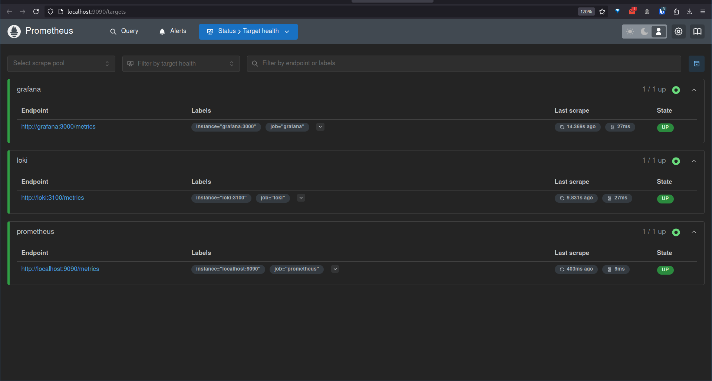

# Monitoring Setup Documentation

## Prometheus Setup

### Prometheus Targets



### Prometheus Configuration

The Prometheus configuration includes scraping metrics from:

- Prometheus itself
- Loki
- Grafana

## Grafana Dashboards

### Loki Dashboard


### Prometheus Dashboard


## Service Configuration Updates

### Log Rotation

All services in the docker-compose.yml file have been configured with log rotation:

```yaml
logging:
  driver: "json-file"
  options:
    max-size: "10m"
    max-file: "3"
```

### Memory Limits

All containers have been assigned memory limits:

```yaml
mem_limit: 512m
```
