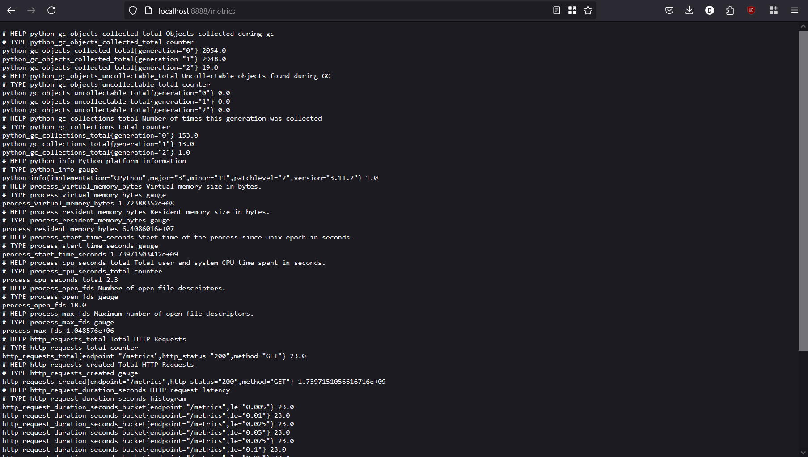

# Metrics

## Prometheus Targets

## Grafana Loki Dashboard

## Grafana Prometheus Dashboard

## Updates to Service Configuration

### Log Rotation
  
  Each service utilizes JSON file logging with log rotation. Each log file is limited to 10MB and a maximum of 3 rotated log files will be kept.

### Memory Limits

  A memory limit of 512MB has been set for all containers.

## Application Metrics

## Health Checks

### Loki

Checked using a process check (`pgrep loki`) with a start period of 5s, an interval of 10s, a timeout of 5s, and 5 retries.

### Promtail

Checked using a process check (`pgrep promtail`) with the same parameters.

### Grafana

Uses curl command to test its API endpoint (`http://localhost:3000/api/health`) every 10s, with a 5s timeout and 5 retries.

### Python App

Checked using a process check (`pgrep python`) with the same parameters.

### Prometheus

Checked using a process check (`pgrep prometheus`) with the same parameters.
