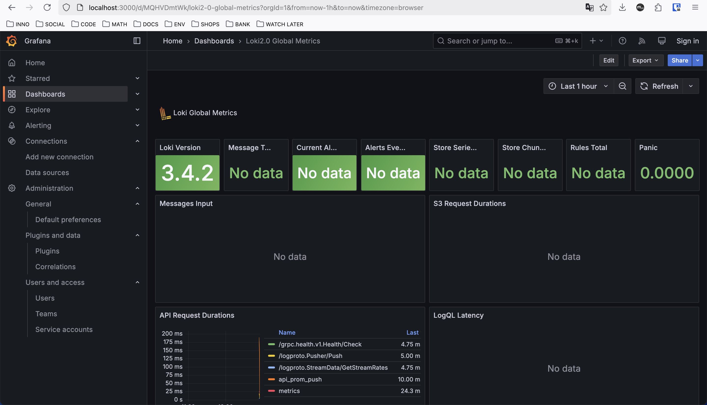

# Metrics

Setup consists of Prometheus container every 5 seconds collecting
metrics from the `prometheus`, `loki` containers and both Go and Python web applications.

For metrics collection purposes, to web applications `/metrics` endpoints
were added along with middlewares. Prometheus uses them to collect data.

Default dashboards with configured data sources for Prometheus and Loki containers
are also set up.

Limits on the memory usage along with log rotation settings were added to `docker-compose.yml`.
For some containers they differ because of OOM tendency for them.

In order to monitor the health status of applications, healthchecks were also added.

Specific details can be checked at `docker-compose.yml` as well.
