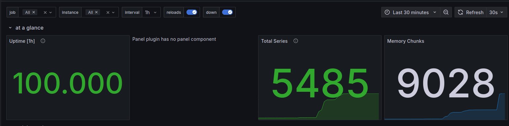

# METRICS.md

## Prometheus Setup
- **Prometheus Overview**: Learned about Prometheus and its core concepts.
- **Docker Compose Integration**: Added Prometheus to `docker-compose.yml`.
- **Prometheus Configuration**: Configured Prometheus to scrape metrics from Loki and other services.
- **Targets Verification**: Verified targets at `http://localhost:9090/targets`.

---

## Grafana Dashboards
- **Prometheus Dashboard**: Created a dashboard to visualize metrics (e.g., request count, response time).
- **Loki Dashboard**: Created a dashboard to display application logs.

