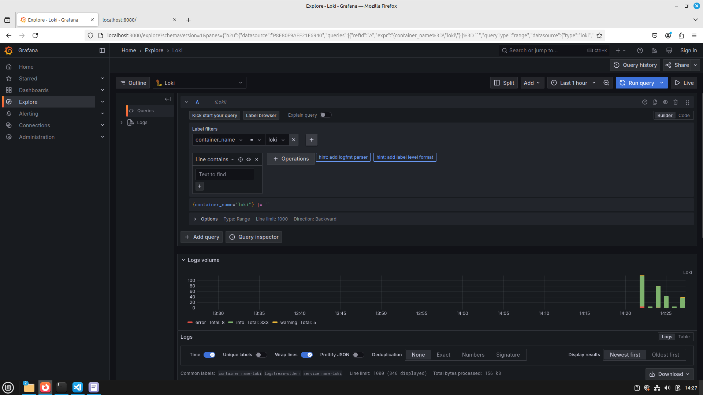

# Metrics Log

## Screenshots of the results

### Prometheus


### Prometheus Dashboard


### Loki Dashboard



## Changes made

- Added log rotation mechanisms, specified memory limits for containers

```bash
logging:
      driver: "json-file"
      options:
        max-size: "50m"
        max-file: "3"
    deploy:
      resources:
        limits:
          memory: 500M
```