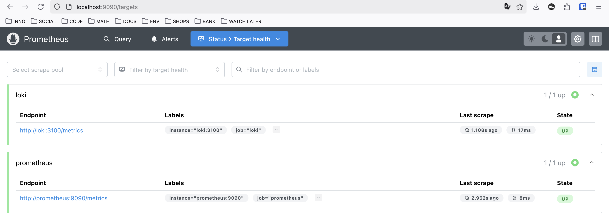

# Metrics Setup

## Prometheus

***Prometheus*** is used a monitoring system that fetches metrics from docker containers
of *loki*, *grafana* and *python web app*. Prometheus config can be found [here](prometheus-config.yml).
All metrics for each service are accessed on `/metrics` endpoint.

*Note:* Flutter applications **do not support Prometheus and Grafana**.
Popular production solutions for metric collection on frontend/mobile client applications
include Yandex AppMetrica, Firebase Crashlist and etc.

## Healthchecks

Each service has its own healthcheck test to ensure a health (valid) setup.
For a web applications, `curl` is used to ensure that application is accessible.

## Results

* Available targets

* Loki dashboard

* Prometheus dashboard

* Grafana metrics

* Loki metrics

* Prometheus metrics

* Python web app metrics

