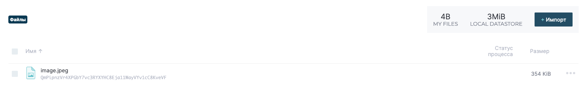
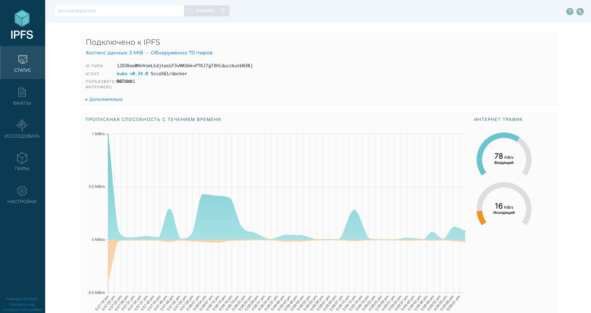
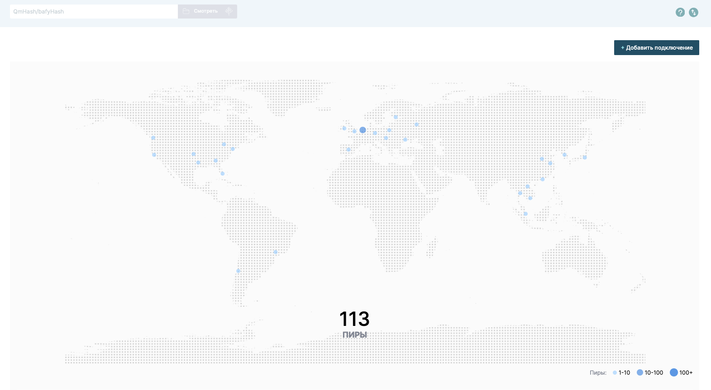

# IPFS and Fleek

## Set Up IPFS Gateway

```shell
docker pull ipfs/go-ipfs
docker run -d --name ipfs_host -v lab16_assets:/export -v ipfs_data:/data/ipfs -p 8080:8080 -p 4001:4001 -p 5001:5001 ipfs/go-ipfs
```

```shell
docker ps
```

```text
CONTAINER ID   IMAGE           COMMAND                  CREATED          STATUS                    PORTS                                                                                        NAMES
4da9a9d41d32   ipfs/go-ipfs    "/sbin/tini -- /usr/…"   15 seconds ago   Up 15 seconds (healthy)   0.0.0.0:4001->4001/tcp, 0.0.0.0:5001->5001/tcp, 4001/udp, 0.0.0.0:8080->8080/tcp, 8081/tcp   ipfs_host
```

## Upload File

`http://127.0.0.1:5001/webui/`



Hash: `QmPipnzVr4XPGbY7vc3RYXYHC8Eja11WayVYv1cC8KveVF`





### Access file via public IPFS gateway

https://ipfs.io/ipfs/QmPipnzVr4XPGbY7vc3RYXYHC8Eja11WayVYv1cC8KveVF
