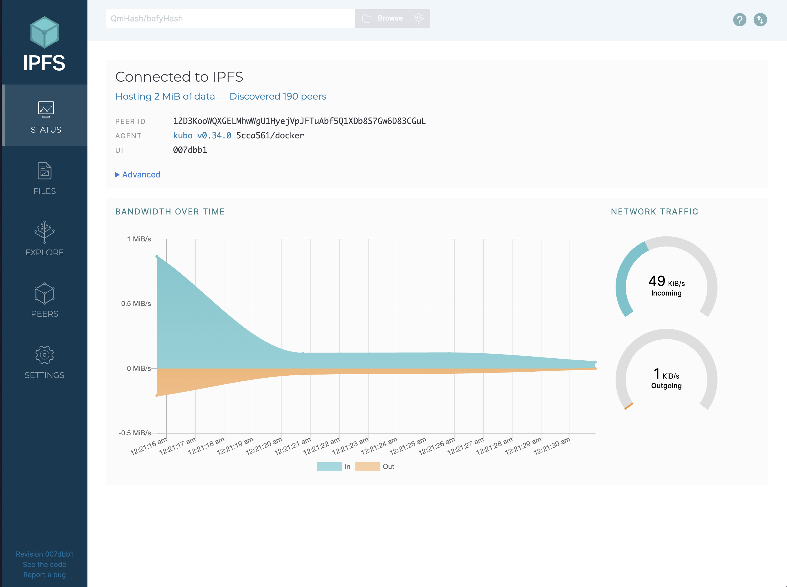
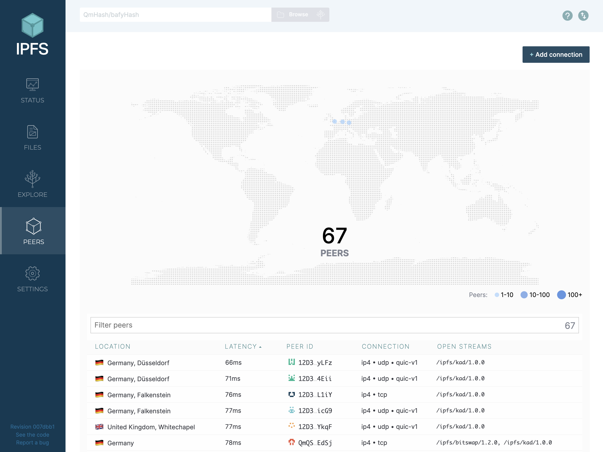
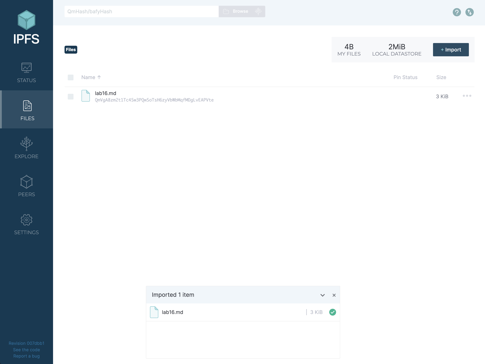

# Lab 16: IPFS and Fleek Submission

## Task 1: IPFS Gateway Using Docker

### Connected Peers and Bandwidth

### File Upload Information

- File Hash: `QmVgA8zm2t1Tc4Sw3PQwSoTsH6zyVbWbMqfMDgLvEAPVte`
- Gateway URLs used for verification:
  - https://ipfs.io/ipfs/QmVgA8zm2t1Tc4Sw3PQwSoTsH6zyVbWbMqfMDgLvEAPVte
  - https://cloudflare-ipfs.com/ipfs/QmVgA8zm2t1Tc4Sw3PQwSoTsH6zyVbWbMqfMDgLvEAPVte
  - https://ipfs.infura.io/ipfs/QmVgA8zm2t1Tc4Sw3PQwSoTsH6zyVbWbMqfMDgLvEAPVte

## Task 2: Project on Fleek.xyz

### Research Notes

- IPFS (InterPlanetary File System) is a distributed system for storing and accessing files, websites, applications, and data. It aims to make the web more resilient by addressing content by what it is, not where it's located.
- Fleek is a platform that simplifies the deployment of websites and applications to IPFS, providing a seamless way to host content on the decentralized web.

### Project Deployment

- IPFS Link: https://ipfs.io/ipfs/bafybeigqonpqhl2y4kehnlitfaui2k32do5opjjt2ykcycrmqcqjmtl2q4
- Domain: https://sparse-afternoon-brief.prd.on-fleek.net/
