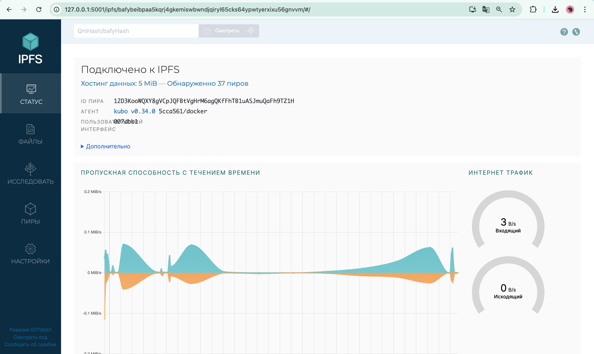
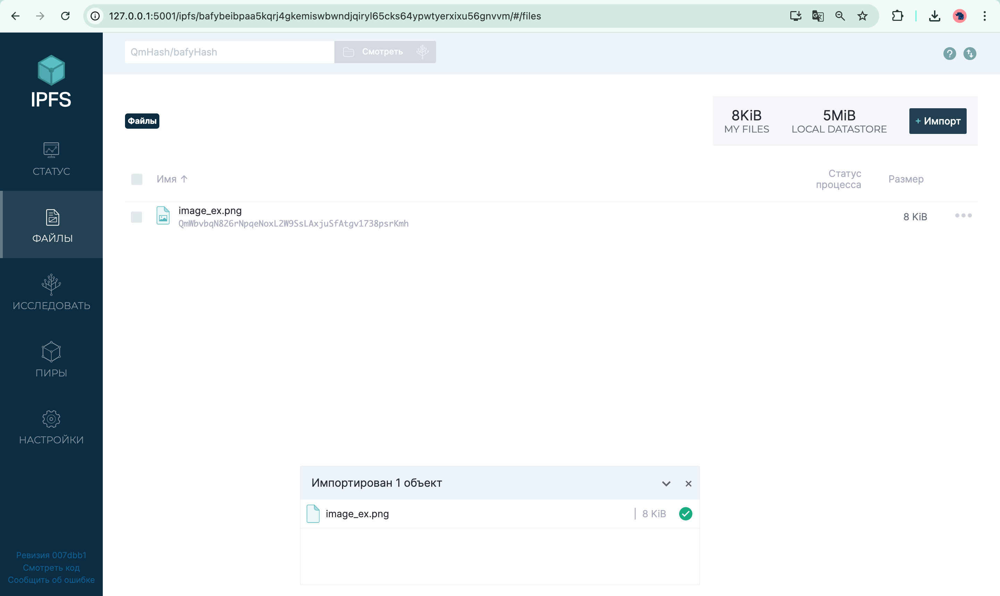
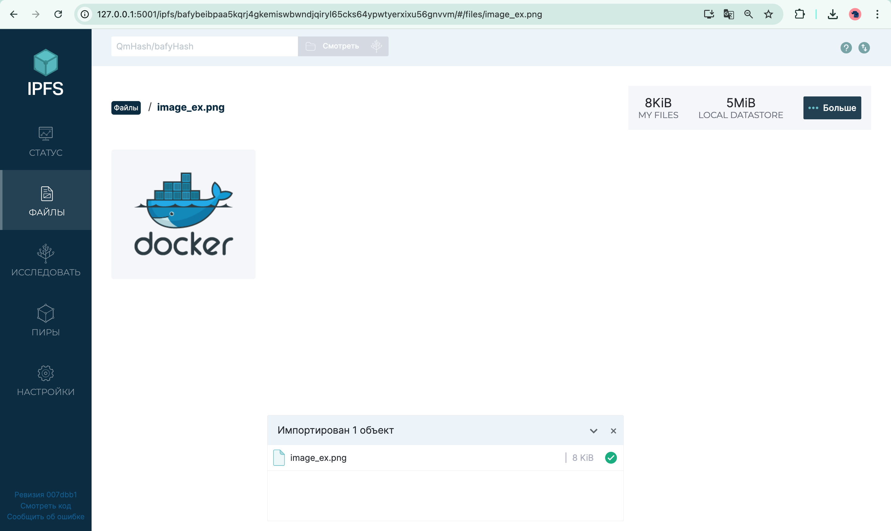

# IPFS Gateway Setup and File Upload

## Network Status

## File Upload

Hash: QmWbvbqN826rNpqeNoxL2W9SsLAxjuSfAtgv1738psrKmh
Link: https://ipfs.io/ipfs/QmWbvbqN826rNpqeNoxL2W9SsLAxjuSfAtgv1738psrKmh

# Task 2: Set Up Project on Fleek.xyz

### Objectives

- Understand the principles of IPFS and the features of Fleek.
- Deploy a project on Fleek and obtain a public IPFS link.

### Steps Executed

1. **Research and Preparation:**
   - In-depth research was conducted on the purpose of IPFS and the benefits of using Fleek.
   - Fleek’s features were reviewed to understand how it integrates with IPFS for decentralized hosting.

2. **Project Deployment on Fleek:**
   - An account was created on Fleek, if not already available.
   - A fork of the lab repository was used as the project source.
   - The project settings on Fleek were configured, and the repository was deployed. This deployment ensured that the project was automatically uploaded to IPFS.

3. **Documentation:**
   - The public IPFS link and the domain of the deployed project were recorded in the `submission2.md` file for easy verification.

### Outcomes

- The project was successfully deployed on Fleek.
- A public IPFS link was obtained, demonstrating that the project was live on the decentralized network.
- All setup details were meticulously documented.