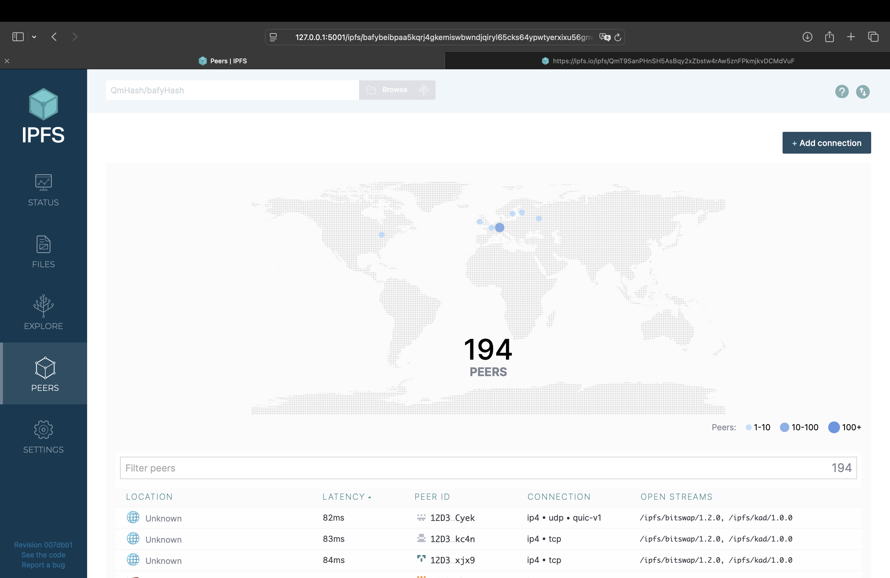
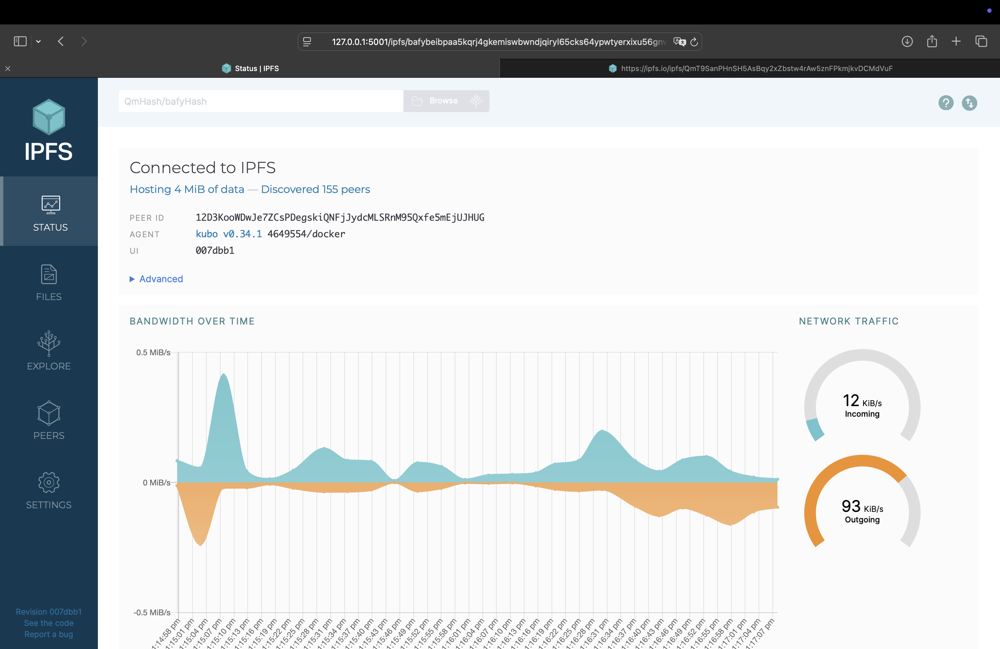

# Lab 16: IPFS and Fleek

## Task 1: IPFS Gateway

### 1. IPFS Setup

- Docker installed
- IPFS container run: 
```bash
(venv) louayfarah@Louays-MacBook-Pro S25-core-course-labs % docker run -d \    
  --name ipfs_host \
  -v app_python:/export \ 
  -v ipfs_data:/data/ipfs \
  -p 8080:8080 \
  -p 4001:4001 \
  -p 5001:5001 \
  ipfs/go-ipfs

9d2cd59dfe3e15c2215dbbcb070c417ba42b2f4d125aad19c4ea223d0f4e0a3d
(venv) louayfarah@Louays-MacBook-Pro S25-core-course-labs % docker ps
CONTAINER ID   IMAGE                                 COMMAND                  CREATED         STATUS                   PORTS                                                                                                                                  NAMES
9d2cd59dfe3e   ipfs/go-ipfs                          "/sbin/tini -- /usr/…"   9 seconds ago   Up 9 seconds (healthy)   0.0.0.0:4001->4001/tcp, 0.0.0.0:5001->5001/tcp, 4001/udp, 0.0.0.0:8080->8080/tcp, 8081/tcp                                             ipfs_host
eecf4d58ef02   gcr.io/k8s-minikube/kicbase:v0.0.46   "/usr/local/bin/entr…"   4 days ago      Up 18 hours              127.0.0.1:49502->22/tcp, 127.0.0.1:49498->2376/tcp, 127.0.0.1:49500->5000/tcp, 127.0.0.1:49501->8443/tcp, 127.0.0.1:49499->32443/tcp   minikube
(venv) louayfarah@Louays-MacBook-Pro S25-core-course-labs %
```

### 2. Uploading File to IPFS

- Connected peers: 

- Bandwidth usage:

- File Hash: `QmT9SanPHnSH5AsBqy2xZbstw4rAw5znFPkmjkvDCMdVuF`
- Gateway URLs tested:
  - https://ipfs.io/ipfs/QmT9SanPHnSH5AsBqy2xZbstw4rAw5znFPkmjkvDCMdVuF --> Loads
  - https://cloudflare-ipfs.com/ipfs/QmT9SanPHnSH5AsBqy2xZbstw4rAw5znFPkmjkvDCMdVuF --> Doesn't load


## Task 2: Fleek Deployment

- Project Source: [louayfarah/S25-core-course-labs](https://github.com/louayfarah/S25-core-course-labs)
- Fleek Site URL: [https://my-labs-site.on.fleek.co](https://many-arm-wide.on-fleek.app/)
- IPFS Hash: `bafybeibjmlyrm35b264rbehqng7xw5ry2meppztg3jsji36mmb7aezguia`
- Observed “Site Deployed” in Fleek dashboard.
