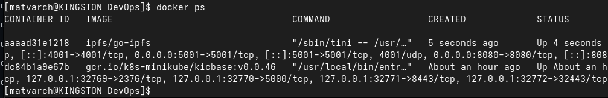
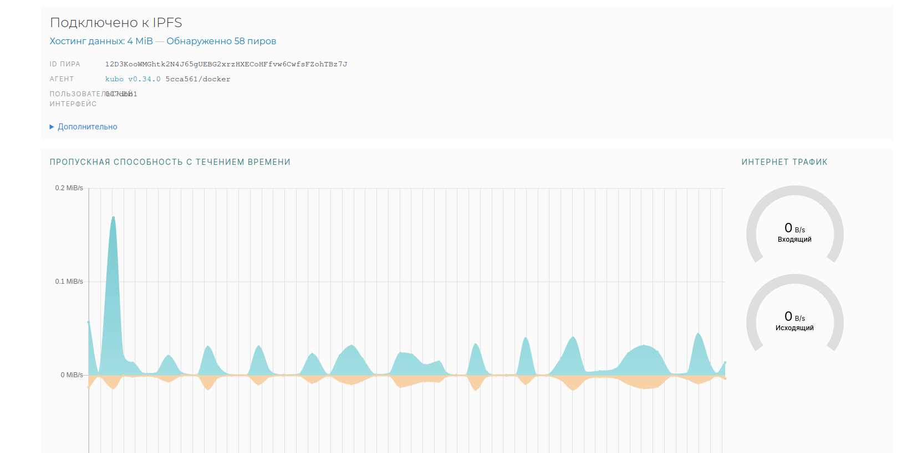
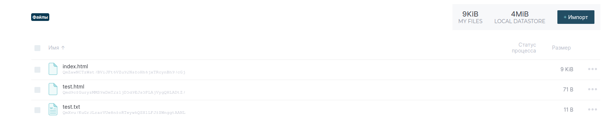

# Lab16 report

## Docker ps result

## Peers and bandwidth info

## Saved files:

## I uploaded index.html file from lab16/ folder. You was right, I can't access it throw links which you provided so I use dweb.link/ipfs. By the following link you surely can access this file:

### https://dweb.link/ipfs/QmZawNCTzWst7BViJFt6VZu92NsfoHh6jxTRcynBh97cGj

## I tried to save another one but it gave me only 504 error, so here is only hash for it:

### Qmd9cfGuryzMMS9xDmT2z1jD5d9EJs5PLAjVygQHLADtZ7