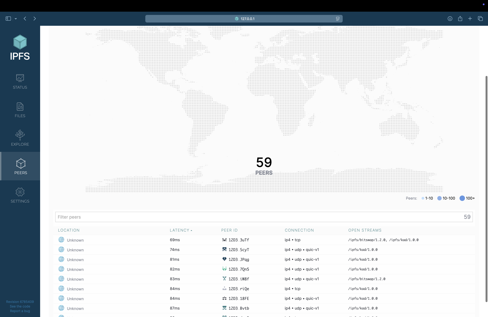

# Lab 16: IPFS and Fleek

## Task 1: Set Up an IPFS Gateway Using Docker

```bash
❱❱❱ docker ps
CONTAINER ID   IMAGE          COMMAND                  CREATED         STATUS                            PORTS                                                                                        NAMES
af384a5e4537   ipfs/go-ipfs   "/sbin/tini -- /usr/…"   5 seconds ago   Up 5 seconds (health: starting)   0.0.0.0:4001->4001/tcp, 0.0.0.0:5001->5001/tcp, 4001/udp, 0.0.0.0:8080->8080/tcp, 8081/tcp   ipfs_host
```

Link to the file:  <https://ipfs.io/ipfs/QmfM7bDFVm6JLcdMxPWB2WVJrGvkJAB9BTaqaYwMbN1yjK>




### Task 2

<https://tiny-argument-microscopic.on-fleek.app>


