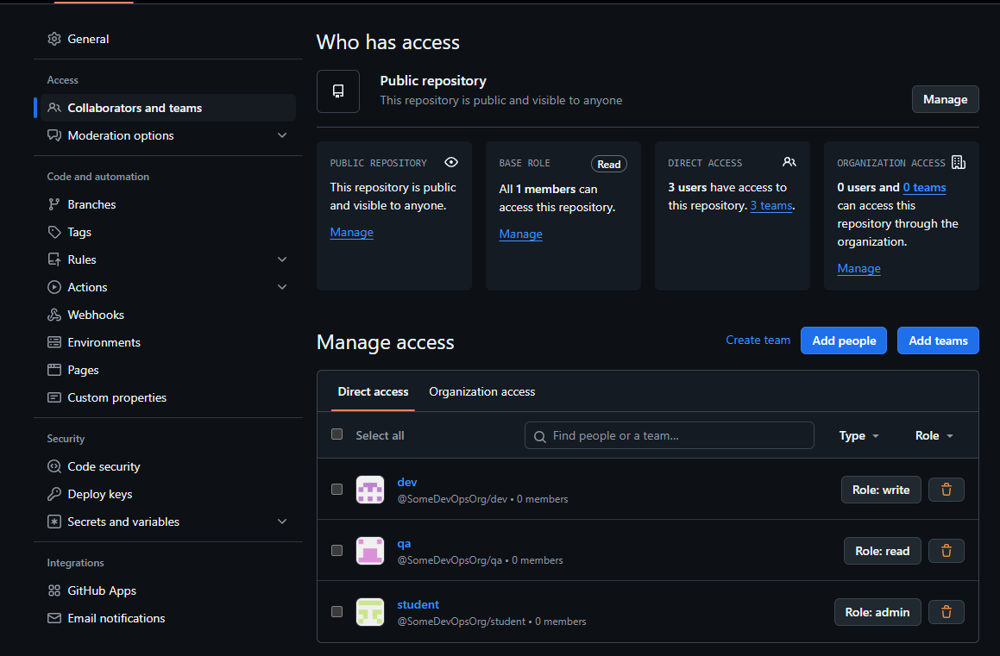

# **Terraform Lab Documentation**

## **1. Introduction**
This document outlines the process of setting up a Docker infrastructure using Terraform.

---

## **2. Prerequisites**
- A VPN tool was used to ensure access to required resources.
- Terraform was downloaded and added to the system's `PATH` on Windows via **System Variables**.
- Docker Desktop was installed and running on the local machine.

---

## **3. Terraform Configuration**

### **Initial Setup: `main.tf`**
The initial Terraform configuration (`main.tf`) was created as follows:

```hcl
terraform {
  required_providers {
    docker = {
      source  = "kreuzwerker/docker"
      version = "~> 3.0.1"
    }
  }
}

provider "docker" {
  host    = "npipe:////.//pipe//docker_engine"
}

resource "docker_image" "nginx" {
  name         = "nginx:latest"
  keep_locally = false
}

resource "docker_container" "nginx" {
  image = docker_image.nginx.image_id
  name  = "tutorial"
  ports {
    internal = 80
    external = 8000
  }
}
```
## Commands Executed

### Step 1: Initialize Terraform

**Command:**
```bash
terraform init
```
**Output:**
```bash
Initializing the backend...
Initializing provider plugins...
- Finding kreuzwerker/docker versions matching "~> 3.0.1"...
- Installing kreuzwerker/docker v3.0.2...
- Installed kreuzwerker/docker v3.0.2 (self-signed, key ID BD080C4571C6104C)
Partner and community providers are signed by their developers.
If you'd like to know more about provider signing, you can read about it here:
https://www.terraform.io/docs/cli/plugins/signing.html
Terraform has created a lock file .terraform.lock.hcl to record the provider
selections it made above. Include this file in your version control repository
so that Terraform can guarantee to make the same selections by default when
you run "terraform init" in the future.

Terraform has been successfully initialized!

You may now begin working with Terraform. Try running "terraform plan" to see
any changes that are required for your infrastructure. All Terraform commands
should now work.

If you ever set or change modules or backend configuration for Terraform,
rerun this command to reinitialize your working directory. If you forget, other
commands will detect it and remind you to do so if necessary.
```
### Step 2: Apply Terraform Configuration

**Command:**
```bash
terraform apply
```
**Output:**
```bash
Terraform used the selected providers to generate the following execution plan. Resource actions are indicated with the
following symbols:
  + create

Terraform will perform the following actions:

  # docker_container.nginx will be created
  + resource "docker_container" "nginx" {
      + attach                                      = false
      + bridge                                      = (known after apply)
      + command                                     = (known after apply)
      + container_logs                              = (known after apply)
      + container_read_refresh_timeout_milliseconds = 15000
      + entrypoint                                  = (known after apply)
      + env                                         = (known after apply)
      + exit_code                                   = (known after apply)
      + hostname                                    = (known after apply)
      + id                                          = (known after apply)
      + image                                       = (known after apply)
      + init                                        = (known after apply)
      + ipc_mode                                    = (known after apply)
      + log_driver                                  = (known after apply)
      + logs                                        = false
      + must_run                                    = true
      + name                                        = "tutorial"
      + network_data                                = (known after apply)
      + read_only                                   = false
      + remove_volumes                              = true
      + restart                                     = "no"
      + rm                                          = false
      + runtime                                     = (known after apply)
      + security_opts                               = (known after apply)
      + shm_size                                    = (known after apply)
      + start                                       = true
      + stdin_open                                  = false
      + stop_signal                                 = (known after apply)
      + stop_timeout                                = (known after apply)
      + tty                                         = false
      + wait                                        = false
      + wait_timeout                                = 60

      + healthcheck (known after apply)

      + labels (known after apply)

      + ports {
          + external = 8080
          + internal = 80
          + ip       = "0.0.0.0"
          + protocol = "tcp"
        }
    }

  # docker_image.nginx will be created
  + resource "docker_image" "nginx" {
      + id           = (known after apply)
      + image_id     = (known after apply)
      + keep_locally = false
      + name         = "nginx:latest"
      + repo_digest  = (known after apply)
    }

Plan: 2 to add, 0 to change, 0 to destroy.

Do you want to perform these actions?
  Terraform will perform the actions described above.
  Only 'yes' will be accepted to approve.

  Enter a value: yes

docker_image.nginx: Creating...
docker_image.nginx: Creation complete after 9s [id=sha256:c59e925d63f3aa135bfa9d82cb03fba9ee30edb22ebe6c9d4f43824312ba3d9bnginx:latest]
docker_container.nginx: Creating...
docker_container.nginx: Creation complete after 1s [id=025919f87ed58612de7a6393a78335e4a563bb272b44bb3cd813fb596bef5929]

Apply complete! Resources: 2 added, 0 changed, 0 destroyed.
```

### Step 3: Inspect Terraform State

**Command:**
```bash
terraform state show
```
**Output:**
```bash
# docker_container.nginx:
resource "docker_container" "nginx" {
    attach                                      = false
    bridge                                      = null
    command                                     = [
        "nginx",
        "-g",
        "daemon off;",
    ]
    container_read_refresh_timeout_milliseconds = 15000
    cpu_set                                     = null
    cpu_shares                                  = 0
    domainname                                  = null
    entrypoint                                  = [
        "/docker-entrypoint.sh",
    ]
    env                                         = []
    hostname                                    = "025919f87ed5"
    id                                          = "025919f87ed58612de7a6393a78335e4a563bb272b44bb3cd813fb596bef5929"
    image                                       = "sha256:c59e925d63f3aa135bfa9d82cb03fba9ee30edb22ebe6c9d4f43824312ba3d9b"
    init                                        = false
    ipc_mode                                    = "private"
    log_driver                                  = "json-file"
    logs                                        = false
    max_retry_count                             = 0
    memory                                      = 0
    memory_swap                                 = 0
    must_run                                    = true
    name                                        = "tutorial"
    network_data                                = [
        {
            gateway                   = "172.17.0.1"
            global_ipv6_address       = null
            global_ipv6_prefix_length = 0
            ip_address                = "172.17.0.2"
            ip_prefix_length          = 16
            ipv6_gateway              = null
            mac_address               = "02:42:ac:11:00:02"
            network_name              = "bridge"
        },
    ]
    network_mode                                = "bridge"
    pid_mode                                    = null
    privileged                                  = false
    publish_all_ports                           = false
    read_only                                   = false
    remove_volumes                              = true
    restart                                     = "no"
    rm                                          = false
    runtime                                     = "runc"
    security_opts                               = []
    shm_size                                    = 64
    start                                       = true
    stdin_open                                  = false
    stop_signal                                 = "SIGQUIT"
    stop_timeout                                = 0
    tty                                         = false
    user                                        = null
    userns_mode                                 = null
    wait                                        = false
    wait_timeout                                = 60
    working_dir                                 = null

    ports {
        external = 8080
        internal = 80
        ip       = "0.0.0.0"
        protocol = "tcp"
    }
}

# docker_image.nginx:
resource "docker_image" "nginx" {
    id           = "sha256:c59e925d63f3aa135bfa9d82cb03fba9ee30edb22ebe6c9d4f43824312ba3d9bnginx:latest"
    image_id     = "sha256:c59e925d63f3aa135bfa9d82cb03fba9ee30edb22ebe6c9d4f43824312ba3d9b"
    keep_locally = false
    name         = "nginx:latest"
    repo_digest  = "nginx@sha256:bc2f6a7c8ddbccf55bdb19659ce3b0a92ca6559e86d42677a5a02ef6bda2fcef"
}
```
**Command:**
```bash
terraform state list
```
**Output:**
```bash
docker_container.nginx
docker_image.nginx
```
### Step 4: View Terraform Outputs
I created an output.tf file and put inside
```
output "container_id" {
  description = "ID of the Docker container"
  value       = docker_container.nginx.id
}

output "image_id" {
  description = "ID of the Docker image"
  value       = docker_image.nginx.id
}
```
Then I used to redefine outputs
```bash
terraform refresh
```
With output
```
docker_image.nginx: Refreshing state... [id=sha256:c59e925d63f3aa135bfa9d82cb03fba9ee30edb22ebe6c9d4f43824312ba3d9bnginx:latest]
docker_container.nginx: Refreshing state... [id=025919f87ed58612de7a6393a78335e4a563bb272b44bb3cd813fb596bef5929]

Outputs:

image_id = "sha256:c59e925d63f3aa135bfa9d82cb03fba9ee30edb22ebe6c9d4f43824312ba3d9bnginx:latest"
```

**Command:**
```bash
terraform output
```
**Output:**
```bash
image_id = "sha256:c59e925d63f3aa135bfa9d82cb03fba9ee30edb22ebe6c9d4f43824312ba3d9bnginx:latest"
```

## Commands Executed With Variables Defined In variables.tf

### Step 1: variables.txt
```
variable "container_name" {
  description = "Value of the name for the Docker container"
  type        = string
  default     = "ExampleNginxContainer"
}
```

### Step 2: Replacing var name in main.tf
```
terraform {
  required_providers {
    docker = {
      source  = "kreuzwerker/docker"
      version = "~> 3.0.1"
    }
  }
}

provider "docker" {
  host    = "npipe:////.//pipe//docker_engine"
}

resource "docker_image" "nginx" {
  name         = "nginx:latest"
  keep_locally = false
}

resource "docker_container" "nginx" {
  image = docker_image.nginx.image_id
  name  = var.container_name
  ports {
    internal = 80
    external = 8080
  }
}
```
### Step 3: Apply Terraform Configuration

**Command:**
```bash
terraform apply
```
**Output:**
```bash
docker_image.nginx: Refreshing state... [id=sha256:c59e925d63f3aa135bfa9d82cb03fba9ee30edb22ebe6c9d4f43824312ba3d9bnginx:latest]
docker_container.nginx: Refreshing state... [id=025919f87ed58612de7a6393a78335e4a563bb272b44bb3cd813fb596bef5929]

Terraform used the selected providers to generate the following execution plan. Resource actions are indicated with the
following symbols:
-/+ destroy and then create replacement

Terraform will perform the following actions:

  # docker_container.nginx must be replaced
-/+ resource "docker_container" "nginx" {
      + bridge                                      = (known after apply)
      ~ command                                     = [
          - "nginx",
          - "-g",
          - "daemon off;",
        ] -> (known after apply)
      + container_logs                              = (known after apply)
      - cpu_shares                                  = 0 -> null
      - dns                                         = [] -> null
      - dns_opts                                    = [] -> null
      - dns_search                                  = [] -> null
      ~ entrypoint                                  = [
          - "/docker-entrypoint.sh",
        ] -> (known after apply)
      ~ env                                         = [] -> (known after apply)
      + exit_code                                   = (known after apply)
      - group_add                                   = [] -> null
      ~ hostname                                    = "025919f87ed5" -> (known after apply)
      ~ id                                          = "025919f87ed58612de7a6393a78335e4a563bb272b44bb3cd813fb596bef5929" -> (known after apply)
      ~ init                                        = false -> (known after apply)
      ~ ipc_mode                                    = "private" -> (known after apply)
      ~ log_driver                                  = "json-file" -> (known after apply)
      - log_opts                                    = {} -> null
      - max_retry_count                             = 0 -> null
      - memory                                      = 0 -> null
      - memory_swap                                 = 0 -> null
      ~ name                                        = "tutorial" -> "ExampleNginxContainer" # forces replacement
      ~ network_data                                = [
          - {
              - gateway                   = "172.17.0.1"
              - global_ipv6_prefix_length = 0
              - ip_address                = "172.17.0.2"
              - ip_prefix_length          = 16
              - mac_address               = "02:42:ac:11:00:02"
              - network_name              = "bridge"
                # (2 unchanged attributes hidden)
            },
        ] -> (known after apply)
      - network_mode                                = "bridge" -> null # forces replacement
      - privileged                                  = false -> null
      - publish_all_ports                           = false -> null
      ~ runtime                                     = "runc" -> (known after apply)
      ~ security_opts                               = [] -> (known after apply)
      ~ shm_size                                    = 64 -> (known after apply)
      ~ stop_signal                                 = "SIGQUIT" -> (known after apply)
      ~ stop_timeout                                = 0 -> (known after apply)
      - storage_opts                                = {} -> null
      - sysctls                                     = {} -> null
      - tmpfs                                       = {} -> null
        # (20 unchanged attributes hidden)

      ~ healthcheck (known after apply)

      ~ labels (known after apply)

        # (1 unchanged block hidden)
    }

Plan: 1 to add, 0 to change, 1 to destroy.

Changes to Outputs:
  + container_id = (known after apply)

Do you want to perform these actions?
  Terraform will perform the actions described above.
  Only 'yes' will be accepted to approve.

  Enter a value: yes

docker_container.nginx: Destroying... [id=025919f87ed58612de7a6393a78335e4a563bb272b44bb3cd813fb596bef5929]
docker_container.nginx: Destruction complete after 1s
docker_container.nginx: Creating...
docker_container.nginx: Creation complete after 1s [id=4846605e217a35c9730ec3a4a7309b168c079556fc78860628a9f39e4ce863eb]

Apply complete! Resources: 1 added, 0 changed, 1 destroyed.

Outputs:

container_id = "4846605e217a35c9730ec3a4a7309b168c079556fc78860628a9f39e4ce863eb"
image_id = "sha256:c59e925d63f3aa135bfa9d82cb03fba9ee30edb22ebe6c9d4f43824312ba3d9bnginx:latest"
```
### Step 4: Inspect Terraform State

**Command:**
```bash
terraform state show
```
**Output:**
```bash
# docker_container.nginx:
resource "docker_container" "nginx" {
    attach                                      = false
    bridge                                      = null
    command                                     = [
        "nginx",
        "-g",
        "daemon off;",
    ]
    container_read_refresh_timeout_milliseconds = 15000
    cpu_set                                     = null
    cpu_shares                                  = 0
    domainname                                  = null
    entrypoint                                  = [
        "/docker-entrypoint.sh",
    ]
    env                                         = []
    hostname                                    = "4846605e217a"
    id                                          = "4846605e217a35c9730ec3a4a7309b168c079556fc78860628a9f39e4ce863eb"
    image                                       = "sha256:c59e925d63f3aa135bfa9d82cb03fba9ee30edb22ebe6c9d4f43824312ba3d9b"
    init                                        = false
    ipc_mode                                    = "private"
    log_driver                                  = "json-file"
    logs                                        = false
    max_retry_count                             = 0
    memory                                      = 0
    memory_swap                                 = 0
    must_run                                    = true
    name                                        = "ExampleNginxContainer"
    network_data                                = [
        {
            gateway                   = "172.17.0.1"
            global_ipv6_address       = null
            global_ipv6_prefix_length = 0
            ip_address                = "172.17.0.2"
            ip_prefix_length          = 16
            ipv6_gateway              = null
            mac_address               = "02:42:ac:11:00:02"
            network_name              = "bridge"
        },
    ]
    network_mode                                = "bridge"
    pid_mode                                    = null
    privileged                                  = false
    publish_all_ports                           = false
    read_only                                   = false
    remove_volumes                              = true
    restart                                     = "no"
    rm                                          = false
    runtime                                     = "runc"
    security_opts                               = []
    shm_size                                    = 64
    start                                       = true
    stdin_open                                  = false
    stop_signal                                 = "SIGQUIT"
    stop_timeout                                = 0
    tty                                         = false
    user                                        = null
    userns_mode                                 = null
    wait                                        = false
    wait_timeout                                = 60
    working_dir                                 = null

    ports {
        external = 8080
        internal = 80
        ip       = "0.0.0.0"
        protocol = "tcp"
    }
}

# docker_image.nginx:
resource "docker_image" "nginx" {
    id           = "sha256:c59e925d63f3aa135bfa9d82cb03fba9ee30edb22ebe6c9d4f43824312ba3d9bnginx:latest"
    image_id     = "sha256:c59e925d63f3aa135bfa9d82cb03fba9ee30edb22ebe6c9d4f43824312ba3d9b"
    keep_locally = false
    name         = "nginx:latest"
    repo_digest  = "nginx@sha256:bc2f6a7c8ddbccf55bdb19659ce3b0a92ca6559e86d42677a5a02ef6bda2fcef"
}


Outputs:

container_id = "4846605e217a35c9730ec3a4a7309b168c079556fc78860628a9f39e4ce863eb"
image_id = "sha256:c59e925d63f3aa135bfa9d82cb03fba9ee30edb22ebe6c9d4f43824312ba3d9bnginx:latest"
```
**Command:**
```bash
terraform state list
```
**Output:**
```bash
docker_container.nginx
docker_image.nginx
```
### Step 5: View Terraform Outputs
**Command:**
```bash
terraform output
```
**Output:**
```bash
container_id = "4846605e217a35c9730ec3a4a7309b168c079556fc78860628a9f39e4ce863eb"
image_id = "sha256:c59e925d63f3aa135bfa9d82cb03fba9ee30edb22ebe6c9d4f43824312ba3d9bnginx:latest"
```

## Commands Executed With Variable Name Aliasing From Terminal
### Step 1: Apply Terraform Configuration
**Command:**
```bash
terraform apply -var "container_name=SomeAnotherName"
```
**Output:**
```bash
docker_image.nginx: Refreshing state... [id=sha256:c59e925d63f3aa135bfa9d82cb03fba9ee30edb22ebe6c9d4f43824312ba3d9bnginx:latest]
docker_container.nginx: Refreshing state... [id=4846605e217a35c9730ec3a4a7309b168c079556fc78860628a9f39e4ce863eb]

Terraform used the selected providers to generate the following execution plan. Resource actions are indicated with the
following symbols:
-/+ destroy and then create replacement

Terraform will perform the following actions:

  # docker_container.nginx must be replaced
-/+ resource "docker_container" "nginx" {
      + bridge                                      = (known after apply)
      ~ command                                     = [
          - "nginx",
          - "-g",
          - "daemon off;",
        ] -> (known after apply)
      + container_logs                              = (known after apply)
      - cpu_shares                                  = 0 -> null
      - dns                                         = [] -> null
      - dns_opts                                    = [] -> null
      - dns_search                                  = [] -> null
      ~ entrypoint                                  = [
          - "/docker-entrypoint.sh",
        ] -> (known after apply)
      ~ env                                         = [] -> (known after apply)
      + exit_code                                   = (known after apply)
      - group_add                                   = [] -> null
      ~ hostname                                    = "4846605e217a" -> (known after apply)
      ~ id                                          = "4846605e217a35c9730ec3a4a7309b168c079556fc78860628a9f39e4ce863eb" -> (known after apply)
      ~ init                                        = false -> (known after apply)
      ~ ipc_mode                                    = "private" -> (known after apply)
      ~ log_driver                                  = "json-file" -> (known after apply)
      - log_opts                                    = {} -> null
      - max_retry_count                             = 0 -> null
      - memory                                      = 0 -> null
      - memory_swap                                 = 0 -> null
      ~ name                                        = "ExampleNginxContainer" -> "SomeAnotherName" # forces replacement
      ~ network_data                                = [
          - {
              - gateway                   = "172.17.0.1"
              - global_ipv6_prefix_length = 0
              - ip_address                = "172.17.0.2"
              - ip_prefix_length          = 16
              - mac_address               = "02:42:ac:11:00:02"
              - network_name              = "bridge"
                # (2 unchanged attributes hidden)
            },
        ] -> (known after apply)
      - network_mode                                = "bridge" -> null # forces replacement
      - privileged                                  = false -> null
      - publish_all_ports                           = false -> null
      ~ runtime                                     = "runc" -> (known after apply)
      ~ security_opts                               = [] -> (known after apply)
      ~ shm_size                                    = 64 -> (known after apply)
      ~ stop_signal                                 = "SIGQUIT" -> (known after apply)
      ~ stop_timeout                                = 0 -> (known after apply)
      - storage_opts                                = {} -> null
      - sysctls                                     = {} -> null
      - tmpfs                                       = {} -> null
        # (20 unchanged attributes hidden)

      ~ healthcheck (known after apply)

      ~ labels (known after apply)

        # (1 unchanged block hidden)
    }

Plan: 1 to add, 0 to change, 1 to destroy.

Changes to Outputs:
  ~ container_id = "4846605e217a35c9730ec3a4a7309b168c079556fc78860628a9f39e4ce863eb" -> (known after apply)

Do you want to perform these actions?
  Terraform will perform the actions described above.
  Only 'yes' will be accepted to approve.

  Enter a value: yes

docker_container.nginx: Destroying... [id=4846605e217a35c9730ec3a4a7309b168c079556fc78860628a9f39e4ce863eb]
docker_container.nginx: Destruction complete after 1s
docker_container.nginx: Creating...
docker_container.nginx: Creation complete after 0s [id=2c0c131d3e4eab6fad28edcbaaf46694153ab97370e7979525b3a05ffd777616]

Apply complete! Resources: 1 added, 0 changed, 1 destroyed.

Outputs:

container_id = "2c0c131d3e4eab6fad28edcbaaf46694153ab97370e7979525b3a05ffd777616"
image_id = "sha256:c59e925d63f3aa135bfa9d82cb03fba9ee30edb22ebe6c9d4f43824312ba3d9bnginx:latest"
```
### Step 2: Inspect Terraform State

**Command:**
```bash
terraform state show
```
**Output:**
```bash
# docker_container.nginx:
resource "docker_container" "nginx" {
    attach                                      = false
    bridge                                      = null
    command                                     = [
        "nginx",
        "-g",
        "daemon off;",
    ]
    container_read_refresh_timeout_milliseconds = 15000
    cpu_set                                     = null
    cpu_shares                                  = 0
    domainname                                  = null
    entrypoint                                  = [
        "/docker-entrypoint.sh",
    ]
    env                                         = []
    hostname                                    = "2c0c131d3e4e"
    id                                          = "2c0c131d3e4eab6fad28edcbaaf46694153ab97370e7979525b3a05ffd777616"
    image                                       = "sha256:c59e925d63f3aa135bfa9d82cb03fba9ee30edb22ebe6c9d4f43824312ba3d9b"
    init                                        = false
    ipc_mode                                    = "private"
    log_driver                                  = "json-file"
    logs                                        = false
    max_retry_count                             = 0
    memory                                      = 0
    memory_swap                                 = 0
    must_run                                    = true
    name                                        = "SomeAnotherName"
    network_data                                = [
        {
            gateway                   = "172.17.0.1"
            global_ipv6_address       = null
            global_ipv6_prefix_length = 0
            ip_address                = "172.17.0.2"
            ip_prefix_length          = 16
            ipv6_gateway              = null
            mac_address               = "02:42:ac:11:00:02"
            network_name              = "bridge"
        },
    ]
    network_mode                                = "bridge"
    pid_mode                                    = null
    privileged                                  = false
    publish_all_ports                           = false
    read_only                                   = false
    remove_volumes                              = true
    restart                                     = "no"
    rm                                          = false
    runtime                                     = "runc"
    security_opts                               = []
    shm_size                                    = 64
    start                                       = true
    stdin_open                                  = false
    stop_signal                                 = "SIGQUIT"
    stop_timeout                                = 0
    tty                                         = false
    user                                        = null
    userns_mode                                 = null
    wait                                        = false
    wait_timeout                                = 60
    working_dir                                 = null

    ports {
        external = 8080
        internal = 80
        ip       = "0.0.0.0"
        protocol = "tcp"
    }
}

# docker_image.nginx:
resource "docker_image" "nginx" {
    id           = "sha256:c59e925d63f3aa135bfa9d82cb03fba9ee30edb22ebe6c9d4f43824312ba3d9bnginx:latest"
    image_id     = "sha256:c59e925d63f3aa135bfa9d82cb03fba9ee30edb22ebe6c9d4f43824312ba3d9b"
    keep_locally = false
    name         = "nginx:latest"
    repo_digest  = "nginx@sha256:bc2f6a7c8ddbccf55bdb19659ce3b0a92ca6559e86d42677a5a02ef6bda2fcef"
}


Outputs:

container_id = "2c0c131d3e4eab6fad28edcbaaf46694153ab97370e7979525b3a05ffd777616"
image_id = "sha256:c59e925d63f3aa135bfa9d82cb03fba9ee30edb22ebe6c9d4f43824312ba3d9bnginx:latest"
```
**Command:**
```bash
terraform state list
```
**Output:**
```bash
docker_container.nginx
docker_image.nginx
```
### Step 5: View Terraform Outputs
**Command:**
```bash
terraform output
```
**Output:**
```bash
container_id = "2c0c131d3e4eab6fad28edcbaaf46694153ab97370e7979525b3a05ffd777616"
image_id = "sha256:c59e925d63f3aa135bfa9d82cb03fba9ee30edb22ebe6c9d4f43824312ba3d9bnginx:latest"
```

## Yandex Cloud Terraform Setup

### Step 1: Create a Yandex Cloud Account
 I created an account on **Yandex Cloud**.
 I then created a **service account** and assigned it the **admin role**.

### Step 2: Install Yandex Cloud CLI
 I navigated to the terraform folder and created yandex-cloud inside
 I downloaded the **Yandex Cloud CLI** to my Windows PC using PowerShell in the yandex-cloud. The following commands were executed:
  ```bash
  iex (New-Object System.Net.WebClient).DownloadString('https://storage.yandexcloud.net/yandexcloud-yc/install.ps1')
  $env:PATH += ";$env:USERPROFILE\yandex-cloud\bin"
  [Environment]::SetEnvironmentVariable("PATH", "$env:PATH;$env:USERPROFILE\yandex-cloud\bin", [EnvironmentVariableTarget]::User)
  ```
- These commands installed the CLI and added it to the system's `PATH` for easy access.

### Step 3: Set Up CLI Profile
 I initialized the CLI profile using:
 ```bash
  yc init
  ```
 This prompted me to visit the following URL to obtain an OAuth token:
  ```bash
    Welcome! This command will take you through the configuration process.
    Please go to https://oauth.yandex.ru/authorize?response_type=token&amp;client_id= ...
    in order to obtain OAuth token.
    Please enter OAuth token: ...
  ```
After entering the token, I was asked to select a cloud. I chose the default cloud:
  ```bash    
  You have one cloud available: 'cloud-n1col0s228' (id = b1g8t8ln41nog7*****). It is going to be used by default.
  Please choose folder to use:
   [1] default (id = b1g9ej6smvinr******)
   [2] Create a new folder
   ```
  I selected option `[1] default`.

### Step 4: Create a Service Account Key
 To create a service account key, I ran the following command (with my actual data):
  ```bash
  yc iam key create --service-account-id ... --folder-name default --output key.json
  ```
 The output was:
  ```bash
  id: ....
  service_account_id: ...
  created_at: "2025-02-06T00:58:31.998994186Z"
  key_algorithm: RSA_2048
  ```

### Step 5: Configure CLI Profile
 I created a new CLI profile:
  ```bash
  yc config profile create <profile_name>
  ```
 Output:
 ```bash
  Profile 'sa-terraform' created and activated
 ```
 I then set the profile configuration using:
  ```bash
  yc config set service-account-key key.json
  yc config set cloud-id <cloud_ID>
  yc config set folder-id <folder_ID>
  ```

### Step 6: Add Credentials to Environment Variables
I added the credentials to environment variables using the following commands:
  ```bash
  $Env:YC_TOKEN=$(yc iam create-token)
  $Env:YC_CLOUD_ID=$(yc config get cloud-id)
  $Env:YC_FOLDER_ID=$(yc config get folder-id)
  ```

### Step 7: Terraform Configuration
### main.tf
The following Terraform configuration (`main.tf`) was created:
```bash
terraform {
  required_providers {
    yandex = {
      source = "yandex-cloud/yandex"
    }
  }
  required_version = ">= 0.13"
}

provider "yandex" {
  zone = var.zone
}

resource "yandex_compute_disk" "boot-disk-1" {
  name     = "boot-disk-1"
  type     = "network-hdd"
  zone     = var.zone
  size     = "20"
  image_id = var.image_id
}

resource "yandex_compute_disk" "boot-disk-2" {
  name     = "boot-disk-2"
  type     = "network-hdd"
  zone     = var.zone
  size     = "20"
  image_id = var.image_id
}

resource "yandex_compute_instance" "vm-1" {
  name = "terraform1"
  resources {
    cores  = 2
    memory = 2
  }
  boot_disk {
    disk_id = yandex_compute_disk.boot-disk-1.id
  }
  network_interface {
    subnet_id = yandex_vpc_subnet.subnet-1.id
    nat       = true
  }
  metadata = {
    ssh-keys = "ubuntu:${file("~/.ssh/id_ed25519.pub")}"
  }
}

resource "yandex_compute_instance" "vm-2" {
  name = "terraform2"
  resources {
    cores  = 4
    memory = 4
  }
  boot_disk {
    disk_id = yandex_compute_disk.boot-disk-2.id
  }
  network_interface {
    subnet_id = yandex_vpc_subnet.subnet-1.id
    nat       = true
  }
  metadata = {
    ssh-keys = "ubuntu:${file("~/.ssh/id_ed25519.pub")}"
  }
}

resource "yandex_vpc_network" "network-1" {
  name = "network1"
}

resource "yandex_vpc_subnet" "subnet-1" {
  name           = "subnet1"
  zone           = var.zone
  network_id     = yandex_vpc_network.network-1.id
  v4_cidr_blocks = ["192.168.10.0/24"]
}

output "internal_ip_address_vm_1" {
  value = yandex_compute_instance.vm-1.network_interface.0.ip_address
}

output "internal_ip_address_vm_2" {
  value = yandex_compute_instance.vm-2.network_interface.0.ip_address
}

output "external_ip_address_vm_1" {
  value = yandex_compute_instance.vm-1.network_interface.0.nat_ip_address
}

output "external_ip_address_vm_2" {
  value = yandex_compute_instance.vm-2.network_interface.0.nat_ip_address
}
```
### variables.tf
The following variables were defined in `variables.tf`:
```bash
variable "zone" {
  type    = string
  default = "ru-central1-a"
}

variable "image_id" {
  type    = string
  default = "fd865uon0af912uhk9cs"
}
```
### Step 8: Initialize Terraform
I ran the following command to initialize Terraform:
```bash
terraform init
```
**Output:**
```
Initializing the backend...
Initializing provider plugins...
- Finding latest version of yandex-cloud/yandex...
- Installing yandex-cloud/yandex v0.136.0...
- Installed yandex-cloud/yandex v0.136.0 (self-signed, key ID E40F590B50BB8E40)
Partner and community providers are signed by their developers.
If you'd like to know more about provider signing, you can read about it here:
https://www.terraform.io/docs/cli/plugins/signing.html
Terraform has created a lock file .terraform.lock.hcl to record the provider
selections it made above. Include this file in your version control repository
so that Terraform can guarantee to make the same selections by default when
you run "terraform init" in the future.

Terraform has been successfully initialized!

You may now begin working with Terraform. Try running "terraform plan" to see
any changes that are required for your infrastructure. All Terraform commands
should now work.

If you ever set or change modules or backend configuration for Terraform,
rerun this command to reinitialize your working directory. If you forget, other
commands will detect it and remind you to do so if necessary.
```
### Step 9: Validate Terraform Configuration
I validated the Terraform configuration using:
```
terraform validate
```
**Output:**
```
Success! The configuration is valid.
```
### Step 10: Plan Terraform Changes
I generated an execution plan using:
```
terraform plan
```
**Output:**
```
Terraform used the selected providers to generate the following execution plan. Resource actions are indicated with the
following symbols:
  + create

Terraform will perform the following actions:

  # yandex_compute_disk.boot-disk-1 will be created
  + resource "yandex_compute_disk" "boot-disk-1" {
      + block_size  = 4096
      + created_at  = (known after apply)
      + folder_id   = (known after apply)
      + id          = (known after apply)
      + image_id    = "fd865uon0af912uhk9cs"
      + name        = "boot-disk-1"
      + product_ids = (known after apply)
      + size        = 20
      + status      = (known after apply)
      + type        = "network-hdd"
      + zone        = "ru-central1-a"

      + disk_placement_policy (known after apply)

      + hardware_generation (known after apply)
    }

  # yandex_compute_disk.boot-disk-2 will be created
  + resource "yandex_compute_disk" "boot-disk-2" {
      + block_size  = 4096
      + created_at  = (known after apply)
      + folder_id   = (known after apply)
      + id          = (known after apply)
      + image_id    = "fd865uon0af912uhk9cs"
      + name        = "boot-disk-2"
      + product_ids = (known after apply)
      + size        = 20
      + status      = (known after apply)
      + type        = "network-hdd"
      + zone        = "ru-central1-a"

      + disk_placement_policy (known after apply)

      + hardware_generation (known after apply)
    }

  # yandex_compute_instance.vm-1 will be created
  + resource "yandex_compute_instance" "vm-1" {
      + created_at                = (known after apply)
      + folder_id                 = (known after apply)
      + fqdn                      = (known after apply)
      + gpu_cluster_id            = (known after apply)
      + hardware_generation       = (known after apply)
      + hostname                  = (known after apply)
      + id                        = (known after apply)
      + maintenance_grace_period  = (known after apply)
      + maintenance_policy        = (known after apply)
      + metadata                  = {
          + "ssh-keys" = <<-EOT
                ubuntu:ssh-ed25519 AAAAC3NzaC1lZDI1NTE5AAAAIIfNq0AFOEdMd26y+u8IYoHpsoM9oK9ORiPoOJ+Tl5du engli@NikolaiPC
            EOT
        }
      + name                      = "terraform1"
      + network_acceleration_type = "standard"
      + platform_id               = "standard-v1"
      + service_account_id        = (known after apply)
      + status                    = (known after apply)
      + zone                      = (known after apply)

      + boot_disk {
          + auto_delete = true
          + device_name = (known after apply)
          + disk_id     = (known after apply)
          + mode        = (known after apply)

          + initialize_params (known after apply)
        }

      + metadata_options (known after apply)

      + network_interface {
          + index              = (known after apply)
          + ip_address         = (known after apply)
          + ipv4               = true
          + ipv6               = (known after apply)
          + ipv6_address       = (known after apply)
          + mac_address        = (known after apply)
          + nat                = true
          + nat_ip_address     = (known after apply)
          + nat_ip_version     = (known after apply)
          + security_group_ids = (known after apply)
          + subnet_id          = (known after apply)
        }

      + placement_policy (known after apply)

      + resources {
          + core_fraction = 100
          + cores         = 2
          + memory        = 2
        }

      + scheduling_policy (known after apply)
    }

  # yandex_compute_instance.vm-2 will be created
  + resource "yandex_compute_instance" "vm-2" {
      + created_at                = (known after apply)
      + folder_id                 = (known after apply)
      + fqdn                      = (known after apply)
      + gpu_cluster_id            = (known after apply)
      + hardware_generation       = (known after apply)
      + hostname                  = (known after apply)
      + id                        = (known after apply)
      + maintenance_grace_period  = (known after apply)
      + maintenance_policy        = (known after apply)
      + metadata                  = {
          + "ssh-keys" = <<-EOT
                ubuntu:ssh-ed25519 AAAAC3NzaC1lZDI1NTE5AAAAIIfNq0AFOEdMd26y+u8IYoHpsoM9oK9ORiPoOJ+Tl5du engli@NikolaiPC
            EOT
        }
      + name                      = "terraform2"
      + network_acceleration_type = "standard"
      + platform_id               = "standard-v1"
      + service_account_id        = (known after apply)
      + status                    = (known after apply)
      + zone                      = (known after apply)

      + boot_disk {
          + auto_delete = true
          + device_name = (known after apply)
          + disk_id     = (known after apply)
          + mode        = (known after apply)

          + initialize_params (known after apply)
        }

      + metadata_options (known after apply)

      + network_interface {
          + index              = (known after apply)
          + ip_address         = (known after apply)
          + ipv4               = true
          + ipv6               = (known after apply)
          + ipv6_address       = (known after apply)
          + mac_address        = (known after apply)
          + nat                = true
          + nat_ip_address     = (known after apply)
          + nat_ip_version     = (known after apply)
          + security_group_ids = (known after apply)
          + subnet_id          = (known after apply)
        }

      + placement_policy (known after apply)

      + resources {
          + core_fraction = 100
          + cores         = 4
          + memory        = 4
        }

      + scheduling_policy (known after apply)
    }

  # yandex_vpc_network.network-1 will be created
  + resource "yandex_vpc_network" "network-1" {
      + created_at                = (known after apply)
      + default_security_group_id = (known after apply)
      + folder_id                 = (known after apply)
      + id                        = (known after apply)
      + labels                    = (known after apply)
      + name                      = "network1"
      + subnet_ids                = (known after apply)
    }

  # yandex_vpc_subnet.subnet-1 will be created
  + resource "yandex_vpc_subnet" "subnet-1" {
      + created_at     = (known after apply)
      + folder_id      = (known after apply)
      + id             = (known after apply)
      + labels         = (known after apply)
      + name           = "subnet1"
      + network_id     = (known after apply)
      + v4_cidr_blocks = [
          + "192.168.10.0/24",
        ]
      + v6_cidr_blocks = (known after apply)
      + zone           = "ru-central1-a"
    }

Plan: 6 to add, 0 to change, 0 to destroy.

Changes to Outputs:
  + external_ip_address_vm_1 = (known after apply)
  + external_ip_address_vm_2 = (known after apply)
  + internal_ip_address_vm_1 = (known after apply)
  + internal_ip_address_vm_2 = (known after apply)
 ```
### Step 11: Apply Terraform Changes
I applied the Terraform configuration using:
```
terraform apply
```
**Output:**
```
Terraform used the selected providers to generate the following execution plan. Resource actions are indicated with the
following symbols:
  + create

Terraform will perform the following actions:

  # yandex_compute_disk.boot-disk-1 will be created
  + resource "yandex_compute_disk" "boot-disk-1" {
      + block_size  = 4096
      + created_at  = (known after apply)
      + folder_id   = (known after apply)
      + id          = (known after apply)
      + image_id    = "fd865uon0af912uhk9cs"
      + name        = "boot-disk-1"
      + product_ids = (known after apply)
      + size        = 20
      + status      = (known after apply)
      + type        = "network-hdd"
      + zone        = "ru-central1-a"

      + disk_placement_policy (known after apply)

      + hardware_generation (known after apply)
    }

  # yandex_compute_disk.boot-disk-2 will be created
  + resource "yandex_compute_disk" "boot-disk-2" {
      + block_size  = 4096
      + created_at  = (known after apply)
      + folder_id   = (known after apply)
      + id          = (known after apply)
      + image_id    = "fd865uon0af912uhk9cs"
      + name        = "boot-disk-2"
      + product_ids = (known after apply)
      + size        = 20
      + status      = (known after apply)
      + type        = "network-hdd"
      + zone        = "ru-central1-a"

      + disk_placement_policy (known after apply)

      + hardware_generation (known after apply)
    }

  # yandex_compute_instance.vm-1 will be created
  + resource "yandex_compute_instance" "vm-1" {
      + created_at                = (known after apply)
      + folder_id                 = (known after apply)
      + fqdn                      = (known after apply)
      + gpu_cluster_id            = (known after apply)
      + hardware_generation       = (known after apply)
      + hostname                  = (known after apply)
      + id                        = (known after apply)
      + maintenance_grace_period  = (known after apply)
      + maintenance_policy        = (known after apply)
      + metadata                  = {
          + "ssh-keys" = <<-EOT
                ubuntu:ssh-ed25519 AAAAC3NzaC1lZDI1NTE5AAAAIIfNq0AFOEdMd26y+u8IYoHpsoM9oK9ORiPoOJ+Tl5du engli@NikolaiPC
            EOT
        }
      + name                      = "terraform1"
      + network_acceleration_type = "standard"
      + platform_id               = "standard-v1"
      + service_account_id        = (known after apply)
      + status                    = (known after apply)
      + zone                      = (known after apply)

      + boot_disk {
          + auto_delete = true
          + device_name = (known after apply)
          + disk_id     = (known after apply)
          + mode        = (known after apply)

          + initialize_params (known after apply)
        }

      + metadata_options (known after apply)

      + network_interface {
          + index              = (known after apply)
          + ip_address         = (known after apply)
          + ipv4               = true
          + ipv6               = (known after apply)
          + ipv6_address       = (known after apply)
          + mac_address        = (known after apply)
          + nat                = true
          + nat_ip_address     = (known after apply)
          + nat_ip_version     = (known after apply)
          + security_group_ids = (known after apply)
          + subnet_id          = (known after apply)
        }

      + placement_policy (known after apply)

      + resources {
          + core_fraction = 100
          + cores         = 2
          + memory        = 2
        }

      + scheduling_policy (known after apply)
    }

  # yandex_compute_instance.vm-2 will be created
  + resource "yandex_compute_instance" "vm-2" {
      + created_at                = (known after apply)
      + folder_id                 = (known after apply)
      + fqdn                      = (known after apply)
      + gpu_cluster_id            = (known after apply)
      + hardware_generation       = (known after apply)
      + hostname                  = (known after apply)
      + id                        = (known after apply)
      + maintenance_grace_period  = (known after apply)
      + maintenance_policy        = (known after apply)
      + metadata                  = {
          + "ssh-keys" = <<-EOT
                ubuntu:ssh-ed25519 AAAAC3NzaC1lZDI1NTE5AAAAIIfNq0AFOEdMd26y+u8IYoHpsoM9oK9ORiPoOJ+Tl5du engli@NikolaiPC
            EOT
        }
      + name                      = "terraform2"
      + network_acceleration_type = "standard"
      + platform_id               = "standard-v1"
      + service_account_id        = (known after apply)
      + status                    = (known after apply)
      + zone                      = (known after apply)

      + boot_disk {
          + auto_delete = true
          + device_name = (known after apply)
          + disk_id     = (known after apply)
          + mode        = (known after apply)

          + initialize_params (known after apply)
        }

      + metadata_options (known after apply)

      + network_interface {
          + index              = (known after apply)
          + ip_address         = (known after apply)
          + ipv4               = true
          + ipv6               = (known after apply)
          + ipv6_address       = (known after apply)
          + mac_address        = (known after apply)
          + nat                = true
          + nat_ip_address     = (known after apply)
          + nat_ip_version     = (known after apply)
          + security_group_ids = (known after apply)
          + subnet_id          = (known after apply)
        }

      + placement_policy (known after apply)

      + resources {
          + core_fraction = 100
          + cores         = 4
          + memory        = 4
        }

      + scheduling_policy (known after apply)
    }

  # yandex_vpc_network.network-1 will be created
  + resource "yandex_vpc_network" "network-1" {
      + created_at                = (known after apply)
      + default_security_group_id = (known after apply)
      + folder_id                 = (known after apply)
      + id                        = (known after apply)
      + labels                    = (known after apply)
      + name                      = "network1"
      + subnet_ids                = (known after apply)
    }

  # yandex_vpc_subnet.subnet-1 will be created
  + resource "yandex_vpc_subnet" "subnet-1" {
      + created_at     = (known after apply)
      + folder_id      = (known after apply)
      + id             = (known after apply)
      + labels         = (known after apply)
      + name           = "subnet1"
      + network_id     = (known after apply)
      + v4_cidr_blocks = [
          + "192.168.10.0/24",
        ]
      + v6_cidr_blocks = (known after apply)
      + zone           = "ru-central1-a"
    }

Plan: 6 to add, 0 to change, 0 to destroy.

Changes to Outputs:
  + external_ip_address_vm_1 = (known after apply)
  + external_ip_address_vm_2 = (known after apply)
  + internal_ip_address_vm_1 = (known after apply)
  + internal_ip_address_vm_2 = (known after apply)

Do you want to perform these actions?
  Terraform will perform the actions described above.
  Only 'yes' will be accepted to approve.

  Enter a value: yes

yandex_vpc_network.network-1: Creating...
yandex_compute_disk.boot-disk-1: Creating...
yandex_compute_disk.boot-disk-2: Creating...
yandex_vpc_network.network-1: Creation complete after 3s [id=enpvg8fqlv7anvu2ibju]
yandex_vpc_subnet.subnet-1: Creating...
yandex_vpc_subnet.subnet-1: Creation complete after 0s [id=e9bss9hup3ur6gou2m3n]
yandex_compute_disk.boot-disk-1: Creation complete after 9s [id=fhmb0ge763a0i4qfo2l5]
yandex_compute_instance.vm-1: Creating...
yandex_compute_disk.boot-disk-2: Still creating... [10s elapsed]
yandex_compute_disk.boot-disk-2: Creation complete after 11s [id=fhm50p4u3pgu473u9klc]
yandex_compute_instance.vm-2: Creating...
yandex_compute_instance.vm-1: Still creating... [10s elapsed]
yandex_compute_instance.vm-2: Still creating... [10s elapsed]
yandex_compute_instance.vm-1: Still creating... [20s elapsed]
yandex_compute_instance.vm-2: Still creating... [20s elapsed]
yandex_compute_instance.vm-1: Creation complete after 27s [id=fhmu8rhavlp0d4bs6v8v]
yandex_compute_instance.vm-2: Creation complete after 29s [id=fhmjv3jn1crvg1g7c9eu]

Apply complete! Resources: 6 added, 0 changed, 0 destroyed.

Outputs:

external_ip_address_vm_1 = "89.169.139.151"
external_ip_address_vm_2 = "89.169.132.117"
internal_ip_address_vm_1 = "192.168.10.27"
internal_ip_address_vm_2 = "192.168.10.8"
```

# GitHub Infrastructure Using Terraform
### Step 1. Create a Directory for GitHub Infrastructure
 Created a folder named `github` inside the `terraform` directory:
 ```bash
  mkdir github
  cd github
 ```
### Step 2. Generate a Personal Access Token (PAT)
 Generated a **Personal Access Token (PAT)** in GitHub with all the possible permissions and created a new repository

### Step 3. Create Terraform Configuration Files

#### main.tf
The following Terraform configuration (`main.tf`) was created to define the GitHub repository and its settings:
```bash
terraform {
  required_providers {
    github = {
      source  = "integrations/github"
      version = "~> 4.0"
    }
  }
}

provider "github" {
  token = var.token
}

resource "github_repository" "repo" {
  name               = "My-incredible-repo"
  description        = "My awesome codebase"
  visibility         = "private"  # Change to "public" if needed
  has_issues         = true
  has_wiki           = true
  auto_init          = true
  license_template   = "mit"
  gitignore_template = "VisualStudio"
}

# Set default branch to 'main'
resource "github_branch_default" "master" {
  repository = github_repository.repo.name
  branch     = "main"
}

# Create a branch protection rule for the default branch
resource "github_branch_protection" "default" {
  repository_id                   = github_repository.repo.id
  pattern                         = github_branch_default.master.branch
  require_conversation_resolution = true
  enforce_admins                  = true
  required_pull_request_reviews {
    required_approving_review_count = 1
  }
}
```
#### variables.tf
The following variable definition (`variables.tf`) was created to securely manage the GitHub token:
```
variable "token" {
  type        = string
  description = "Specifies the GitHub PAT token or GITHUB_TOKEN"
  sensitive   = true
}
```
### Step 4. Securely Add GitHub Token to Environment Variables
To avoid hardcoding sensitive information, the GitHub token was added to the environment variables:
```
$env:GITHUB_TOKEN = <token>
$env:TF_VAR_token = $env:GITHUB_TOKEN
```
### Step 5. Initialize Terraform
Initialized Terraform to download the required providers:
```
terraform init
```
**Output:**
```
Initializing the backend...
Initializing provider plugins...
- Finding integrations/github versions matching "~> 4.0"...
- Installing integrations/github v4.31.0...
- Installed integrations/github v4.31.0 (signed by a HashiCorp partner, key ID 38027F80D7FD5FB2)
Partner and community providers are signed by their developers.
If you'd like to know more about provider signing, you can read about it here:
https://www.terraform.io/docs/cli/plugins/signing.html
Terraform has created a lock file .terraform.lock.hcl to record the provider
selections it made above. Include this file in your version control repository
so that Terraform can guarantee to make the same selections by default when
you run "terraform init" in the future.

Terraform has been successfully initialized!

You may now begin working with Terraform. Try running "terraform plan" to see
any changes that are required for your infrastructure. All Terraform commands
should now work.

If you ever set or change modules or backend configuration for Terraform,
rerun this command to reinitialize your working directory. If you forget, other
commands will detect it and remind you to do so if necessary.
```
### Step 6. Import Existing Repository
Imported the existing GitHub repository into Terraform state using the `terraform import` command:
```
terraform import github_repository.repo test_repo
```
**Output:**
```
github_repository.repo: Importing from ID "test_repo"...
github_repository.repo: Import prepared!
  Prepared github_repository for import
github_repository.repo: Refreshing state... [id=test_repo]

Import successful!

The resources that were imported are shown above. These resources are now in
your Terraform state and will henceforth be managed by Terraform.
```
### Step 7. Apply Terraform Changes
Applied the Terraform configuration to ensure the GitHub repository matched the desired state:
```
terraform apply
```
**Output:**
```
github_repository.repo: Refreshing state... [id=test_repo]

Terraform used the selected providers to generate the following execution plan. Resource actions are indicated with the
following symbols:
  + create
  ~ update in-place

Terraform will perform the following actions:

  # github_branch_default.master will be created
  + resource "github_branch_default" "master" {
      + branch     = "main"
      + id         = (known after apply)
      + repository = "My-incredible-repo"
    }

  # github_branch_protection.default will be created
  + resource "github_branch_protection" "default" {
      + allows_deletions                = false
      + allows_force_pushes             = false
      + blocks_creations                = false
      + enforce_admins                  = true
      + id                              = (known after apply)
      + pattern                         = "main"
      + repository_id                   = "test_repo"
      + require_conversation_resolution = true
      + require_signed_commits          = false
      + required_linear_history         = false

      + required_pull_request_reviews {
          + required_approving_review_count = 1
        }
    }

  # github_repository.repo will be updated in-place
  ~ resource "github_repository" "repo" {
      ~ auto_init                   = false -> true
      + description                 = "My awesome codebase"
      + gitignore_template          = "VisualStudio"
      - has_downloads               = true -> null
      - has_projects                = true -> null
        id                          = "test_repo"
      + license_template            = "mit"
      ~ name                        = "test_repo" -> "My-incredible-repo"
      ~ visibility                  = "public" -> "private"
        # (28 unchanged attributes hidden)
    }

Plan: 2 to add, 1 to change, 0 to destroy.

Do you want to perform these actions?
  Terraform will perform the actions described above.
  Only 'yes' will be accepted to approve.

  Enter a value: yes

github_repository.repo: Modifying... [id=test_repo]
github_repository.repo: Modifications complete after 5s [id=My-incredible-repo]
github_branch_default.master: Creating...
github_branch_default.master: Creation complete after 1s [id=My-incredible-repo]
╷
│ Error: Provider produced inconsistent final plan
│
│ When expanding the plan for github_branch_protection.default to include new values learned so far during apply,
│ provider "registry.terraform.io/integrations/github" produced an invalid new value for .repository_id: was
│ cty.StringVal("test_repo"), but now cty.StringVal("My-incredible-repo").
│
│ This is a bug in the provider, which should be reported in the provider's own issue tracker.
```
But got a bug in the provider side, trying again we have success
```
terraform apply
```
```
github_repository.repo: Refreshing state... [id=My-incredible-repo]
github_branch_default.master: Refreshing state... [id=My-incredible-repo]

Terraform used the selected providers to generate the following execution plan. Resource actions are indicated with the
following symbols:
  + create

Terraform will perform the following actions:

  # github_branch_protection.default will be created
  + resource "github_branch_protection" "default" {
      + allows_deletions                = false
      + allows_force_pushes             = false
      + blocks_creations                = false
      + enforce_admins                  = true
      + id                              = (known after apply)
      + pattern                         = "main"
      + repository_id                   = "My-incredible-repo"
      + require_conversation_resolution = true
      + require_signed_commits          = false
      + required_linear_history         = false

      + required_pull_request_reviews {
          + required_approving_review_count = 1
        }
    }

Plan: 1 to add, 0 to change, 0 to destroy.

Do you want to perform these actions?
  Terraform will perform the actions described above.
  Only 'yes' will be accepted to approve.

  Enter a value: yes

github_branch_protection.default: Creating...
github_branch_protection.default: Creation complete after 5s [id=BPR_kwDON1EGJ84Digv7]

Apply complete! Resources: 1 added, 0 changed, 0 destroyed.
```
Success!

# Best Practices Applied in GitHub Infrastructure Using Terraform

This section outlines the Terraform best practices that were applied to ensure secure, maintainable, and efficient infrastructure management.

## 1. Use of Environment Variables for Sensitive Data

The GitHub Personal Access Token was securely passed as an environment variable instead of being hardcoded in the Terraform configuration.

```
$env:GITHUB_TOKEN = <token>
$env:TF_VAR_token = $env:GITHUB_TOKEN
```

In the provider block, the token was referenced using a variable:
```
provider "github" {
token = var.token
}
```

---

## 2. Separation of Configuration into Logical Files

The Terraform configuration was split into two files:
- `main.tf`: Contains the main resource definitions (repository, branch settings, protection rules).
- `variables.tf`: Defines input variables, such as the GitHub token.

---

## 3. Use of Input Variables for Flexibility

A `variables.tf` file was created to define the GitHub token as an input variable:
```
variable "token" {
type = string
description = "Specifies the GitHub PAT token or GITHUB_TOKEN"
sensitive = true
}
```


## 4. Initialization and Import Workflow

The Terraform configuration was initialized using:
```
terraform init
```

An existing GitHub repository was imported into Terraform state using:
```
terraform import github_repository.repo test_repo
```

## 5. Distribution of Terraform Files Across Folders

Terraform files were organized into separate folders: **github**, **yandex-cloud**, based on specific tasks or components, such as repository management, branch protection rules, and secrets configuration. 

# Bonus. GitHub Organization and Teams Configuration with Terraform

Firstly, I created an organization in GitHub and set up a repository within it. 
Below is the updated `main.tf` file located in the `github` folder:
```
Terraform {
  required_providers {
    github = {
      source  = "integrations/github"
      version = "~> 4.0"
    }
  }
}

resource "github_repository" "repo" {
  name               = "My-incredible-repo"
  description        = "My awesome automated codebase"
  visibility         = "public"
  has_issues         = true
  has_wiki           = true
  auto_init          = true
  license_template   = "mit"
  gitignore_template = "VisualStudio"
}

provider "github" {
  token = var.token
  owner = "SomeDevOpsOrg"
}

resource "github_team" "team1" {
  name        = "dev"
  description = "push"
  privacy     = "closed"
}

resource "github_team" "team2" {
  name        = "qa"
  description = "read"
  privacy     = "closed"
}

resource "github_team" "team3" {
  name        = "student"
  description = "full"
  privacy     = "closed"
}

resource "github_team_repository" "devss" {
  team_id    = github_team.team1.id
  repository = github_repository.repo.name
  permission = "push"
}

resource "github_team_repository" "qass" {
  team_id    = github_team.team2.id
  repository = github_repository.repo.name
  permission = "pull"
}

resource "github_team_repository" "studentss" {
  team_id    = github_team.team3.id
  repository = github_repository.repo.name
  permission = "admin"
}
```
As you can see, I am going to create 3 teams with different permissions

### Step 1. Terraform Initialization
Initialized the working directory
```
terraform init
```
**Output:**
 ```bash
 Initializing the backend...
 Initializing provider plugins...
 - Finding latest version of hashicorp/github...
 - Reusing previous version of integrations/github from the dependency lock file
 - Installing hashicorp/github v6.5.0...
 - Installed hashicorp/github v6.5.0 (signed by HashiCorp)
 - Using previously-installed integrations/github v4.31.0
 Terraform has made some changes to the provider dependency selections recorded
 in the .terraform.lock.hcl file. Review those changes and commit them to your
 version control system if they represent changes you intended to make.

 ╷
 │ Warning: Additional provider information from registry
 │
 │ The remote registry returned warnings for registry.terraform.io/hashicorp/github:
 │ - For users on Terraform 0.13 or greater, this provider has moved to integrations/github. Please update your source
 │ in required_providers.
 ╵
 Terraform has been successfully initialized!

 You may now begin working with Terraform. Try running "terraform plan" to see
 any changes that are required for your infrastructure. All Terraform commands
 should now work.

 If you ever set or change modules or backend configuration for Terraform,
 rerun this command to reinitialize your working directory. If you forget, other
 commands will detect it and remind you to do so if necessary.
 ```

### Step 2. Plan Execution:
```
terraform plan
```
**Output:**
```
github_branch_default.master: Refreshing state... [id=My-incredible-repo]
github_branch_protection.default: Refreshing state... [id=BPR_kwDON1EGJ84Digv7]
github_repository.repo: Refreshing state... [id=My-incredible-repo]

Terraform used the selected providers to generate the following execution plan. Resource actions are indicated with the
following symbols:
  + create
  ~ update in-place
  - destroy

Terraform will perform the following actions:

  # github_branch_default.master will be destroyed
  # (because github_branch_default.master is not in configuration)
  - resource "github_branch_default" "master" {
      - branch     = "main" -> null
      - id         = "My-incredible-repo" -> null
      - repository = "My-incredible-repo" -> null
    }

  # github_branch_protection.default will be destroyed
  # (because github_branch_protection.default is not in configuration)
  - resource "github_branch_protection" "default" {
      - allows_deletions                = false -> null
      - allows_force_pushes             = false -> null
      - blocks_creations                = false -> null
      - enforce_admins                  = true -> null
      - id                              = "BPR_kwDON1EGJ84Digv7" -> null
      - pattern                         = "main" -> null
      - repository_id                   = "My-incredible-repo" -> null
      - require_conversation_resolution = true -> null
      - require_signed_commits          = false -> null
      - required_linear_history         = false -> null

      - required_pull_request_reviews {
          - dismiss_stale_reviews           = false -> null
          - require_code_owner_reviews      = false -> null
          - required_approving_review_count = 1 -> null
          - restrict_dismissals             = false -> null
        }
    }

  # github_repository.repo will be updated in-place
  ~ resource "github_repository" "repo" {
      + description                 = "My awesome automated codebase"
      - has_downloads               = true -> null
      - has_projects                = true -> null
      ~ has_wiki                    = false -> true
        id                          = "My-incredible-repo"
        name                        = "My-incredible-repo"
      ~ visibility                  = "private" -> "public"
        # (30 unchanged attributes hidden)
    }

  # github_team.team1 will be created
  + resource "github_team" "team1" {
      + create_default_maintainer = false
      + description               = "push"
      + etag                      = (known after apply)
      + id                        = (known after apply)
      + members_count             = (known after apply)
      + name                      = "dev"
      + node_id                   = (known after apply)
      + privacy                   = "closed"
      + slug                      = (known after apply)
    }

  # github_team.team2 will be created
  + resource "github_team" "team2" {
      + create_default_maintainer = false
      + description               = "read"
      + etag                      = (known after apply)
      + id                        = (known after apply)
      + members_count             = (known after apply)
      + name                      = "qa"
      + node_id                   = (known after apply)
      + privacy                   = "closed"
      + slug                      = (known after apply)
    }

  # github_team.team3 will be created
  + resource "github_team" "team3" {
      + create_default_maintainer = false
      + description               = "full"
      + etag                      = (known after apply)
      + id                        = (known after apply)
      + members_count             = (known after apply)
      + name                      = "student"
      + node_id                   = (known after apply)
      + privacy                   = "closed"
      + slug                      = (known after apply)
    }

  # github_team_repository.devss will be created
  + resource "github_team_repository" "devss" {
      + etag       = (known after apply)
      + id         = (known after apply)
      + permission = "push"
      + repository = "My-incredible-repo"
      + team_id    = (known after apply)
    }

  # github_team_repository.qass will be created
  + resource "github_team_repository" "qass" {
      + etag       = (known after apply)
      + id         = (known after apply)
      + permission = "pull"
      + repository = "My-incredible-repo"
      + team_id    = (known after apply)
    }

  # github_team_repository.studentss will be created
  + resource "github_team_repository" "studentss" {
      + etag       = (known after apply)
      + id         = (known after apply)
      + permission = "admin"
      + repository = "My-incredible-repo"
      + team_id    = (known after apply)
    }

Plan: 6 to add, 1 to change, 2 to destroy.
```

### Step 3. Apply changes
```
terraform apply
```
```
github_branch_default.master: Refreshing state... [id=My-incredible-repo]
github_branch_protection.default: Refreshing state... [id=BPR_kwDON1EGJ84Digv7]
github_repository.repo: Refreshing state... [id=My-incredible-repo]

Terraform used the selected providers to generate the following execution plan. Resource actions are indicated with the
following symbols:
  + create
  ~ update in-place
  - destroy

Terraform will perform the following actions:

  # github_branch_default.master will be destroyed
  # (because github_branch_default.master is not in configuration)
  - resource "github_branch_default" "master" {
      - branch     = "main" -> null
      - id         = "My-incredible-repo" -> null
      - repository = "My-incredible-repo" -> null
    }

  # github_branch_protection.default will be destroyed
  # (because github_branch_protection.default is not in configuration)
  - resource "github_branch_protection" "default" {
      - allows_deletions                = false -> null
      - allows_force_pushes             = false -> null
      - blocks_creations                = false -> null
      - enforce_admins                  = true -> null
      - id                              = "BPR_kwDON1EGJ84Digv7" -> null
      - pattern                         = "main" -> null
      - repository_id                   = "My-incredible-repo" -> null
      - require_conversation_resolution = true -> null
      - require_signed_commits          = false -> null
      - required_linear_history         = false -> null

      - required_pull_request_reviews {
          - dismiss_stale_reviews           = false -> null
          - require_code_owner_reviews      = false -> null
          - required_approving_review_count = 1 -> null
          - restrict_dismissals             = false -> null
        }
    }

  # github_repository.repo will be updated in-place
  ~ resource "github_repository" "repo" {
      + description                 = "My awesome automated codebase"
      - has_downloads               = true -> null
      - has_projects                = true -> null
      ~ has_wiki                    = false -> true
        id                          = "My-incredible-repo"
        name                        = "My-incredible-repo"
      ~ visibility                  = "private" -> "public"
        # (30 unchanged attributes hidden)
    }

  # github_team.team1 will be created
  + resource "github_team" "team1" {
      + create_default_maintainer = false
      + description               = "push"
      + etag                      = (known after apply)
      + id                        = (known after apply)
      + members_count             = (known after apply)
      + name                      = "dev"
      + node_id                   = (known after apply)
      + privacy                   = "closed"
      + slug                      = (known after apply)
    }

  # github_team.team2 will be created
  + resource "github_team" "team2" {
      + create_default_maintainer = false
      + description               = "read"
      + etag                      = (known after apply)
      + id                        = (known after apply)
      + members_count             = (known after apply)
      + name                      = "qa"
      + node_id                   = (known after apply)
      + privacy                   = "closed"
      + slug                      = (known after apply)
    }

  # github_team.team3 will be created
  + resource "github_team" "team3" {
      + create_default_maintainer = false
      + description               = "full"
      + etag                      = (known after apply)
      + id                        = (known after apply)
      + members_count             = (known after apply)
      + name                      = "student"
      + node_id                   = (known after apply)
      + privacy                   = "closed"
      + slug                      = (known after apply)
    }

  # github_team_repository.devss will be created
  + resource "github_team_repository" "devss" {
      + etag       = (known after apply)
      + id         = (known after apply)
      + permission = "push"
      + repository = "My-incredible-repo"
      + team_id    = (known after apply)
    }

  # github_team_repository.qass will be created
  + resource "github_team_repository" "qass" {
      + etag       = (known after apply)
      + id         = (known after apply)
      + permission = "pull"
      + repository = "My-incredible-repo"
      + team_id    = (known after apply)
    }

  # github_team_repository.studentss will be created
  + resource "github_team_repository" "studentss" {
      + etag       = (known after apply)
      + id         = (known after apply)
      + permission = "admin"
      + repository = "My-incredible-repo"
      + team_id    = (known after apply)
    }

Plan: 6 to add, 1 to change, 2 to destroy.

Do you want to perform these actions?
  Terraform will perform the actions described above.
  Only 'yes' will be accepted to approve.

  Enter a value: yes

github_branch_protection.default: Destroying... [id=BPR_kwDON1EGJ84Digv7]
github_team.team3: Creating...
github_team.team1: Creating...
github_team.team2: Creating...
github_branch_protection.default: Destruction complete after 0s
github_branch_default.master: Destroying... [id=My-incredible-repo]
github_branch_default.master: Destruction complete after 7s
github_repository.repo: Modifying... [id=My-incredible-repo]
github_team.team1: Still creating... [10s elapsed]
github_team.team3: Still creating... [10s elapsed]
github_team.team2: Still creating... [10s elapsed]
github_repository.repo: Still modifying... [id=My-incredible-repo, 10s elapsed]
github_team.team1: Creation complete after 19s [id=12124951]
github_team.team3: Creation complete after 19s [id=12124952]
github_team.team2: Creation complete after 19s [id=12124953]
github_repository.repo: Modifications complete after 13s [id=My-incredible-repo]
github_team_repository.devss: Creating...
github_team_repository.studentss: Creating...
github_team_repository.qass: Creating...
github_team_repository.studentss: Creation complete after 5s [id=12124952:My-incredible-repo]
github_team_repository.devss: Creation complete after 5s [id=12124951:My-incredible-repo]
github_team_repository.qass: Creation complete after 5s [id=12124953:My-incredible-repo]

Apply complete! Resources: 6 added, 1 changed, 2 destroyed.
```

Finally, all the teams were added and each of them has their own priorities.

