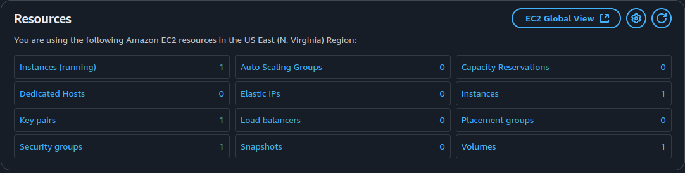

# Terraform

## Terraform Docker Infrastructure

This document provides details on the Terraform-managed Docker infrastructure. It includes Terraform state information, resource attributes, logs from applied changes, and output values.

### List of resources in the Terraform state

The infrastructure consists of:

- A Docker container running Nginx.
- A Docker image for Nginx.

```sh
$ terraform state list
docker_container.nginx
docker_image.nginx
```

### Attributes in the `docker_container.nginx` state

```sh
$ terraform state show "docker_container.nginx"
# docker_container.nginx:
resource "docker_container" "nginx" {
    attach                                      = false
    bridge                                      = null
    command                                     = [
        "nginx",
        "-g",
        "daemon off;",
    ]
    container_read_refresh_timeout_milliseconds = 15000
    cpu_set                                     = null
    cpu_shares                                  = 0
    domainname                                  = null
    entrypoint                                  = [
        "/docker-entrypoint.sh",
    ]
    env                                         = []
    hostname                                    = "3b2418011d84"
    id                                          = "3b2418011d84a6ea9317fa2510dc14ae403d349f2ab6079f7e17cb17c1aee0b1"
    image                                       = "sha256:c59e925d63f3aa135bfa9d82cb03fba9ee30edb22ebe6c9d4f43824312ba3d9b"
    init                                        = false
    ipc_mode                                    = "private"
    log_driver                                  = "syslog"
    logs                                        = false
    max_retry_count                             = 0
    memory                                      = 0
    memory_swap                                 = 0
    must_run                                    = true
    name                                        = "nginx_container"
    network_data                                = [
        {
            gateway                   = "172.17.0.1"
            global_ipv6_address       = null
            global_ipv6_prefix_length = 0
            ip_address                = "172.17.0.2"
            ip_prefix_length          = 16
            ipv6_gateway              = null
            mac_address               = "02:42:ac:11:00:02"
            network_name              = "bridge"
        },
    ]
    network_mode                                = "bridge"
    pid_mode                                    = null
    privileged                                  = false
    publish_all_ports                           = false
    read_only                                   = false
    remove_volumes                              = true
    restart                                     = "no"
    rm                                          = false
    runtime                                     = "runc"
    security_opts                               = []
    shm_size                                    = 64
    start                                       = true
    stdin_open                                  = false
    stop_signal                                 = "SIGQUIT"
    stop_timeout                                = 0
    tty                                         = false
    user                                        = null
    userns_mode                                 = null
    wait                                        = false
    wait_timeout                                = 60
    working_dir                                 = null

    ports {
        external = 8000
        internal = 80
        ip       = "0.0.0.0"
        protocol = "tcp"
    }
}
```

### Attributes in the `docker_image.nginx` state

```sh
$ terraform state show "docker_image.nginx"
# docker_image.nginx:
resource "docker_image" "nginx" {
    id           = "sha256:c59e925d63f3aa135bfa9d82cb03fba9ee30edb22ebe6c9d4f43824312ba3d9bnginx"
    image_id     = "sha256:c59e925d63f3aa135bfa9d82cb03fba9ee30edb22ebe6c9d4f43824312ba3d9b"
    keep_locally = false
    name         = "nginx"
    repo_digest  = "nginx@sha256:bc2f6a7c8ddbccf55bdb19659ce3b0a92ca6559e86d42677a5a02ef6bda2fcef"
}
```

### Logs after making a change

```sh
      ~ stop_signal                                 = "SIGQUIT" -> (known after apply)
      ~ stop_timeout                                = 0 -> (known after apply)
      - storage_opts                                = {} -> null
      - sysctls                                     = {} -> null
      - tmpfs                                       = {} -> null
        # (20 unchanged attributes hidden)

      ~ healthcheck (known after apply)

      ~ labels (known after apply)

      ~ ports {
          ~ external = 8000 -> 8080 # forces replacement
            # (3 unchanged attributes hidden)
        }
    }

Plan: 1 to add, 0 to change, 1 to destroy.

Do you want to perform these actions?
  Terraform will perform the actions described above.
  Only 'yes' will be accepted to approve.

  Enter a value: yes

docker_container.nginx: Destroying... [id=3b2418011d84a6ea9317fa2510dc14ae403d349f2ab6079f7e17cb17c1aee0b1]
docker_container.nginx: Destruction complete after 0s
docker_container.nginx: Creating...
docker_container.nginx: Creation complete after 0s [id=e9d9af71c801c4b78b73753a54dff57cc244d2fc1f1b39a6760be0e6734133cb]

Apply complete! Resources: 1 added, 0 changed, 1 destroyed.

Outputs:

container_id = "nginx_container"
image_id = "nginx"
```

### Updated Terraform configeration

We used variables to change the name of the docker container

```terraform
variable "container_name" {
    description = "A variable holding the name of the docker container"
    type = string
    default = "nginx_container"
}
```

### Terraform output

```sh
$ terraform output 
container_id = "nginx_container"
image_id = "nginx"
```

Referance: [What is Infrastructure as Code with Terraform?](https://developer.hashicorp.com/terraform/tutorials/docker-get-started/infrastructure-as-code)

## Terraform Cloud Infrastructure - AWS

This section show how to start an instance on AWS using terraform

### Challenges

The biggest challenge faced here was being able to get access to an AWS account, the rest of the work was simple due to terraforms great documentation

### Starting the instance

- **Installing AWS CLI on the local machine:** We first start by installing the `AWS CLI` to we can add our credentials and allow terraform to create the instance for us
- **Adding the credentials:** We get the credentials from our AWS account and then we add them to our local machine

    ```sh
    $ aws configure
    AWS Access Key ID [None]: ********************
    AWS Secret Access Key [None]: ********************
    Default region name [None]: us-east-1
    Default output format [None]: json
    ```

- **Build the terraform infrastructure**
- **Initiate**

    ```sh
    $ terraform init
    Initializing the backend...
    Initializing provider plugins...
    - Reusing previous version of hashicorp/aws from the dependency lock file
    - Using previously-installed hashicorp/aws v4.67.0

    Terraform has been successfully initialized!

    You may now begin working with Terraform. Try running "terraform plan" to see
    any changes that are required for your infrastructure. All Terraform commands
    should now work.

    If you ever set or change modules or backend configuration for Terraform,
    rerun this command to reinitialize your working directory. If you forget, other
    commands will detect it and remind you to do so if necessary.
    ```

- **Apply**

    ```sh
    $ terraform apply

    Terraform used the selected providers to generate the following execution plan. Resource actions are indicated with the
    following symbols:
    + create

    Terraform will perform the following actions:

    # aws_instance.S25-core-course-labs will be created
    + resource "aws_instance" "S25-core-course-labs" {
        + ami                                  = "ami-04b4f1a9cf54c11d0"
        + arn                                  = (known after apply)
        + associate_public_ip_address          = (known after apply)
        + availability_zone                    = (known after apply)
        + cpu_core_count                       = (known after apply)
        + cpu_threads_per_core                 = (known after apply)
        + disable_api_stop                     = (known after apply)
        + disable_api_termination              = (known after apply)
        + ebs_optimized                        = (known after apply)
        + get_password_data                    = false
        + host_id                              = (known after apply)
        + host_resource_group_arn              = (known after apply)
        + iam_instance_profile                 = (known after apply)
        + id                                   = (known after apply)
        + instance_initiated_shutdown_behavior = (known after apply)
        + instance_state                       = (known after apply)
        + instance_type                        = "t2.micro"
        + ipv6_address_count                   = (known after apply)
        + ipv6_addresses                       = (known after apply)
        + key_name                             = (known after apply)
        + monitoring                           = (known after apply)
        + outpost_arn                          = (known after apply)
        + password_data                        = (known after apply)
        + placement_group                      = (known after apply)
        + placement_partition_number           = (known after apply)
        + primary_network_interface_id         = (known after apply)
        + private_dns                          = (known after apply)
        + private_ip                           = (known after apply)
        + public_dns                           = (known after apply)
        + public_ip                            = (known after apply)
        + secondary_private_ips                = (known after apply)
        + security_groups                      = (known after apply)
        + source_dest_check                    = true
        + subnet_id                            = (known after apply)
        + tags_all                             = (known after apply)
        + tenancy                              = (known after apply)
        + user_data                            = (known after apply)
        + user_data_base64                     = (known after apply)
        + user_data_replace_on_change          = false
        + vpc_security_group_ids               = (known after apply)

        + capacity_reservation_specification (known after apply)

        + cpu_options (known after apply)

        + ebs_block_device (known after apply)

        + enclave_options (known after apply)

        + ephemeral_block_device (known after apply)

        + maintenance_options (known after apply)

        + metadata_options (known after apply)

        + network_interface (known after apply)

        + private_dns_name_options (known after apply)

        + root_block_device (known after apply)
        }

    Plan: 1 to add, 0 to change, 0 to destroy.

    Do you want to perform these actions?
    Terraform will perform the actions described above.
    Only 'yes' will be accepted to approve.

    Enter a value: yes

    aws_instance.S25-core-course-labs: Creating...
    aws_instance.S25-core-course-labs: Still creating... [10s elapsed]
    aws_instance.S25-core-course-labs: Creation complete after 17s [id=i-0d285b14bc57d8793]

    Apply complete! Resources: 1 added, 0 changed, 0 destroyed.
    ```

And with that we now how a running instance on AWS



Referance: [Build infrastructure](https://developer.hashicorp.com/terraform/tutorials/aws-get-started/aws-build?in=terraform%2Faws-get-started)

## Terraform for GitHub

### Building a GitHub infrastructure

This section shows how to create a github repo using terraform

First I generated the github token and stored it as an environment variable on my machine

```sh
export TF_VAR_token=[Token]
```

The rest was similar to what we did int he docker infustructure, with extra things to specifiy:

- Create `main.tf` and `variables.tf` to create write our terraform infrastructure

    ```sh
    name               = "terraform-github"
    description        = "Github Terraform infrastructure"
    visibility         = "public"
    has_issues         = false
    has_wiki           = false
    auto_init          = true
    license_template   = "mit"
    gitignore_template = "VisualStudio"
    ```

- Run `terraform init`
- Run `terraform apply`

Referance: [Manage and maintain GitHub with Terraform](https://dev.to/pwd9000/manage-and-maintain-github-with-terraform-2k86)

### Importing an existing repo

We import the repo using `terraform import`:

```sh
$ terraform import "github_repository.S25-core-course-labs" "S25-core-course-labs"
github_repository.S25-core-course-labs: Importing from ID "S25-core-course-labs"...
github_repository.S25-core-course-labs: Import prepared!
Prepared github_repository for import
github_repository.S25-core-course-labs: Refreshing state... [id=S25-core-course-labs]

Import successful!

The resources that were imported are shown above. These resources are now in
your Terraform state and will henceforth be managed by Terraform.
```

We can check on the new state created as follow:

```sh
$ terraform state show "github_repository.S25-core-course-labs"
# github_repository.S25-core-course-labs:
resource "github_repository" "S25-core-course-labs" {
    allow_auto_merge            = false
    allow_merge_commit          = true
    allow_rebase_merge          = true
    allow_squash_merge          = true
    allow_update_branch         = false
    archived                    = false
    auto_init                   = false
    default_branch              = "master"
    delete_branch_on_merge      = false
    description                 = null
    etag                        = "W/\"66b50bbd7cce0c8fc3804962716a0dc7e4ca00f45380f683799d39be31e83b29\""
    full_name                   = "HayderSarhan/S25-core-course-labs"
    git_clone_url               = "git://github.com/HayderSarhan/S25-core-course-labs.git"
    has_discussions             = false
    has_downloads               = true
    has_issues                  = false
    has_projects                = true
    has_wiki                    = true
    homepage_url                = null
    html_url                    = "https://github.com/HayderSarhan/S25-core-course-labs"
    http_clone_url              = "https://github.com/HayderSarhan/S25-core-course-labs.git"
    id                          = "S25-core-course-labs"
    is_template                 = false
    merge_commit_message        = "PR_TITLE"
    merge_commit_title          = "MERGE_MESSAGE"
    name                        = "S25-core-course-labs"
    node_id                     = "R_kgDONxysLg"
    primary_language            = null
    private                     = false
    repo_id                     = 924625966
    squash_merge_commit_message = "COMMIT_MESSAGES"
    squash_merge_commit_title   = "COMMIT_OR_PR_TITLE"
    ssh_clone_url               = "git@github.com:HayderSarhan/S25-core-course-labs.git"
    svn_url                     = "https://github.com/HayderSarhan/S25-core-course-labs"
    topics                      = []
    visibility                  = "public"
    vulnerability_alerts        = false
    web_commit_signoff_required = false

    security_and_analysis {
        secret_scanning {
            status = "enabled"
        }
        secret_scanning_push_protection {
            status = "enabled"
        }
    }
}
```

Repository created: [terraform-github](https://github.com/HayderSarhan/terraform-github)

### Applying changes to the repo

We can do that by simply editing the `main.tf file`.
I added the following:

```terraform
resource "github_repository" "S25-core-course-labs" {
    name = "S25-core-course-labs"
    description        = "A repo containing materials from the course DevOps Engineering for the year 2025"

}
```

Now to apply the changes we simply run `terraform apply`:

```sh
$ terraform apply
github_repository.repo: Refreshing state... [id=terraform-github]
github_repository.S25-core-course-labs: Refreshing state... [id=S25-core-course-labs]
github_branch_default.main: Refreshing state... [id=terraform-github]
github_branch_protection.default: Refreshing state... [id=BPR_kwDON1B6fM4DigKt]

Terraform used the selected providers to generate the following execution plan. Resource actions are indicated with the
following symbols:
  ~ update in-place

Terraform will perform the following actions:

  # github_repository.S25-core-course-labs will be updated in-place
  ~ resource "github_repository" "S25-core-course-labs" {
      + description                 = "A repo containing materials from the course DevOps Engineering for the year 2025"
        id                          = "S25-core-course-labs"
        name                        = "S25-core-course-labs"
        # (35 unchanged attributes hidden)

        # (1 unchanged block hidden)
    }

Plan: 0 to add, 1 to change, 0 to destroy.

Do you want to perform these actions?
  Terraform will perform the actions described above.
  Only 'yes' will be accepted to approve.

  Enter a value: yes

github_repository.S25-core-course-labs: Modifying... [id=S25-core-course-labs]
github_repository.S25-core-course-labs: Modifications complete after 2s [id=S25-core-course-labs]

Apply complete! Resources: 0 added, 1 changed, 0 destroyed.
```

And now the changes must be made on github repo

## Best practices followed

- **Modular and Scalable Design:** Separation of concerns with variables.tf, outputs.tf, and main.tf
- **Security Best Practices:** No hardcoded credentials, use of environment variables for sensitive values
- **State Visibility:** Using output blocks to expose relevant infrastructure details
- **Version Pinning:** Prevents unexpected provider updates
- **Branch Protection Rules:** Enforces security and code quality
- **Docker Image Cleanup (`keep_locally = false`):** Saves disk space
