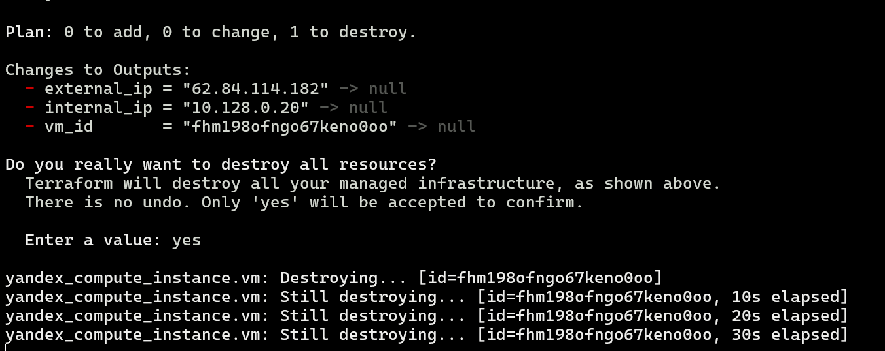
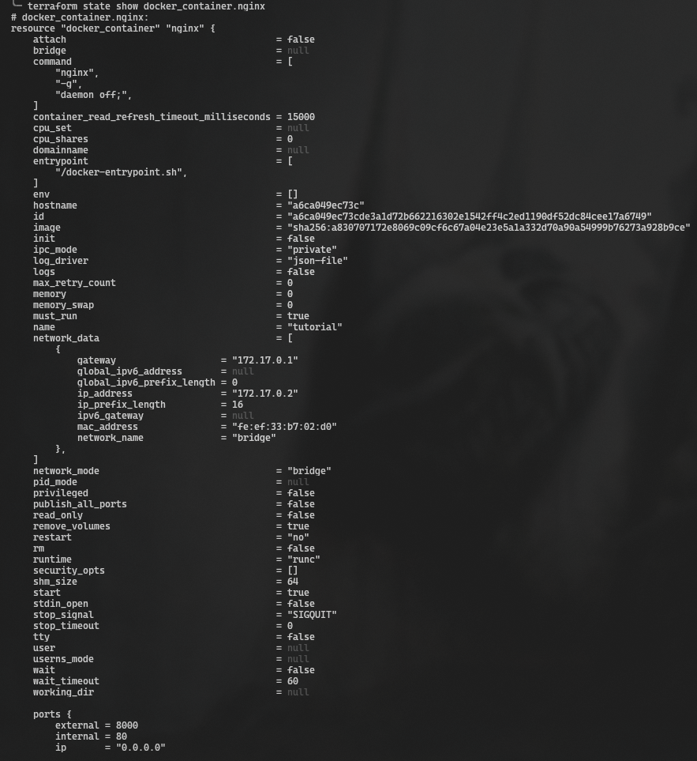
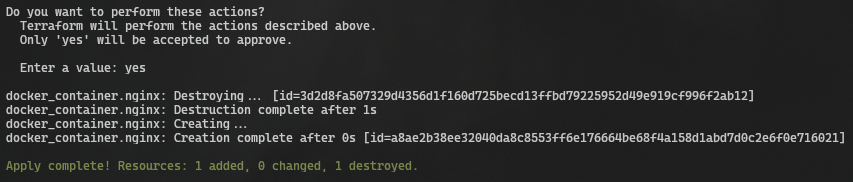
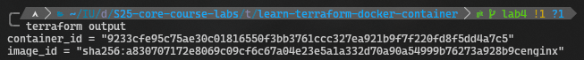
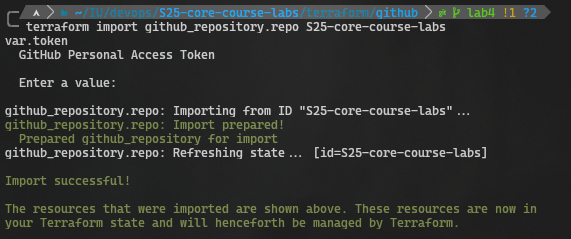
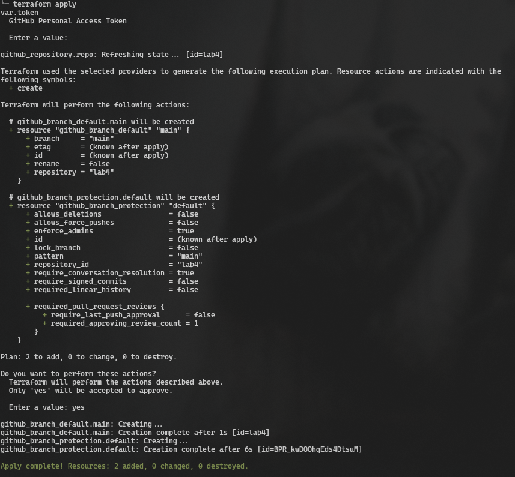

# Terraform

## Best practices

- **Secrets managed by terraform variables**

- **Directories created accordingly to their tasks for better readability**

## Docker

1. `terraform state list`

2. `terraform state show docker_container.app_python`

3. `terraform apply`

5. `terraform output`

## Yandex Cloud

Since YandexCloud unaccessible without payment terraform files were created by tutorials only and were not tested.

## Github

1. `terraform import github_repository.repo S25-core-course-labs`

2. `terraform apply`

