# **Terraform Docker Infrastructure**

## Docker Infrastructure Using Terraform

### **1. Installation of Terraform**

Terraform was installed from the [official website](https://developer.hashicorp.com/terraform/install) and verified using:

```sh
terraform -v
```

#### **Output:**

```sh
Terraform v1.10.5
on windows_amd64
```

### **2. Building the Infrastructure**

#### **Terraform Files**

- **main.tf** – Defines Docker infrastructure (containers, images, and configurations).
- **variables.tf** – Manages input variables for flexibility and reuse.
- **outputs.tf** - Stores and displays key resource information after deployment.

#### **Terraform Commands Used**

1. **Initialize Terraform**

   ```sh
   terraform init
   ```

2. **Plan the Deployment**

   ```sh
   terraform plan
   ```

3. **Apply the Deployment**

   ```sh
   terraform apply
   ```

### **3. Terraform State**

#### **terraform state show**

```sh
terraform state show docker_container.app_python_container
```

#### **Output:**

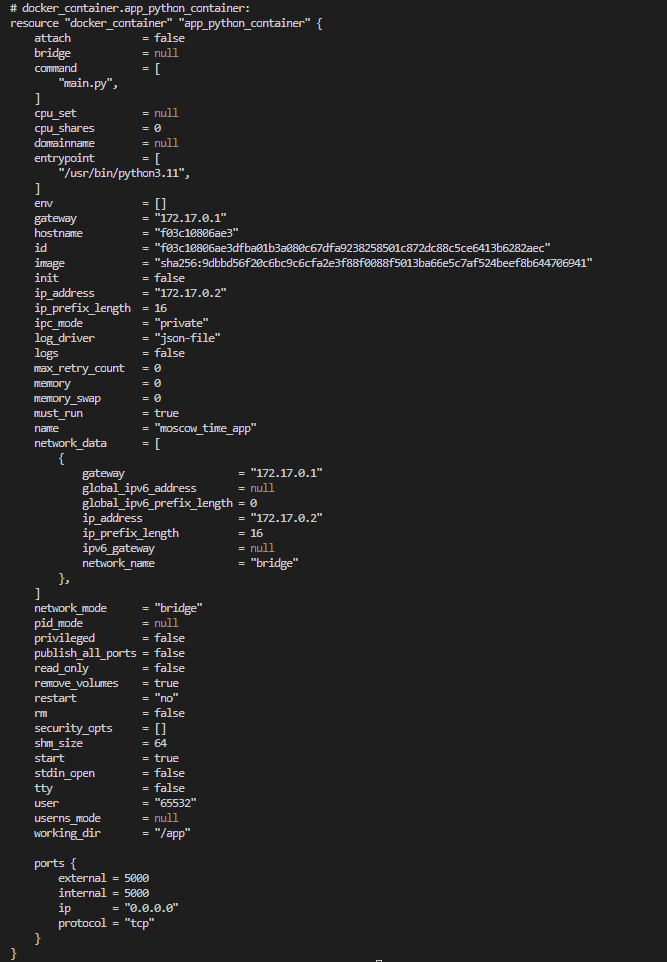

```sh
terraform state show docker_container.app_javascript_container
```

#### **Output:**

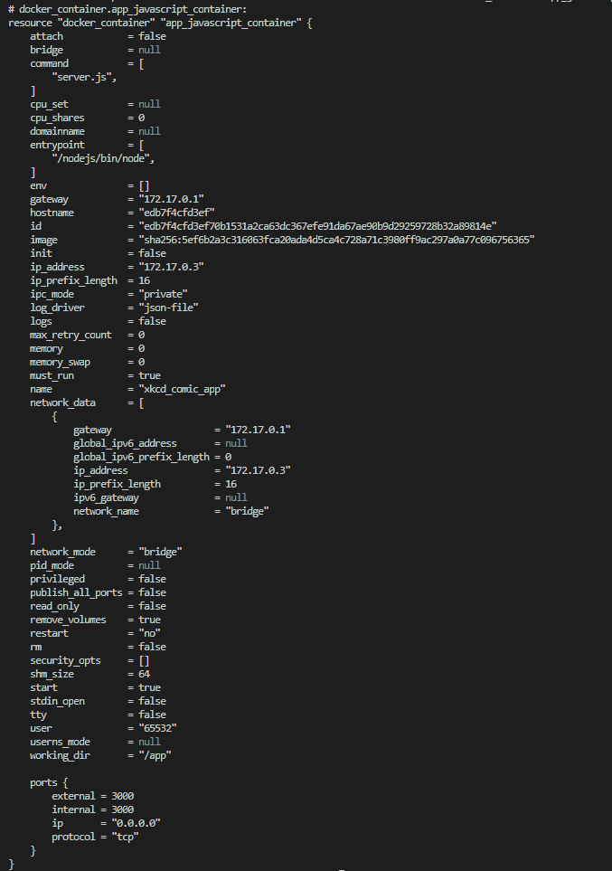

#### **terraform state list**

```sh
terraform state list
```

#### **Output:**

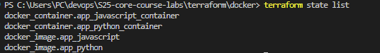

### **4. Logs of Applied Changes**

`terraform apply` output:

```sh
docker_image.app_javascript: Creating...
docker_image.app_python: Creating...
docker_image.app_javascript: Creation complete after 0s [id=sha256:5ef6b2a3c316063fca20ada4d5ca4c728a71c3980ff9ac297a0a77c096756365kira354/app-javascript-distroless:latest]
docker_image.app_python: Creation complete after 0s [id=sha256:9dbbd56f20c6bc9c6cfa2e3f88f0088f5013ba66e5c7af524beef8b644706941kira354/app-python-distroless:latest]
docker_container.app_javascript_container: Creating...
docker_container.app_python_container: Creating...
docker_container.app_javascript_container: Creation complete after 1s [id=edb7f4cfd3ef70b1531a2ca63dc367efe91da67ae90b9d29259728b32a89814e]
docker_container.app_python_container: Creation complete after 1s [id=f03c10806ae3dfba01b3a080c67dfa9238258501c872dc88c5ce6413b6282aec]

Apply complete! Resources: 4 added, 0 changed, 0 destroyed.
```

---

### **5. Utilizing Input Variables for Renaming Containers**

Defined in **variables.tf**:

```hcl
variable "python_container_name" {
  description = "The name of the Python container"
  type        = string
  default     = "moscow_time_app"
}

variable "javascript_container_name" {
  description = "The name of the JavaScript container"
  type        = string
  default     = "xkcd_comic_app"
}
```

**main.tf**:

```hcl
resource "docker_container" "app_python_container" {
  name  = var.python_container_name
  image = docker_image.app_python.latest
  ports {
    internal = 5000
    external = 5000
  }
}

resource "docker_container" "app_javascript_container" {
  name  = var.javascript_container_name
  image = docker_image.app_javascript.latest
  ports {
    internal = 3000
    external = 3000
  }
}
```

### **6. Terraform Output**

Ran:

```sh
terraform output
```

Output:

```sh
javascript_container_id = "edb7f4cfd3ef70b1531a2ca63dc367efe91da67ae90b9d29259728b32a89814e"
python_container_id = "f03c10806ae3dfba01b3a080c67dfa9238258501c872dc88c5ce6413b6282aec"
```

## Yandex Cloud Infrastructure Using Terraform

### 1. Yandex Cloud Account Setup

- Created a Yandex Cloud account at [Yandex Cloud](https://cloud.yandex.com/).
- Enabled free-tier trial during registration.
- Verified account with email.

### 2. Install Yandex CLI

1. Installed Yandex Cloud CLI:

   ```bash
   iex (New-Object System.Net.WebClient).DownloadString('https://storage.yandexcloud.net/yandexcloud-yc/install.ps1')
   ```

2. Authenticated with `yc init`:
   - Set default **cloud**, **folder**, and **region**.
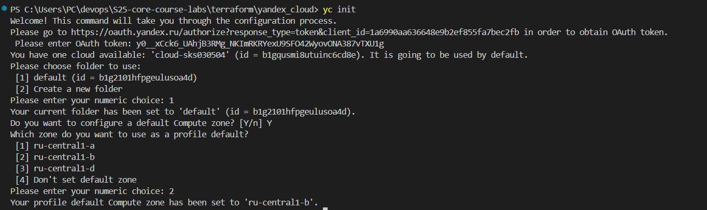

### 3. Install Terraform and Configure Yandex Provider

1. Installed Terraform *(done from docker part of the task)*
2. Added Yandex provider to `provider.tf`:

   ```hcl
   terraform {
     required_providers {
       yandex = {
          source = "yandex-cloud/yandex"
       }
     }
     required_version = ">= 0.13"
   }
   provider "yandex" {
     zone = var.zone
     token = file("${path.root}/iam_token")
     folder_id = file("${path.root}/folder_id")
     cloud_id = file("${path.root}/cloud_id")
   }

   ```

3. Configured main.tf and variables.tf.
   - **main.tf**: Defines the resources to be created in Yandex Cloud (VM instances, networks).
   - **`variables.tf`**: Manages the input variables used in the configuration (`zone`, `name`, `memory`, `disk_size`, etc.).

### 4. Deploy Yandex Cloud Infrastructure

1. **Initialize Terraform**:

   ```bash
   terraform init
   ```

2. **Check the Plan**:

   ```bash
   terraform plan
   ```

3. **Apply the Plan**:

   ```bash
   terraform apply
   ```

**Logs:**

```bash
yandex_vpc_network.my-vm-network: Refreshing state... [id=enp7g4hm5r3d9v11jl94]
yandex_vpc_subnet.my-vm-subnet: Refreshing state... [id=e2lshlrrh76es1vlivsl]
yandex_compute_instance.vm-1: Refreshing state... [id=epd08p08ro60sh0e5jvd]
...
yandex_compute_instance.vm-1: Creating...
yandex_compute_instance.vm-1: Still creating... [10s elapsed]
yandex_compute_instance.vm-1: Still creating... [20s elapsed]
yandex_compute_instance.vm-1: Still creating... [30s elapsed]
yandex_compute_instance.vm-1: Still creating... [40s elapsed]
yandex_compute_instance.vm-1: Creation complete after 46s [id=epdc2ibl1fr6itdp7tnh]
```

### 5. Terraform State

#### **terraform show**

```sh
terraform show
```

#### **Output:**

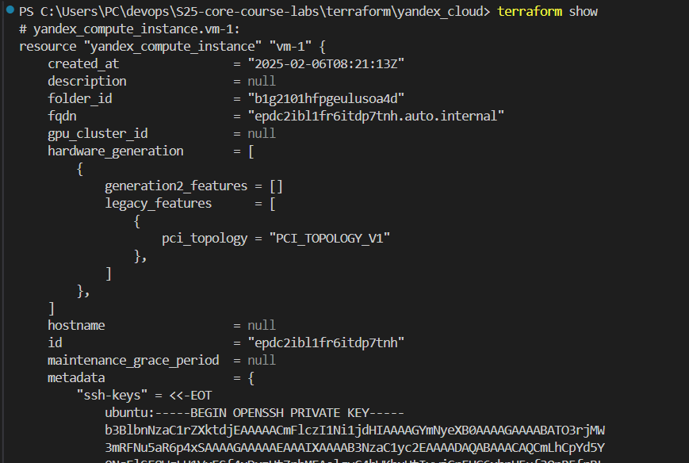
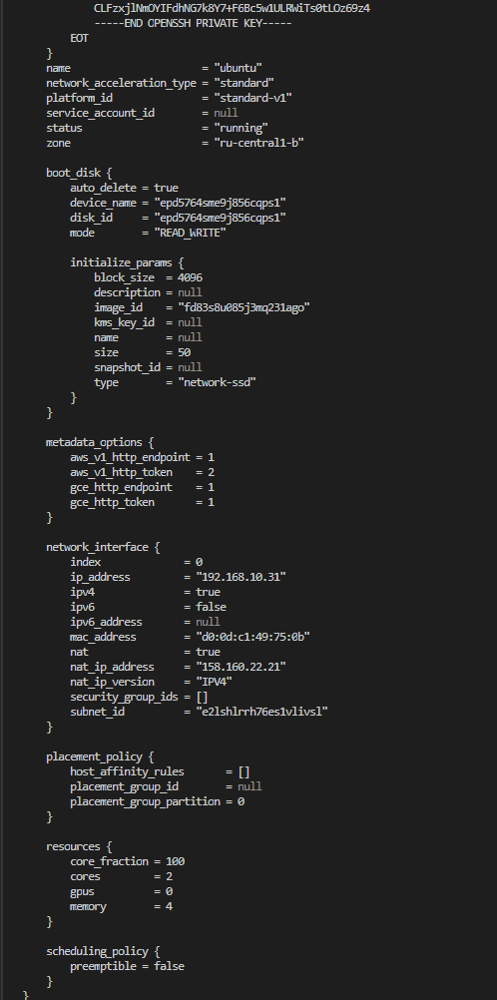
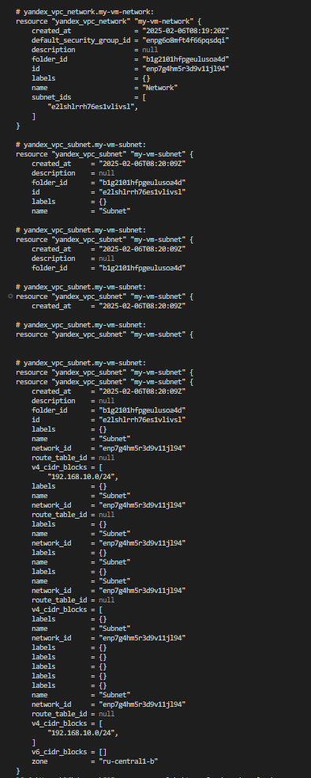

#### **terraform state list**

```sh
terraform state list
```

#### **Output:**

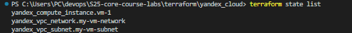

### 8. Conclusion

- Deployed a Yandex Cloud VM instance with Terraform.
- Managed the infrastructure successfully using the free-tier option.

## GitHub Infrastructure Using Terraform

### 1. Set Up GitHub Provider

- Installed the GitHub provider for Terraform and configured the provider in `provider.tf`.
- Used the `GITHUB_TOKEN` environment variable for secure authentication.

### 2. Define GitHub Repository

- Created a repository using `github_repository` resource in `main.tf`.
- Configured visibility, description, and default branch for the repository.
- Added a **branch protection rule** for the default branch.

### 3. Import Existing Repository

- Used `terraform import` to import an existing GitHub repository in imports.tf:

  ```sh
  import {
    to = github_repository.devops_labs
    id = "S25-core-course-labs"
  }
  ```

### 4. Apply Terraform Changes

- Initialized Terraform:

  ```bash
  terraform init
  ```

- Checked the plan:

  ```bash
  terraform plan
  ```

- Applied the changes:

  ```bash
  terraform apply
  ```

**Logs:*

```bash
github_repository.devops_labs: Importing... [id=S25-core-course-labs]
github_repository.devops_labs: Import complete [id=S25-core-course-labs]
github_repository.devops_labs: Modifying... [id=S25-core-course-labs]
github_repository.devops_labs: Modifications complete after 3s [id=S25-core-course-labs]
github_branch_default.master: Creating...
github_branch_default.master: Creation complete after 1s [id=S25-core-course-labs]
github_branch_protection.default: Creating...
github_branch_protection.default: Creation complete after 5s [id=BPR_kwDONvs4z84DikSD]

Apply complete! Resources: 1 imported, 2 added, 1 changed, 0 destroyed.
```

### 5. Terraform State

#### **terraform show**

```sh
terraform show
```

#### **Output:**

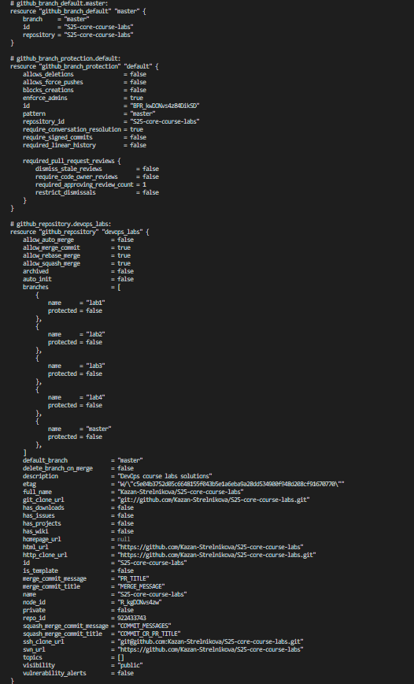

#### **terraform state list**

```sh
terraform state list
```

#### **Output:**

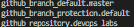

### 6. Best Practices

- **Environment Variables**: Used `GITHUB_TOKEN` securely by setting it as an environment variable.
- **Input Variables**: Utilized input variables in `variables.tf` for flexibility in repository settings.
- **Version Control**: Managed Terraform state in a remote backend for better state management.

## Bonus Task: Adding Teams

### 1. Creating a New GitHub Organization

- Created a new GitHub organization "devops-kira354" through the GitHub web interface.

### 2. Adding Teams to the Organization

- Added the following teams using Terraform:
  - **read-team**: Read-only access to the repository.
  - **write-team**: Write access to the repository.
  - **admin-team**: Admin access to the repository.

### 3. Applied Changes

- Ran `terraform apply` to apply the configuration and created the teams in the organization.

```bash
github_team_repository.read_team_repo: Creating...
github_team_repository.read_team_repo: Creation complete after 1s [id=12127361:S25-core-course-labs]

Apply complete! Resources: 1 added, 0 changed, 0 destroyed.
```

### 5. Terraform State

#### **terraform show**

```sh
terraform show
```

#### **Output:**

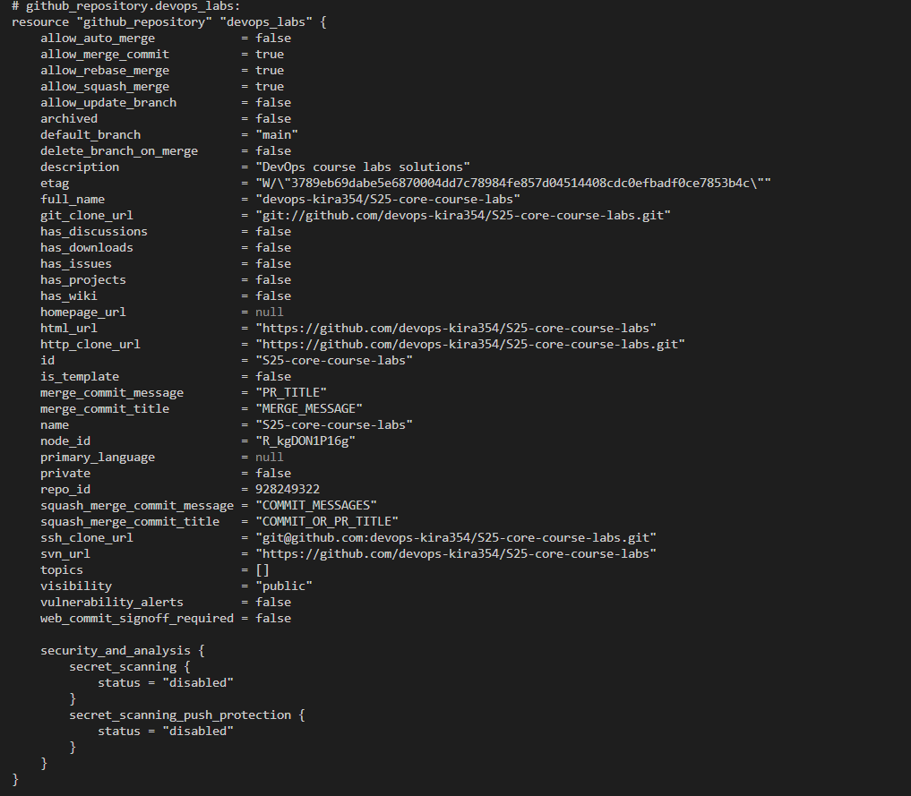
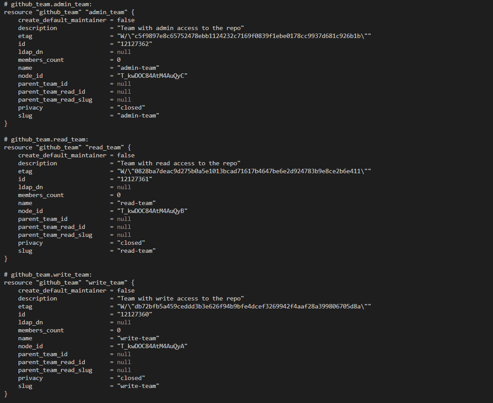
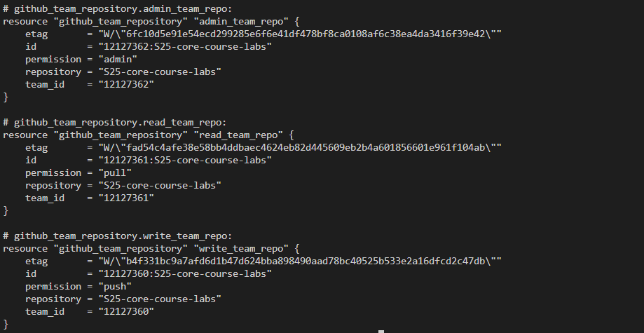

#### **terraform state list**

```sh
terraform state list
```

#### **Output:**

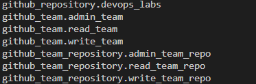
