# Terraform

---

This is my first time when I really used terraform in practice, so there can be any inconveniences in configuration.
Please give your advices to me how to better implement such tools because I want to see myself as a devops in the future
(as on of the possible ways).

---

## `terraform state list`

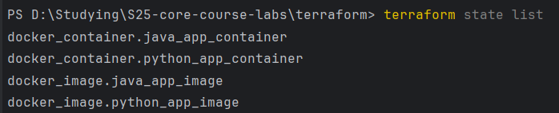

---

## `terraform state show <state_list_entry_i>`

* `java_app_container`

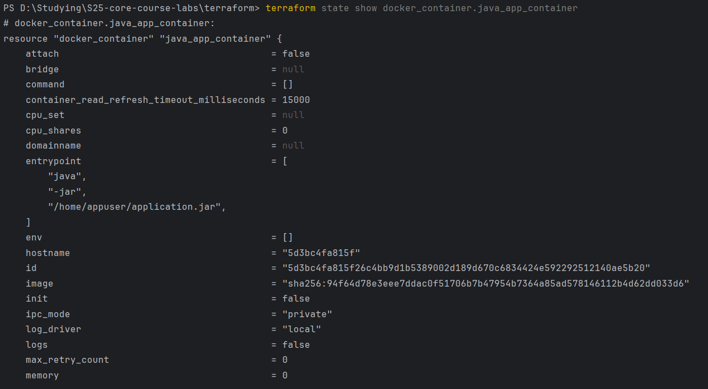
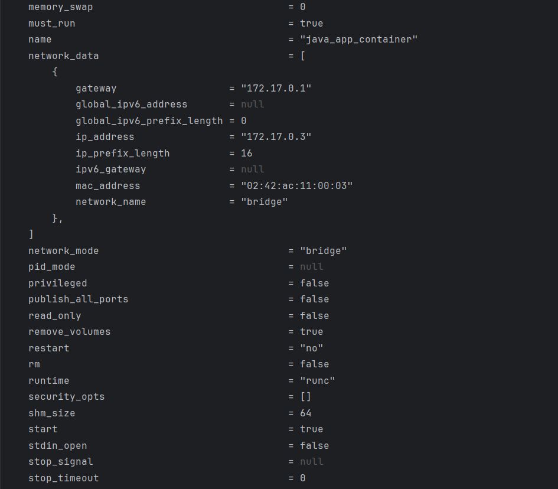


---

* `python_app_container`

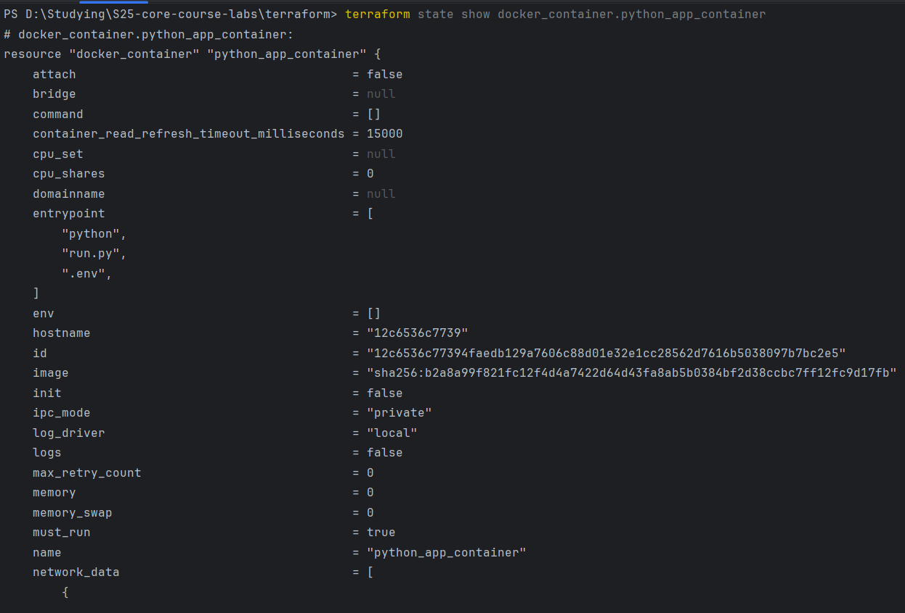
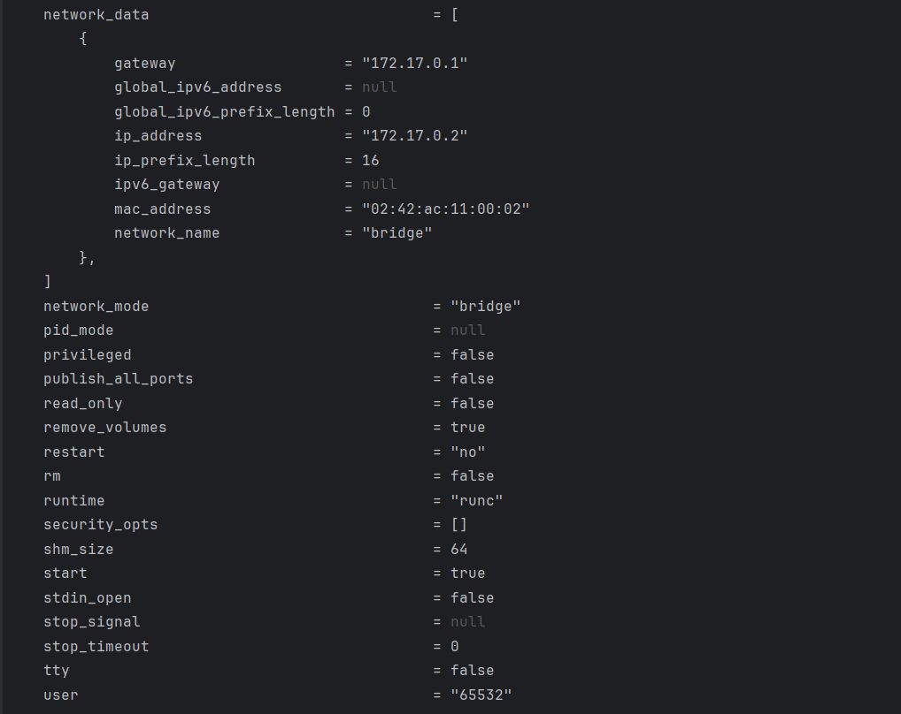
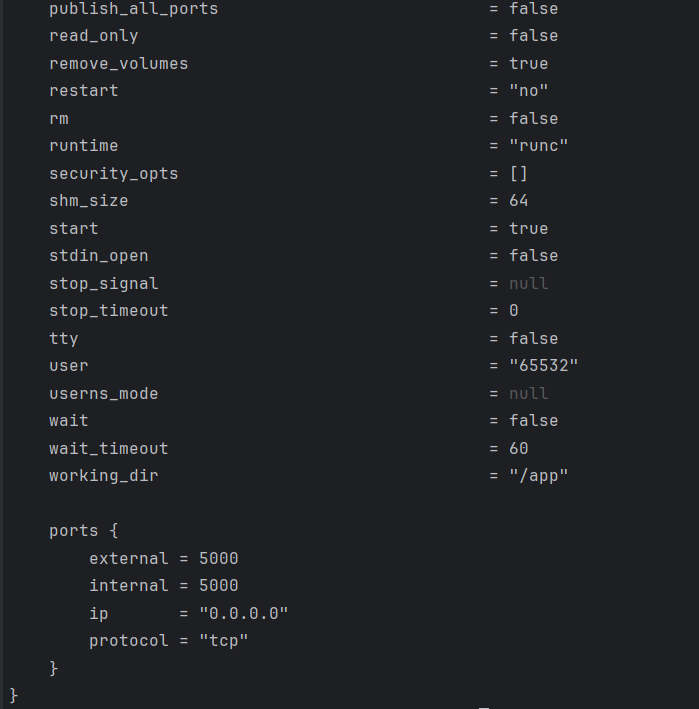

---

* `docker_image.java_app_image`

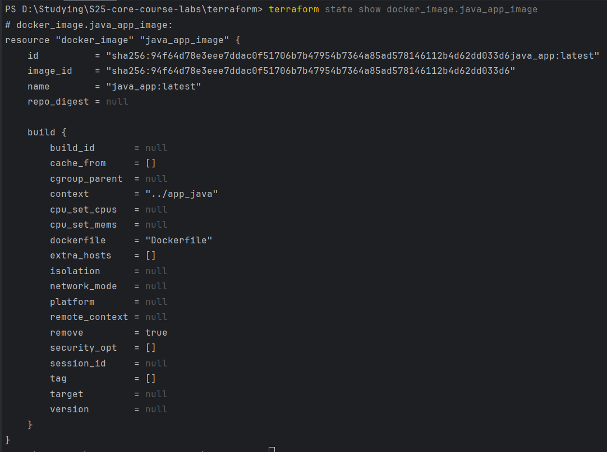

---

* `docker_image.python_app_image`

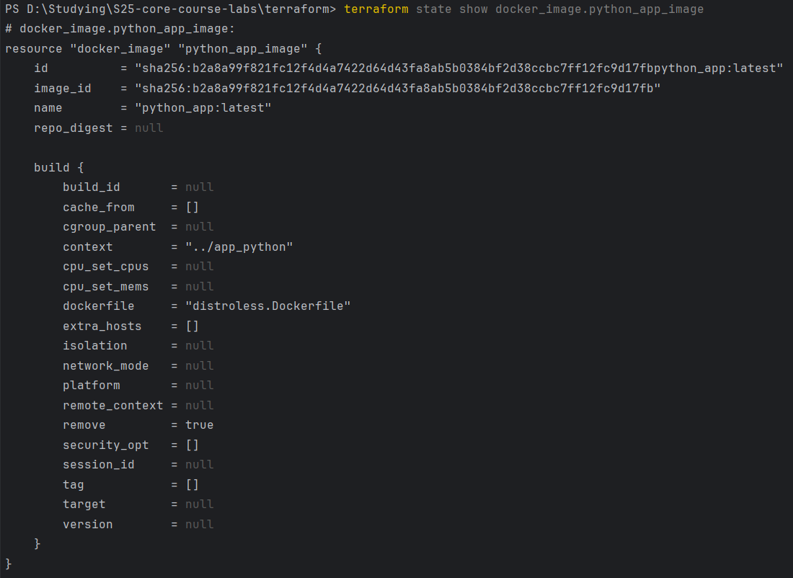

---

## Changing names of the containers

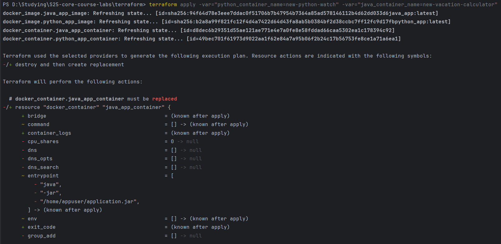
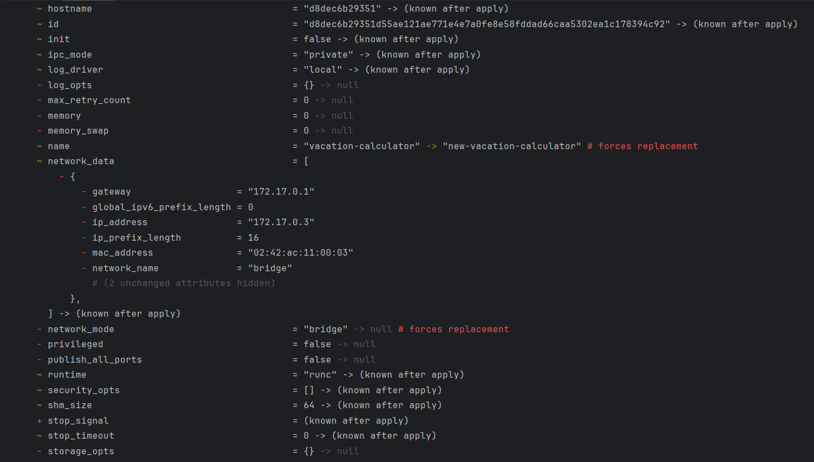
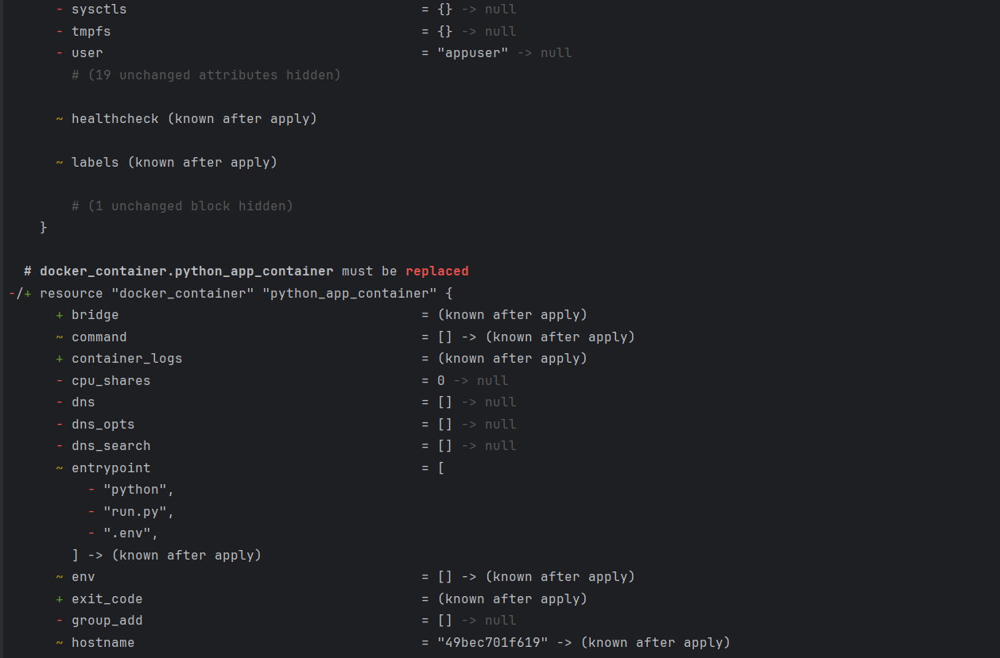
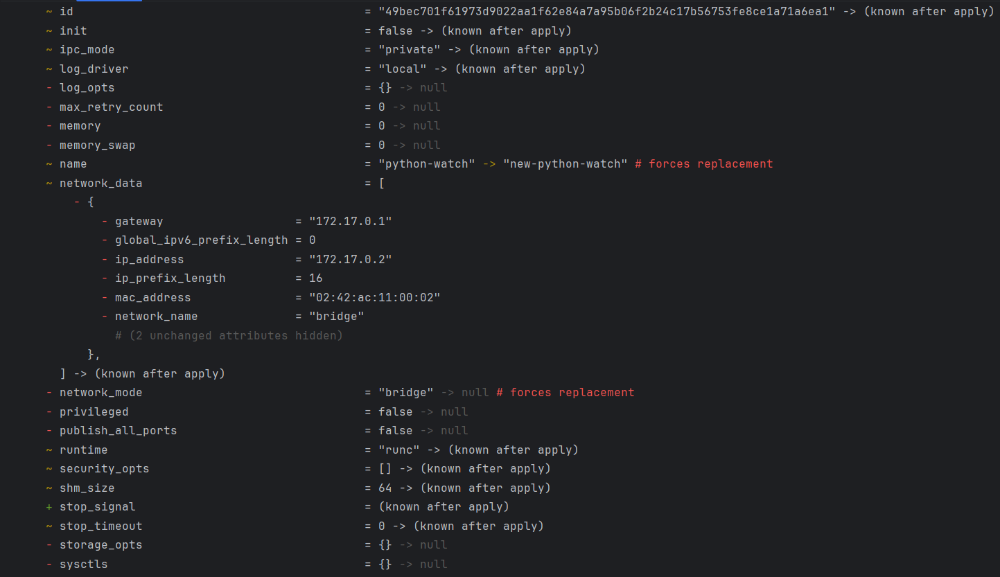
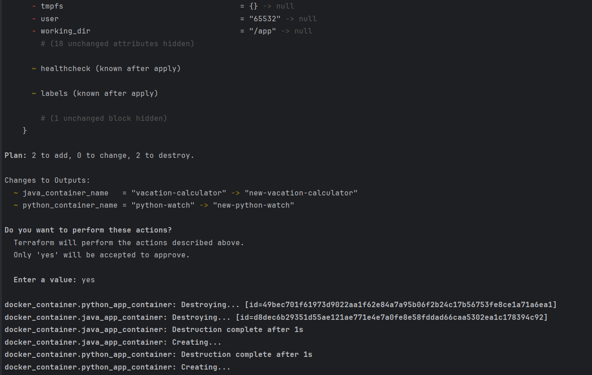


---

## `terraform output`

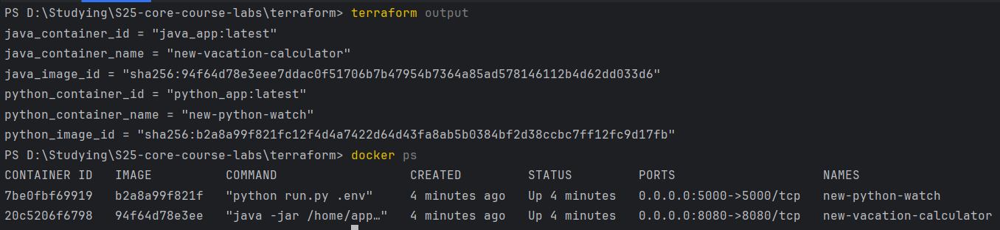

---

## Usage of Yandex.Cloud Provider

Firstly, It was hard for me to understand, what is exactly 'free-tier' means. Then, after some research, it is become
clear that this is free start grant when user fisrtly create billing plan. Therefore, this one is the most difficult
part
for me.

Then I faced the next error:

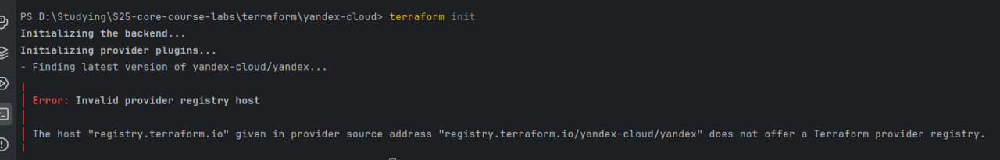

It was connected to the absence of `terraform.rc` file. After I created it, no difficulties at all.

## `terraform plan`

```bash
yandex_vpc_network.devops-net: Refreshing state... [id=enpmqu5qfo2nfb46lqsu]
yandex_vpc_subnet.devops-subnet: Refreshing state... [id=e2lt0266hkmjaa0kof7e]

Terraform used the selected providers to generate the following execution plan. Resource actions are indicated with the following symbols:
  + create

Terraform will perform the following actions:

  # yandex_compute_disk.vm-disk will be created
  + resource "yandex_compute_disk" "vm-disk" {
      + block_size  = 4096
      + created_at  = (known after apply)
      + folder_id   = (known after apply)
      + id          = (known after apply)
      + image_id    = "fd8bpal18cm4kprpjc2m"
      + name        = "ubuntu-2404-lts-oslogin-v20250203"
      + product_ids = (known after apply)
      + size        = 10
      + status      = (known after apply)
      + type        = "network-ssd"
      + zone        = "ru-central1-b"

      + disk_placement_policy (known after apply)

      + hardware_generation (known after apply)
    }

  # yandex_compute_instance.vm will be created
  + resource "yandex_compute_instance" "vm" {
      + created_at                = (known after apply)
      + folder_id                 = (known after apply)
      + fqdn                      = (known after apply)
      + gpu_cluster_id            = (known after apply)
      + hardware_generation       = (known after apply)
      + hostname                  = (known after apply)
      + id                        = (known after apply)
      + maintenance_grace_period  = (known after apply)
      + maintenance_policy        = (known after apply)
      + metadata                  = {
          + "ssh-keys" = (sensitive value)
        }
      + name                      = "devops-vm"
      + network_acceleration_type = "standard"
      + platform_id               = "standard-v1"
      + service_account_id        = (known after apply)
      + status                    = (known after apply)
      + zone                      = "ru-central1-b"

      + boot_disk {
          + auto_delete = true
          + device_name = (known after apply)
          + disk_id     = (known after apply)
          + mode        = (known after apply)

          + initialize_params (known after apply)
        }

      + metadata_options (known after apply)

      + network_interface {
          + index              = 1
          + ip_address         = (known after apply)
          + ipv4               = true
          + ipv6               = (known after apply)
          + ipv6_address       = (known after apply)
          + mac_address        = (known after apply)
          + nat                = true
          + nat_ip_address     = (known after apply)
          + nat_ip_version     = (known after apply)
          + security_group_ids = (known after apply)
          + subnet_id          = "e2lt0266hkmjaa0kof7e"
        }

      + placement_policy (known after apply)

      + resources {
          + core_fraction = 20
          + cores         = 2
          + memory        = 2
        }

      + scheduling_policy {
          + preemptible = true
        }
    }

Plan: 2 to add, 0 to change, 0 to destroy.

Do you want to perform these actions?
  Terraform will perform the actions described above.
  Only 'yes' will be accepted to approve.

  Enter a value: yes

yandex_compute_disk.vm-disk: Creating...
yandex_compute_disk.vm-disk: Creation complete after 7s [id=epdmjld5d1sb15vbpo57]
yandex_compute_instance.vm: Creating...
yandex_compute_instance.vm: Still creating... [10s elapsed]
yandex_compute_instance.vm: Still creating... [20s elapsed]
yandex_compute_instance.vm: Still creating... [30s elapsed]
yandex_compute_instance.vm: Still creating... [40s elapsed]
yandex_compute_instance.vm: Still creating... [50s elapsed]
yandex_compute_instance.vm: Still creating... [1m0s elapsed]
yandex_compute_instance.vm: Still creating... [1m10s elapsed]
yandex_compute_instance.vm: Still creating... [1m20s elapsed]
yandex_compute_instance.vm: Creation complete after 1m22s [id=epdupbocj0edg6nbrk7c]

Apply complete! Resources: 2 added, 0 changed, 0 destroyed.

D:\Studying\S25-core-course-labs\terraform\yandex-cloud>terraform plan
yandex_vpc_network.devops-net: Refreshing state... [id=enpmqu5qfo2nfb46lqsu]
yandex_compute_disk.vm-disk: Refreshing state... [id=epdmjld5d1sb15vbpo57]
yandex_vpc_subnet.devops-subnet: Refreshing state... [id=e2lt0266hkmjaa0kof7e]
yandex_compute_instance.vm: Refreshing state... [id=epdupbocj0edg6nbrk7c]

Terraform used the selected providers to generate the following execution plan. Resource actions are indicated with the following symbols:
  ~ update in-place

Terraform will perform the following actions:

  # yandex_compute_instance.vm will be updated in-place
  ~ resource "yandex_compute_instance" "vm" {
        id                        = "epdupbocj0edg6nbrk7c"
        name                      = "devops-vm"
        # (15 unchanged attributes hidden)

      ~ network_interface {
          ~ index              = 0 -> 1
            # (10 unchanged attributes hidden)
        }

        # (5 unchanged blocks hidden)
    }

Plan: 0 to add, 1 to change, 0 to destroy.
```

## `terraform apply`

```bash
yandex_compute_disk.vm-disk: Creating...
yandex_compute_disk.vm-disk: Creation complete after 7s [id=epdmjld5d1sb15vbpo57]
yandex_compute_instance.vm: Creating...
yandex_compute_instance.vm: Still creating... [10s elapsed]
yandex_compute_instance.vm: Still creating... [20s elapsed]
yandex_compute_instance.vm: Still creating... [30s elapsed]
yandex_compute_instance.vm: Still creating... [40s elapsed]
yandex_compute_instance.vm: Still creating... [50s elapsed]
yandex_compute_instance.vm: Still creating... [1m0s elapsed]
yandex_compute_instance.vm: Still creating... [1m10s elapsed]
yandex_compute_instance.vm: Still creating... [1m20s elapsed]
yandex_compute_instance.vm: Creation complete after 1m22s [id=epdupbocj0edg6nbrk7c]

Apply complete! Resources: 2 added, 0 changed, 0 destroyed.
```

---

## Github

## `terraform import ...`

```bash
D:\Studying\S25-core-course-labs\terraform\github>terraform import "github_repository.repo" "S25-core-course-labs"

github_repository.repo: Importing from ID "S25-core-course-labs"...
github_repository.repo: Import prepared!
  Prepared github_repository for import
github_repository.repo: Refreshing state... [id=S25-core-course-labs]

Import successful!

The resources that were imported are shown above. These resources are now in
your Terraform state and will henceforth be managed by Terraform.
```

## `terraform apply`

```bash
D:\Studying\S25-core-course-labs\terraform\github>terraform apply

github_repository.repo: Refreshing state... [id=devops-labs-repository]
github_branch_default.main: Refreshing state... [id=devops-labs-repository]

Terraform used the selected providers to generate the following execution plan. Resource actions are indicated with the following symbols:
  + create

Terraform will perform the following actions:

  # github_branch_protection.default will be created
  + resource "github_branch_protection" "default" {
      + allows_deletions                = false
      + allows_force_pushes             = false
      + blocks_creations                = false
      + enforce_admins                  = true
      + id                              = (known after apply)
      + pattern                         = "master"
      + repository_id                   = "devops-labs-repository"
      + require_conversation_resolution = true
      + require_signed_commits          = false
      + required_linear_history         = false

      + required_pull_request_reviews {
          + required_approving_review_count = 1
        }
    }

Plan: 1 to add, 0 to change, 0 to destroy.

Do you want to perform these actions?
  Terraform will perform the actions described above.
  Only 'yes' will be accepted to approve.

  Enter a value: yes

github_branch_protection.default: Creating...
github_branch_protection.default: Creation complete after 4s [id=BPR_kwDONug0SM4DiezQ]

Apply complete! Resources: 1 added, 0 changed, 0 destroyed.
```

## Best Practices

I am not good enough in the terraform, so the single thing I made is to keep variables in another `variables.tf` file.

---

## GitHub Teams / Organization

## `terraform plan`

```bash
Terraform used the selected providers to generate the following execution plan. Resource actions are indicated with the following symbols:
  + create

Terraform will perform the following actions:

  # github_branch_default.main will be created
  + resource "github_branch_default" "main" {
      + branch     = (known after apply)
      + id         = (known after apply)
      + repository = "devops-labs-repository-teams"
    }

  # github_branch_protection.default will be created
  + resource "github_branch_protection" "default" {
      + allows_deletions                = false
      + allows_force_pushes             = false
      + blocks_creations                = false
      + enforce_admins                  = true
      + id                              = (known after apply)
      + pattern                         = (known after apply)
      + repository_id                   = (known after apply)
      + require_conversation_resolution = true
      + require_signed_commits          = false
      + required_linear_history         = false

      + required_pull_request_reviews {
          + required_approving_review_count = 1
        }
    }

  # github_repository.repo will be created
  + resource "github_repository" "repo" {
      + allow_auto_merge            = false
      + allow_merge_commit          = true
      + allow_rebase_merge          = true
      + allow_squash_merge          = true
      + archived                    = false
      + auto_init                   = true
      + branches                    = (known after apply)
      + default_branch              = (known after apply)
      + delete_branch_on_merge      = false
      + description                 = "This is repository that will be created by using the terraform for the labs on the DevOPs course"
      + etag                        = (known after apply)
      + full_name                   = (known after apply)
      + git_clone_url               = (known after apply)
      + gitignore_template          = "IntelliJ"
      + has_issues                  = true
      + has_wiki                    = true
      + html_url                    = (known after apply)
      + http_clone_url              = (known after apply)
      + id                          = (known after apply)
      + license_template            = "apache"
      + merge_commit_message        = "PR_TITLE"
      + merge_commit_title          = "MERGE_MESSAGE"
      + name                        = "devops-labs-repository-teams"
      + node_id                     = (known after apply)
      + private                     = (known after apply)
      + repo_id                     = (known after apply)
      + squash_merge_commit_message = "COMMIT_MESSAGES"
      + squash_merge_commit_title   = "COMMIT_OR_PR_TITLE"
      + ssh_clone_url               = (known after apply)
      + svn_url                     = (known after apply)
      + visibility                  = "public"
    }

  # github_team.admins_team will be created
  + resource "github_team" "admins_team" {
      + create_default_maintainer = false
      + etag                      = (known after apply)
      + id                        = (known after apply)
      + members_count             = (known after apply)
      + name                      = "admin-team"
      + node_id                   = (known after apply)
      + privacy                   = "secret"
      + slug                      = (known after apply)
    }

  # github_team.maintainers_team will be created
  + resource "github_team" "maintainers_team" {
      + create_default_maintainer = false
      + etag                      = (known after apply)
      + id                        = (known after apply)
      + members_count             = (known after apply)
      + name                      = "maintainers-team"
      + node_id                   = (known after apply)
      + privacy                   = "secret"
      + slug                      = (known after apply)
    }

  # github_team_membership.admin_member_1 will be created
  + resource "github_team_membership" "admin_member_1" {
      + etag     = (known after apply)
      + id       = (known after apply)
      + role     = "member"
      + team_id  = (known after apply)
      + username = "CatOrLeader"
    }

  # github_team_membership.maintainer_member_1 will be created
  + resource "github_team_membership" "maintainer_member_1" {
      + etag     = (known after apply)
      + id       = (known after apply)
      + role     = "member"
      + team_id  = (known after apply)
      + username = "CatOrLeader"
    }

  # github_team_repository.admins_team will be created
  + resource "github_team_repository" "admins_team" {
      + etag       = (known after apply)
      + id         = (known after apply)
      + permission = "admin"
      + repository = "devops-labs-repository-teams"
      + team_id    = (known after apply)
    }

  # github_team_repository.maintainers_team will be created
  + resource "github_team_repository" "maintainers_team" {
      + etag       = (known after apply)
      + id         = (known after apply)
      + permission = "maintain"
      + repository = "devops-labs-repository-teams"
      + team_id    = (known after apply)
    }

Plan: 9 to add, 0 to change, 0 to destroy.
```

## `terraform apply`

```bash
D:\Studying\S25-core-course-labs\terraform\github-organization>terraform apply

Terraform used the selected providers to generate the following execution plan. Resource actions are indicated with the following symbols:
  + create

Terraform will perform the following actions:

  # github_branch_default.main will be created
  + resource "github_branch_default" "main" {
      + branch     = (known after apply)
      + id         = (known after apply)
      + repository = "devops-labs-repository-teams"
    }

  # github_branch_protection.default will be created
  + resource "github_branch_protection" "default" {
      + allows_deletions                = false
      + allows_force_pushes             = false
      + blocks_creations                = false
      + enforce_admins                  = true
      + id                              = (known after apply)
      + pattern                         = (known after apply)
      + repository_id                   = (known after apply)
      + require_conversation_resolution = true
      + require_signed_commits          = false
      + required_linear_history         = false

      + required_pull_request_reviews {
          + required_approving_review_count = 1
        }
    }

  # github_repository.repo will be created
  + resource "github_repository" "repo" {
      + allow_auto_merge            = false
      + allow_merge_commit          = true
      + allow_rebase_merge          = true
      + allow_squash_merge          = true
      + archived                    = false
      + auto_init                   = true
      + branches                    = (known after apply)
      + default_branch              = (known after apply)
      + delete_branch_on_merge      = false
      + description                 = "This is repository that will be created by using the terraform for organization task on devops course"
      + etag                        = (known after apply)
      + full_name                   = (known after apply)
      + git_clone_url               = (known after apply)
      + gitignore_template          = "VisualStudio"
      + has_issues                  = true
      + has_wiki                    = true
      + html_url                    = (known after apply)
      + http_clone_url              = (known after apply)
      + id                          = (known after apply)
      + license_template            = "mit"
      + merge_commit_message        = "PR_TITLE"
      + merge_commit_title          = "MERGE_MESSAGE"
      + name                        = "devops-labs-repository-teams"
      + node_id                     = (known after apply)
      + private                     = (known after apply)
      + repo_id                     = (known after apply)
      + squash_merge_commit_message = "COMMIT_MESSAGES"
      + squash_merge_commit_title   = "COMMIT_OR_PR_TITLE"
      + ssh_clone_url               = (known after apply)
      + svn_url                     = (known after apply)
      + visibility                  = "public"
    }

  # github_team.admins_team will be created
  + resource "github_team" "admins_team" {
      + create_default_maintainer = false
      + etag                      = (known after apply)
      + id                        = (known after apply)
      + members_count             = (known after apply)
      + name                      = "admin-team"
      + node_id                   = (known after apply)
      + privacy                   = "secret"
      + slug                      = (known after apply)
    }

  # github_team.maintainers_team will be created
  + resource "github_team" "maintainers_team" {
      + create_default_maintainer = false
      + etag                      = (known after apply)
      + id                        = (known after apply)
      + members_count             = (known after apply)
      + name                      = "maintainers-team"
      + node_id                   = (known after apply)
      + privacy                   = "secret"
      + slug                      = (known after apply)
    }

  # github_team_membership.admin_member_1 will be created
  + resource "github_team_membership" "admin_member_1" {
      + etag     = (known after apply)
      + id       = (known after apply)
      + role     = "member"
      + team_id  = (known after apply)
      + username = "CatOrLeader"
    }

  # github_team_membership.maintainer_member_1 will be created
  + resource "github_team_membership" "maintainer_member_1" {
      + etag     = (known after apply)
      + id       = (known after apply)
      + role     = "member"
      + team_id  = (known after apply)
      + username = "CatOrLeader"
    }

  # github_team_repository.admins_team will be created
  + resource "github_team_repository" "admins_team" {
      + etag       = (known after apply)
      + id         = (known after apply)
      + permission = "admin"
      + repository = "devops-labs-repository-teams"
      + team_id    = (known after apply)
    }

  # github_team_repository.maintainers_team will be created
  + resource "github_team_repository" "maintainers_team" {
      + etag       = (known after apply)
      + id         = (known after apply)
      + permission = "maintain"
      + repository = "devops-labs-repository-teams"
      + team_id    = (known after apply)
    }

Plan: 9 to add, 0 to change, 0 to destroy.

Do you want to perform these actions?
  Terraform will perform the actions described above.
  Only 'yes' will be accepted to approve.

  Enter a value: yes

github_team.maintainers_team: Creating...
github_team.admins_team: Creating...
github_repository.repo: Creating...
github_team.maintainers_team: Still creating... [10s elapsed]
github_team.admins_team: Still creating... [10s elapsed]
github_repository.repo: Still creating... [10s elapsed]
github_team.maintainers_team: Creation complete after 14s [id=12122907]
github_team_membership.maintainer_member_1: Creating...
github_team.admins_team: Creation complete after 15s [id=12122908]
github_team_membership.admin_member_1: Creating...
github_team_membership.maintainer_member_1: Creation complete after 4s [id=12122907:CatOrLeader]
github_team_membership.admin_member_1: Creation complete after 4s [id=12122908:CatOrLeader]
github_repository.repo: Creation complete after 19s [id=devops-labs-repository-teams]
github_branch_default.main: Creating...
github_team_repository.maintainers_team: Creating...
github_team_repository.admins_team: Creating...
github_team_repository.maintainers_team: Creation complete after 3s [id=12122907:devops-labs-repository-teams]
github_branch_default.main: Creation complete after 4s [id=devops-labs-repository-teams]
github_branch_protection.default: Creating...
github_team_repository.admins_team: Creation complete after 6s [id=12122908:devops-labs-repository-teams]
github_branch_protection.default: Creation complete after 6s [id=BPR_kwDON085GM4DifCd]

Apply complete! Resources: 9 added, 0 changed, 0 destroyed.
```

But I create organization by myself (manually). I don't really know, If it is possible to automatize the
organization creation either.

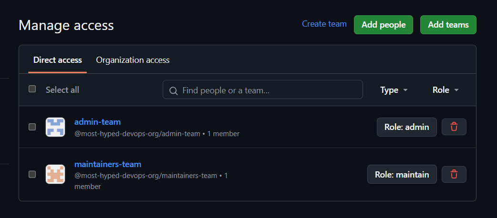

But this is great thing to do, really impressive. Thanks for the new features I opened because of this course!
