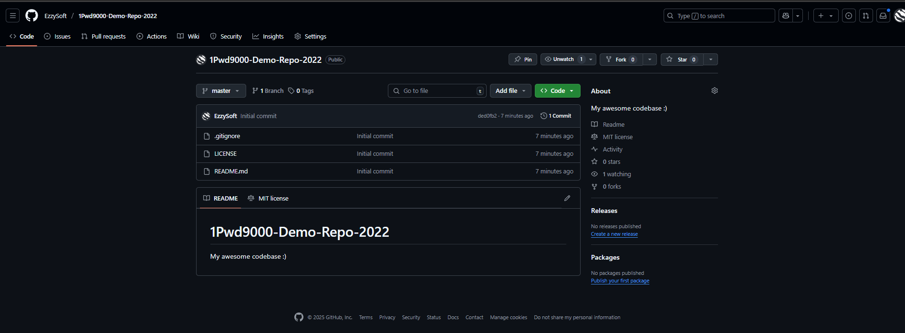
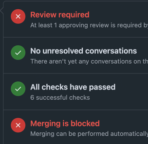

# Terraform

## Docker

### state show

#### Moscow current time

```bash
> terraform state show docker_container.moscow_time_app
# docker_container.moscow_time_app:
resource "docker_container" "moscow_time_app" {
    attach                                      = false
    bridge                                      = null
    command                                     = [
        "app.py",
    ]
    container_read_refresh_timeout_milliseconds = 15000
    cpu_set                                     = null
    cpu_shares                                  = 0
    domainname                                  = null
    entrypoint                                  = [
        "/usr/bin/python3.11",
    ]
    env                                         = []
    hostname                                    = "010cddca2fe4"
    id                                          = "010cddca2fe4c84617365642d105769afcfa0084b3bbf66c9b0e0d0754cbce22"
    image                                       = "sha256:3990345d21362490e5ca8724560ae4ace4991412167d260b6778b8dcb1cad74b"
    init                                        = false
    ipc_mode                                    = "private"
    log_driver                                  = "json-file"
    logs                                        = false
    max_retry_count                             = 0
    memory                                      = 0
    memory_swap                                 = 0
    must_run                                    = true
    name                                        = "moscow-current-time"
    network_data                                = [
        {
            gateway                   = "172.17.0.1"
            global_ipv6_address       = null
            global_ipv6_prefix_length = 0
            ip_address                = "172.17.0.2"
            ip_prefix_length          = 16
            ipv6_gateway              = null
            mac_address               = "02:42:ac:11:00:02"
            network_name              = "bridge"
        },
    ]
    network_mode                                = "bridge"
    pid_mode                                    = null
    privileged                                  = false
    publish_all_ports                           = false
    read_only                                   = false
    remove_volumes                              = true
    restart                                     = "no"
    rm                                          = false
    runtime                                     = "runc"
    security_opts                               = []
    shm_size                                    = 64
    start                                       = true
    stdin_open                                  = false
    stop_signal                                 = null
    stop_timeout                                = 0
    tty                                         = false
    user                                        = "nonroot:nonroot"
    userns_mode                                 = null
    wait                                        = false
    wait_timeout                                = 60
    working_dir                                 = "/app"

    ports {
        external = 5001
        internal = 5000
        ip       = "0.0.0.0"
        protocol = "tcp"
    }
}

   ```

#### Random predictions

```bash
> terraform state show docker_container.random_predictions
# docker_container.random_predictions:
resource "docker_container" "random_predictions" {
    attach                                      = false
    bridge                                      = null
    command                                     = [
        "./main.out",
    ]
    container_read_refresh_timeout_milliseconds = 15000
    cpu_set                                     = null
    cpu_shares                                  = 0
    domainname                                  = null
    entrypoint                                  = []
    env                                         = []
    hostname                                    = "431583dda49c"
    id                                          = "431583dda49c5ab548c8a938f7d444455f2f17a3505f42fd9955d1a86ebf9796"
    image                                       = "sha256:40668be63e214f05232da5d2a1afedef3f3c61cb7b25efae3326ed122e7eafc7"
    init                                        = false
    ipc_mode                                    = "private"
    log_driver                                  = "json-file"
    logs                                        = false
    max_retry_count                             = 0
    memory                                      = 0
    memory_swap                                 = 0
    must_run                                    = true
    name                                        = "random-predictions"
    network_data                                = [
        {
            gateway                   = "172.17.0.1"
            global_ipv6_address       = null
            global_ipv6_prefix_length = 0
            ip_address                = "172.17.0.3"
            ip_prefix_length          = 16
            ipv6_gateway              = null
            mac_address               = "02:42:ac:11:00:03"
            network_name              = "bridge"
        },
    ]
    network_mode                                = "bridge"
    pid_mode                                    = null
    privileged                                  = false
    publish_all_ports                           = false
    read_only                                   = false
    remove_volumes                              = true
    restart                                     = "no"
    rm                                          = false
    runtime                                     = "runc"
    security_opts                               = []
    shm_size                                    = 64
    start                                       = true
    stdin_open                                  = false
    stop_signal                                 = null
    stop_timeout                                = 0
    tty                                         = false
    user                                        = "nonroot:nonroot"
    userns_mode                                 = null
    wait                                        = false
    wait_timeout                                = 60
    working_dir                                 = "/"

    ports {
        external = 8080
        internal = 8080
        ip       = "0.0.0.0"
        protocol = "tcp"
    }
}
```

### state list

```bash
> terraform state list
docker_container.moscow_time_app
docker_container.random_predictions
```

```bash
> terraform apply 

docker_container.moscow_time_app: Refreshing state... [id=4cc31d3f8edcc0ef19b6cf499662ad2c4fcc5318e04c6e2eb3203c2d9cb5cbe5]
docker_container.random_predictions: Refreshing state... [id=affb214308e1f4b0eb8fbc4696b70f30db5c8e5212aff434807124d4774f6494]

Terraform used the selected providers to generate the following execution plan. Resource actions are indicated with the following symbols:
-/+ destroy and then create replacement

Terraform will perform the following actions:

  # docker_container.moscow_time_app must be replaced
-/+ resource "docker_container" "moscow_time_app" {
      + bridge                                      = (known after apply)
      ~ command                                     = [
          - "app.py",
        ] -> (known after apply)
      + container_logs                              = (known after apply)
      - cpu_shares                                  = 0 -> null
      - dns                                         = [] -> null
      - dns_opts                                    = [] -> null
      - dns_search                                  = [] -> null
      ~ entrypoint                                  = [
          - "/usr/bin/python3.11",
        ] -> (known after apply)
      ~ env                                         = [] -> (known after apply)
      + exit_code                                   = (known after apply)
      - group_add                                   = [] -> null
      ~ hostname                                    = "4cc31d3f8edc" -> (known after apply)
      ~ id                                          = "4cc31d3f8edcc0ef19b6cf499662ad2c4fcc5318e04c6e2eb3203c2d9cb5cbe5" -> (known after apply)
      ~ image                                       = "sha256:3990345d21362490e5ca8724560ae4ace4991412167d260b6778b8dcb1cad74b" -> "python-distroless-web-app" # forces replacement
      ~ init                                        = false -> (known after apply)
      ~ ipc_mode                                    = "private" -> (known after apply)
      ~ log_driver                                  = "json-file" -> (known after apply)
      - log_opts                                    = {} -> null
      - max_retry_count                             = 0 -> null
      - memory                                      = 0 -> null
      - memory_swap                                 = 0 -> null
        name                                        = "moscow-current-time"
      ~ network_data                                = [
          - {
              - gateway                   = "172.17.0.1"
              - global_ipv6_prefix_length = 0
              - ip_address                = "172.17.0.3"
              - ip_prefix_length          = 16
              - mac_address               = "02:42:ac:11:00:03"
              - network_name              = "bridge"
                # (2 unchanged attributes hidden)
            },
        ] -> (known after apply)
      - network_mode                                = "bridge" -> null # forces replacement
      - privileged                                  = false -> null
      - publish_all_ports                           = false -> null
      ~ runtime                                     = "runc" -> (known after apply)
      ~ security_opts                               = [] -> (known after apply)
      ~ shm_size                                    = 64 -> (known after apply)
      + stop_signal                                 = (known after apply)
      ~ stop_timeout                                = 0 -> (known after apply)
      - storage_opts                                = {} -> null
      - sysctls                                     = {} -> null
      - tmpfs                                       = {} -> null
      - user                                        = "nonroot:nonroot" -> null
      - working_dir                                 = "/app" -> null
        # (17 unchanged attributes hidden)

      ~ healthcheck (known after apply)

      ~ labels (known after apply)

        # (1 unchanged block hidden)
    }

  # docker_container.random_predictions must be replaced
-/+ resource "docker_container" "random_predictions" {
      + bridge                                      = (known after apply)
      ~ command                                     = [
          - "./main.out",
        ] -> (known after apply)
      + container_logs                              = (known after apply)
      - cpu_shares                                  = 0 -> null
      - dns                                         = [] -> null
      - dns_opts                                    = [] -> null
      - dns_search                                  = [] -> null
      ~ entrypoint                                  = [] -> (known after apply)
      ~ env                                         = [] -> (known after apply)
      + exit_code                                   = (known after apply)
      - group_add                                   = [] -> null
      ~ hostname                                    = "affb214308e1" -> (known after apply)
      ~ id                                          = "affb214308e1f4b0eb8fbc4696b70f30db5c8e5212aff434807124d4774f6494" -> (known after apply)
      ~ image                                       = "sha256:40668be63e214f05232da5d2a1afedef3f3c61cb7b25efae3326ed122e7eafc7" -> "go-distroless-web-app" # forces replacement
      ~ init                                        = false -> (known after apply)
      ~ ipc_mode                                    = "private" -> (known after apply)
      ~ log_driver                                  = "json-file" -> (known after apply)
      - log_opts                                    = {} -> null
      - max_retry_count                             = 0 -> null
      - memory                                      = 0 -> null
      - memory_swap                                 = 0 -> null
        name                                        = "random-predictions"
      ~ network_data                                = [
          - {
              - gateway                   = "172.17.0.1"
              - global_ipv6_prefix_length = 0
              - ip_address                = "172.17.0.2"
              - ip_prefix_length          = 16
              - mac_address               = "02:42:ac:11:00:02"
              - network_name              = "bridge"
                # (2 unchanged attributes hidden)
            },
        ] -> (known after apply)
      - network_mode                                = "bridge" -> null # forces replacement
      - privileged                                  = false -> null
      - publish_all_ports                           = false -> null
      ~ runtime                                     = "runc" -> (known after apply)
      ~ security_opts                               = [] -> (known after apply)
      ~ shm_size                                    = 64 -> (known after apply)
      + stop_signal                                 = (known after apply)
      ~ stop_timeout                                = 0 -> (known after apply)
      - storage_opts                                = {} -> null
      - sysctls                                     = {} -> null
      - tmpfs                                       = {} -> null
      - user                                        = "nonroot:nonroot" -> null
      - working_dir                                 = "/" -> null
        # (17 unchanged attributes hidden)

      ~ healthcheck (known after apply)

      ~ labels (known after apply)

        # (1 unchanged block hidden)
    }

Plan: 2 to add, 0 to change, 2 to destroy.

Changes to Outputs:
  ~ go_container_id        = "affb214308e1f4b0eb8fbc4696b70f30db5c8e5212aff434807124d4774f6494" -> (known after apply)
  ~ python_container_id    = "4cc31d3f8edcc0ef19b6cf499662ad2c4fcc5318e04c6e2eb3203c2d9cb5cbe5" -> (known after apply)

Do you want to perform these actions?
  Terraform will perform the actions described above.
  Only 'yes' will be accepted to approve.

  Enter a value: yes

docker_container.moscow_time_app: Destroying... [id=4cc31d3f8edcc0ef19b6cf499662ad2c4fcc5318e04c6e2eb3203c2d9cb5cbe5]
docker_container.random_predictions: Destroying... [id=affb214308e1f4b0eb8fbc4696b70f30db5c8e5212aff434807124d4774f6494]
docker_container.moscow_time_app: Destruction complete after 1s
docker_container.random_predictions: Destruction complete after 1s
docker_container.moscow_time_app: Creating...
docker_container.random_predictions: Creating...
docker_container.random_predictions: Creation complete after 0s [id=f3517241c9d3214de024211e6e992b81967db05ec14a531ac1267482ff121616]
docker_container.moscow_time_app: Creation complete after 0s [id=01941d0987de29024b074008607ff35083d5c8ff0d245ed4de91f2cc506c510a]

Apply complete! Resources: 2 added, 0 changed, 2 destroyed.

Outputs:

go_container_id = "f3517241c9d3214de024211e6e992b81967db05ec14a531ac1267482ff121616"
go_container_ports = tolist([
  {
    "external" = 8080
    "internal" = 8080
    "ip" = "0.0.0.0"
    "protocol" = "tcp"
  },
])
python_container_id = "01941d0987de29024b074008607ff35083d5c8ff0d245ed4de91f2cc506c510a"
python_container_ports = tolist([
  {
    "external" = 5001
    "internal" = 5000
    "ip" = "0.0.0.0"
    "protocol" = "tcp"
  },
])

```

```bash
> terraform output
go_container_id = "f3517241c9d3214de024211e6e992b81967db05ec14a531ac1267482ff121616"
go_container_ports = tolist([
  {
    "external" = 8080
    "internal" = 8080
    "ip" = "0.0.0.0"
    "protocol" = "tcp"
  },
])
python_container_id = "01941d0987de29024b074008607ff35083d5c8ff0d245ed4de91f2cc506c510a"
python_container_ports = tolist([
  {
    "external" = 5001
    "internal" = 5000
    "ip" = "0.0.0.0"
    "protocol" = "tcp"
  },
])
```

## Yandex Cloud

Firstly, make an account and a VM was complicated, steps are not intuitive.

### Set up

I did all by [instruction](https://yandex.cloud/en-ru/docs/tutorials/infrastructure-management/terraform-quickstart#linux_1)

```bash
> curl -sSL https://storage.yandexcloud.net/yandexcloud-yc/install.sh | bash
Downloading yc 0.142.0
  % Total    % Received % Xferd  Average Speed   Time    Time     Time  Current
                                 Dload  Upload   Total   Spent    Left  Speed
100 98.0M  100 98.0M    0     0  7258k      0  0:00:13  0:00:13 --:--:-- 7233k


Yandex Cloud CLI 0.142.0 darwin/arm64
grep: /Users/m.sirozhova/.zshrc: No such file or directory

yc PATH has been added to your '/Users/m.sirozhova/.zshrc' profile
yc zsh completion has been added to your '/Users/m.sirozhova/.zshrc' profile.
To complete installation, start a new shell (exec -l $SHELL) or type 'source "/Users/m.sirozhova/.zshrc"' in the current one


> source "/Users/m.sirozhova/.zshrc" 

> yc iam key create \
  --service-account-id ajet6b9q9qlk863oqimp \
  --folder-name default \
  --output key.json

ERROR: Failed to get credentials
```

Here I got that I need to init (it was not obvious, my first challenge)

```bash
> yc init
Welcome! This command will take you through the configuration process.
Please go to https://oauth.yandex.ru/authorize?response_type=token&client_id=1a6990aa636648e9b2ef855fa7bec2fb in order to obtain OAuth token.
 Please enter OAuth token: y0__xDOkdjwAhjB3RMgovf-lxK_Gx1t88_hyRbtRmeEMvmd33bGXQ
You have one cloud available: 'cloud-milanasirozhova' (id = b1gh5cm297sjld6ua1o4). It is going to be used by default.
Please choose folder to use:
 [1] default (id = b1gu8uhicuj7jjnecp6g)
 [2] Create a new folder
Please enter your numeric choice: 1
Your current folder has been set to 'default' (id = b1gu8uhicuj7jjnecp6g).
Do you want to configure a default Compute zone? [Y/n] y
Which zone do you want to use as a profile default?
 [1] ru-central1-a
 [2] ru-central1-b
 [3] ru-central1-d
 [4] Don't set default zone
Please enter your numeric choice: 1
Your profile default Compute zone has been set to 'ru-central1-a'.
```

And again this command

```bash
> yc iam key create \
>  --service-account-id ajet6b9q9qlk863oqimp \
>  --folder-name default \
>  --output key.json
id: aje79lapsk4jrc7o1q0r
service_account_id: ajet6b9q9qlk863oqimp
created_at: "2025-02-04T19:49:52.309883891Z"
key_algorithm: RSA_2048
```

```bash
> yc config profile create s25-terraform 
Profile 's25-terraform' created and activated
> yc config set service-account-key key.json
> yc config set cloud-id b1gh5cm297sjld6ua1o4
> yc config set folder-id b1gu8uhicuj7jjnecp6g

> export YC_TOKEN=$(yc iam create-token)
> export YC_CLOUD_ID=$(yc config get cloud-id)
> export YC_FOLDER_ID=$(yc config get folder-id)

> nano ~/.terraformrc
```

```bash
> terraform init
Initializing the backend...
Initializing provider plugins...
- Finding latest version of yandex-cloud/yandex...
- Installing yandex-cloud/yandex v0.136.0...
- Installed yandex-cloud/yandex v0.136.0 (unauthenticated)
Terraform has created a lock file .terraform.lock.hcl to record the provider
selections it made above. Include this file in your version control repository
so that Terraform can guarantee to make the same selections by default when
you run "terraform init" in the future.

╷
│ Warning: Incomplete lock file information for providers
│ 
│ Due to your customized provider installation methods, Terraform was forced to calculate lock file checksums locally for the following providers:
│   - yandex-cloud/yandex
│ 
│ The current .terraform.lock.hcl file only includes checksums for darwin_arm64, so Terraform running on another platform will fail to install these providers.
│ 
│ To calculate additional checksums for another platform, run:
│   terraform providers lock -platform=linux_amd64
│ (where linux_amd64 is the platform to generate)
╵
Terraform has been successfully initialized!

You may now begin working with Terraform. Try running "terraform plan" to see
any changes that are required for your infrastructure. All Terraform commands
should now work.

If you ever set or change modules or backend configuration for Terraform,
rerun this command to reinitialize your working directory. If you forget, other
commands will detect it and remind you to do so if necessary.

```

Then I wrote main.tf (with the help of instruction), I took out variables.tf and output.tf.

```bash
> terraform plan 

Terraform used the selected providers to generate the following execution plan. Resource actions are indicated with the following symbols:
  + create

Terraform will perform the following actions:

  # yandex_compute_disk.boot-disk will be created
  + resource "yandex_compute_disk" "boot-disk" {
      + block_size  = 4096
      + created_at  = (known after apply)
      + folder_id   = (known after apply)
      + id          = (known after apply)
      + image_id    = "fd8bpal18cm4kprpjc2m"
      + name        = "boot-disk"
      + product_ids = (known after apply)
      + size        = 20
      + status      = (known after apply)
      + type        = "network-hdd"
      + zone        = "ru-central1-a"

      + disk_placement_policy (known after apply)

      + hardware_generation (known after apply)
    }

  # yandex_compute_instance.vm will be created
  + resource "yandex_compute_instance" "vm" {
      + created_at                = (known after apply)
      + folder_id                 = (known after apply)
      + fqdn                      = (known after apply)
      + gpu_cluster_id            = (known after apply)
      + hardware_generation       = (known after apply)
      + hostname                  = (known after apply)
      + id                        = (known after apply)
      + maintenance_grace_period  = (known after apply)
      + maintenance_policy        = (known after apply)
      + metadata                  = {
          + "ssh-keys" = <<-EOT
                ubuntu:ssh-rsa AAAAB3NzaC1yc2EAAAADAQABAAABgQDCGOG77aD529nTBNzKL6+uZVOXY7nzxWFOSthZnhJGmHroINAdLriXPFLC1uSy2fAOfdwtbaDX/P3ksYB92jpH5DFZSDOx+BYSqIbkch/fyPX+Li34JVldpGxmva9HaJVejO5VKRMwrgIANSLA8wBH+HSIhIN5G7X7P9HSMfuexYmxDqU7aF4QoKALW9WzOPZSIRWp5fxDuBERSjv4HynIwQscczE8pWdeuDhEpfYAOe2tjo3jbyW8RAgmAxo5+qco9YyPo25BWn5JCou5t3Nji0OP7bY2I8Hbqv74QBLPIi44Q5cvB+bGjhM71JXLVI9NWOJ42E2czZNSIAhQywFCPIxk62fkcdWGE5X+05f7gwzlyOZZCg4S0Sm1Y4wphEb/kQMy9aQquWlpJwWK497fmfM9zWeb0oGbEs33jDovUouKoBBvRLiKtaM6GdWQdocdgbBVwptgX55ekMeizEyXyR1xMbZpQCK1iLuI/wTbcLQg9O5/yaqSGGU5ni2IdnM= m.sirozhova@macbook-FN9T7TWJ52
            EOT
        }
      + name                      = "terraform"
      + network_acceleration_type = "standard"
      + platform_id               = "standard-v1"
      + service_account_id        = (known after apply)
      + status                    = (known after apply)
      + zone                      = (known after apply)

      + boot_disk {
          + auto_delete = true
          + device_name = (known after apply)
          + disk_id     = (known after apply)
          + mode        = (known after apply)

          + initialize_params (known after apply)
        }

      + metadata_options (known after apply)

      + network_interface {
          + index              = (known after apply)
          + ip_address         = (known after apply)
          + ipv4               = true
          + ipv6               = (known after apply)
          + ipv6_address       = (known after apply)
          + mac_address        = (known after apply)
          + nat                = true
          + nat_ip_address     = (known after apply)
          + nat_ip_version     = (known after apply)
          + security_group_ids = (known after apply)
          + subnet_id          = (known after apply)
        }

      + placement_policy (known after apply)

      + resources {
          + core_fraction = 100
          + cores         = 2
          + memory        = 2
        }

      + scheduling_policy (known after apply)
    }

  # yandex_vpc_network.network will be created
  + resource "yandex_vpc_network" "network" {
      + created_at                = (known after apply)
      + default_security_group_id = (known after apply)
      + folder_id                 = (known after apply)
      + id                        = (known after apply)
      + labels                    = (known after apply)
      + name                      = "network"
      + subnet_ids                = (known after apply)
    }

  # yandex_vpc_subnet.subnet will be created
  + resource "yandex_vpc_subnet" "subnet" {
      + created_at     = (known after apply)
      + folder_id      = (known after apply)
      + id             = (known after apply)
      + labels         = (known after apply)
      + name           = "subnet"
      + network_id     = (known after apply)
      + v4_cidr_blocks = [
          + "192.168.0.0/16",
        ]
      + v6_cidr_blocks = (known after apply)
      + zone           = "ru-central1-a"
    }

Plan: 4 to add, 0 to change, 0 to destroy.

Changes to Outputs:
  + external_ip_address_vm = (known after apply)
  + internal_ip_address_vm = (known after apply)

Note: You didn't use the -out option to save this plan, so Terraform can't guarantee to take exactly these actions if you run "terraform apply" now.
```

```bash
> terraform apply

Terraform used the selected providers to generate the following execution plan. Resource actions are indicated with the following symbols:
  + create

Terraform will perform the following actions:

  # yandex_compute_disk.boot-disk will be created
  + resource "yandex_compute_disk" "boot-disk" {
      + block_size  = 4096
      + created_at  = (known after apply)
      + folder_id   = (known after apply)
      + id          = (known after apply)
      + image_id    = "fd8bpal18cm4kprpjc2m"
      + name        = "boot-disk"
      + product_ids = (known after apply)
      + size        = 20
      + status      = (known after apply)
      + type        = "network-hdd"
      + zone        = "ru-central1-a"

      + disk_placement_policy (known after apply)

      + hardware_generation (known after apply)
    }

  # yandex_compute_instance.vm will be created
  + resource "yandex_compute_instance" "vm" {
      + created_at                = (known after apply)
      + folder_id                 = (known after apply)
      + fqdn                      = (known after apply)
      + gpu_cluster_id            = (known after apply)
      + hardware_generation       = (known after apply)
      + hostname                  = (known after apply)
      + id                        = (known after apply)
      + maintenance_grace_period  = (known after apply)
      + maintenance_policy        = (known after apply)
      + metadata                  = {
          + "ssh-keys" = <<-EOT
                ubuntu:ssh-rsa AAAAB3NzaC1yc2EAAAADAQABAAABgQDCGOG77aD529nTBNzKL6+uZVOXY7nzxWFOSthZnhJGmHroINAdLriXPFLC1uSy2fAOfdwtbaDX/P3ksYB92jpH5DFZSDOx+BYSqIbkch/fyPX+Li34JVldpGxmva9HaJVejO5VKRMwrgIANSLA8wBH+HSIhIN5G7X7P9HSMfuexYmxDqU7aF4QoKALW9WzOPZSIRWp5fxDuBERSjv4HynIwQscczE8pWdeuDhEpfYAOe2tjo3jbyW8RAgmAxo5+qco9YyPo25BWn5JCou5t3Nji0OP7bY2I8Hbqv74QBLPIi44Q5cvB+bGjhM71JXLVI9NWOJ42E2czZNSIAhQywFCPIxk62fkcdWGE5X+05f7gwzlyOZZCg4S0Sm1Y4wphEb/kQMy9aQquWlpJwWK497fmfM9zWeb0oGbEs33jDovUouKoBBvRLiKtaM6GdWQdocdgbBVwptgX55ekMeizEyXyR1xMbZpQCK1iLuI/wTbcLQg9O5/yaqSGGU5ni2IdnM= m.sirozhova@macbook-FN9T7TWJ52
            EOT
        }
      + name                      = "terraform"
      + network_acceleration_type = "standard"
      + platform_id               = "standard-v1"
      + service_account_id        = (known after apply)
      + status                    = (known after apply)
      + zone                      = (known after apply)

      + boot_disk {
          + auto_delete = true
          + device_name = (known after apply)
          + disk_id     = (known after apply)
          + mode        = (known after apply)

          + initialize_params (known after apply)
        }

      + metadata_options (known after apply)

      + network_interface {
          + index              = (known after apply)
          + ip_address         = (known after apply)
          + ipv4               = true
          + ipv6               = (known after apply)
          + ipv6_address       = (known after apply)
          + mac_address        = (known after apply)
          + nat                = true
          + nat_ip_address     = (known after apply)
          + nat_ip_version     = (known after apply)
          + security_group_ids = (known after apply)
          + subnet_id          = (known after apply)
        }

      + placement_policy (known after apply)

      + resources {
          + core_fraction = 100
          + cores         = 2
          + memory        = 2
        }

      + scheduling_policy (known after apply)
    }

  # yandex_vpc_network.network will be created
  + resource "yandex_vpc_network" "network" {
      + created_at                = (known after apply)
      + default_security_group_id = (known after apply)
      + folder_id                 = (known after apply)
      + id                        = (known after apply)
      + labels                    = (known after apply)
      + name                      = "network"
      + subnet_ids                = (known after apply)
    }

  # yandex_vpc_subnet.subnet will be created
  + resource "yandex_vpc_subnet" "subnet" {
      + created_at     = (known after apply)
      + folder_id      = (known after apply)
      + id             = (known after apply)
      + labels         = (known after apply)
      + name           = "subnet"
      + network_id     = (known after apply)
      + v4_cidr_blocks = [
          + "192.168.0.0/16",
        ]
      + v6_cidr_blocks = (known after apply)
      + zone           = "ru-central1-a"
    }

Plan: 4 to add, 0 to change, 0 to destroy.

Changes to Outputs:
  + external_ip_address_vm = (known after apply)
  + internal_ip_address_vm = (known after apply)

Do you want to perform these actions?
  Terraform will perform the actions described above.
  Only 'yes' will be accepted to approve.

  Enter a value: yes

yandex_vpc_network.network: Creating...
yandex_compute_disk.boot-disk: Creating...
yandex_vpc_network.network: Creation complete after 2s [id=enpn5ecit6a40ds0l5c8]
yandex_vpc_subnet.subnet: Creating...
yandex_vpc_subnet.subnet: Creation complete after 0s [id=e9bgc4q5lnptp1fd0jku]
yandex_compute_disk.boot-disk: Still creating... [10s elapsed]
yandex_compute_disk.boot-disk: Creation complete after 12s [id=fhm8569trkpmfbvuog6i]
yandex_compute_instance.vm: Creating...
yandex_compute_instance.vm: Still creating... [10s elapsed]
yandex_compute_instance.vm: Still creating... [20s elapsed]
yandex_compute_instance.vm: Still creating... [30s elapsed]
yandex_compute_instance.vm: Creation complete after 32s [id=fhm8l97e5pdu2rs2pmlu]

Apply complete! Resources: 4 added, 0 changed, 0 destroyed.

Outputs:

external_ip_address_vm = "84.201.158.253"
internal_ip_address_vm = "192.168.0.12"
```

## GitHub

I used provided tutorial <https://dev.to/pwd9000/manage-and-maintain-github-with-terraform-2k86>

```bash
> terraform init
Initializing the backend...
Initializing provider plugins...
- Finding integrations/github versions matching "~> 6.0"...
- Installing integrations/github v6.5.0...
- Installed integrations/github v6.5.0 (unauthenticated)
Terraform has created a lock file .terraform.lock.hcl to record the provider
selections it made above. Include this file in your version control repository
so that Terraform can guarantee to make the same selections by default when
you run "terraform init" in the future.

╷
│ Warning: Incomplete lock file information for providers
│ 
│ Due to your customized provider installation methods, Terraform was forced to calculate lock file checksums locally for the following providers:
│   - integrations/github
│ 
│ The current .terraform.lock.hcl file only includes checksums for darwin_arm64, so Terraform running on another platform will fail to install these providers.
│ 
│ To calculate additional checksums for another platform, run:
│   terraform providers lock -platform=linux_amd64
│ (where linux_amd64 is the platform to generate)
╵
Terraform has been successfully initialized!

You may now begin working with Terraform. Try running "terraform plan" to see
any changes that are required for your infrastructure. All Terraform commands
should now work.

If you ever set or change modules or backend configuration for Terraform,
rerun this command to reinitialize your working directory. If you forget, other
commands will detect it and remind you to do so if necessary.
(venv) m.sirozhova@macbook-FN9T7TWJ52 github % terraform import "github_repository.repo" "S25-core-course-labs"
github_repository.repo: Importing from ID "S25-core-course-labs"...
github_repository.repo: Import prepared!
  Prepared github_repository for import
github_repository.repo: Refreshing state... [id=S25-core-course-labs]

Import successful!

The resources that were imported are shown above. These resources are now in
your Terraform state and will henceforth be managed by Terraform.
```

```bash
> terraform apply
github_repository.repo: Refreshing state... [id=S25-core-course-labs]

Terraform used the selected providers to generate the following execution plan. Resource actions are indicated with the following symbols:
  + create
  ~ update in-place

Terraform will perform the following actions:

  # github_branch_default.master will be created
  + resource "github_branch_default" "master" {
      + branch     = "master"
      + etag       = (known after apply)
      + id         = (known after apply)
      + rename     = false
      + repository = "S25-core-course-labs"
    }

  # github_branch_protection.default will be created
  + resource "github_branch_protection" "default" {
      + allows_deletions                = false
      + allows_force_pushes             = false
      + enforce_admins                  = true
      + id                              = (known after apply)
      + lock_branch                     = false
      + pattern                         = "master"
      + repository_id                   = "S25-core-course-labs"
      + require_conversation_resolution = true
      + require_signed_commits          = false
      + required_linear_history         = false

      + required_pull_request_reviews {
          + require_last_push_approval      = false
          + required_approving_review_count = 1
        }
    }

  # github_repository.repo will be updated in-place
  ~ resource "github_repository" "repo" {
      ~ auto_init                   = false -> true
      + description                 = "my DevOps labs S25"
      + gitignore_template          = "Python"
      - has_downloads               = true -> null
      ~ has_issues                  = false -> true
      - has_projects                = true -> null
        id                          = "S25-core-course-labs"
      + license_template            = "mit"
        name                        = "S25-core-course-labs"
        # (31 unchanged attributes hidden)

        # (1 unchanged block hidden)
    }

Plan: 2 to add, 1 to change, 0 to destroy.

Do you want to perform these actions?
  Terraform will perform the actions described above.
  Only 'yes' will be accepted to approve.

  Enter a value: yes

github_repository.repo: Modifying... [id=S25-core-course-labs]
github_repository.repo: Modifications complete after 2s [id=S25-core-course-labs]
github_branch_default.master: Creating...
github_branch_default.master: Creation complete after 1s [id=S25-core-course-labs]
github_branch_protection.default: Creating...
github_branch_protection.default: Creation complete after 5s [id=BPR_kwDONvYsrc4DiV5k]

Apply complete! Resources: 2 added, 1 changed, 0 destroyed.

```

Now the repo is changed



### Best practices

Here the best practices that I applied:

1) Hidden variables: in terraform.tfvars and variables.tf
2) Branch Protection: Enforces PR reviews (1 approval), conversation resolution, and admin restrictions
3) Repo Setup: Public, initialized with MIT license, Python .gitignore, issues & wiki enabled
4) Limit Repository Visibility: Set to private when necessary for security

## Bonus

Organization: <https://github.com/MilanaSi>
Repo: <https://github.com/MilanaSi/Cool_project>
Teams: <https://github.com/orgs/MilanaSi/teams>

```bash
> terraform init                                                  
Initializing the backend...
Initializing provider plugins...
- Finding integrations/github versions matching "~> 6.0"...
- Installing integrations/github v6.5.0...
- Installed integrations/github v6.5.0 (unauthenticated)
Terraform has created a lock file .terraform.lock.hcl to record the provider
selections it made above. Include this file in your version control repository
so that Terraform can guarantee to make the same selections by default when
you run "terraform init" in the future.

╷
│ Warning: Incomplete lock file information for providers
│ 
│ Due to your customized provider installation methods, Terraform was forced to calculate lock file checksums locally for the following providers:
│   - integrations/github
│ 
│ The current .terraform.lock.hcl file only includes checksums for darwin_arm64, so Terraform running on another platform will fail to install these providers.
│ 
│ To calculate additional checksums for another platform, run:
│   terraform providers lock -platform=linux_amd64
│ (where linux_amd64 is the platform to generate)
╵
Terraform has been successfully initialized!

You may now begin working with Terraform. Try running "terraform plan" to see
any changes that are required for your infrastructure. All Terraform commands
should now work.

If you ever set or change modules or backend configuration for Terraform,
rerun this command to reinitialize your working directory. If you forget, other
commands will detect it and remind you to do so if necessary.
```

```bash
> terraform apply
github_team.developers: Refreshing state... [id=12114347]
github_repository.repo: Refreshing state... [id=Cool-project]
github_branch_default.main: Refreshing state... [id=Cool-project]
github_team_repository.developers_access: Refreshing state... [id=12114347:Cool-project]
github_branch_protection.repo_protection: Refreshing state... [id=BPR_kwDON0b1ac4DiWPX]

Terraform used the selected providers to generate the following execution plan. Resource actions are indicated with the following symbols:
  + create

Terraform will perform the following actions:

  # github_team.devops will be created
  + resource "github_team" "devops" {
      + create_default_maintainer = false
      + description               = "Guys build and deploy code"
      + etag                      = (known after apply)
      + id                        = (known after apply)
      + members_count             = (known after apply)
      + name                      = "DevOps team"
      + node_id                   = (known after apply)
      + parent_team_read_id       = (known after apply)
      + parent_team_read_slug     = (known after apply)
      + privacy                   = "closed"
      + slug                      = (known after apply)
    }

  # github_team.qa will be created
  + resource "github_team" "qa" {
      + create_default_maintainer = false
      + description               = "Guys check the code (and break it)"
      + etag                      = (known after apply)
      + id                        = (known after apply)
      + members_count             = (known after apply)
      + name                      = "Quality assurance Team"
      + node_id                   = (known after apply)
      + parent_team_read_id       = (known after apply)
      + parent_team_read_slug     = (known after apply)
      + privacy                   = "closed"
      + slug                      = (known after apply)
    }

  # github_team.sa will be created
  + resource "github_team" "sa" {
      + create_default_maintainer = false
      + description               = "Guys make tasks and know the system"
      + etag                      = (known after apply)
      + id                        = (known after apply)
      + members_count             = (known after apply)
      + name                      = "System analysts Team"
      + node_id                   = (known after apply)
      + parent_team_read_id       = (known after apply)
      + parent_team_read_slug     = (known after apply)
      + privacy                   = "closed"
      + slug                      = (known after apply)
    }

  # github_team_repository.devops_access will be created
  + resource "github_team_repository" "devops_access" {
      + etag       = (known after apply)
      + id         = (known after apply)
      + permission = "admin"
      + repository = "Cool-project"
      + team_id    = (known after apply)
    }

  # github_team_repository.qa_access will be created
  + resource "github_team_repository" "qa_access" {
      + etag       = (known after apply)
      + id         = (known after apply)
      + permission = "pull"
      + repository = "Cool-project"
      + team_id    = (known after apply)
    }

  # github_team_repository.sa_access will be created
  + resource "github_team_repository" "sa_access" {
      + etag       = (known after apply)
      + id         = (known after apply)
      + permission = "pull"
      + repository = "Cool-project"
      + team_id    = (known after apply)
    }

Plan: 6 to add, 0 to change, 0 to destroy.

Do you want to perform these actions?
  Terraform will perform the actions described above.
  Only 'yes' will be accepted to approve.

  Enter a value: yes

github_team.devops: Creating...
github_team.sa: Creating...
github_team.qa: Creating...
github_team.sa: Still creating... [10s elapsed]
github_team.qa: Still creating... [10s elapsed]
github_team.devops: Still creating... [10s elapsed]
github_team.qa: Creation complete after 13s [id=12114356]
github_team_repository.qa_access: Creating...
github_team.sa: Creation complete after 13s [id=12114357]
github_team_repository.sa_access: Creating...
github_team.devops: Creation complete after 13s [id=12114358]
github_team_repository.devops_access: Creating...
github_team_repository.qa_access: Creation complete after 5s [id=12114356:Cool-project]
github_team_repository.sa_access: Creation complete after 5s [id=12114357:Cool-project]
github_team_repository.devops_access: Creation complete after 5s [id=12114358:Cool-project]

Apply complete! Resources: 6 added, 0 changed, 0 destroyed.
```
