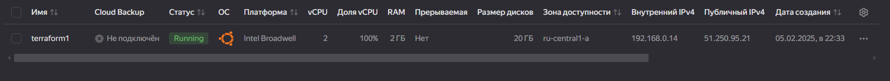
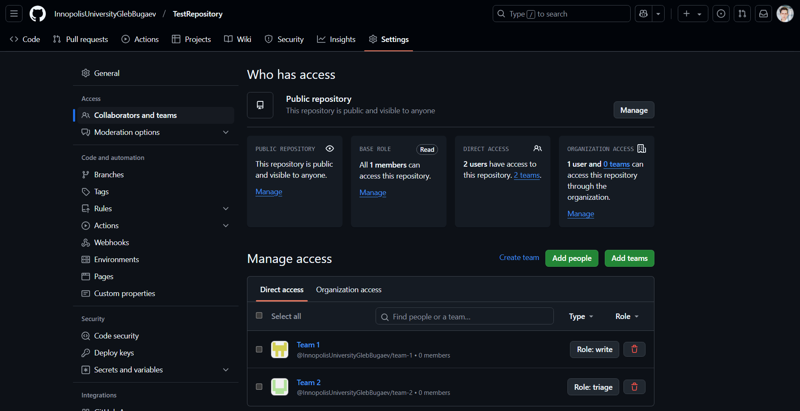

# Terraform Infrastructure

-----

## Docker Infrastructure

These are the outputs for the next commands after the setting up an infrastructure:

```bash
> terraform state show "docker_container.python_app_container"
```

```cmd
# docker_container.python_app_container:
resource "docker_container" "python_app_container" {
    attach                                      = false
    bridge                                      = null
    command                                     = []
    container_read_refresh_timeout_milliseconds = 15000
    cpu_set                                     = null
    cpu_shares                                  = 0
    domainname                                  = null
    entrypoint                                  = [
        "python3",
        "-m",
        "flask",
        "run",
        "--host=0.0.0.0",
    ]
    env                                         = []
    hostname                                    = "3ae43868b541"
    id                                          = "3ae43868b541c55cd86857862e73c477ac5fd8c94049bcc74f6f92a82876b279"
    image                                       = "sha256:f9a463cca77af58181ae6b9b2c44a6e98eaf2346669c8f2aca5a564f7b187be0"
    init                                        = false
    ipc_mode                                    = "private"
    log_driver                                  = "json-file"
    logs                                        = false
    max_retry_count                             = 0
    memory                                      = 0
    memory_swap                                 = 0
    must_run                                    = true
    name                                        = "python-msk-time-app-distroless"
    network_data                                = [
        {
            gateway                   = "172.17.0.1"
            global_ipv6_address       = null
            global_ipv6_prefix_length = 0
            ip_address                = "172.17.0.3"
            ip_prefix_length          = 16
            ipv6_gateway              = null
            mac_address               = "02:42:ac:11:00:03"
            network_name              = "bridge"
        },
    ]
    network_mode                                = "default"
    pid_mode                                    = null
    privileged                                  = false
    publish_all_ports                           = false
    read_only                                   = false
    remove_volumes                              = true
    restart                                     = "no"
    rm                                          = false
    runtime                                     = "runc"
    security_opts                               = []
    shm_size                                    = 64
    start                                       = true
    stdin_open                                  = false
    stop_signal                                 = null
    stop_timeout                                = 0
    tty                                         = false
    user                                        = "65532"
    userns_mode                                 = null
    wait                                        = false
    wait_timeout                                = 60
    working_dir                                 = "/app_python"

    ports {
        external = 5000
        internal = 5000
        ip       = "0.0.0.0"
        protocol = "tcp"
    }
}
```

```bash
> terraform state show "docker_container.scala_app_container"
```

```cmd
# docker_container.scala_app_container:
resource "docker_container" "scala_app_container" {
    attach                                      = false
    bridge                                      = null
    command                                     = []
    container_read_refresh_timeout_milliseconds = 15000
    cpu_set                                     = null
    cpu_shares                                  = 0
    domainname                                  = null
    entrypoint                                  = [
        "java",
        "-jar",
        "app.jar",
    ]
    env                                         = []
    hostname                                    = "6d57417285a7"
    id                                          = "6d57417285a713986d889b6f59d209ace11234338816026243efa79a418ba8ed"
    image                                       = "sha256:266dde043b14faf09f0e1c0f639db2dd8229cbfcc0e6a26f10ce710e250f9bd7"
    init                                        = false
    ipc_mode                                    = "private"
    log_driver                                  = "json-file"
    logs                                        = false
    max_retry_count                             = 0
    memory                                      = 0
    memory_swap                                 = 0
    must_run                                    = true
    name                                        = "scala-msk-time-app-distroless"
    network_data                                = [
        {
            gateway                   = "172.17.0.1"
            global_ipv6_address       = null
            global_ipv6_prefix_length = 0
            ip_address                = "172.17.0.2"
            ip_prefix_length          = 16
            ipv6_gateway              = null
            mac_address               = "02:42:ac:11:00:02"
            network_name              = "bridge"
        },
    ]
    network_mode                                = "default"
    pid_mode                                    = null
    privileged                                  = false
    publish_all_ports                           = false
    read_only                                   = false
    remove_volumes                              = true
    restart                                     = "no"
    rm                                          = false
    runtime                                     = "runc"
    security_opts                               = []
    shm_size                                    = 64
    start                                       = true
    stdin_open                                  = false
    stop_signal                                 = null
    stop_timeout                                = 0
    tty                                         = false
    user                                        = "65532"
    userns_mode                                 = null
    wait                                        = false
    wait_timeout                                = 60
    working_dir                                 = "/app"

    ports {
        external = 9090
        internal = 9090
        ip       = "0.0.0.0"
        protocol = "tcp"
    }
}
```

```bash
> terraform state list
```

```cmd
docker_container.python_app_container
docker_container.scala_app_container
```

```bash
> terraform output
```

```cmd
python_app_container_id = "3ae43868b541c55cd86857862e73c477ac5fd8c94049bcc74f6f92a82876b279"
python_app_ports = tolist([
  {
    "external" = 5000
    "internal" = 5000
    "ip" = "0.0.0.0"
    "protocol" = "tcp"
  },
])
scala_app_container_id = "6d57417285a713986d889b6f59d209ace11234338816026243efa79a418ba8ed"
scala_app_ports = tolist([
  {
    "external" = 9090
    "internal" = 9090
    "ip" = "0.0.0.0"
    "protocol" = "tcp"
  },
])
```

-----

## Yandex Cloud Infrastructure

I go through the provided tutorial to set up an infrastructure and done the following steps:

- Creating Yandex Cloud **service** account
- Installing yc CLI to my machine
- Creating a config file `terraform.rc` in %APPDATA% folder, as proposed in the tutorial
- Choosing  the dist image from available ones
- Set up .ft files (`main.tf`, `variables.tf`, `output.tf`), by splitting and modifying (decrease a number of VMs from 2 to 1) the `main.tf` file from the tutorial
- Format, validate, plan and apply the infrastructure changes with terraform

So, I have running VM:



And these are the outputs for the next commands after the setting up an infrastructure:

```bash
> terraform state list
```

```cmd
yandex_compute_disk.boot-disk
yandex_compute_instance.vm
yandex_vpc_network.network
yandex_vpc_subnet.subnet
```

```bash
> terraform output
```

```cmd
external_ip_address = "51.250.95.21"
internal_ip_address = "192.168.0.14"
```

-----

## GitHub Infrastructure

I set up a GitHub Infrastructure according to the provided turotial and imported my repo. So, these are the outputs for the next commands after the setting up an infrastructure:

```bash
> terraform import "github_repository.repo" "S25-core-course-labs"
```

```cmd
github_repository.repo: Importing from ID "S25-core-course-labs"...
github_repository.repo: Import prepared!
  Prepared github_repository for import
github_repository.repo: Refreshing state... [id=S25-core-course-labs]

Import successful!

The resources that were imported are shown above. These resources are now in
your Terraform state and will henceforth be managed by Terraform.
```

```bash
> terraform apply
```

```cmd
github_repository.repo: Refreshing state... [id=S25-core-course-labs]

Terraform used the selected providers to generate the following execution plan. Resource actions are indicated with the following symbols:
  + create
  ~ update in-place

Terraform will perform the following actions:

  # github_branch_default.master will be created
  + resource "github_branch_default" "master" {
      + branch     = "master"
      + id         = (known after apply)
      + repository = "S25-core-course-labs"
    }

  # github_branch_protection.default will be created
  + resource "github_branch_protection" "default" {
      + allows_deletions                = false
      + allows_force_pushes             = false
      + blocks_creations                = false
      + enforce_admins                  = true
      + id                              = (known after apply)
      + pattern                         = "master"
      + repository_id                   = "S25-core-course-labs"
      + require_conversation_resolution = true
      + require_signed_commits          = false
      + required_linear_history         = false

      + required_pull_request_reviews {
          + required_approving_review_count = 1
        }
    }

  # github_repository.repo will be updated in-place
  ~ resource "github_repository" "repo" {
      + description                 = "DevOps labs solution"
        id                          = "S25-core-course-labs"
        name                        = "S25-core-course-labs"
        # (32 unchanged attributes hidden)
    }

Plan: 2 to add, 1 to change, 0 to destroy.

Do you want to perform these actions?
  Terraform will perform the actions described above.
  Only 'yes' will be accepted to approve.

  Enter a value: yes

github_repository.repo: Modifying... [id=S25-core-course-labs]
github_repository.repo: Modifications complete after 2s [id=S25-core-course-labs]
github_branch_default.master: Creating...
github_branch_protection.default: Creating...
github_branch_default.master: Creation complete after 3s [id=S25-core-course-labs]
github_branch_protection.default: Creation complete after 6s [id=BPR_kwDONvvvu84DifLP]

Apply complete! Resources: 2 added, 1 changed, 0 destroyed.
```

-----

## GitHub Teams

I created an organization InnopolisUniversityGlebBugaev and set up an infrastructure that will create a TestRepository and add 2 teams, Team_1 and Team_2, with different permissions - push and triage respectively. This is an output for `terraform apply` command:

```cmd
Terraform used the selected providers to generate the following execution plan. Resource actions are indicated with the following symbols:
  + create

Terraform will perform the following actions:

  # github_branch_default.main will be created
  + resource "github_branch_default" "main" {
      + branch     = "main"
      + id         = (known after apply)
      + repository = "TestRepository"
    }

  # github_branch_protection.default will be created
  + resource "github_branch_protection" "default" {
      + allows_deletions                = false
      + allows_force_pushes             = false
      + blocks_creations                = false
      + enforce_admins                  = true
      + id                              = (known after apply)
      + pattern                         = "main"
      + repository_id                   = (known after apply)
      + require_conversation_resolution = true
      + require_signed_commits          = false
      + required_linear_history         = false
    }

  # github_repository.repo will be created
  + resource "github_repository" "repo" {
      + allow_auto_merge            = false
      + allow_merge_commit          = true
      + allow_rebase_merge          = true
      + allow_squash_merge          = true
      + archived                    = false
      + auto_init                   = true
      + branches                    = (known after apply)
      + default_branch              = (known after apply)
      + delete_branch_on_merge      = false
      + description                 = "DevOps lab test"
      + etag                        = (known after apply)
      + full_name                   = (known after apply)
      + git_clone_url               = (known after apply)
      + has_downloads               = true
      + has_projects                = true
      + has_wiki                    = true
      + html_url                    = (known after apply)
      + http_clone_url              = (known after apply)
      + id                          = (known after apply)
      + merge_commit_message        = "PR_TITLE"
      + merge_commit_title          = "MERGE_MESSAGE"
      + name                        = "TestRepository"
      + node_id                     = (known after apply)
      + private                     = (known after apply)
      + repo_id                     = (known after apply)
      + squash_merge_commit_message = "COMMIT_MESSAGES"
      + squash_merge_commit_title   = "COMMIT_OR_PR_TITLE"
      + ssh_clone_url               = (known after apply)
      + svn_url                     = (known after apply)
      + visibility                  = "public"
    }

  # github_team.team_1 will be created
  + resource "github_team" "team_1" {
      + create_default_maintainer = false
      + description               = "The first team"
      + etag                      = (known after apply)
      + id                        = (known after apply)
      + members_count             = (known after apply)
      + name                      = "Team 1"
      + node_id                   = (known after apply)
      + privacy                   = "closed"
      + slug                      = (known after apply)
    }

  # github_team.team_2 will be created
  + resource "github_team" "team_2" {
      + create_default_maintainer = false
      + description               = "The second team"
      + etag                      = (known after apply)
      + id                        = (known after apply)
      + members_count             = (known after apply)
      + name                      = "Team 2"
      + node_id                   = (known after apply)
      + privacy                   = "closed"
      + slug                      = (known after apply)
    }

  # github_team_repository.team_1_access will be created
  + resource "github_team_repository" "team_1_access" {
      + etag       = (known after apply)
      + id         = (known after apply)
      + permission = "push"
      + repository = "TestRepository"
      + team_id    = (known after apply)
    }

  # github_team_repository.team_2_access will be created
  + resource "github_team_repository" "team_2_access" {
      + etag       = (known after apply)
      + id         = (known after apply)
      + permission = "triage"
      + repository = "TestRepository"
      + team_id    = (known after apply)
    }

Plan: 7 to add, 0 to change, 0 to destroy.

Do you want to perform these actions?
  Terraform will perform the actions described above.
  Only 'yes' will be accepted to approve.

  Enter a value: yes

github_team.team_2: Creating...
github_team.team_1: Creating...
github_repository.repo: Creating...
github_team.team_2: Still creating... [10s elapsed]
github_team.team_1: Still creating... [10s elapsed]
github_repository.repo: Still creating... [10s elapsed]
github_team.team_2: Creation complete after 14s [id=12123711]
github_team.team_1: Creation complete after 14s [id=12123712]
github_repository.repo: Creation complete after 15s [id=TestRepository]
github_team_repository.team_1_access: Creating...
github_branch_default.main: Creating...
github_team_repository.team_2_access: Creating...
github_branch_protection.default: Creating...
github_branch_default.main: Creation complete after 4s [id=TestRepository]
github_team_repository.team_1_access: Creation complete after 7s [id=12123712:TestRepository]
github_team_repository.team_2_access: Creation complete after 8s [id=12123711:TestRepository]
github_branch_protection.default: Creation complete after 9s [id=BPR_kwDON0_LKc4DifcA]

Apply complete! Resources: 7 added, 0 changed, 0 destroyed.
```

And the repository in organization was created as I expected, with 2 teams with different permissions:



-----

## Best Terraform Practices

Through all these tasks I used the following best practices regarding the Terraform:

- **IsC organization**: Separated into `main.tf`, `variables.tf`, `output.tf` files to keep logic of the infrastructure as clear as possible;
- **Secrets**: Credentials and tokens are stored in machine environment variables and `.tfvars` files (included in `.gitignore` file) to keep them secure;
- **Pre-applying actions**: I used `terraform fmt` to format all infrastructure files, `terraform validate` to check the correctness and `terraform plan` to see expected changes in the infrastructure before applying them;
- **Version Specification**: Stated Terraform and providers versions avoid conflicts and unexpected updates.

-----
