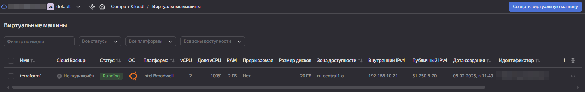
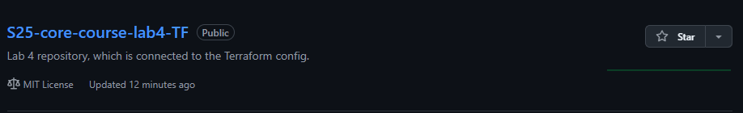
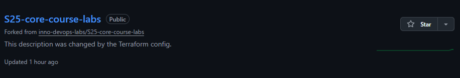
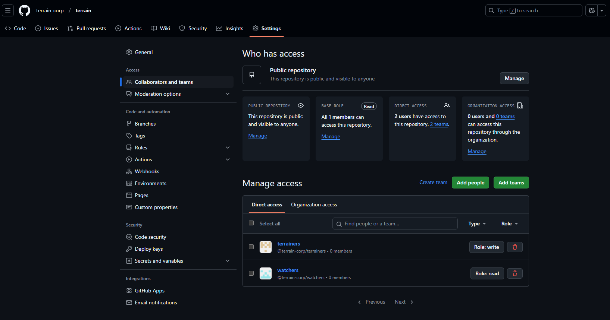

# Terraform

## Best practices

- Tokens are hidden in environment variables, either in `.tfvars` or command line environment.
- Tokens that are issued for the Terraform are containing only necessary permissions to prevent dangerous consequences if the token is leaked
- The `terraform` folder is structured well: all terraform configs are separated from each other by folders: `docker`, `yandex-cloud` and `github`
- Terraform files are named logically: `main.tf`, `variables.tf`, `outputs.tf`
- Before running the `terraform apply`, I always ran `terraform fmt` and `terraform validate` to ensure that terraform config is valid before its application.
- Resource type is not repeated in resource name (not partially, nor completely)
- Values that can be passed via variables are not hardcoded
- Resource modules are plain as much as possible
- `tfstate` is not managed by `git`

## Docker Infrastructure

### `terraform state list`

```powershell
> terraform state list

docker_container.nginx
docker_image.nginx
```

### `terraform state show`

- `docker_container.nginx`

```powershell
> terraform state show docker_container.nginx

# docker_container.nginx:
resource "docker_container" "nginx" {
    attach                                      = false
    bridge                                      = null
    command                                     = [
        "nginx",
        "-g",
        "daemon off;",
    ]
    container_read_refresh_timeout_milliseconds = 15000
    cpu_set                                     = null
    cpu_shares                                  = 0
    domainname                                  = null
    entrypoint                                  = [
        "/docker-entrypoint.sh",
    ]
    env                                         = []
    hostname                                    = "a74bd3073bcc"
    id                                          = "a74bd3073bcce2e75eac709500f6dbfa43c61109174967796ccb97504e2df874"
    image                                       = "sha256:97662d24417b316f60607afbca9f226a2ba58f09d642f27b8e197a89859ddc8e"
    init                                        = false
    ipc_mode                                    = "private"
    log_driver                                  = "json-file"
    logs                                        = false
    max_retry_count                             = 0
    memory                                      = 0
    memory_swap                                 = 0
    must_run                                    = true
    name                                        = "nginx_container"
    network_data                                = [
        {
            gateway                   = "172.17.0.1"
            global_ipv6_address       = null
            global_ipv6_prefix_length = 0
            ip_address                = "172.17.0.2"
            ip_prefix_length          = 16
            ipv6_gateway              = null
            mac_address               = "02:42:ac:11:00:02"
            network_name              = "bridge"
        },
    ]
    network_mode                                = "bridge"
    pid_mode                                    = null
    privileged                                  = false
    publish_all_ports                           = false
    read_only                                   = false
    remove_volumes                              = true
    restart                                     = "no"
    rm                                          = false
    runtime                                     = "runc"
    security_opts                               = []
    shm_size                                    = 64
    start                                       = true
    stdin_open                                  = false
    stop_signal                                 = "SIGQUIT"
    stop_timeout                                = 0
    tty                                         = false
    user                                        = null
    userns_mode                                 = null
    wait                                        = false
    wait_timeout                                = 60
    working_dir                                 = null

    ports {
        external = 8000
        internal = 80
        ip       = "0.0.0.0"
        protocol = "tcp"
    }
}
```

- `docker_image.nginx`

```powershell
> terraform state show docker_image.nginx

# docker_image.nginx:
resource "docker_image" "nginx" {
    id           = "sha256:97662d24417b316f60607afbca9f226a2ba58f09d642f27b8e197a89859ddc8enginx:latest"
    image_id     = "sha256:97662d24417b316f60607afbca9f226a2ba58f09d642f27b8e197a89859ddc8e"
    keep_locally = false
    name         = "nginx:latest"
    repo_digest  = "nginx@sha256:91734281c0ebfc6f1aea979cffeed5079cfe786228a71cc6f1f46a228cde6e34"
}
```

### `terraform apply`

A part of the log with applied changes is documented here:

```powershell
> terraform apply

Terraform used the selected providers to generate the following execution plan. Resource actions are indicated with the following symbols:
  + create

Terraform will perform the following actions:

  # docker_container.nginx will be created
  + resource "docker_container" "nginx" {
      + attach                                      = false
      + bridge                                      = (known after apply)
      + command                                     = (known after apply)
      + container_logs                              = (known after apply)
      + container_read_refresh_timeout_milliseconds = 15000
      + entrypoint                                  = (known after apply)
      + env                                         = (known after apply)
      + exit_code                                   = (known after apply)
      + hostname                                    = (known after apply)
      + id                                          = (known after apply)
      + image                                       = (known after apply)
      + init                                        = (known after apply)
      + ipc_mode                                    = (known after apply)
      + log_driver                                  = (known after apply)
      + logs                                        = false
      + must_run                                    = true
      + name                                        = "nginx_container"
      + network_data                                = (known after apply)
      + read_only                                   = false
      + remove_volumes                              = true
      + restart                                     = "no"
      + rm                                          = false
      + runtime                                     = (known after apply)
      + security_opts                               = (known after apply)
      + shm_size                                    = (known after apply)
      + start                                       = true
      + stdin_open                                  = false
      + stop_signal                                 = (known after apply)
      + stop_timeout                                = (known after apply)
      + tty                                         = false
      + wait                                        = false
      + wait_timeout                                = 60

      + healthcheck (known after apply)

      + labels (known after apply)

      + ports {
          + external = 8000
          + internal = 80
          + ip       = "0.0.0.0"
          + protocol = "tcp"
        }
    }

  # docker_image.nginx will be created
  + resource "docker_image" "nginx" {
      + id           = (known after apply)
      + image_id     = (known after apply)
      + keep_locally = false
      + name         = "nginx:latest"
      + repo_digest  = (known after apply)
    }

Plan: 2 to add, 0 to change, 0 to destroy.

Changes to Outputs:
  + container_id = (known after apply)
  + image_id     = (known after apply)

Do you want to perform these actions?
  Terraform will perform the actions described above.
  Only 'yes' will be accepted to approve.

  Enter a value: yes

docker_image.nginx: Creating...
docker_image.nginx: Creation complete after 10s [id=sha256:97662d24417b316f60607afbca9f226a2ba58f09d642f27b8e197a89859ddc8enginx:latest]
docker_container.nginx: Creating...
docker_container.nginx: Creation complete after 2s [id=a74bd3073bcce2e75eac709500f6dbfa43c61109174967796ccb97504e2df874]

Apply complete! Resources: 2 added, 0 changed, 0 destroyed.

Outputs:

container_id = "a74bd3073bcce2e75eac709500f6dbfa43c61109174967796ccb97504e2df874"
image_id = "sha256:97662d24417b316f60607afbca9f226a2ba58f09d642f27b8e197a89859ddc8enginx:latest"
```

### `terraform output`

```powershell
> terraform output

container_id = "a74bd3073bcce2e75eac709500f6dbfa43c61109174967796ccb97504e2df874"
image_id = "sha256:97662d24417b316f60607afbca9f226a2ba58f09d642f27b8e197a89859ddc8enginx:latest"
```

## Yandex Cloud Infrastructure

1. I have created an account on [Yandex Cloud](https://cloud.yandex.com/)
2. There is one available free-tier option: a grant for 1000₽ that may be spent for virtual machines, which are suitable for this lab.
   > During the whole process of building a Yandex Cloud Infrastructure, I have followed the official [Yandex Quickstart Guide](https://yandex.cloud/en-ru/docs/tutorials/infrastructure-management/terraform-quickstart#linux_1).
3. To begin the setup, we need to create a [service account](https://yandex.cloud/en/docs/iam/concepts/users/service-accounts) via Identity and Access Management.

- I have chosen the folder where I wanted to create a service account. In my particular case, it was a `default` folder.
- Then I clicked the **Identity and Access Management** service in the service list
- Then I clicked the **Create service account** button.
- In the modal I specified the desired name, description, and have chosen the `editor` role and created the account.
  > **CAVEAT:** do not forget to set roles for a service account! Service account requires at least an `editor` role to have possibility to create a resources inside our folder.

4. Then we need to create [an authorized key](https://yandex.cloud/en/docs/iam/concepts/authorization/key) for the brand new service account.

The command I entered is:

```powershell
yc iam key create \
  --service-account-id aje***************** \
  --folder-name default \
  --output key.json
```

where:

- `service-account-id` is an identifier of service account
- `folder-name` is the name of folder where the service account is created. In my case it is `default`
- `output` is the name of output file, which will contain this authorized key.

The output:

```powershell
id: aje*****************
service_account_id: aje*****************
created_at: "2025-06-02T10:57:43.479156798Z"
key_algorithm: RSA_2048
```

5. Then I have created the CLI profile to perform operations as a service account.

```powershell
yc config profile create terraform_cli
```

The output:

```powershell
Profile 'terraform_cli' created and activated
```

6. Also we need to set the profile configuration.

To do so, I used the following commands:

```powershell
yc config set service-account-key key.json
yc config set cloud-id b1g*****************
yc config set folder-id b1g*****************
```

where:

- `service-account-key` is a file with authorized key of service account
- `cloud-id` is the identifier of a cloud
- `folder-id` is the identifier of a folder (in my case `default`)

7. Then I have added the authentication data from the previous step to the environment variables.
   Since I am using Windows as my primary OS, I did it in Powershell:

```powershell
$Env:YC_TOKEN=$(yc iam create-token)
$Env:YC_CLOUD_ID=$(yc config get cloud-id)
$Env:YC_FOLDER_ID=$(yc config get folder-id)
```

where:

- `YC_TOKEN` is IAM-token.
- `YC_CLOUD_ID` is the identifier of a cloud
- `YC_FOLDER_ID` is the identifier of a folder

8. Then we need to configure the Terraform provider.
   If you have previous provider (I did not have one), then you need to save its preferences.

```powershell
mv $env:APPDATA/terraform.rc $env:APPDATA/terraform.rc.old
```

I created the file `terraform.rc` and added the following block (which specifying the official Terraform mirror).

```powershell
provider_installation {
  network_mirror {
    url = "https://terraform-mirror.yandexcloud.net/"
    include = ["registry.terraform.io/*/*"]
  }
  direct {
    exclude = ["registry.terraform.io/*/*"]
  }
}
```

9. Then I generated the SSH key for the user:

```powershell
ssh-keygen -t ed25519 -C "yc"
```

10. Now we can setup the Terraform configuration file.
    I have used the template specified in the guide, but it may be changed according to our needs.

- the provider is Yandex Cloud
- the availability zone of the provider is `ru-central1-a`

The image list is provided by Yandex Cloud Marketplace, which is available by this command:

```powershell
yc compute image list --folder-id standard-images
```

I have decided to use common LTS image - `ubuntu-2204-lts`, which has this ID: `fd85u0rct32prepgjlv0`.

### Resources created

The YC Disk is connected to YC Instance.
The YC Instance is connected to YVPC Subnet.
The YVPC Subnet is connected to YVPC Network.

The created VM has two IP addresses: internal and external.

- Yandex Compute Disk (HDD, 20GB, `ru-central1-a`, `ubuntu-2204-lts` image)
- Yandex Compute Instance (CPUx2, 2GB RAM)
- Yandex VPC Network
- Yandex VPC Subnet (`ru-central1-a`)

> Additionally, for the VM it is necessary to setup the **user metadata** (in the resource config I specified the metadata field and provided path to the `user_metadata.txt` file). It contains the public SSH key generated earlier and username for the user on this VM.

10. Then I initiated the provider using `terraform init`.

11. Format and validate the Terraform configuration: `terraform fmt` and `terraform validate`.

12. Then let's perform the check: `terraform plan`.

Output:

```powershell
> terraform plan

Terraform used the selected providers to generate the following execution plan. Resource actions are indicated with the following symbols:
  + create

Terraform will perform the following actions:

  # yandex_compute_disk.boot-disk-1 will be created
  + resource "yandex_compute_disk" "boot-disk-1" {
      + block_size  = 4096
      + created_at  = (known after apply)
      + folder_id   = (known after apply)
      + id          = (known after apply)
      + image_id    = "fd85u0rct32prepgjlv0"
      + name        = "boot-disk-1"
      + product_ids = (known after apply)
      + size        = 20
      + status      = (known after apply)
      + type        = "network-hdd"
      + zone        = "ru-central1-a"

      + disk_placement_policy (known after apply)

      + hardware_generation (known after apply)
    }

  # yandex_compute_instance.vm-1 will be created
  + resource "yandex_compute_instance" "vm-1" {
      + created_at                = (known after apply)
      + folder_id                 = (known after apply)
      + fqdn                      = (known after apply)
      + gpu_cluster_id            = (known after apply)
      + hardware_generation       = (known after apply)
      + hostname                  = (known after apply)
      + id                        = (known after apply)
      + maintenance_grace_period  = (known after apply)
      + maintenance_policy        = (known after apply)
      + metadata                  = {
          + "user-data" = <<-EOT
                #cloud-config
                users:
                  - name: yc_user
                    groups: sudo
                    shell: /bin/bash
                    sudo: 'ALL=(ALL) NOPASSWD:ALL'
                    ssh_authorized_keys:
                      - ssh-ed25519 AAAAC3NzaC1lZDI1NTE5AAAAICR8jQL9Pv6VF+HBwcSo79zvIB+24iRTNjTmGbGz1TOI
            EOT
        }
      + name                      = "terraform1"
      + network_acceleration_type = "standard"
      + platform_id               = "standard-v1"
      + service_account_id        = (known after apply)
      + status                    = (known after apply)
      + zone                      = (known after apply)

      + boot_disk {
          + auto_delete = true
          + device_name = (known after apply)
          + disk_id     = (known after apply)
          + mode        = (known after apply)

          + initialize_params (known after apply)
        }

      + metadata_options (known after apply)

      + network_interface {
          + index              = (known after apply)
          + ip_address         = (known after apply)
          + ipv4               = true
          + ipv6               = (known after apply)
          + ipv6_address       = (known after apply)
          + mac_address        = (known after apply)
          + nat                = true
          + nat_ip_address     = (known after apply)
          + nat_ip_version     = (known after apply)
          + security_group_ids = (known after apply)
          + subnet_id          = (known after apply)
        }

      + placement_policy (known after apply)

      + resources {
          + core_fraction = 100
          + cores         = 2
          + memory        = 2
        }

      + scheduling_policy (known after apply)
    }

  # yandex_vpc_network.network-1 will be created
  + resource "yandex_vpc_network" "network-1" {
      + created_at                = (known after apply)
      + default_security_group_id = (known after apply)
      + folder_id                 = (known after apply)
      + id                        = (known after apply)
      + labels                    = (known after apply)
      + name                      = "network1"
      + subnet_ids                = (known after apply)
    }

  # yandex_vpc_subnet.subnet-1 will be created
  + resource "yandex_vpc_subnet" "subnet-1" {
      + created_at     = (known after apply)
      + folder_id      = (known after apply)
      + id             = (known after apply)
      + labels         = (known after apply)
      + name           = "subnet1"
      + network_id     = (known after apply)
      + v4_cidr_blocks = [
          + "192.168.10.0/24",
        ]
      + v6_cidr_blocks = (known after apply)
      + zone           = "ru-central1-a"
    }

Plan: 4 to add, 0 to change, 0 to destroy.

Changes to Outputs:
  + external_ip_address_vm_1 = (known after apply)
  + internal_ip_address_vm_1 = (known after apply)
```

13. The configuration is ok, then I write `terraform apply` and confirm my choice.

Output:

```powershell
> terraform apply

Terraform used the selected providers to generate the following execution plan. Resource actions are indicated with the following symbols:
  + create

Terraform will perform the following actions:

  # yandex_compute_disk.boot-disk-1 will be created
  + resource "yandex_compute_disk" "boot-disk-1" {
      + block_size  = 4096
      + created_at  = (known after apply)
      + folder_id   = (known after apply)
      + id          = (known after apply)
      + image_id    = "fd85u0rct32prepgjlv0"
      + name        = "boot-disk-1"
      + product_ids = (known after apply)
      + size        = 20
      + status      = (known after apply)
      + type        = "network-hdd"
      + zone        = "ru-central1-a"

      + disk_placement_policy (known after apply)

      + hardware_generation (known after apply)
    }

  # yandex_compute_instance.vm-1 will be created
  + resource "yandex_compute_instance" "vm-1" {
      + created_at                = (known after apply)
      + folder_id                 = (known after apply)
      + fqdn                      = (known after apply)
      + gpu_cluster_id            = (known after apply)
      + hardware_generation       = (known after apply)
      + hostname                  = (known after apply)
      + id                        = (known after apply)
      + maintenance_grace_period  = (known after apply)
      + maintenance_policy        = (known after apply)
      + metadata                  = {
          + "user-data" = <<-EOT
                #cloud-config
                users:
                  - name: yc_user
                    groups: sudo
                    shell: /bin/bash
                    sudo: 'ALL=(ALL) NOPASSWD:ALL'
                    ssh_authorized_keys:
                      - ssh-ed25519 AAAAC3NzaC1lZDI1NTE5AAAAICR8jQL9Pv6VF+HBwcSo79zvIB+24iRTNjTmGbGz1TOI
            EOT
        }
      + name                      = "terraform1"
      + network_acceleration_type = "standard"
      + platform_id               = "standard-v1"
      + service_account_id        = (known after apply)
      + status                    = (known after apply)
      + zone                      = (known after apply)

      + boot_disk {
          + auto_delete = true
          + device_name = (known after apply)
          + disk_id     = (known after apply)
          + mode        = (known after apply)

          + initialize_params (known after apply)
        }

      + metadata_options (known after apply)

      + network_interface {
          + index              = (known after apply)
          + ip_address         = (known after apply)
          + ipv4               = true
          + ipv6               = (known after apply)
          + ipv6_address       = (known after apply)
          + mac_address        = (known after apply)
          + nat                = true
          + nat_ip_address     = (known after apply)
          + nat_ip_version     = (known after apply)
          + security_group_ids = (known after apply)
          + subnet_id          = (known after apply)
        }

      + placement_policy (known after apply)

      + resources {
          + core_fraction = 100
          + cores         = 2
          + memory        = 2
        }

      + scheduling_policy (known after apply)
    }

  # yandex_vpc_network.network-1 will be created
  + resource "yandex_vpc_network" "network-1" {
      + created_at                = (known after apply)
      + default_security_group_id = (known after apply)
      + folder_id                 = (known after apply)
      + id                        = (known after apply)
      + labels                    = (known after apply)
      + name                      = "network1"
      + subnet_ids                = (known after apply)
    }

  # yandex_vpc_subnet.subnet-1 will be created
  + resource "yandex_vpc_subnet" "subnet-1" {
      + created_at     = (known after apply)
      + folder_id      = (known after apply)
      + id             = (known after apply)
      + labels         = (known after apply)
      + name           = "subnet1"
      + network_id     = (known after apply)
      + v4_cidr_blocks = [
          + "192.168.10.0/24",
        ]
      + v6_cidr_blocks = (known after apply)
      + zone           = "ru-central1-a"
    }

Plan: 4 to add, 0 to change, 0 to destroy.

Changes to Outputs:
  + external_ip_address_vm_1 = (known after apply)
  + internal_ip_address_vm_1 = (known after apply)

Do you want to perform these actions?
  Terraform will perform the actions described above.
  Only 'yes' will be accepted to approve.

  Enter a value: yes

yandex_vpc_network.network-1: Creating...
yandex_compute_disk.boot-disk-1: Creating...
yandex_vpc_network.network-1: Creation complete after 3s [id=enpnm2vjefqcj2e9ljkm]
yandex_vpc_subnet.subnet-1: Creating...
yandex_vpc_subnet.subnet-1: Creation complete after 0s [id=e9b9lsrbvt7oeckhrtvr]
yandex_compute_disk.boot-disk-1: Still creating... [10s elapsed]
yandex_compute_disk.boot-disk-1: Creation complete after 11s [id=fhmn9ik3sph8nuoq4tis]
yandex_compute_instance.vm-1: Creating...
yandex_compute_instance.vm-1: Still creating... [10s elapsed]
yandex_compute_instance.vm-1: Still creating... [20s elapsed]
yandex_compute_instance.vm-1: Still creating... [30s elapsed]
yandex_compute_instance.vm-1: Still creating... [40s elapsed]
yandex_compute_instance.vm-1: Still creating... [50s elapsed]
yandex_compute_instance.vm-1: Creation complete after 58s [id=fhmlokreq2o8a6bl6jvr]

Apply complete! Resources: 4 added, 0 changed, 0 destroyed.

Outputs:

external_ip_address_vm_1 = "51.250.8.70"
internal_ip_address_vm_1 = "192.168.10.21"
```

14. Let's check the state list and separate states:

```powershell
> terraform state list

yandex_compute_disk.boot-disk-1
yandex_compute_instance.vm-1
yandex_vpc_network.network-1
yandex_vpc_subnet.subnet-1
```

- `yandex_compute_disk.boot-disk-1`

```powershell
> terraform state show yandex_compute_disk.boot-disk-1

# yandex_compute_disk.boot-disk-1:
resource "yandex_compute_disk" "boot-disk-1" {
    block_size  = 4096
    created_at  = "2025-02-06T08:49:03Z"
    description = null
    folder_id   = "b1g*****************"
    id          = "fhmn9ik3sph8nuoq4tis"
    image_id    = "fd85u0rct32prepgjlv0"
    name        = "boot-disk-1"
    product_ids = [
        "f2ef01lju2nsansfdahf",
    ]
    size        = 20
    snapshot_id = null
    status      = "ready"
    type        = "network-hdd"
    zone        = "ru-central1-a"

    disk_placement_policy {
        disk_placement_group_id = null
    }

    hardware_generation {
        legacy_features {
            pci_topology = "PCI_TOPOLOGY_V1"
        }
    }
}
```

- `yandex_compute_instance.vm-1`

```powershell
# yandex_compute_instance.vm-1:
resource "yandex_compute_instance" "vm-1" {
    created_at                = "2025-02-06T08:49:14Z"
    description               = null
    folder_id                 = "b1g*****************"
    fqdn                      = "fhmlokreq2o8a6bl6jvr.auto.internal"
    gpu_cluster_id            = null
    hardware_generation       = [
        {
            generation2_features = []
            legacy_features      = [
                {
                    pci_topology = "PCI_TOPOLOGY_V1"
                },
            ]
        },
    ]
    hostname                  = null
    id                        = "fhmlokreq2o8a6bl6jvr"
    maintenance_grace_period  = null
    metadata                  = {
        "user-data" = <<-EOT
            #cloud-config
            users:
              - name: yc_user
                groups: sudo
                shell: /bin/bash
                sudo: 'ALL=(ALL) NOPASSWD:ALL'
                ssh_authorized_keys:
                  - ssh-ed25519 AAAAC3NzaC1lZDI1NTE5AAAAICR8jQL9Pv6VF+HBwcSo79zvIB+24iRTNjTmGbGz1TOI
        EOT
    }
    name                      = "terraform1"
    network_acceleration_type = "standard"
    platform_id               = "standard-v1"
    service_account_id        = null
    status                    = "running"
    zone                      = "ru-central1-a"

    boot_disk {
        auto_delete = true
        device_name = "fhmn9ik3sph8nuoq4tis"
        disk_id     = "fhmn9ik3sph8nuoq4tis"
        mode        = "READ_WRITE"

        initialize_params {
            block_size  = 4096
            description = null
            image_id    = "fd85u0rct32prepgjlv0"
            kms_key_id  = null
            name        = "boot-disk-1"
            size        = 20
            snapshot_id = null
            type        = "network-hdd"
        }
    }

    metadata_options {
        aws_v1_http_endpoint = 1
        aws_v1_http_token    = 2
        gce_http_endpoint    = 1
        gce_http_token       = 1
    }

    network_interface {
        index              = 0
        ip_address         = "192.168.10.21"
        ipv4               = true
        ipv6               = false
        ipv6_address       = null
        mac_address        = "d0:0d:15:c5:36:ed"
        nat                = true
        nat_ip_address     = "51.250.8.70"
        nat_ip_version     = "IPV4"
        security_group_ids = []
        subnet_id          = "e9b9lsrbvt7oeckhrtvr"
    }

    placement_policy {
        host_affinity_rules       = []
        placement_group_id        = null
        placement_group_partition = 0
    }

    resources {
        core_fraction = 100
        cores         = 2
        gpus          = 0
        memory        = 2
    }

    scheduling_policy {
        preemptible = false
    }
}
```

- `yandex_vpc_network.network-1`

```powershell
> terraform state show yandex_vpc_network.network-1

# yandex_vpc_network.network-1:
resource "yandex_vpc_network" "network-1" {
    created_at                = "2025-02-06T08:49:03Z"
    default_security_group_id = "enpm336la6u0c186ikf7"
    description               = null
    folder_id                 = "b1g*****************"
    id                        = "enpnm2vjefqcj2e9ljkm"
    labels                    = {}
    name                      = "network1"
    subnet_ids                = []
}
```

- `yandex_vpc_subnet.subnet-1`

```powershell
> terraform state show yandex_vpc_subnet.subnet-1

# yandex_vpc_subnet.subnet-1:
resource "yandex_vpc_subnet" "subnet-1" {
    created_at     = "2025-02-06T08:49:05Z"
    description    = null
    folder_id      = "b1g*****************"
    id             = "e9b9lsrbvt7oeckhrtvr"
    labels         = {}
    name           = "subnet1"
    network_id     = "enpnm2vjefqcj2e9ljkm"
    route_table_id = null
    v4_cidr_blocks = [
        "192.168.10.0/24",
    ]
    v6_cidr_blocks = []
    zone           = "ru-central1-a"
}
```

15. Finally, let's check the `terraform output`:

```powershell
> terraform output

external_ip_address_vm_1 = "51.250.8.70"
internal_ip_address_vm_1 = "192.168.10.21"
```



There were not any significant challenges, except for my forgetfullness to give the `editor` role to service account.

## Terraform for GitHub

I prepared `main.tf` file that contains:

- Repository name - `S25-core-course-lab4-TF`
- Repository description - `Lab 4 repository, which is connected to the Terraform config.`
- Visibility settings - `public`
- Default branch - `master`
- Branch protection rules for the default branch
  - At least 1 approving review is required for pull requests
  - All conversations on code must be resolved before a pull request can be merged
  - Status checks are enforced for repository administrators
- I avoided placing my token as a variable in the code, and I utilized `.tfvars` for this purpose.
  > **Note:** you need to use `-var-file` option to specify the path for `.tfvars` file.

Let's plan the infrastracture change:

```powershell
> terraform plan -var-file=".tfvars"

Terraform used the selected providers to generate the following execution plan. Resource actions are indicated with the following symbols:
  + create

Terraform will perform the following actions:

  # github_branch_default.master will be created
  + resource "github_branch_default" "master" {
      + branch     = "master"
      + etag       = (known after apply)
      + id         = (known after apply)
      + rename     = false
      + repository = "S25-core-course-lab4-TF"
    }

  # github_branch_protection.default will be created
  + resource "github_branch_protection" "default" {
      + allows_deletions                = false
      + allows_force_pushes             = false
      + enforce_admins                  = true
      + id                              = (known after apply)
      + lock_branch                     = false
      + pattern                         = "master"
      + repository_id                   = (known after apply)
      + require_conversation_resolution = true
      + require_signed_commits          = false
      + required_linear_history         = false

      + required_pull_request_reviews {
          + require_last_push_approval      = false
          + required_approving_review_count = 1
        }
    }

  # github_repository.repo will be created
  + resource "github_repository" "repo" {
      + allow_auto_merge            = false
      + allow_merge_commit          = true
      + allow_rebase_merge          = true
      + allow_squash_merge          = true
      + archived                    = false
      + auto_init                   = true
      + default_branch              = (known after apply)
      + delete_branch_on_merge      = false
      + description                 = "Lab 4 repository, which is connected to the Terraform config."
      + etag                        = (known after apply)
      + full_name                   = (known after apply)
      + git_clone_url               = (known after apply)
      + has_issues                  = true
      + has_wiki                    = true
      + html_url                    = (known after apply)
      + http_clone_url              = (known after apply)
      + id                          = (known after apply)
      + license_template            = "mit"
      + merge_commit_message        = "PR_TITLE"
      + merge_commit_title          = "MERGE_MESSAGE"
      + name                        = "S25-core-course-lab4-TF"
      + node_id                     = (known after apply)
      + primary_language            = (known after apply)
      + private                     = (known after apply)
      + repo_id                     = (known after apply)
      + squash_merge_commit_message = "COMMIT_MESSAGES"
      + squash_merge_commit_title   = "COMMIT_OR_PR_TITLE"
      + ssh_clone_url               = (known after apply)
      + svn_url                     = (known after apply)
      + topics                      = (known after apply)
      + visibility                  = "public"
      + web_commit_signoff_required = false

      + security_and_analysis (known after apply)
    }

Plan: 3 to add, 0 to change, 0 to destroy.
```

Finally, let's apply this changes!

```powershell
> terraform apply -var-file=".tfvars"

Terraform used the selected providers to generate the following execution plan. Resource actions are indicated with the following symbols:
  + create

Terraform will perform the following actions:

  # github_branch.master will be created
  + resource "github_branch" "master" {
      + branch        = "master"
      + etag          = (known after apply)
      + id            = (known after apply)
      + ref           = (known after apply)
      + repository    = "S25-core-course-lab4-TF"
      + sha           = (known after apply)
      + source_branch = "main"
      + source_sha    = (known after apply)
    }

  # github_branch_default.default will be created
  + resource "github_branch_default" "default" {
      + branch     = "master"
      + etag       = (known after apply)
      + id         = (known after apply)
      + rename     = false
      + repository = "S25-core-course-lab4-TF"
    }

  # github_branch_protection.default will be created
  + resource "github_branch_protection" "default" {
      + allows_deletions                = false
      + allows_force_pushes             = false
      + enforce_admins                  = true
      + id                              = (known after apply)
      + lock_branch                     = false
      + pattern                         = "master"
      + repository_id                   = (known after apply)
      + require_conversation_resolution = true
      + require_signed_commits          = false
      + required_linear_history         = false

      + required_pull_request_reviews {
          + require_last_push_approval      = false
          + required_approving_review_count = 1
        }
    }

  # github_repository.repo will be created
  + resource "github_repository" "repo" {
      + allow_auto_merge            = false
      + allow_merge_commit          = true
      + allow_rebase_merge          = true
      + allow_squash_merge          = true
      + archived                    = false
      + auto_init                   = true
      + default_branch              = (known after apply)
      + delete_branch_on_merge      = false
      + description                 = "Lab 4 repository, which is connected to the Terraform config."
      + etag                        = (known after apply)
      + full_name                   = (known after apply)
      + git_clone_url               = (known after apply)
      + has_issues                  = true
      + has_wiki                    = true
      + html_url                    = (known after apply)
      + http_clone_url              = (known after apply)
      + id                          = (known after apply)
      + license_template            = "mit"
      + merge_commit_message        = "PR_TITLE"
      + merge_commit_title          = "MERGE_MESSAGE"
      + name                        = "S25-core-course-lab4-TF"
      + node_id                     = (known after apply)
      + primary_language            = (known after apply)
      + private                     = (known after apply)
      + repo_id                     = (known after apply)
      + squash_merge_commit_message = "COMMIT_MESSAGES"
      + squash_merge_commit_title   = "COMMIT_OR_PR_TITLE"
      + ssh_clone_url               = (known after apply)
      + svn_url                     = (known after apply)
      + topics                      = (known after apply)
      + visibility                  = "public"
      + web_commit_signoff_required = false

      + security_and_analysis (known after apply)
    }

Plan: 4 to add, 0 to change, 0 to destroy.

Do you want to perform these actions?
  Terraform will perform the actions described above.
  Only 'yes' will be accepted to approve.

  Enter a value: yes

github_repository.repo: Creating...
github_repository.repo: Creation complete after 5s [id=S25-core-course-lab4-TF]
github_branch.master: Creating...
github_branch.master: Creation complete after 2s [id=S25-core-course-lab4-TF:master]
github_branch_default.default: Creating...
github_branch_default.default: Creation complete after 2s [id=S25-core-course-lab4-TF]
github_branch_protection.default: Creating...
github_branch_protection.default: Creation complete after 4s [id=BPR_kwDON1S51s4Dik7k]

Apply complete! Resources: 4 added, 0 changed, 0 destroyed.
```

The repository is created and may be accessed by thee [link](https://github.com/danmaninc/S25-core-course-lab4-TF).


Now, let's import the existing repository with lab submissions into Terraform.

I created the resource with the same name as the respository inside the Terraform config.

```tf
resource "github_repository" "S25-core-course-labs" {
  name = "S25-core-course-labs"
}
```

Then let's import the GitHub repository.

```powershell
> terraform import -var-file=".tfvars" "github_repository.S25-core-course-labs" "S25-core-course-labs"

github_repository.S25-core-course-labs: Importing from ID "S25-core-course-labs"...
github_repository.S25-core-course-labs: Import prepared!
  Prepared github_repository for import
github_repository.S25-core-course-labs: Refreshing state... [id=S25-core-course-labs]

Import successful!

The resources that were imported are shown above. These resources are now in
your Terraform state and will henceforth be managed by Terraform.
```

Finally, let's make some change. For example, I will change the description of the repository.

`This description was changed by the Terraform config.`

Let's plan the change:

```powershell
> terraform plan -var-file=".tfvars"

Terraform used the selected providers to generate the following execution plan. Resource actions are indicated with the following symbols:
  ~ update in-place

Terraform will perform the following actions:

  # github_repository.S25-core-course-labs will be updated in-place
  ~ resource "github_repository" "S25-core-course-labs" {
      + description                 = "This description was changed by the Terraform config."
      - has_downloads               = true -> null
      - has_projects                = true -> null
      - has_wiki                    = true -> null
        id                          = "S25-core-course-labs"
        name                        = "S25-core-course-labs"
        # (32 unchanged attributes hidden)

        # (1 unchanged block hidden)
    }

Plan: 0 to add, 1 to change, 0 to destroy.
```

Then, let's apply it.

```powershell
> terraform apply

Terraform used the selected providers to generate the following execution plan. Resource actions are indicated with the following symbols:
  ~ update in-place

Terraform will perform the following actions:

  # github_repository.S25-core-course-labs will be updated in-place
  ~ resource "github_repository" "S25-core-course-labs" {
      + description                 = "This description was changed by the Terraform config."
      - has_downloads               = true -> null
      - has_projects                = true -> null
      - has_wiki                    = true -> null
        id                          = "S25-core-course-labs"
        name                        = "S25-core-course-labs"
        # (32 unchanged attributes hidden)

        # (1 unchanged block hidden)
    }

Plan: 0 to add, 1 to change, 0 to destroy.

Do you want to perform these actions?
  Terraform will perform the actions described above.
  Only 'yes' will be accepted to approve.

  Enter a value: yes

github_repository.S25-core-course-labs: Modifying... [id=S25-core-course-labs]
github_repository.S25-core-course-labs: Modifications complete after 2s [id=S25-core-course-labs]

Apply complete! Resources: 0 added, 1 changed, 0 destroyed.
```



## Bonus Task: Adding Teams

I have created an organization in GitHub [check out](https://github.com/terrain-corp).
Let's create another configuration and add new teams to this organization. Therefore, I initialize the Terraform again (`terraform init`).

I will add two teams:

- _terrainers_ - a team of people who can push to the repository
- _watchers_ - a team of people who can only pull the repository

Let's plan and apply the Terraform configuration.

Planning:

```powershell
> terraform plan -var-file=".tfvars"

Terraform used the selected providers to generate the following execution plan. Resource actions are indicated with the following symbols:
  + create

Terraform will perform the following actions:

  # github_branch.master will be created
  + resource "github_branch" "master" {
      + branch        = "master"
      + etag          = (known after apply)
      + id            = (known after apply)
      + ref           = (known after apply)
      + repository    = "terrain"
      + sha           = (known after apply)
      + source_branch = "main"
      + source_sha    = (known after apply)
    }

  # github_branch_default.default will be created
  + resource "github_branch_default" "default" {
      + branch     = "master"
      + etag       = (known after apply)
      + id         = (known after apply)
      + rename     = false
      + repository = "terrain"
    }

  # github_branch_protection.default will be created
  + resource "github_branch_protection" "default" {
      + allows_deletions                = false
      + allows_force_pushes             = false
      + enforce_admins                  = true
      + id                              = (known after apply)
      + lock_branch                     = false
      + pattern                         = "master"
      + repository_id                   = (known after apply)
      + require_conversation_resolution = true
      + require_signed_commits          = false
      + required_linear_history         = false

      + required_pull_request_reviews {
          + require_last_push_approval      = false
          + required_approving_review_count = 1
        }
    }

  # github_repository.repo will be created
  + resource "github_repository" "repo" {
      + allow_auto_merge            = false
      + allow_merge_commit          = true
      + allow_rebase_merge          = true
      + allow_squash_merge          = true
      + archived                    = false
      + auto_init                   = true
      + default_branch              = (known after apply)
      + delete_branch_on_merge      = false
      + description                 = "This is the terrain. Old one."
      + etag                        = (known after apply)
      + full_name                   = (known after apply)
      + git_clone_url               = (known after apply)
      + has_issues                  = true
      + has_wiki                    = true
      + html_url                    = (known after apply)
      + http_clone_url              = (known after apply)
      + id                          = (known after apply)
      + license_template            = "mit"
      + merge_commit_message        = "PR_TITLE"
      + merge_commit_title          = "MERGE_MESSAGE"
      + name                        = "terrain"
      + node_id                     = (known after apply)
      + primary_language            = (known after apply)
      + private                     = (known after apply)
      + repo_id                     = (known after apply)
      + squash_merge_commit_message = "COMMIT_MESSAGES"
      + squash_merge_commit_title   = "COMMIT_OR_PR_TITLE"
      + ssh_clone_url               = (known after apply)
      + svn_url                     = (known after apply)
      + topics                      = (known after apply)
      + visibility                  = "public"
      + web_commit_signoff_required = false

      + security_and_analysis (known after apply)
    }

  # github_team.terrainers will be created
  + resource "github_team" "terrainers" {
      + create_default_maintainer = false
      + description               = "Some cool team of terrainers who create terrains from the beginning of computer era."
      + etag                      = (known after apply)
      + id                        = (known after apply)
      + members_count             = (known after apply)
      + name                      = "terrainers"
      + node_id                   = (known after apply)
      + parent_team_read_id       = (known after apply)
      + parent_team_read_slug     = (known after apply)
      + privacy                   = "closed"
      + slug                      = (known after apply)
    }

  # github_team.watchers will be created
  + resource "github_team" "watchers" {
      + create_default_maintainer = false
      + description               = "Team of watchers who do nothing but watch"
      + etag                      = (known after apply)
      + id                        = (known after apply)
      + members_count             = (known after apply)
      + name                      = "watchers"
      + node_id                   = (known after apply)
      + parent_team_read_id       = (known after apply)
      + parent_team_read_slug     = (known after apply)
      + privacy                   = "closed"
      + slug                      = (known after apply)
    }

  # github_team_repository.terrainers will be created
  + resource "github_team_repository" "terrainers" {
      + etag       = (known after apply)
      + id         = (known after apply)
      + permission = "push"
      + repository = "terrain"
      + team_id    = (known after apply)
    }

  # github_team_repository.watchers will be created
  + resource "github_team_repository" "watchers" {
      + etag       = (known after apply)
      + id         = (known after apply)
      + permission = "pull"
      + repository = "terrain"
      + team_id    = (known after apply)
    }

Plan: 8 to add, 0 to change, 0 to destroy.
```

Applying:

```powershell
> terraform apply -var-file=".tfvars"

Terraform used the selected providers to generate the following execution plan. Resource actions are indicated with the following symbols:
  + create

Terraform will perform the following actions:

  # github_branch.master will be created
  + resource "github_branch" "master" {
      + branch        = "master"
      + etag          = (known after apply)
      + id            = (known after apply)
      + ref           = (known after apply)
      + repository    = "terrain"
      + sha           = (known after apply)
      + source_branch = "main"
      + source_sha    = (known after apply)
    }

  # github_branch_default.default will be created
  + resource "github_branch_default" "default" {
      + branch     = "master"
      + etag       = (known after apply)
      + id         = (known after apply)
      + rename     = false
      + repository = "terrain"
    }

  # github_branch_protection.default will be created
  + resource "github_branch_protection" "default" {
      + allows_deletions                = false
      + allows_force_pushes             = false
      + enforce_admins                  = true
      + id                              = (known after apply)
      + lock_branch                     = false
      + pattern                         = "master"
      + repository_id                   = (known after apply)
      + require_conversation_resolution = true
      + require_signed_commits          = false
      + required_linear_history         = false

      + required_pull_request_reviews {
          + require_last_push_approval      = false
          + required_approving_review_count = 1
        }
    }

  # github_repository.repo will be created
  + resource "github_repository" "repo" {
      + allow_auto_merge            = false
      + allow_merge_commit          = true
      + allow_rebase_merge          = true
      + allow_squash_merge          = true
      + archived                    = false
      + auto_init                   = true
      + default_branch              = (known after apply)
      + delete_branch_on_merge      = false
      + description                 = "This is the terrain. Old one."
      + etag                        = (known after apply)
      + full_name                   = (known after apply)
      + git_clone_url               = (known after apply)
      + has_issues                  = true
      + has_wiki                    = true
      + html_url                    = (known after apply)
      + http_clone_url              = (known after apply)
      + id                          = (known after apply)
      + license_template            = "mit"
      + merge_commit_message        = "PR_TITLE"
      + merge_commit_title          = "MERGE_MESSAGE"
      + name                        = "terrain"
      + node_id                     = (known after apply)
      + primary_language            = (known after apply)
      + private                     = (known after apply)
      + repo_id                     = (known after apply)
      + squash_merge_commit_message = "COMMIT_MESSAGES"
      + squash_merge_commit_title   = "COMMIT_OR_PR_TITLE"
      + ssh_clone_url               = (known after apply)
      + svn_url                     = (known after apply)
      + topics                      = (known after apply)
      + visibility                  = "public"
      + web_commit_signoff_required = false

      + security_and_analysis (known after apply)
    }

  # github_team.terrainers will be created
  + resource "github_team" "terrainers" {
      + create_default_maintainer = false
      + description               = "Some cool team of terrainers who create terrains from the beginning of computer era."
      + etag                      = (known after apply)
      + id                        = (known after apply)
      + members_count             = (known after apply)
      + name                      = "terrainers"
      + node_id                   = (known after apply)
      + parent_team_read_id       = (known after apply)
      + parent_team_read_slug     = (known after apply)
      + privacy                   = "closed"
      + slug                      = (known after apply)
    }

  # github_team.watchers will be created
  + resource "github_team" "watchers" {
      + create_default_maintainer = false
      + description               = "Team of watchers who do nothing but watch"
      + etag                      = (known after apply)
      + id                        = (known after apply)
      + members_count             = (known after apply)
      + name                      = "watchers"
      + node_id                   = (known after apply)
      + parent_team_read_id       = (known after apply)
      + parent_team_read_slug     = (known after apply)
      + privacy                   = "closed"
      + slug                      = (known after apply)
    }

  # github_team_repository.terrainers will be created
  + resource "github_team_repository" "terrainers" {
      + etag       = (known after apply)
      + id         = (known after apply)
      + permission = "push"
      + repository = "terrain"
      + team_id    = (known after apply)
    }

  # github_team_repository.watchers will be created
  + resource "github_team_repository" "watchers" {
      + etag       = (known after apply)
      + id         = (known after apply)
      + permission = "pull"
      + repository = "terrain"
      + team_id    = (known after apply)
    }

Plan: 8 to add, 0 to change, 0 to destroy.

Do you want to perform these actions?
  Terraform will perform the actions described above.
  Only 'yes' will be accepted to approve.

  Enter a value: yes

github_team.terrainers: Creating...
github_team.watchers: Creating...
github_repository.repo: Creating...
github_team.terrainers: Still creating... [10s elapsed]
github_team.watchers: Still creating... [10s elapsed]
github_repository.repo: Still creating... [10s elapsed]
github_team.terrainers: Creation complete after 13s [id=12128636]
github_team.watchers: Creation complete after 14s [id=12128637]
github_repository.repo: Creation complete after 14s [id=terrain]
github_team_repository.watchers: Creating...
github_team_repository.terrainers: Creating...
github_branch.master: Creating...
github_team_repository.watchers: Creation complete after 4s [id=12128637:terrain]
github_team_repository.terrainers: Creation complete after 4s [id=12128636:terrain]
github_branch.master: Creation complete after 6s [id=terrain:master]
github_branch_default.default: Creating...
github_branch_default.default: Creation complete after 1s [id=terrain]
github_branch_protection.default: Creating...
github_branch_protection.default: Creation complete after 5s [id=BPR_kwDON1VWZs4DilhA]

Apply complete! Resources: 8 added, 0 changed, 0 destroyed.
```

Then, we can see, that teams are added and have their own permissions:



Therefore, we successfully added new teams within organization via Terraform configuration.
