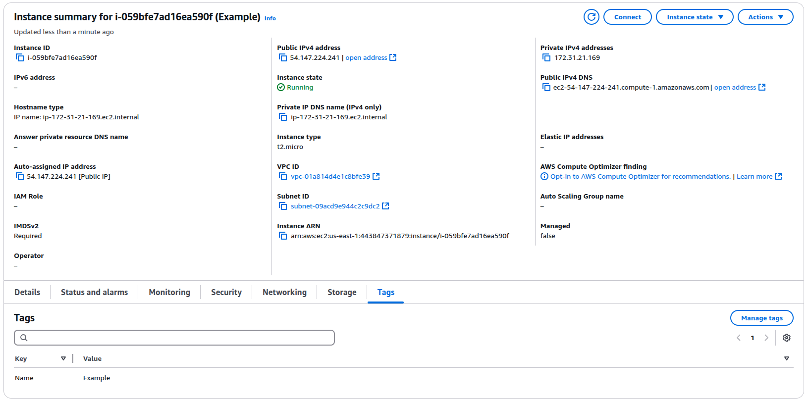

# Terraform
## Terraform Docker Infrastructure

### The output of `terraform state list`:
```sh
anas@anas-Legion ~/I/D/S/t/docker (lab4)> terraform state list
docker_container.nginx
docker_image.nginx
```

### The output of `terraform state show`:
```sh
anas@anas-Legion ~/I/D/S/t/docker (lab4)> terraform state show docker_container.nginx
# docker_container.nginx:
resource "docker_container" "nginx" {
    attach                                      = false
    bridge                                      = null
    command                                     = [
        "nginx",
        "-g",
        "daemon off;",
    ]
    container_read_refresh_timeout_milliseconds = 15000
    cpu_set                                     = null
    cpu_shares                                  = 0
    dns                                         = []
    dns_opts                                    = []
    dns_search                                  = []
    domainname                                  = null
    entrypoint                                  = [
        "/docker-entrypoint.sh",
    ]
    env                                         = []
    group_add                                   = []
    hostname                                    = "aea6f1b35c2a"
    id                                          = "aea6f1b35c2ad4e1a9c037086335446e94161308b1cdf007ccb644167c0454e7"
    image                                       = "sha256:c59e925d63f3aa135bfa9d82cb03fba9ee30edb22ebe6c9d4f43824312ba3d9b"
    init                                        = false
    ipc_mode                                    = "private"
    log_driver                                  = "json-file"
    log_opts                                    = {}
    logs                                        = false
    max_retry_count                             = 0
    memory                                      = 0
    memory_swap                                 = 0
    must_run                                    = true
    name                                        = "tutorial"
    network_data                                = [
        {
            gateway                   = "172.17.0.1"
            global_ipv6_address       = null
            global_ipv6_prefix_length = 0
            ip_address                = "172.17.0.2"
            ip_prefix_length          = 16
            ipv6_gateway              = null
            mac_address               = "02:42:ac:11:00:02"
            network_name              = "bridge"
        },
    ]
    network_mode                                = "default"
    pid_mode                                    = null
    privileged                                  = false
    publish_all_ports                           = false
    read_only                                   = false
    remove_volumes                              = true
    restart                                     = "no"
    rm                                          = false
    runtime                                     = "runc"
    security_opts                               = []
    shm_size                                    = 64
    start                                       = true
    stdin_open                                  = false
    stop_signal                                 = "SIGQUIT"
    stop_timeout                                = 0
    storage_opts                                = {}
    sysctls                                     = {}
    tmpfs                                       = {}
    tty                                         = false
    user                                        = null
    userns_mode                                 = null
    wait                                        = false
    wait_timeout                                = 60
    working_dir                                 = null

    ports {
        external = 8000
        internal = 80
        ip       = "0.0.0.0"
        protocol = "tcp"
    }
}
```

### The output of `terraform state show docker_image.nginx`:
```bash
anas@anas-Legion ~/I/D/S/t/docker (lab4)> terraform state show docker_image.nginx
# docker_image.nginx:
resource "docker_image" "nginx" {
    id           = "sha256:c59e925d63f3aa135bfa9d82cb03fba9ee30edb22ebe6c9d4f43824312ba3d9bnginx"
    image_id     = "sha256:c59e925d63f3aa135bfa9d82cb03fba9ee30edb22ebe6c9d4f43824312ba3d9b"
    keep_locally = false
    name         = "nginx"
    repo_digest  = "nginx@sha256:bc2f6a7c8ddbccf55bdb19659ce3b0a92ca6559e86d42677a5a02ef6bda2fcef"
}
```

### The output of `terraform apply` after changes:
```bash
anas@anas-Legion ~/I/D/S/t/docker (lab4)> terraform apply
docker_image.nginx: Refreshing state... [id=sha256:c59e925d63f3aa135bfa9d82cb03fba9ee30edb22ebe6c9d4f43824312ba3d9bnginx:latest]
docker_container.nginx: Refreshing state... [id=ca3d917055702c8acdf5f48073b96fd06236edd5ae5048799b171dd20cfbd6f8]

Terraform used the selected providers to generate the following execution plan. Resource actions are indicated with the following symbols:
-/+ destroy and then create replacement

Terraform will perform the following actions:

  # docker_container.nginx must be replaced
-/+ resource "docker_container" "nginx" {
      + bridge                                      = (known after apply)
      ~ command                                     = [
          - "nginx",
          - "-g",
          - "daemon off;",
        ] -> (known after apply)
      + container_logs                              = (known after apply)
      - cpu_shares                                  = 0 -> null
      - dns                                         = [] -> null
      - dns_opts                                    = [] -> null
      - dns_search                                  = [] -> null
      ~ entrypoint                                  = [
          - "/docker-entrypoint.sh",
        ] -> (known after apply)
      ~ env                                         = [] -> (known after apply)
      + exit_code                                   = (known after apply)
      - group_add                                   = [] -> null
      ~ hostname                                    = "ca3d91705570" -> (known after apply)
      ~ id                                          = "ca3d917055702c8acdf5f48073b96fd06236edd5ae5048799b171dd20cfbd6f8" -> (known after apply)
      ~ init                                        = false -> (known after apply)
      ~ ipc_mode                                    = "private" -> (known after apply)
      ~ log_driver                                  = "json-file" -> (known after apply)
      - log_opts                                    = {} -> null
      - max_retry_count                             = 0 -> null
      - memory                                      = 0 -> null
      - memory_swap                                 = 0 -> null
        name                                        = "tutorial"
.
.
.
docker_container.nginx: Destroying... [id=ca3d917055702c8acdf5f48073b96fd06236edd5ae5048799b171dd20cfbd6f8]
docker_container.nginx: Destruction complete after 1s
docker_container.nginx: Creating...
docker_container.nginx: Creation complete after 0s [id=e6ec80794fd557d3886b349dfe46cf391ea5232b5ad63f870adea5f7171b2b0a]

Apply complete! Resources: 1 added, 0 changed, 1 destroyed.
```

### The output of `terraform output`:
```bash
anas@anas-Legion ~/I/D/S/t/docker (lab4)> terraform output
container_id = "8bd36dba5bb550b6205a438544a76588739d6f3eb58ec648107d20e476f70aa3"
image_id = "sha256:c59e925d63f3aa135bfa9d82cb03fba9ee30edb22ebe6c9d4f43824312ba3d9bnginx:latest"
```

## Terraform for Github:
### You can find the repo created by terraform [here](https://github.com/anasalatasiuni/testtest)

### The state of the imported repo: 
```bash
anas@anas-Legion ~/I/D/S/t/github (lab4) [1]> terraform state show "github_repository.S25-core-course-labs"
# github_repository.S25-core-course-labs:
resource "github_repository" "S25-core-course-labs" {
    allow_auto_merge            = false
    allow_merge_commit          = true
    allow_rebase_merge          = true
    allow_squash_merge          = true
    archived                    = false
    auto_init                   = false
    branches                    = [
        {
            name      = "lab1"
            protected = false
        },
        {
            name      = "lab2"
            protected = false
        },
        {
            name      = "lab3"
            protected = false
        },
        {
            name      = "lab4"
            protected = false
        },
        {
            name      = "master"
            protected = false
        },
    ]
    default_branch              = "master"
    delete_branch_on_merge      = false
    description                 = null
    etag                        = "W/\"ce915f4230f65e3efd2a4397e27c038ec0e9ce786bc34d6f32e3ed2b886e3d77\""
    full_name                   = "anasalatasiuni/S25-core-course-labs"
    git_clone_url               = "git://github.com/anasalatasiuni/S25-core-course-labs.git"
    has_downloads               = true
    has_issues                  = false
    has_projects                = true
    has_wiki                    = true
    homepage_url                = null
    html_url                    = "https://github.com/anasalatasiuni/S25-core-course-labs"
    http_clone_url              = "https://github.com/anasalatasiuni/S25-core-course-labs.git"
    id                          = "S25-core-course-labs"
    is_template                 = false
    merge_commit_message        = "PR_TITLE"
    merge_commit_title          = "MERGE_MESSAGE"
    name                        = "S25-core-course-labs"
    node_id                     = "R_kgDONx4kxA"
    private                     = false
    repo_id                     = 924722372
    squash_merge_commit_message = "COMMIT_MESSAGES"
    squash_merge_commit_title   = "COMMIT_OR_PR_TITLE"
    ssh_clone_url               = "git@github.com:anasalatasiuni/S25-core-course-labs.git"
    svn_url                     = "https://github.com/anasalatasiuni/S25-core-course-labs"
    topics                      = []
    visibility                  = "public"
    vulnerability_alerts        = false
}
```

### Changes on the repo using terraform:
```bash
terraform apply
github_repository.repo: Refreshing state... [id=testtest]
github_repository.S25-core-course-labs: Refreshing state... [id=S25-core-course-labs]
github_branch_default.main: Refreshing state... [id=testtest]
github_branch_protection.default: Refreshing state... [id=BPR_kwDON1HUWs4DiiMx]

Terraform used the selected providers to generate the following execution plan. Resource actions are indicated with the following symbols:
  ~ update in-place
-/+ destroy and then create replacement

Terraform will perform the following actions:

  # github_branch_default.main must be replaced
-/+ resource "github_branch_default" "main" {
      ~ id         = "testtest" -> (known after apply)


  # github_repository.S25-core-course-labs will be updated in-place
  ~ resource "github_repository" "S25-core-course-labs" {
      + description                 = "DevOps 2025"
      - has_downloads               = true -> null
      - has_projects                = true -> null
      - has_wiki                    = true -> null
        id                          = "S25-core-course-labs"
        name                        = "S25-core-course-labs"
        # (29 unchanged attributes hidden)
    }
```
you can see the changes on [github](https://github.com/anasalatasiuni/S25-core-course-labs)

## Terraform for aws
## 1- Installing AWS CLI on my machine
I installed `awscli` using pip:
```bash
pip install awscli
```
## 2- Configure credintials on local machine
To do that I got the credintials from AWS account and on my local machine I ran:
```bash
aws configure
```
## 3- Create main.tf
you can check it on `terraform/aws/main.tf`

## 4- Build the terraform
### Initialization
```bash
anas@anas-Legion ~/I/D/S/t/aws (lab4)> terraform init
Initializing the backend...
Initializing provider plugins...
- Reusing previous version of hashicorp/aws from the dependency lock file
- Using previously-installed hashicorp/aws v5.85.0

Terraform has been successfully initialized!

You may now begin working with Terraform. Try running "terraform plan" to see
any changes that are required for your infrastructure. All Terraform commands
should now work.

If you ever set or change modules or backend configuration for Terraform,
rerun this command to reinitialize your working directory. If you forget, other
commands will detect it and remind you to do so if necessary.
```
### Applying
```bash
anas@anas-Legion ~/I/D/S/t/aws (lab4)> terraform apply

Terraform used the selected providers to generate the following execution plan. Resource actions are indicated with the following symbols:
  + create

Terraform will perform the following actions:

  # aws_instance.aws_vm will be created
  + resource "aws_instance" "aws_vm" {
      + ami                                  = "ami-04b4f1a9cf54c11d0"
      + arn                                  = (known after apply)
      + associate_public_ip_address          = (known after apply)
      + availability_zone                    = (known after apply)
      + cpu_core_count                       = (known after apply)
      + cpu_threads_per_core                 = (known after apply)
      + disable_api_stop                     = (known after apply)
      + disable_api_termination              = (known after apply)
      + ebs_optimized                        = (known after apply)
      + enable_primary_ipv6                  = (known after apply)
      + get_password_data                    = false
      + host_id                              = (known after apply)
      + host_resource_group_arn              = (known after apply)
      + iam_instance_profile                 = (known after apply)
      + id                                   = (known after apply)
      + instance_initiated_shutdown_behavior = (known after apply)
      + instance_lifecycle                   = (known after apply)
      + instance_state                       = (known after apply)
      + instance_type                        = "t2.micro"
      + ipv6_address_count                   = (known after apply)
      + ipv6_addresses                       = (known after apply)
      + key_name                             = (known after apply)
      + monitoring                           = (known after apply)
      + outpost_arn                          = (known after apply)
      + password_data                        = (known after apply)
      + placement_group                      = (known after apply)
      + placement_partition_number           = (knS25-core-course-labs/terraformown after apply)
      + primary_network_interface_id         = (known after apply)
      + private_dns                          = (known after apply)
      + private_ip                           = (known after apply)
      + public_dns                           = (known after apply)
      + public_ip                            = (known after apply)
      + secondary_private_ips                = (known after apply)
      + security_groups                      = (known after apply)
      + source_dest_check                    = true
      + spot_instance_request_id             = (known after apply)
      + subnet_id                            = (known after apply)
      + tags                                 = {
          + "Name" = "Example"
        }
      + tags_all                             = {
          + "Name" = "Example"
        }
      + tenancy                              = (known after apply)
      + user_data                            = (known after apply)
      + user_data_base64                     = (known after apply)
      + user_data_replace_on_change          = false
      + vpc_security_group_ids               = (known after apply)

      + capacity_reservation_specification (known after apply)

      + cpu_options (known after apply)

      + ebs_block_device (known after apply)

      + enclave_options (known after apply)

      + ephemeral_block_device (known after apply)

      + instance_market_options (known after apply)

      + maintenance_options (known after apply)

      + metadata_options (known after apply)

      + network_interface (known after apply)

      + private_dns_name_options (known after apply)

      + root_block_device (known after apply)
    }

Plan: 1 to add, 0 to change, 0 to destroy.

Do you want to perform these actions?
  Terraform will perform the actions described above.
  Only 'yes' will be accepted to approve.

  Enter a value: yes

aws_instance.aws_vm: Creating...
aws_instance.aws_vm: Still creating... [10s elapsed]
aws_instance.aws_vm: Creation complete after 15s [id=i-059bfe7ad16ea590f]

Apply complete! Resources: 1 added, 0 changed, 0 destroyed.

```
Now an instance will be created:



## Terraform Best Practices
### 1. Use of Version Control
- **Version Locking**: The `required_providers` block specifies the version of the GitHub provider to ensure consistent behavior across different environments. This prevents unexpected changes when the provider is updated.

### 2. Secure Handling of Sensitive Data
- **Sensitive Variables**: The GitHub token is stored in a variable marked as sensitive, which helps prevent accidental exposure of sensitive information.

### 3. Resource Initialization
- **Repository Initialization**: The GitHub repository is initialized with a license and a `.gitignore` file, which are best practices for new repositories.

### 4. Branch Management
- **Default Branch Setting**: The default branch is explicitly set to `main`, which is a common practice for clarity and consistency.

### 5. Branch Protection
- **Branch Protection Rules**: Protecting the default branch with rules such as requiring conversation resolution and enforcing admin rules helps maintain code quality and security.

### 6. Descriptive Resource Naming
- **Resource Naming**: Resources are named descriptively to reflect their purpose, which aids in understanding and maintaining the code.

