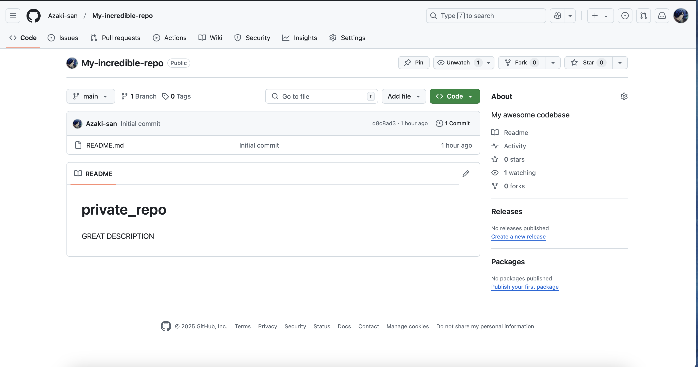
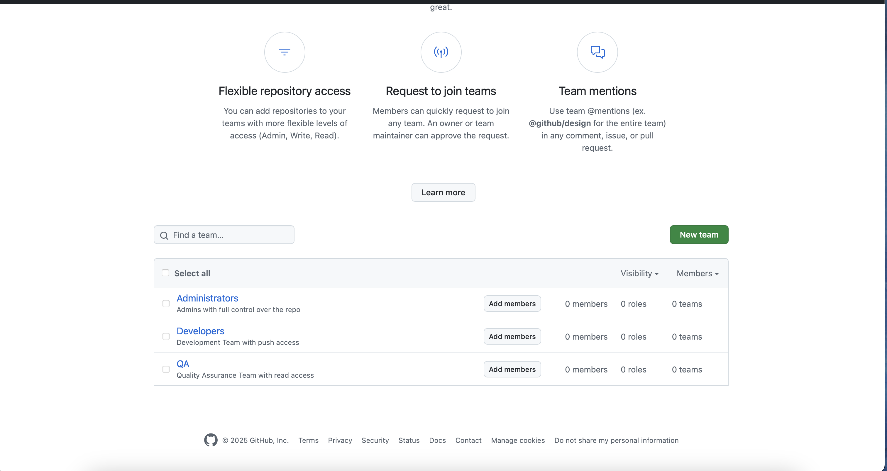

# Terraform Lab Assignment Report

This document captures the commands run and outputs received during the lab assignment. It covers initialization, formatting, validation, applying configurations with both hardcoded and variable-based container names, and updating the configuration via command-line variables.
**The cost of writing this document was 17.76 RUB.**
---

## 1. Terraform Initialization and Formatting

### 1.1 Running `terraform init`
```bash
Initializing the backend...
Initializing provider plugins...
- Finding kreuzwerker/docker versions matching "~> 3.0.1"...
- Installing kreuzwerker/docker v3.0.2...
- Installed kreuzwerker/docker v3.0.2 (self-signed, key ID BD080C4571C6104C)
Partner and community providers are signed by their developers.
If you'd like to know more about provider signing, you can read about it here:
https://www.terraform.io/docs/cli/plugins/signing.html
Terraform has created a lock file .terraform.lock.hcl to record the provider
selections it made above. Include this file in your version control repository
so that Terraform can guarantee to make the same selections by default when
you run "terraform init" in the future.

Terraform has been successfully initialized!

You may now begin working with Terraform. Try running "terraform plan" to see
any changes that are required for your infrastructure. All Terraform commands
should now work.

If you ever set or change modules or backend configuration for Terraform,
rerun this command to reinitialize your working directory. If you forget, other
commands will detect it and remind you to do so if necessary.
```
### 1.2 Running `terraform fmt`

- **Command:** `terraform fmt`
- **Result:** since the configuration files were already formatted correctly, no file names were returned.

### 1.3 Running `terraform validate`
```bash
Success! The configuration is valid.
```

## 2. Initial Docker Infrastructure Deployment (Hardcoded Container Name)
### 2.1 Terraform Configuration (docker.tf)
Below is the configuration used initially (with a hardcoded container name "tutorial"):
```yaml
terraform {
  required_providers {
    docker = {
      source  = "kreuzwerker/docker"
      version = "~> 3.0.1"
    }
  }
}

provider "docker" {}

resource "docker_image" "nginx" {
  name         = "nginx:latest"
  keep_locally = false
}

resource "docker_container" "nginx" {
  image = docker_image.nginx.image_id
  name  = "tutorial"
  ports {
    internal = 80
    external = 8000
  }
}
```

### 2.2 Running `terraform apply` (Initial Run)
```
andrew@Andrews-MacBook-Pro terraform % terraform apply

Terraform used the selected providers to generate the following execution plan. Resource actions are indicated with
the following symbols:
  + create

Terraform will perform the following actions:

  # docker_container.nginx will be created
  + resource "docker_container" "nginx" {
      + attach                                      = false
      + bridge                                      = (known after apply)
      + command                                     = (known after apply)
      + container_logs                              = (known after apply)
      + container_read_refresh_timeout_milliseconds = 15000
      + entrypoint                                  = (known after apply)
      + env                                         = (known after apply)
      + exit_code                                   = (known after apply)
      + hostname                                    = (known after apply)
      + id                                          = (known after apply)
      + image                                       = (known after apply)
      + init                                        = (known after apply)
      + ipc_mode                                    = (known after apply)
      + log_driver                                  = (known after apply)
      + logs                                        = false
      + must_run                                    = true
      + name                                        = "tutorial"
      + network_data                                = (known after apply)
      + read_only                                   = false
      + remove_volumes                              = true
      + restart                                     = "no"
      + rm                                          = false
      + runtime                                     = (known after apply)
      + security_opts                               = (known after apply)
      + shm_size                                    = (known after apply)
      + start                                       = true
      + stdin_open                                  = false
      + stop_signal                                 = (known after apply)
      + stop_timeout                                = (known after apply)
      + tty                                         = false
      + wait                                        = false
      + wait_timeout                                = 60

      + healthcheck (known after apply)

      + labels (known after apply)

      + ports {
          + external = 8000
          + internal = 80
          + ip       = "0.0.0.0"
          + protocol = "tcp"
        }
    }

  # docker_image.nginx will be created
  + resource "docker_image" "nginx" {
      + id           = (known after apply)
      + image_id     = (known after apply)
      + keep_locally = false
      + name         = "nginx:latest"
      + repo_digest  = (known after apply)
    }

Plan: 2 to add, 0 to change, 0 to destroy.

Do you want to perform these actions?
  Terraform will perform the actions described above.
  Only 'yes' will be accepted to approve.

  Enter a value: yes

docker_image.nginx: Creating...
docker_image.nginx: Creation complete after 0s [id=sha256:0dff3f9967e3cb3482965cc57c30e171f1def88e574757def5474cd791f50a16nginx:latest]
docker_container.nginx: Creating...
docker_container.nginx: Creation complete after 0s [id=a79c96ba0e5e4c9b9d55f79578985b8df5a11175f1baa165591c91c07bcb812e]

Apply complete! Resources: 2 added, 0 changed, 0 destroyed.

```

### 2.3 Inspecting the Current State
a. Running `terraform show`
```
andrew@Andrews-MacBook-Pro terraform % terraform show
# docker_container.nginx:
resource "docker_container" "nginx" {
    attach                                      = false
    bridge                                      = null
    command                                     = [
        "nginx",
        "-g",
        "daemon off;",
    ]
    container_read_refresh_timeout_milliseconds = 15000
    cpu_set                                     = null
    cpu_shares                                  = 0
    domainname                                  = null
    entrypoint                                  = [
        "/docker-entrypoint.sh",
    ]
    env                                         = []
    hostname                                    = "a79c96ba0e5e"
    id                                          = "a79c96ba0e5e4c9b9d55f79578985b8df5a11175f1baa165591c91c07bcb812e"
    image                                       = "sha256:0dff3f9967e3cb3482965cc57c30e171f1def88e574757def5474cd791f50a16"
    init                                        = false
    ipc_mode                                    = "private"
    log_driver                                  = "json-file"
    log_opts                                    = {
        "max-file" = "5"
        "max-size" = "20m"
    }
    logs                                        = false
    max_retry_count                             = 0
    memory                                      = 0
    memory_swap                                 = 0
    must_run                                    = true
    name                                        = "tutorial"
    network_data                                = [
        {
            gateway                   = "192.168.215.1"
            global_ipv6_address       = null
            global_ipv6_prefix_length = 0
            ip_address                = "192.168.215.2"
            ip_prefix_length          = 24
            ipv6_gateway              = null
            mac_address               = "02:42:c0:a8:d7:02"
            network_name              = "bridge"
        },
    ]
    network_mode                                = "bridge"
    pid_mode                                    = null
    privileged                                  = false
    publish_all_ports                           = false
    read_only                                   = false
    remove_volumes                              = true
    restart                                     = "no"
    rm                                          = false
    runtime                                     = "runc"
    security_opts                               = []
    shm_size                                    = 6004
    start                                       = true
    stdin_open                                  = false
    stop_signal                                 = "SIGQUIT"
    stop_timeout                                = 0
    tty                                         = false
    user                                        = null
    userns_mode                                 = null
    wait                                        = false
    wait_timeout                                = 60
    working_dir                                 = null

    ports {
        external = 8000
        internal = 80
        ip       = "0.0.0.0"
        protocol = "tcp"
    }
}

# docker_image.nginx:
resource "docker_image" "nginx" {
    id           = "sha256:0dff3f9967e3cb3482965cc57c30e171f1def88e574757def5474cd791f50a16nginx:latest"
    image_id     = "sha256:0dff3f9967e3cb3482965cc57c30e171f1def88e574757def5474cd791f50a16"
    keep_locally = false
    name         = "nginx:latest"
    repo_digest  = "nginx@sha256:bc2f6a7c8ddbccf55bdb19659ce3b0a92ca6559e86d42677a5a02ef6bda2fcef"
}
```

b. Running `terraform state list`
```
andrew@Andrews-MacBook-Pro terraform % terraform state list
docker_container.nginx
docker_image.nginx
```

## 3. Updating the Configuration to Use an Input Variable
### 3.1 Creating the Input Variable File (`variables.tf`)
```
variable "container_name" {
  description = "Name of the Docker container"
  default     = "azaki_nginx"
}
```

### 3.2 Modifying the Docker Container Resource
In main configuration file (`docker.tf`), update the container resource to use the input variable instead of the hardcoded name:
```
resource "docker_container" "nginx" {
  image = docker_image.nginx.image_id
  name  = var.container_name
  ports {
    internal = 80
    external = 8000
  }
}
```

### 3.3 Running terraform apply after the change
```
docker_image.nginx: Refreshing state... [id=sha256:0dff3f9967e3cb3482965cc57c30e171f1def88e574757def5474cd791f50a16nginx:latest]
docker_container.nginx: Refreshing state... [id=a79c96ba0e5e4c9b9d55f79578985b8df5a11175f1baa165591c91c07bcb812e]

Terraform used the selected providers to generate the following execution plan. Resource actions are indicated with
the following symbols:
-/+ destroy and then create replacement

Terraform will perform the following actions:

  # docker_container.nginx must be replaced
-/+ resource "docker_container" "nginx" {
      + bridge                                      = (known after apply)
      ~ command                                     = [
          - "nginx",
          - "-g",
          - "daemon off;",
        ] -> (known after apply)
      + container_logs                              = (known after apply)
      - cpu_shares                                  = 0 -> null
      - dns                                         = [] -> null
      - dns_opts                                    = [] -> null
      - dns_search                                  = [] -> null
      ~ entrypoint                                  = [
          - "/docker-entrypoint.sh",
        ] -> (known after apply)
      ~ env                                         = [] -> (known after apply)
      + exit_code                                   = (known after apply)
      - group_add                                   = [] -> null
      ~ hostname                                    = "a79c96ba0e5e" -> (known after apply)
      ~ id                                          = "a79c96ba0e5e4c9b9d55f79578985b8df5a11175f1baa165591c91c07bcb812e" -> (known after apply)
      ~ init                                        = false -> (known after apply)
      ~ ipc_mode                                    = "private" -> (known after apply)
      ~ log_driver                                  = "json-file" -> (known after apply)
      - log_opts                                    = { # forces replacement
          - "max-file" = "5"
          - "max-size" = "20m"
        } -> null
      - max_retry_count                             = 0 -> null
      - memory                                      = 0 -> null
      - memory_swap                                 = 0 -> null
      ~ name                                        = "tutorial" -> "azaki_nginx" # forces replacement
      ~ network_data                                = [
          - {
              - gateway                   = "192.168.215.1"
              - global_ipv6_prefix_length = 0
              - ip_address                = "192.168.215.2"
              - ip_prefix_length          = 24
              - mac_address               = "02:42:c0:a8:d7:02"
              - network_name              = "bridge"
                # (2 unchanged attributes hidden)
            },
        ] -> (known after apply)
      - network_mode                                = "bridge" -> null # forces replacement
      - privileged                                  = false -> null
      - publish_all_ports                           = false -> null
      ~ runtime                                     = "runc" -> (known after apply)
      ~ security_opts                               = [] -> (known after apply)
      ~ shm_size                                    = 6004 -> (known after apply)
      ~ stop_signal                                 = "SIGQUIT" -> (known after apply)
      ~ stop_timeout                                = 0 -> (known after apply)
      - storage_opts                                = {} -> null
      - sysctls                                     = {} -> null
      - tmpfs                                       = {} -> null
        # (20 unchanged attributes hidden)

      ~ healthcheck (known after apply)

      ~ labels (known after apply)

        # (1 unchanged block hidden)
    }

Plan: 1 to add, 0 to change, 1 to destroy.

Do you want to perform these actions?
  Terraform will perform the actions described above.
  Only 'yes' will be accepted to approve.

  Enter a value: yes

docker_container.nginx: Destroying... [id=a79c96ba0e5e4c9b9d55f79578985b8df5a11175f1baa165591c91c07bcb812e]
docker_container.nginx: Destruction complete after 0s
docker_container.nginx: Creating...
docker_container.nginx: Creation complete after 0s [id=f2563cdf9662a96b6fe2b0645a6bf2f2d854e98701dd5033c19b096fddb97873]

Apply complete! Resources: 1 added, 0 changed, 1 destroyed.
```

### 3.4 Verifying the updated state with terraform show
```
andrew@Andrews-MacBook-Pro terraform % terraform show
# docker_container.nginx:
resource "docker_container" "nginx" {
    attach                                      = false
    bridge                                      = null
    command                                     = [
        "nginx",
        "-g",
        "daemon off;",
    ]
    container_read_refresh_timeout_milliseconds = 15000
    cpu_set                                     = null
    cpu_shares                                  = 0
    domainname                                  = null
    entrypoint                                  = [
        "/docker-entrypoint.sh",
    ]
    env                                         = []
    hostname                                    = "f2563cdf9662"
    id                                          = "f2563cdf9662a96b6fe2b0645a6bf2f2d854e98701dd5033c19b096fddb97873"
    image                                       = "sha256:0dff3f9967e3cb3482965cc57c30e171f1def88e574757def5474cd791f50a16"
    init                                        = false
    ipc_mode                                    = "private"
    log_driver                                  = "json-file"
    log_opts                                    = {
        "max-file" = "5"
        "max-size" = "20m"
    }
    logs                                        = false
    max_retry_count                             = 0
    memory                                      = 0
    memory_swap                                 = 0
    must_run                                    = true
    name                                        = "azaki_nginx"
    network_data                                = [
        {
            gateway                   = "192.168.215.1"
            global_ipv6_address       = null
            global_ipv6_prefix_length = 0
            ip_address                = "192.168.215.2"
            ip_prefix_length          = 24
            ipv6_gateway              = null
            mac_address               = "02:42:c0:a8:d7:02"
            network_name              = "bridge"
        },
    ]
    network_mode                                = "bridge"
    pid_mode                                    = null
    privileged                                  = false
    publish_all_ports                           = false
    read_only                                   = false
    remove_volumes                              = true
    restart                                     = "no"
    rm                                          = false
    runtime                                     = "runc"
    security_opts                               = []
    shm_size                                    = 6004
    start                                       = true
    stdin_open                                  = false
    stop_signal                                 = "SIGQUIT"
    stop_timeout                                = 0
    tty                                         = false
    user                                        = null
    userns_mode                                 = null
    wait                                        = false
    wait_timeout                                = 60
    working_dir                                 = null

    ports {
        external = 8000
        internal = 80
        ip       = "0.0.0.0"
        protocol = "tcp"
    }
}

# docker_image.nginx:
resource "docker_image" "nginx" {
    id           = "sha256:0dff3f9967e3cb3482965cc57c30e171f1def88e574757def5474cd791f50a16nginx:latest"
    image_id     = "sha256:0dff3f9967e3cb3482965cc57c30e171f1def88e574757def5474cd791f50a16"
    keep_locally = false
    name         = "nginx:latest"
    repo_digest  = "nginx@sha256:bc2f6a7c8ddbccf55bdb19659ce3b0a92ca6559e86d42677a5a02ef6bda2fcef"
}
```

## 4. Updating the Container Name via Command-Line Variable Override
To change the container name from azaki_nginx to azaki2_nginx without modifying the code, the following command was run:
`terraform apply -var="container_name=azaki2_nginx"`
### 4.1 Command Output
```
andrew@Andrews-MacBook-Pro terraform % terraform apply -var="container_name=azaki2_nginx"
docker_image.nginx: Refreshing state... [id=sha256:0dff3f9967e3cb3482965cc57c30e171f1def88e574757def5474cd791f50a16nginx:latest]
docker_container.nginx: Refreshing state... [id=f2563cdf9662a96b6fe2b0645a6bf2f2d854e98701dd5033c19b096fddb97873]

Terraform used the selected providers to generate the following execution plan. Resource actions are indicated with
the following symbols:
-/+ destroy and then create replacement

Terraform will perform the following actions:

  # docker_container.nginx must be replaced
-/+ resource "docker_container" "nginx" {
      + bridge                                      = (known after apply)
      ~ command                                     = [
          - "nginx",
          - "-g",
          - "daemon off;",
        ] -> (known after apply)
      + container_logs                              = (known after apply)
      - cpu_shares                                  = 0 -> null
      - dns                                         = [] -> null
      - dns_opts                                    = [] -> null
      - dns_search                                  = [] -> null
      ~ entrypoint                                  = [
          - "/docker-entrypoint.sh",
        ] -> (known after apply)
      ~ env                                         = [] -> (known after apply)
      + exit_code                                   = (known after apply)
      - group_add                                   = [] -> null
      ~ hostname                                    = "f2563cdf9662" -> (known after apply)
      ~ id                                          = "f2563cdf9662a96b6fe2b0645a6bf2f2d854e98701dd5033c19b096fddb97873" -> (known after apply)
      ~ init                                        = false -> (known after apply)
      ~ ipc_mode                                    = "private" -> (known after apply)
      ~ log_driver                                  = "json-file" -> (known after apply)
      - log_opts                                    = { # forces replacement
          - "max-file" = "5"
          - "max-size" = "20m"
        } -> null
      - max_retry_count                             = 0 -> null
      - memory                                      = 0 -> null
      - memory_swap                                 = 0 -> null
      ~ name                                        = "azaki_nginx" -> "azaki2_nginx" # forces replacement
      ~ network_data                                = [
          - {
              - gateway                   = "192.168.215.1"
              - global_ipv6_prefix_length = 0
              - ip_address                = "192.168.215.2"
              - ip_prefix_length          = 24
              - mac_address               = "02:42:c0:a8:d7:02"
              - network_name              = "bridge"
                # (2 unchanged attributes hidden)
            },
        ] -> (known after apply)
      - network_mode                                = "bridge" -> null # forces replacement
      - privileged                                  = false -> null
      - publish_all_ports                           = false -> null
      ~ runtime                                     = "runc" -> (known after apply)
      ~ security_opts                               = [] -> (known after apply)
      ~ shm_size                                    = 6004 -> (known after apply)
      ~ stop_signal                                 = "SIGQUIT" -> (known after apply)
      ~ stop_timeout                                = 0 -> (known after apply)
      - storage_opts                                = {} -> null
      - sysctls                                     = {} -> null
      - tmpfs                                       = {} -> null
        # (20 unchanged attributes hidden)

      ~ healthcheck (known after apply)

      ~ labels (known after apply)

        # (1 unchanged block hidden)
    }

Plan: 1 to add, 0 to change, 1 to destroy.

Do you want to perform these actions?
  Terraform will perform the actions described above.
  Only 'yes' will be accepted to approve.

  Enter a value: yes

docker_container.nginx: Destroying... [id=f2563cdf9662a96b6fe2b0645a6bf2f2d854e98701dd5033c19b096fddb97873]
docker_container.nginx: Destruction complete after 0s
docker_container.nginx: Creating...
docker_container.nginx: Creation complete after 1s [id=df095436a899ec67fb5f019b35b783f528153d9704888e5a9432298033b8219d]

Apply complete! Resources: 1 added, 0 changed, 1 destroyed.
```

### 4.2 Final verification with `terraform show`
```
andrew@Andrews-MacBook-Pro terraform % terraform show
# docker_container.nginx:
resource "docker_container" "nginx" {
    attach                                      = false
    bridge                                      = null
    command                                     = [
        "nginx",
        "-g",
        "daemon off;",
    ]
    container_read_refresh_timeout_milliseconds = 15000
    cpu_set                                     = null
    cpu_shares                                  = 0
    domainname                                  = null
    entrypoint                                  = [
        "/docker-entrypoint.sh",
    ]
    env                                         = []
    hostname                                    = "df095436a899"
    id                                          = "df095436a899ec67fb5f019b35b783f528153d9704888e5a9432298033b8219d"
    image                                       = "sha256:0dff3f9967e3cb3482965cc57c30e171f1def88e574757def5474cd791f50a16"
    init                                        = false
    ipc_mode                                    = "private"
    log_driver                                  = "json-file"
    log_opts                                    = {
        "max-file" = "5"
        "max-size" = "20m"
    }
    logs                                        = false
    max_retry_count                             = 0
    memory                                      = 0
    memory_swap                                 = 0
    must_run                                    = true
    name                                        = "azaki2_nginx"
    network_data                                = [
        {
            gateway                   = "192.168.215.1"
            global_ipv6_address       = null
            global_ipv6_prefix_length = 0
            ip_address                = "192.168.215.2"
            ip_prefix_length          = 24
            ipv6_gateway              = null
            mac_address               = "02:42:c0:a8:d7:02"
            network_name              = "bridge"
        },
    ]
    network_mode                                = "bridge"
    pid_mode                                    = null
    privileged                                  = false
    publish_all_ports                           = false
    read_only                                   = false
    remove_volumes                              = true
    restart                                     = "no"
    rm                                          = false
    runtime                                     = "runc"
    security_opts                               = []
    shm_size                                    = 6004
    start                                       = true
    stdin_open                                  = false
    stop_signal                                 = "SIGQUIT"
    stop_timeout                                = 0
    tty                                         = false
    user                                        = null
    userns_mode                                 = null
    wait                                        = false
    wait_timeout                                = 60
    working_dir                                 = null

    ports {
        external = 8000
        internal = 80
        ip       = "0.0.0.0"
        protocol = "tcp"
    }
}

# docker_image.nginx:
resource "docker_image" "nginx" {
    id           = "sha256:0dff3f9967e3cb3482965cc57c30e171f1def88e574757def5474cd791f50a16nginx:latest"
    image_id     = "sha256:0dff3f9967e3cb3482965cc57c30e171f1def88e574757def5474cd791f50a16"
    keep_locally = false
    name         = "nginx:latest"
    repo_digest  = "nginx@sha256:bc2f6a7c8ddbccf55bdb19659ce3b0a92ca6559e86d42677a5a02ef6bda2fcef"
}
```

## 5. Terraform outputs
### 5.1 Creating `outputs.tf`
Add the configuration below to outputs.tf to define outputs for your container's ID and the image ID.
```
output "container_id" {
  description = "ID of the Docker container"
  value       = docker_container.nginx.id
}

output "image_id" {
  description = "ID of the Docker image"
  value       = docker_image.nginx.id
}
```
### 5.2 Apply patch (`terraform apply`)
```
andrew@Andrews-MacBook-Pro terraform % terraform apply                                   
docker_image.nginx: Refreshing state... [id=sha256:0dff3f9967e3cb3482965cc57c30e171f1def88e574757def5474cd791f50a16nginx:latest]
docker_container.nginx: Refreshing state... [id=df095436a899ec67fb5f019b35b783f528153d9704888e5a9432298033b8219d]

Terraform used the selected providers to generate the following execution plan. Resource actions are indicated with
the following symbols:
-/+ destroy and then create replacement

Terraform will perform the following actions:

  # docker_container.nginx must be replaced
-/+ resource "docker_container" "nginx" {
      + bridge                                      = (known after apply)
      ~ command                                     = [
          - "nginx",
          - "-g",
          - "daemon off;",
        ] -> (known after apply)
      + container_logs                              = (known after apply)
      - cpu_shares                                  = 0 -> null
      - dns                                         = [] -> null
      - dns_opts                                    = [] -> null
      - dns_search                                  = [] -> null
      ~ entrypoint                                  = [
          - "/docker-entrypoint.sh",
        ] -> (known after apply)
      ~ env                                         = [] -> (known after apply)
      + exit_code                                   = (known after apply)
      - group_add                                   = [] -> null
      ~ hostname                                    = "df095436a899" -> (known after apply)
      ~ id                                          = "df095436a899ec67fb5f019b35b783f528153d9704888e5a9432298033b8219d" -> (known after apply)
      ~ init                                        = false -> (known after apply)
      ~ ipc_mode                                    = "private" -> (known after apply)
      ~ log_driver                                  = "json-file" -> (known after apply)
      - log_opts                                    = { # forces replacement
          - "max-file" = "5"
          - "max-size" = "20m"
        } -> null
      - max_retry_count                             = 0 -> null
      - memory                                      = 0 -> null
      - memory_swap                                 = 0 -> null
      ~ name                                        = "azaki2_nginx" -> "azaki_nginx" # forces replacement
      ~ network_data                                = [
          - {
              - gateway                   = "192.168.215.1"
              - global_ipv6_prefix_length = 0
              - ip_address                = "192.168.215.2"
              - ip_prefix_length          = 24
              - mac_address               = "02:42:c0:a8:d7:02"
              - network_name              = "bridge"
                # (2 unchanged attributes hidden)
            },
        ] -> (known after apply)
      - network_mode                                = "bridge" -> null # forces replacement
      - privileged                                  = false -> null
      - publish_all_ports                           = false -> null
      ~ runtime                                     = "runc" -> (known after apply)
      ~ security_opts                               = [] -> (known after apply)
      ~ shm_size                                    = 6004 -> (known after apply)
      ~ stop_signal                                 = "SIGQUIT" -> (known after apply)
      ~ stop_timeout                                = 0 -> (known after apply)
      - storage_opts                                = {} -> null
      - sysctls                                     = {} -> null
      - tmpfs                                       = {} -> null
        # (20 unchanged attributes hidden)

      ~ healthcheck (known after apply)

      ~ labels (known after apply)

        # (1 unchanged block hidden)
    }

Plan: 1 to add, 0 to change, 1 to destroy.

Changes to Outputs:
  + container_id = (known after apply)
  + image_id     = "sha256:0dff3f9967e3cb3482965cc57c30e171f1def88e574757def5474cd791f50a16nginx:latest"

Do you want to perform these actions?
  Terraform will perform the actions described above.
  Only 'yes' will be accepted to approve.

  Enter a value: yes

docker_container.nginx: Destroying... [id=df095436a899ec67fb5f019b35b783f528153d9704888e5a9432298033b8219d]
docker_container.nginx: Destruction complete after 0s
docker_container.nginx: Creating...
docker_container.nginx: Creation complete after 1s [id=225e5c63c0c1c73af3b84263e3e0360666c34498fba5a57de53972bb87415734]

Apply complete! Resources: 1 added, 0 changed, 1 destroyed.

Outputs:

container_id = "225e5c63c0c1c73af3b84263e3e0360666c34498fba5a57de53972bb87415734"
image_id = "sha256:0dff3f9967e3cb3482965cc57c30e171f1def88e574757def5474cd791f50a16nginx:latest"
```
### 5.3 Output of `terraform output`
```
andrew@Andrews-MacBook-Pro terraform % terraform output
container_id = "225e5c63c0c1c73af3b84263e3e0360666c34498fba5a57de53972bb87415734"
image_id = "sha256:0dff3f9967e3cb3482965cc57c30e171f1def88e574757def5474cd791f50a16nginx:latest"
```

## 6. Yandex Cloud Infrastracture Using Terraform
### 6.1 Registration on Yandex Cloud
You need to register on Yandex Cloud, enter your card details, create a service account, and grant it administrator access.

### 6.2 CLI client installation
This guide was tested on MacOS. To install CLI client use:

`curl -sSL https://storage.yandexcloud.net/yandexcloud-yc/install.sh | bash`

Start a new shell after installation (or run `source "/Users/<username>/.zshrc"` to update environment)
### 6.3 CLI client initialization
To start working with CLI, you need to initialize it:
`yc init`
It will ask you to go to authorization link, after you need to copy OAuth token and paste it:
```
andrew@Andrews-MacBook-Pro yandexcloud % yc init
Welcome! This command will take you through the configuration process.
Please go to https://oauth.yandex.ru/authorize?response_type=token&client_id=<this will be your client id> in order to obtain OAuth token.
 Please enter OAuth token <paste token here>
```
**Be careful while pasting token!**

```
andrew@Andrews-MacBook-Pro yandexcloud % yc init
Welcome! This command will take you through the configuration process.
Please go to https://oauth.yandex.ru/authorize?response_type=token&client_id=<this will be your client id> in order to obtain OAuth token.
 Please enter OAuth token: <paste token here>
ERROR: Unable to list clouds: iam token create failed: rpc error: code = Unauthenticated desc = OAuth token is invalid or expired


client-trace-id: 1f967de7-d11d-42df-9c06-7f4da9e98e05

Use client-trace-id for investigation of issues in cloud support
If you are going to ask for help of cloud support, please send the following trace file: /Users/andrew/.config/yandex-cloud/logs/2025-02-05T22-57-00.011-yc_init.txt
andrew@Andrews-MacBook-Pro terraform % yc init
Welcome! This command will take you through the configuration process.
Pick desired action:
 [1] Re-initialize this profile 'default' with new settings 
 [2] Create a new profile
Please enter your numeric choice: 1
Please go to https://oauth.yandex.ru/authorize?response_type=token&client_id=<this will be your client id> in order to obtain OAuth token.
 Please enter OAuth token: [******************************************** ] <paste token here>
You have one cloud available: 'cloud-jandr21' (id = <this will be your id>). It is going to be used by default.
Please choose folder to use:
 [1] default (id = <this will be your id>)
 [2] Create a new folder
Please enter your numeric choice: 1
Your current folder has been set to 'default' (id = <this will be your id>).
Do you want to configure a default Compute zone? [Y/n] n
```
**The error occurred because the OAuth token was invalid or expired; after reinitializing the profile and entering a new token, the configuration completed successfully.**

### 6.4 Creating a Service Account Key
To authenticate Terraform with Yandex Cloud, you need to create a service account key. Run the following command:
```
yc iam key create \
  --service-account-id <insert service token here from Step 6.1>  \
  --folder-name default \
  --output key.json
```

This command generates a key file (key.json) that will be used for authentication. The output should look like this:
```
id: <this will be your id>
service_account_id: <this will be service account id>
created_at: "2025-02-05T19:59:08.572455115Z"
key_algorithm: RSA_2048
```
**Important:**

- Keep key.json secure, as it contains authentication credentials.
- This key will be used in Terraform to manage Yandex Cloud resources.

### 6.5 Yandex Cloud CLI configuration
- Create profile: `yc config profile create sa-terraform`
- Set key: `yc config set service-account-key key.json`
- Set Cloud ID (from Yandex Cloud page): `yc config set cloud-id <your cloud id>`
- Set Folder ID (from Yandex Cloud page): `yc config set folder-id <your folder id>`
- Export variables in PATH: 
    ```
    export YC_TOKEN=$(yc iam create-token)
    export YC_CLOUD_ID=$(yc config get cloud-id)
    export YC_FOLDER_ID=$(yc config get folder-id)
    ```
- Check service account list: `yc iam service-account list`
    ```
    andrew@Andrews-MacBook-Pro terraform % yc iam service-account list
    +----------------------+---------+--------+---------------------+-----------------------+
    |          ID          |  NAME   | LABELS |     CREATED AT      | LAST AUTHENTICATED AT |
    +----------------------+---------+--------+---------------------+-----------------------+
    | fssdfsdffasfasfsafas | service |        | 2025-02-05 19:44:09 |                       |
    +----------------------+---------+--------+---------------------+-----------------------+
    ```

### 6.6 Preparing terraform
Create a cloud-init configuration file `meta.txt` to set up the VM user:
```
#cloud-config
users:
  - name: <username of the VM>
    groups: sudo
    shell: /bin/bash
    sudo: 'ALL=(ALL) NOPASSWD:ALL'
    ssh_authorized_keys:
      - <public ssh key>
```
This file ensures passwordless sudo access and adds the SSH key for remote login.

### 6.7 Configuring Terraform
Create a Terraform configuration file to define cloud infrastructure. Below is an example of a Terraform script that:
- Uses the Yandex Cloud provider
- Creates two virtual machines (vm-1 and vm-2) with boot disks
- Sets up a VPC network and subnet
- Outputs internal and external IP addresses
```
terraform {
  required_providers {
    yandex = {
      source = "yandex-cloud/yandex"
    }
  }
  required_version = ">= 0.13"
}

provider "yandex" {
  zone = "ru-central1-b"
  service_account_key_file = "key.json"
}

resource "yandex_compute_disk" "boot-disk-1" {
  name     = "boot-disk-1"
  type     = "network-hdd"
  zone     = "ru-central1-b"
  size     = "20"
  image_id = "fd865uon0af912uhk9cs"
  folder_id = "<your-folder-id>"
}

resource "yandex_compute_disk" "boot-disk-2" {
  name     = "boot-disk-2"
  type     = "network-hdd"
  zone     = "ru-central1-b"
  size     = "20"
  image_id = "fd865uon0af912uhk9cs"
  folder_id = "<your-folder-id>"
}

resource "yandex_compute_instance" "vm-1" {
  name = "terraform1"
  folder_id = "<your-folder-id>"

  resources {
    cores  = 2
    memory = 2
  }

  boot_disk {
    disk_id = yandex_compute_disk.boot-disk-1.id
  }

  network_interface {
    subnet_id = yandex_vpc_subnet.subnet-1.id
    nat       = true
  }

  metadata = {
    user-data = "${file("meta.txt")}"
  }
}

resource "yandex_compute_instance" "vm-2" {
  name = "terraform2"
  folder_id = "<your-folder-id>"

  resources {
    cores  = 4
    memory = 4
  }

  boot_disk {
    disk_id = yandex_compute_disk.boot-disk-2.id
  }

  network_interface {
    subnet_id = yandex_vpc_subnet.subnet-1.id
    nat       = true
  }

  metadata = {
    user-data = "${file("meta.txt")}"
  }
}

resource "yandex_vpc_network" "network-1" {
  name = "network1"
  folder_id = "<your-folder-id>"
}

resource "yandex_vpc_subnet" "subnet-1" {
  name           = "subnet1"
  zone           = "ru-central1-b"
  network_id     = yandex_vpc_network.network-1.id
  v4_cidr_blocks = ["192.168.10.0/24"]
  folder_id = "<your-folder-id>"
}

output "internal_ip_address_vm_1" {
  value = yandex_compute_instance.vm-1.network_interface.0.ip_address
}

output "internal_ip_address_vm_2" {
  value = yandex_compute_instance.vm-2.network_interface.0.ip_address
}

output "external_ip_address_vm_1" {
  value = yandex_compute_instance.vm-1.network_interface.0.nat_ip_address
}

output "external_ip_address_vm_2" {
  value = yandex_compute_instance.vm-2.network_interface.0.nat_ip_address
}
```

**Notes:**
- Available zones can be checked on the Yandex Cloud website.
- Available image IDs can be listed using: 
  ```bash
  yc compute image list --folder-id standard-images
  ```
  This command retrieves standard images like Ubuntu, CentOS, and others. Make sure to use the correct image_id for your instance.

### 6.8 Run `terraform init`
```
andrew@Andrews-MacBook-Pro yandexcloud % terraform init
Initializing the backend...
Initializing provider plugins...
- Reusing previous version of yandex-cloud/yandex from the dependency lock file
- Reusing previous version of kreuzwerker/docker from the dependency lock file
- Using previously-installed yandex-cloud/yandex v0.136.0
- Using previously-installed kreuzwerker/docker v3.0.2

Terraform has been successfully initialized!

You may now begin working with Terraform. Try running "terraform plan" to see
any changes that are required for your infrastructure. All Terraform commands
should now work.

If you ever set or change modules or backend configuration for Terraform,
rerun this command to reinitialize your working directory. If you forget, other
commands will detect it and remind you to do so if necessary.
```

Also it is necessary to validate:
```bash
terraform validate
```
```
Success! The configuration is valid.
```
FMT list:
```bash
terraform fmt
```
```
andrew@Andrews-MacBook-Pro yandexcloud % terraform fmt
main.tf
```

### 6.9 Terraform Plan Execution
To preview the changes Terraform will apply, run:
```bash
terraform plan
```
This command shows the planned resources to be created, modified, or destroyed. In this case, Terraform will create:
- Two compute disks (`boot-disk-1`, `boot-disk-2`)
- Two virtual machines (`vm-1`, `vm-2`)
- A VPC network (`network-1`)
- A VPC subnet (`subnet-1`)

Each VM will have:
- A boot disk initialized from an image
- A network interface with NAT enabled
- SSH access configured using `meta.txt`

At the end of the output, Terraform indicates:
```
andrew@Andrews-MacBook-Pro yandexcloud % terraform plan

Terraform used the selected providers to generate the following execution plan. Resource actions are indicated with the following symbols:
  + create

Terraform will perform the following actions:

  # yandex_compute_disk.boot-disk-1 will be created
  + resource "yandex_compute_disk" "boot-disk-1" {
      + block_size  = 4096
      + created_at  = (known after apply)
      + folder_id   = (known after apply)
      + id          = (known after apply)
      + image_id    = "fd87va5cc00gaq2f5qfb"
      + name        = "boot-disk-1"
      + product_ids = (known after apply)
      + size        = 20
      + status      = (known after apply)
      + type        = "network-hdd"
      + zone        = "ru-central1-d"

      + disk_placement_policy (known after apply)

      + hardware_generation (known after apply)
    }

  # yandex_compute_disk.boot-disk-2 will be created
  + resource "yandex_compute_disk" "boot-disk-2" {
      + block_size  = 4096
      + created_at  = (known after apply)
      + folder_id   = (known after apply)
      + id          = (known after apply)
      + image_id    = "fd87va5cc00gaq2f5qfb"
      + name        = "boot-disk-2"
      + product_ids = (known after apply)
      + size        = 20
      + status      = (known after apply)
      + type        = "network-hdd"
      + zone        = "ru-central1-d"

      + disk_placement_policy (known after apply)

      + hardware_generation (known after apply)
    }

  # yandex_compute_instance.vm-1 will be created
  + resource "yandex_compute_instance" "vm-1" {
      + created_at                = (known after apply)
      + folder_id                 = (known after apply)
      + fqdn                      = (known after apply)
      + gpu_cluster_id            = (known after apply)
      + hardware_generation       = (known after apply)
      + hostname                  = (known after apply)
      + id                        = (known after apply)
      + maintenance_grace_period  = (known after apply)
      + maintenance_policy        = (known after apply)
      + metadata                  = {
          + "user-data" = <<-EOT
                #cloud-config
                users:
                  - name: username
                    groups: sudo
                    shell: /bin/bash
                    sudo: 'ALL=(ALL) NOPASSWD:ALL'
                    ssh_authorized_keys:
                       - <this will be your key>
            EOT
        }
      + name                      = "terraform1"
      + network_acceleration_type = "standard"
      + platform_id               = "standard-v1"
      + service_account_id        = (known after apply)
      + status                    = (known after apply)
      + zone                      = (known after apply)

      + boot_disk {
          + auto_delete = true
          + device_name = (known after apply)
          + disk_id     = (known after apply)
          + mode        = (known after apply)

          + initialize_params (known after apply)
        }

      + metadata_options (known after apply)

      + network_interface {
          + index              = (known after apply)
          + ip_address         = (known after apply)
          + ipv4               = true
          + ipv6               = (known after apply)
          + ipv6_address       = (known after apply)
          + mac_address        = (known after apply)
          + nat                = true
          + nat_ip_address     = (known after apply)
          + nat_ip_version     = (known after apply)
          + security_group_ids = (known after apply)
          + subnet_id          = (known after apply)
        }

      + placement_policy (known after apply)

      + resources {
          + core_fraction = 100
          + cores         = 2
          + memory        = 2
        }

      + scheduling_policy (known after apply)
    }

  # yandex_compute_instance.vm-2 will be created
  + resource "yandex_compute_instance" "vm-2" {
      + created_at                = (known after apply)
      + folder_id                 = (known after apply)
      + fqdn                      = (known after apply)
      + gpu_cluster_id            = (known after apply)
      + hardware_generation       = (known after apply)
      + hostname                  = (known after apply)
      + id                        = (known after apply)
      + maintenance_grace_period  = (known after apply)
      + maintenance_policy        = (known after apply)
      + metadata                  = {
          + "user-data" = <<-EOT
                #cloud-config
                users:
                  - name: username
                    groups: sudo
                    shell: /bin/bash
                    sudo: 'ALL=(ALL) NOPASSWD:ALL'
                    ssh_authorized_keys:
                       - <this will be your key>
            EOT
        }
      + name                      = "terraform2"
      + network_acceleration_type = "standard"
      + platform_id               = "standard-v1"
      + service_account_id        = (known after apply)
      + status                    = (known after apply)
      + zone                      = (known after apply)

      + boot_disk {
          + auto_delete = true
          + device_name = (known after apply)
          + disk_id     = (known after apply)
          + mode        = (known after apply)

          + initialize_params (known after apply)
        }

      + metadata_options (known after apply)

      + network_interface {
          + index              = (known after apply)
          + ip_address         = (known after apply)
          + ipv4               = true
          + ipv6               = (known after apply)
          + ipv6_address       = (known after apply)
          + mac_address        = (known after apply)
          + nat                = true
          + nat_ip_address     = (known after apply)
          + nat_ip_version     = (known after apply)
          + security_group_ids = (known after apply)
          + subnet_id          = (known after apply)
        }

      + placement_policy (known after apply)

      + resources {
          + core_fraction = 100
          + cores         = 4
          + memory        = 4
        }

      + scheduling_policy (known after apply)
    }

  # yandex_vpc_network.network-1 will be created
  + resource "yandex_vpc_network" "network-1" {
      + created_at                = (known after apply)
      + default_security_group_id = (known after apply)
      + folder_id                 = (known after apply)
      + id                        = (known after apply)
      + labels                    = (known after apply)
      + name                      = "network1"
      + subnet_ids                = (known after apply)
    }

  # yandex_vpc_subnet.subnet-1 will be created
  + resource "yandex_vpc_subnet" "subnet-1" {
      + created_at     = (known after apply)
      + folder_id      = (known after apply)
      + id             = (known after apply)
      + labels         = (known after apply)
      + name           = "subnet1"
      + network_id     = (known after apply)
      + v4_cidr_blocks = [
          + "192.168.10.0/24",
        ]
      + v6_cidr_blocks = (known after apply)
      + zone           = "ru-central1-d"
    }

Plan: 6 to add, 0 to change, 0 to destroy.

Changes to Outputs:
  + external_ip_address_vm_1 = (known after apply)
  + external_ip_address_vm_2 = (known after apply)
  + internal_ip_address_vm_1 = (known after apply)
  + internal_ip_address_vm_2 = (known after apply)

─────────────────────────────────────────────────────────────────────────────────────────────────────────────────────────────────────────────

Note: You didn't use the -out option to save this plan, so Terraform can't guarantee to take exactly these actions if you run "terraform
apply" now.
```
This means six new resources will be created, and no existing resources will be modified or removed.

### 6.10 Applying Terraform Configuration
To apply the planned infrastructure changes, run:
```bash
terraform apply
```
This command creates, updates, or destroys resources as defined in the Terraform configuration.
Some logs may be different.
```
andrew@Andrews-MacBook-Pro yandexcloud % terraform apply
yandex_vpc_network.network-1: Refreshing state... [id=<this will be id>]
yandex_compute_disk.boot-disk-2: Refreshing state... [id=<this will be id>]
yandex_compute_disk.boot-disk-1: Refreshing state... [id=<this will be id>]
yandex_vpc_subnet.subnet-1: Refreshing state... [id=<this will be id>]

Terraform used the selected providers to generate the following execution plan. Resource actions are indicated with the
following symbols:
  + create
-/+ destroy and then create replacement

Terraform will perform the following actions:

  # yandex_compute_disk.boot-disk-1 must be replaced
-/+ resource "yandex_compute_disk" "boot-disk-1" {
      ~ created_at  = "2025-02-05T21:04:08Z" -> (known after apply)
      ~ id          = "<this will be id>" -> (known after apply)
      - labels      = {} -> null
        name        = "boot-disk-1"
      ~ product_ids = [
          - "<this will be id>",
        ] -> (known after apply)
      ~ status      = "ready" -> (known after apply)
      ~ zone        = "ru-central1-d" -> "ru-central1-b" # forces replacement
        # (7 unchanged attributes hidden)

      ~ disk_placement_policy (known after apply)
      - disk_placement_policy {
            # (1 unchanged attribute hidden)
        }

      ~ hardware_generation (known after apply)
      - hardware_generation {
          - legacy_features {
              - pci_topology = "PCI_TOPOLOGY_V1" -> null
            }
        }
    }

  # yandex_compute_disk.boot-disk-2 must be replaced
-/+ resource "yandex_compute_disk" "boot-disk-2" {
      ~ created_at  = "2025-02-05T21:04:08Z" -> (known after apply)
      ~ id          = "<this will be id>" -> (known after apply)
      - labels      = {} -> null
        name        = "boot-disk-2"
      ~ product_ids = [
          - "<this will be id>",
        ] -> (known after apply)
      ~ status      = "ready" -> (known after apply)
      ~ zone        = "ru-central1-d" -> "ru-central1-b" # forces replacement
        # (7 unchanged attributes hidden)

      ~ disk_placement_policy (known after apply)
      - disk_placement_policy {
            # (1 unchanged attribute hidden)
        }

      ~ hardware_generation (known after apply)
      - hardware_generation {
          - legacy_features {
              - pci_topology = "PCI_TOPOLOGY_V1" -> null
            }
        }
    }

  # yandex_compute_instance.vm-1 will be created
  + resource "yandex_compute_instance" "vm-1" {
      + created_at                = (known after apply)
      + folder_id                 = <this will be id>
      + fqdn                      = (known after apply)
      + gpu_cluster_id            = (known after apply)
      + hardware_generation       = (known after apply)
      + hostname                  = (known after apply)
      + id                        = (known after apply)
      + maintenance_grace_period  = (known after apply)
      + maintenance_policy        = (known after apply)
      + metadata                  = {
          + "user-data" = <<-EOT
                #cloud-config
                users:
                  - name: username
                    groups: sudo
                    shell: /bin/bash
                    sudo: 'ALL=(ALL) NOPASSWD:ALL'
                    ssh_authorized_keys:
                       - key
            EOT
        }
      + name                      = "terraform1"
      + network_acceleration_type = "standard"
      + platform_id               = "standard-v1"
      + service_account_id        = (known after apply)
      + status                    = (known after apply)
      + zone                      = (known after apply)

      + boot_disk {
          + auto_delete = true
          + device_name = (known after apply)
          + disk_id     = (known after apply)
          + mode        = (known after apply)

          + initialize_params (known after apply)
        }

      + metadata_options (known after apply)

      + network_interface {
          + index              = (known after apply)
          + ip_address         = (known after apply)
          + ipv4               = true
          + ipv6               = (known after apply)
          + ipv6_address       = (known after apply)
          + mac_address        = (known after apply)
          + nat                = true
          + nat_ip_address     = (known after apply)
          + nat_ip_version     = (known after apply)
          + security_group_ids = (known after apply)
          + subnet_id          = (known after apply)
        }

      + placement_policy (known after apply)

      + resources {
          + core_fraction = 100
          + cores         = 2
          + memory        = 2
        }

      + scheduling_policy (known after apply)
    }

  # yandex_compute_instance.vm-2 will be created
  + resource "yandex_compute_instance" "vm-2" {
      + created_at                = (known after apply)
      + folder_id                 = "<this will be id>"
      + fqdn                      = (known after apply)
      + gpu_cluster_id            = (known after apply)
      + hardware_generation       = (known after apply)
      + hostname                  = (known after apply)
      + id                        = (known after apply)
      + maintenance_grace_period  = (known after apply)
      + maintenance_policy        = (known after apply)
      + metadata                  = {
          + "user-data" = <<-EOT
                #cloud-config
                users:
                  - name: username
                    groups: sudo
                    shell: /bin/bash
                    sudo: 'ALL=(ALL) NOPASSWD:ALL'
                    ssh_authorized_keys:
                       - key
            EOT
        }
      + name                      = "terraform2"
      + network_acceleration_type = "standard"
      + platform_id               = "standard-v1"
      + service_account_id        = (known after apply)
      + status                    = (known after apply)
      + zone                      = (known after apply)

      + boot_disk {
          + auto_delete = true
          + device_name = (known after apply)
          + disk_id     = (known after apply)
          + mode        = (known after apply)

          + initialize_params (known after apply)
        }

      + metadata_options (known after apply)

      + network_interface {
          + index              = (known after apply)
          + ip_address         = (known after apply)
          + ipv4               = true
          + ipv6               = (known after apply)
          + ipv6_address       = (known after apply)
          + mac_address        = (known after apply)
          + nat                = true
          + nat_ip_address     = (known after apply)
          + nat_ip_version     = (known after apply)
          + security_group_ids = (known after apply)
          + subnet_id          = (known after apply)
        }

      + placement_policy (known after apply)

      + resources {
          + core_fraction = 100
          + cores         = 4
          + memory        = 4
        }

      + scheduling_policy (known after apply)
    }

  # yandex_vpc_subnet.subnet-1 must be replaced
-/+ resource "yandex_vpc_subnet" "subnet-1" {
      ~ created_at     = "2025-02-05T21:01:44Z" -> (known after apply)
      ~ id             = "<this will be id>" -> (known after apply)
      ~ labels         = {} -> (known after apply)
        name           = "subnet1"
      ~ v6_cidr_blocks = [] -> (known after apply)
      ~ zone           = "ru-central1-d" -> "ru-central1-b" # forces replacement
        # (5 unchanged attributes hidden)
    }

Plan: 5 to add, 0 to change, 3 to destroy.

Changes to Outputs:
  + external_ip_address_vm_1 = (known after apply)
  + external_ip_address_vm_2 = (known after apply)
  + internal_ip_address_vm_1 = (known after apply)
  + internal_ip_address_vm_2 = (known after apply)

Do you want to perform these actions?
  Terraform will perform the actions described above.
  Only 'yes' will be accepted to approve.

  Enter a value: yes

yandex_vpc_subnet.subnet-1: Destroying... [id=<this will be id>]
yandex_compute_disk.boot-disk-2: Destroying... [id=<this will be id>]
yandex_compute_disk.boot-disk-1: Destroying... [id=<this will be id>]
yandex_vpc_subnet.subnet-1: Destruction complete after 2s
yandex_vpc_subnet.subnet-1: Creating...
yandex_vpc_subnet.subnet-1: Creation complete after 1s [id=<this will be id>]
yandex_compute_disk.boot-disk-1: Destruction complete after 10s
yandex_compute_disk.boot-disk-1: Creating...
yandex_compute_disk.boot-disk-2: Still destroying... [id=<this will be id>, 10s elapsed]
yandex_compute_disk.boot-disk-2: Destruction complete after 11s
yandex_compute_disk.boot-disk-2: Creating...
yandex_compute_disk.boot-disk-2: Creation complete after 7s [id=<this will be id>]
yandex_compute_instance.vm-2: Creating...
yandex_compute_disk.boot-disk-1: Still creating... [10s elapsed]
yandex_compute_disk.boot-disk-1: Creation complete after 15s [id=<this will be id>]
yandex_compute_instance.vm-1: Creating...
yandex_compute_instance.vm-2: Still creating... [10s elapsed]
yandex_compute_instance.vm-1: Still creating... [10s elapsed]
yandex_compute_instance.vm-2: Still creating... [20s elapsed]
yandex_compute_instance.vm-1: Still creating... [20s elapsed]
yandex_compute_instance.vm-2: Still creating... [30s elapsed]
yandex_compute_instance.vm-1: Still creating... [30s elapsed]
yandex_compute_instance.vm-2: Still creating... [40s elapsed]
yandex_compute_instance.vm-1: Still creating... [40s elapsed]
yandex_compute_instance.vm-2: Still creating... [50s elapsed]
yandex_compute_instance.vm-1: Still creating... [50s elapsed]
yandex_compute_instance.vm-2: Still creating... [1m0s elapsed]
yandex_compute_instance.vm-1: Still creating... [1m0s elapsed]
yandex_compute_instance.vm-1: Creation complete after 1m2s [id=<this will be id>]
yandex_compute_instance.vm-2: Still creating... [1m10s elapsed]
yandex_compute_instance.vm-2: Still creating... [1m20s elapsed]
yandex_compute_instance.vm-2: Still creating... [1m30s elapsed]
yandex_compute_instance.vm-2: Still creating... [1m40s elapsed]
yandex_compute_instance.vm-2: Creation complete after 1m49s [id=<this will be id>]

Apply complete! Resources: 5 added, 0 changed, 3 destroyed.

Outputs:

external_ip_address_vm_1 = "SECRET"
external_ip_address_vm_2 = "SECRET"
internal_ip_address_vm_1 = "SECRET"
internal_ip_address_vm_2 = "SECRET"
```

### 6.12 Success! Your Infrastructure is Ready 🎉
Everything is successfully deployed, and your new servers are up and running! You can now connect to them and start using your cloud environment.

To connect via SSH, use:
```bash
ssh -l <INSERT USERNAME FROM meta.txt> <MACHINES IP ADDRESS FROM PREVIOUS STEP>
```
Now you can deploy applications, configure services, or simply enjoy the feeling of successful automation with Terraform! 🚀

## 7. Troubleshooting Common Issues
If you encounter errors during deployment, here are solutions to common problems.
### 7.1 Platform Unavailable in the Selected Zone
**Error:**
```
Error: Error while requesting API to create instance:
rpc error: code = FailedPrecondition desc = platform "standard-v1" is unavailable in zone "ru-central1-d"
```

**Solution:**

- The selected platform is not available in the specified zone.
- Change the zone in your Terraform configuration:
    ```
    resource "yandex_compute_instance" "vm-1" {
      zone = "ru-central1-b"  # Change to an available zone
    }
    ```
### 7.2 Missing folder_id in Compute Instance Configuration
**Error:**
```
Error: Error getting folder ID while creating instance:
cannot determine folder_id: please set 'folder_id' key in this resource or at provider level
```

**Solution:**

- The folder_id is missing from your Terraform resource definition.
- Add the folder_id explicitly:
    ```
    resource "yandex_compute_instance" "vm-1" {
      folder_id = "<your-folder-id>"
    }
    ```
### 7.3 Image Not Found
**Error:**
```
Error: Error while requesting API to create disk:
rpc error: code = FailedPrecondition desc = Image "d865uon0af912uhk9cs" not found
```
**Solution:**

- The provided image ID is incorrect or unavailable in the selected zone.
- List available images using:
    ```bash
    yc compute image list --folder-id standard-images
    ```
- Replace the incorrect image_id in your Terraform configuration:
    ```
    resource "yandex_compute_disk" "boot-disk-1" {
      image_id = "fd800c7s2p483i648ifv"  # Use a valid image ID
    }
    ```

By following these solutions, you can resolve common deployment issues and ensure a smooth Terraform setup! 🚀
### 7.4 Destroy everything
Use `terraform destroy` to delete configurations from Yandex Cloud.

## 8. Terraform for GitHub
**This section describes how to set up and manage a GitHub repository using Terraform, including importing an existing repository.**
### 8.1 Create a New Folder for Terraform Configuration
Navigate to your working directory and create a new folder for GitHub infrastructure:
```bash
mkdir -p terraform/github
cd terraform/github
```
### 8.2 Create a Private (or Public) Repository and Personal Access Token in GitHub
Before using Terraform, manually create a private repository on GitHub (if it doesn't already exist). Create personal access token.
### 8.3 Create main.tf with Terraform Configuration
Inside `terraform/github/`, create a file named `main.tf` with the following content:
```
terraform {
  required_providers {
    github = {
      source  = "integrations/github"
      version = "~> 4.0"
    }
  }
}

provider "github" {
  token = var.token
}

resource "github_repository" "repo" {
  name               = "My-incredible-repo"
  description        = "My awesome codebase"
  visibility         = "private"  # Change to "public" if needed
  has_issues         = true
  has_wiki           = true
  auto_init          = true
  license_template   = "mit"
  gitignore_template = "VisualStudio"
}

# Set default branch to 'main'
resource "github_branch_default" "master" {
  repository = github_repository.repo.name
  branch     = "main"
}

# Create a branch protection rule for the default branch
resource "github_branch_protection" "default" {
  repository_id                   = github_repository.repo.id
  pattern                         = github_branch_default.master.branch
  require_conversation_resolution = true
  enforce_admins                  = true

  required_pull_request_reviews {
    required_approving_review_count = 1
  }
}
```
### 8.4 Create `variables.tf` to Store Token
Create a file named `variables.tf` and define the GitHub token variable:
```
variable "token" {
  type        = string
  description = "Specifies the GitHub PAT token or `GITHUB_TOKEN`"
  sensitive   = true
}
```
### 8.5 Set Up Environment Variables for Authentication
Instead of storing your GitHub token inside `terraform.tfvars`, use an environment variable for security.

Run the following command to export your GitHub Personal Access Token (PAT):
```bash
export GITHUB_TOKEN="your-github-token"
export TF_VAR_token=$GITHUB_TOKEN
```
### 8.6 Initialize Terraform
Run:
```bash
terraform init
```
This initializes Terraform and downloads the required GitHub provider.
```
andrew@Andrews-MacBook-Pro github % terraform init
Initializing the backend...
Initializing provider plugins...
- Finding integrations/github versions matching "~> 4.0"...
- Installing integrations/github v4.31.0...
- Installed integrations/github v4.31.0 (signed by a HashiCorp partner, key ID 38027F80D7FD5FB2)
Partner and community providers are signed by their developers.
If you'd like to know more about provider signing, you can read about it here:
https://www.terraform.io/docs/cli/plugins/signing.html
Terraform has created a lock file .terraform.lock.hcl to record the provider
selections it made above. Include this file in your version control repository
so that Terraform can guarantee to make the same selections by default when
you run "terraform init" in the future.

Terraform has been successfully initialized!

You may now begin working with Terraform. Try running "terraform plan" to see
any changes that are required for your infrastructure. All Terraform commands
should now work.

If you ever set or change modules or backend configuration for Terraform,
rerun this command to reinitialize your working directory. If you forget, other
commands will detect it and remind you to do so if necessary.
```
### 8.7 Import an Existing GitHub Repository
If your repository already exists in GitHub and was manually created, import it into Terraform:
```bash
terraform import github_repository.repo private_repo
```
- Replace `private_repo` with your actual repository name.
```
andrew@Andrews-MacBook-Pro github % terraform import "github_repository.repo" "private_repo"
github_repository.repo: Importing from ID "private_repo"...
github_repository.repo: Import prepared!
  Prepared github_repository for import
github_repository.repo: Refreshing state... [id=private_repo]

Import successful!

The resources that were imported are shown above. These resources are now in
your Terraform state and will henceforth be managed by Terraform.
```

### 8.8 Apply Terraform Configuration
Apply the configuration:
```bash
terraform apply
```
```
andrew@Andrews-MacBook-Pro github % terraform apply
github_repository.repo: Refreshing state... [id=private_repo]

Terraform used the selected providers to generate the following execution plan. Resource actions are indicated with the following symbols:
  + create
  ~ update in-place

Terraform will perform the following actions:

  # github_branch_default.master will be created
  + resource "github_branch_default" "master" {
      + branch     = "main"
      + id         = (known after apply)
      + repository = "My-incredible-repo"
    }

  # github_branch_protection.default will be created
  + resource "github_branch_protection" "default" {
      + allows_deletions                = false
      + allows_force_pushes             = false
      + blocks_creations                = false
      + enforce_admins                  = true
      + id                              = (known after apply)
      + pattern                         = "main"
      + repository_id                   = "private_repo"
      + require_conversation_resolution = true
      + require_signed_commits          = false
      + required_linear_history         = false

      + required_pull_request_reviews {
          + required_approving_review_count = 1
        }
    }

  # github_repository.repo will be updated in-place
  ~ resource "github_repository" "repo" {
      ~ auto_init                   = false -> true
      ~ description                 = "GREAT DESCRIPTION" -> "My awesome codebase"
      + gitignore_template          = "VisualStudio"
      - has_downloads               = true -> null
      - has_projects                = true -> null
        id                          = "private_repo"
      + license_template            = "mit"
      ~ name                        = "private_repo" -> "My-incredible-repo"
      ~ visibility                  = "private" -> "public"
        # (28 unchanged attributes hidden)
    }

Plan: 2 to add, 1 to change, 0 to destroy.

Do you want to perform these actions?
  Terraform will perform the actions described above.
  Only 'yes' will be accepted to approve.

  Enter a value: yes

github_repository.repo: Modifying... [id=private_repo]
github_repository.repo: Modifications complete after 5s [id=My-incredible-repo]
github_branch_default.master: Creating...
github_branch_default.master: Creation complete after 1s [id=My-incredible-repo]
╷
│ Error: Provider produced inconsistent final plan
│ 
│ When expanding the plan for github_branch_protection.default to include new values learned so far during apply, provider "registry.terraform.io/integrations/github"
│ produced an invalid new value for .repository_id: was cty.StringVal("private_repo"), but now cty.StringVal("My-incredible-repo").
│ 
│ This is a bug in the provider, which should be reported in the provider's own issue tracker.
```

A bug in terraform was found, so just apply again and everything will be fine.
```
andrew@Andrews-MacBook-Pro github % terraform apply
github_repository.repo: Refreshing state... [id=My-incredible-repo]
github_branch_default.master: Refreshing state... [id=My-incredible-repo]

Terraform used the selected providers to generate the following execution plan. Resource actions are indicated with the following symbols:
  + create
  ~ update in-place

Terraform will perform the following actions:

  # github_branch_protection.default will be created
  + resource "github_branch_protection" "default" {
      + allows_deletions                = false
      + allows_force_pushes             = false
      + blocks_creations                = false
      + enforce_admins                  = true
      + id                              = (known after apply)
      + pattern                         = "main"
      + repository_id                   = "My-incredible-repo"
      + require_conversation_resolution = true
      + require_signed_commits          = false
      + required_linear_history         = false

      + required_pull_request_reviews {
          + required_approving_review_count = 1
        }
    }

  # github_repository.repo will be updated in-place
  ~ resource "github_repository" "repo" {
        id                          = "My-incredible-repo"
        name                        = "My-incredible-repo"
      - vulnerability_alerts        = true -> null
        # (34 unchanged attributes hidden)
    }

Plan: 1 to add, 1 to change, 0 to destroy.

Do you want to perform these actions?
  Terraform will perform the actions described above.
  Only 'yes' will be accepted to approve.

  Enter a value: yes

github_repository.repo: Modifying... [id=My-incredible-repo]
github_repository.repo: Modifications complete after 3s [id=My-incredible-repo]
github_branch_protection.default: Creating...
github_branch_protection.default: Creation complete after 4s [id=BPR_kwDON1B9M84DigK4]

Apply complete! Resources: 1 added, 1 changed, 0 destroyed.
```



# Terraform Best Practices for GitHub Infrastructure 🚀

## 1. Use Environment Variables for Sensitive Information
Instead of hardcoding your GitHub **Personal Access Token (PAT)** in `variables.tf`, we use an **environment variable** to keep it secure:

```sh
export GITHUB_TOKEN="your-github-token"
export TF_VAR_token=$GITHUB_TOKEN
```
### ✅ **Best Practice**: Never store sensitive data like API keys or tokens directly in `.tf` files or `terraform.tfvars`.

## 2. Use Terraform Import to Manage Existing Resources
Instead of manually recreating an existing GitHub repository, we use:
```bash
terraform import github_repository.repo Azaki-san/My-incredible-repo
```
### ✅ Best Practice: Always import existing infrastructure instead of creating duplicates

## 3. Keep Terraform State Secure
Terraform stores its state in terraform.tfstate. This file contains sensitive information.
### ✅ Best Practice:
- Do not commit `terraform.tfstate` to Git.
- Use remote state storage (e.g., AWS S3, Terraform Cloud) for better team collaboration.

## 4. Structure Terraform Code Properly
We structured our project into meaningful directories:
```
terraform/
  ├── github/          # GitHub infrastructure
  │   ├── main.tf      # Main Terraform configuration
  │   ├── variables.tf # Variables definition
  │   ├── TF.md        # Best practices documentation
```
### ✅ Best Practice: Keep Terraform configurations **modular** and **organized**.

## 5. Use Proper Naming Conventions
We used clear and consistent naming for resources:
```
resource "github_repository" "repo" {
  name = "My-incredible-repo"
}
```
### ✅ Best Practice: Use meaningful resource names to improve readability.

## 6. Validate Terraform Code Before Applying
Before running `terraform apply`, we ensure our configuration is **correct** using:
```bash
terraform fmt  # Format code
terraform validate  # Validate configuration
```
### ✅ Best Practice: Always format and validate Terraform code before applying changes.
## 7. Use terraform destroy for Safe Cleanup
Terraform allows you to destroy infrastructure safely when it’s no longer needed:
```bash
terraform destroy
```
- Always review what will be destroyed before confirming.
- If only specific resources need removal, use:
  ```bash
  terraform destroy -target=github_repository.repo
  ```
### ✅ Best Practice: Use terraform destroy to clean up infrastructure safely and avoid orphaned resources.
# 🚀 Conclusion

By following these Terraform best practices, we:

- ✅ Kept our configuration secure and organized
- ✅ Avoided duplicate resources by importing existing repositories
- ✅ Used environment variables for sensitive data
- ✅ Enforced branch protection for better security
- ✅ Validated Terraform code before applying changes
- ✅ Used terraform destroy for proper cleanup of infrastructure


## 🎁 Bonus: Managing GitHub Organizations and Teams Using Terraform 🚀

### **1. Create a GitHub Organization**
Before managing teams in Terraform, you need a **GitHub Organization**.  
You can create one via [GitHub Organizations](https://github.com/account/organizations).

Once the organization is created, note down its name (e.g., **`GFTeamGF`**) for use in Terraform.

---

### **2. Ensure Your Repository Exists**
You can either:
1. **Manually create** the repository in the GitHub organization.
2. **Use Terraform** to create it:
  ```
  resource "github_repository" "repo" {
    name               = "My-incredible-repo"
    description        = "My awesome codebase"
    visibility         = "public"
    has_issues         = true
    has_wiki           = true
    auto_init          = true
    license_template   = "mit"
    gitignore_template = "VisualStudio"
  }
  ```
  ✅ Best Practice: If the repository is created manually, import it into Terraform using:
  ```bash
  terraform import github_repository.repo GFTeamGF/My-incredible-repo
  ```

3. **Update Terraform to Define Teams and Access Control**

   Modify `main.tf` to include GitHub Teams with the proper permissions.
   - Provider Configuration
    ```
    provider "github" {
      token = var.token
      owner = "GFTeamGF"  # Replace with your actual organization name
    }
    ```
   - Create Teams
    ```
    resource "github_team" "dev_team" {
      name        = "Developers"
      description = "Development Team with push access"
      privacy     = "closed"
    }
    
    resource "github_team" "qa_team" {
      name        = "QA"
      description = "Quality Assurance Team with read access"
      privacy     = "closed"
    }
    
    resource "github_team" "admin_team" {
      name        = "Administrators"
      description = "Admins with full control over the repo"
      privacy     = "closed"
    }
    ```
   - Assign Teams to the Repository
    ```
    resource "github_team_repository" "dev_access" {
      team_id    = github_team.dev_team.id
      repository = github_repository.repo.name
      permission = "push"
    }
    
    resource "github_team_repository" "qa_access" {
      team_id    = github_team.qa_team.id
      repository = github_repository.repo.name
      permission = "pull"
    }
    
    resource "github_team_repository" "admin_access" {
      team_id    = github_team.admin_team.id
      repository = github_repository.repo.name
      permission = "admin"
    }
    ```
4. **Apply Terraform Changes**

    Run the following commands:
    ```bash
    terraform init
    terraform plan
    terraform apply 
    ```
   When prompted, type yes to confirm the changes.
    ```
    andrew@Andrews-MacBook-Pro github % terraform apply
    github_repository.repo: Refreshing state... [id=My-incredible-repo]
    github_branch_default.master: Refreshing state... [id=My-incredible-repo]
    
    Note: Objects have changed outside of Terraform
    
    Terraform detected the following changes made outside of Terraform since the last "terraform apply" which may have affected this plan:
    
      # github_repository.repo has been deleted
      - resource "github_repository" "repo" {
            id                          = "My-incredible-repo"
          - name                        = "My-incredible-repo" -> null
            # (35 unchanged attributes hidden)
        }
    
    
    Unless you have made equivalent changes to your configuration, or ignored the relevant attributes using ignore_changes, the following plan may include actions to undo or
    respond to these changes.
    
    ──────────────────────────────────────────────────────────────────────────────────────────────────────────────────────────────────────────────────────────────────────────────
    
    Terraform used the selected providers to generate the following execution plan. Resource actions are indicated with the following symbols:
      + create
    
    Terraform planned the following actions, but then encountered a problem:
    
      # github_repository.repo will be created
      + resource "github_repository" "repo" {
          + allow_auto_merge            = false
          + allow_merge_commit          = true
          + allow_rebase_merge          = true
          + allow_squash_merge          = true
          + archived                    = false
          + auto_init                   = true
          + branches                    = (known after apply)
          + default_branch              = (known after apply)
          + delete_branch_on_merge      = false
          + description                 = "My awesome codebase"
          + etag                        = (known after apply)
          + full_name                   = (known after apply)
          + git_clone_url               = (known after apply)
          + gitignore_template          = "VisualStudio"
          + has_issues                  = true
          + has_wiki                    = true
          + html_url                    = (known after apply)
          + http_clone_url              = (known after apply)
          + id                          = (known after apply)
          + license_template            = "mit"
          + merge_commit_message        = "PR_TITLE"
          + merge_commit_title          = "MERGE_MESSAGE"
          + name                        = "My-incredible-repo"
          + node_id                     = (known after apply)
          + private                     = (known after apply)
          + repo_id                     = (known after apply)
          + squash_merge_commit_message = "COMMIT_MESSAGES"
          + squash_merge_commit_title   = "COMMIT_OR_PR_TITLE"
          + ssh_clone_url               = (known after apply)
          + svn_url                     = (known after apply)
          + visibility                  = "public"
        }
    
      # github_team.admin_team will be created
      + resource "github_team" "admin_team" {
          + create_default_maintainer = false
          + description               = "Admins with full control over the repo"
          + etag                      = (known after apply)
          + id                        = (known after apply)
          + members_count             = (known after apply)
          + name                      = "Administrators"
          + node_id                   = (known after apply)
          + privacy                   = "closed"
          + slug                      = (known after apply)
        }
    
      # github_team.dev_team will be created
      + resource "github_team" "dev_team" {
          + create_default_maintainer = false
          + description               = "Development Team with push access"
          + etag                      = (known after apply)
          + id                        = (known after apply)
          + members_count             = (known after apply)
          + name                      = "Developers"
          + node_id                   = (known after apply)
          + privacy                   = "closed"
          + slug                      = (known after apply)
        }
    
      # github_team.qa_team will be created
      + resource "github_team" "qa_team" {
          + create_default_maintainer = false
          + description               = "Quality Assurance Team with read access"
          + etag                      = (known after apply)
          + id                        = (known after apply)
          + members_count             = (known after apply)
          + name                      = "QA"
          + node_id                   = (known after apply)
          + privacy                   = "closed"
          + slug                      = (known after apply)
        }
    
      # github_team_repository.admin_access will be created
      + resource "github_team_repository" "admin_access" {
          + etag       = (known after apply)
          + id         = (known after apply)
          + permission = "admin"
          + repository = "My-incredible-repo"
          + team_id    = (known after apply)
        }
    
      # github_team_repository.dev_access will be created
      + resource "github_team_repository" "dev_access" {
          + etag       = (known after apply)
          + id         = (known after apply)
          + permission = "push"
          + repository = "My-incredible-repo"
          + team_id    = (known after apply)
        }
    
      # github_team_repository.qa_access will be created
      + resource "github_team_repository" "qa_access" {
          + etag       = (known after apply)
          + id         = (known after apply)
          + permission = "pull"
          + repository = "My-incredible-repo"
          + team_id    = (known after apply)
        }
    
    Plan: 7 to add, 0 to change, 0 to destroy.
    ╷
    │ Error: GET https://api.github.com/repos/GFTeamGF/My-incredible-repo: 404 Not Found []
    │ 
    │   with github_branch_default.master,
    │   on main.tf line 27, in resource "github_branch_default" "master":
    │   27: resource "github_branch_default" "master" {
    │ 
    ╵
    andrew@Andrews-MacBook-Pro github % terraform apply
    github_repository.repo: Refreshing state... [id=My-incredible-repo]
    github_branch_default.master: Refreshing state... [id=My-incredible-repo]
    github_branch_protection.default: Refreshing state... [id=BPR_kwDON1B9M84DigK4]
    
    Terraform used the selected providers to generate the following execution plan. Resource actions are indicated with the following symbols:
      + create
      ~ update in-place
    
    Terraform will perform the following actions:
    
      # github_repository.repo will be updated in-place
      ~ resource "github_repository" "repo" {
          + description                 = "My awesome codebase"
          - has_downloads               = true -> null
          - has_projects                = true -> null
            id                          = "My-incredible-repo"
            name                        = "My-incredible-repo"
          - vulnerability_alerts        = true -> null
            # (31 unchanged attributes hidden)
        }
    
      # github_team.admin_team will be created
      + resource "github_team" "admin_team" {
          + create_default_maintainer = false
          + description               = "Admins with full control over the repo"
          + etag                      = (known after apply)
          + id                        = (known after apply)
          + members_count             = (known after apply)
          + name                      = "Administrators"
          + node_id                   = (known after apply)
          + privacy                   = "closed"
          + slug                      = (known after apply)
        }
    
      # github_team.dev_team will be created
      + resource "github_team" "dev_team" {
          + create_default_maintainer = false
          + description               = "Development Team with push access"
          + etag                      = (known after apply)
          + id                        = (known after apply)
          + members_count             = (known after apply)
          + name                      = "Developers"
          + node_id                   = (known after apply)
          + privacy                   = "closed"
          + slug                      = (known after apply)
        }
    
      # github_team.qa_team will be created
      + resource "github_team" "qa_team" {
          + create_default_maintainer = false
          + description               = "Quality Assurance Team with read access"
          + etag                      = (known after apply)
          + id                        = (known after apply)
          + members_count             = (known after apply)
          + name                      = "QA"
          + node_id                   = (known after apply)
          + privacy                   = "closed"
          + slug                      = (known after apply)
        }
    
      # github_team_repository.admin_access will be created
      + resource "github_team_repository" "admin_access" {
          + etag       = (known after apply)
          + id         = (known after apply)
          + permission = "admin"
          + repository = "My-incredible-repo"
          + team_id    = (known after apply)
        }
    
      # github_team_repository.dev_access will be created
      + resource "github_team_repository" "dev_access" {
          + etag       = (known after apply)
          + id         = (known after apply)
          + permission = "push"
          + repository = "My-incredible-repo"
          + team_id    = (known after apply)
        }
    
      # github_team_repository.qa_access will be created
      + resource "github_team_repository" "qa_access" {
          + etag       = (known after apply)
          + id         = (known after apply)
          + permission = "pull"
          + repository = "My-incredible-repo"
          + team_id    = (known after apply)
        }
    
    Plan: 6 to add, 1 to change, 0 to destroy.
    
    Do you want to perform these actions?
      Terraform will perform the actions described above.
      Only 'yes' will be accepted to approve.
    
      Enter a value: yes
    
    github_team.qa_team: Creating...
    github_team.admin_team: Creating...
    github_team.dev_team: Creating...
    github_repository.repo: Modifying... [id=My-incredible-repo]
    github_team.dev_team: Still creating... [10s elapsed]
    github_team.admin_team: Still creating... [10s elapsed]
    github_team.qa_team: Still creating... [10s elapsed]
    github_repository.repo: Still modifying... [id=My-incredible-repo, 10s elapsed]
    github_team.admin_team: Creation complete after 14s [id=12124589]
    github_team.qa_team: Creation complete after 16s [id=12124587]
    github_team.dev_team: Creation complete after 17s [id=12124590]
    github_repository.repo: Modifications complete after 17s [id=My-incredible-repo]
    github_team_repository.dev_access: Creating...
    github_team_repository.admin_access: Creating...
    github_team_repository.qa_access: Creating...
    github_team_repository.admin_access: Creation complete after 5s [id=12124589:My-incredible-repo]
    github_team_repository.qa_access: Creation complete after 5s [id=12124587:My-incredible-repo]
    github_team_repository.dev_access: Creation complete after 6s [id=12124590:My-incredible-repo]
    
    Apply complete! Resources: 6 added, 1 changed, 0 destroyed.
    ```
5. **Verify in GitHub**

    After running terraform apply, check GitHub to confirm:
   - The teams **have been created**.
   - **The repository permissions** match the Terraform configuration.
   
   Go to:
   - GitHub → Your Organization → Teams
   - GitHub → Your Repository → Settings → Manage Access
   
    **✅ You should see that Developers, QA, and Admin teams now have correct access levels.**
   

